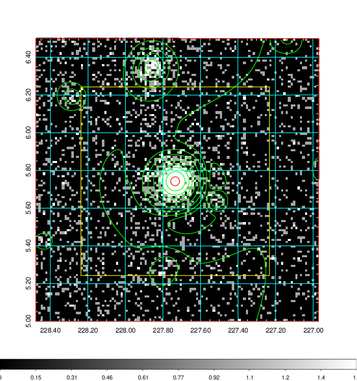
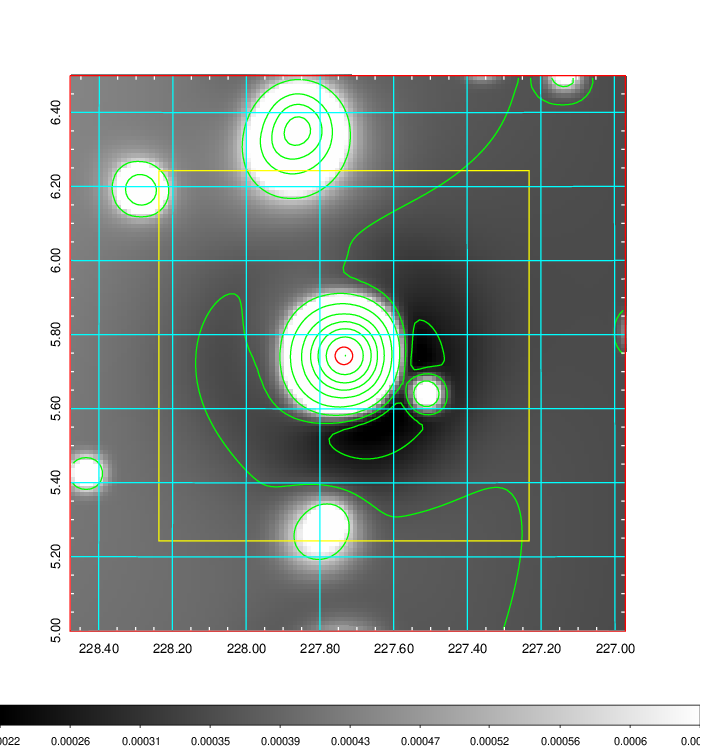
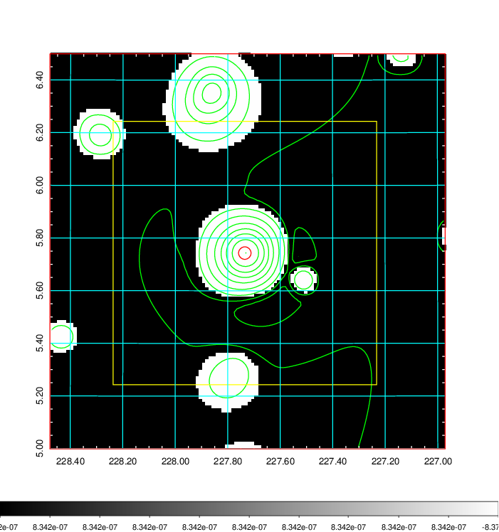
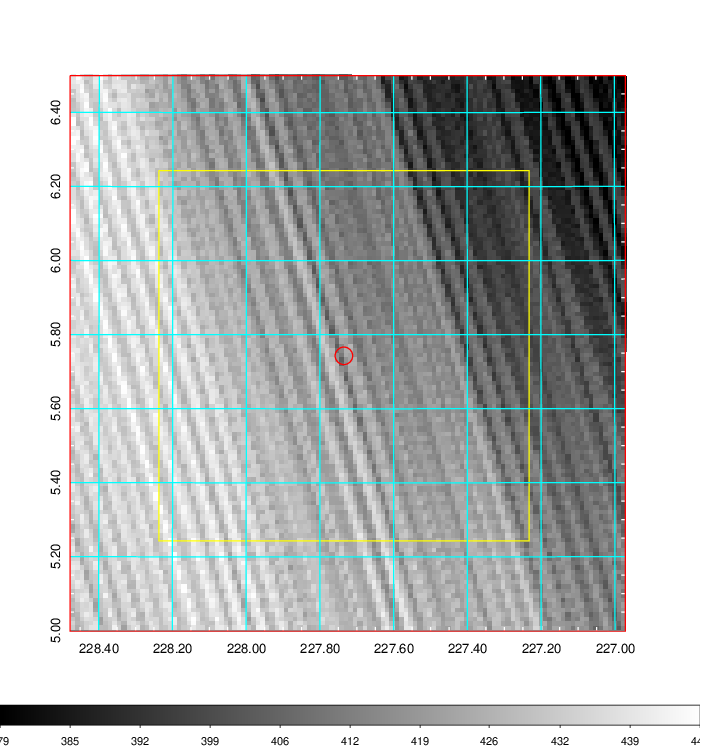
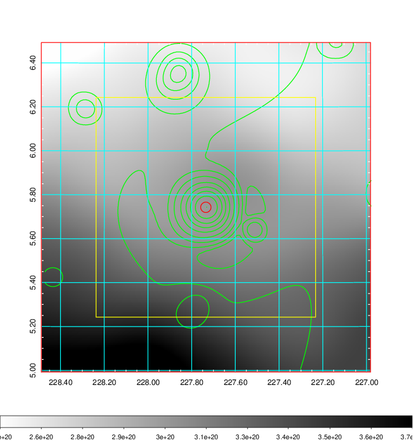
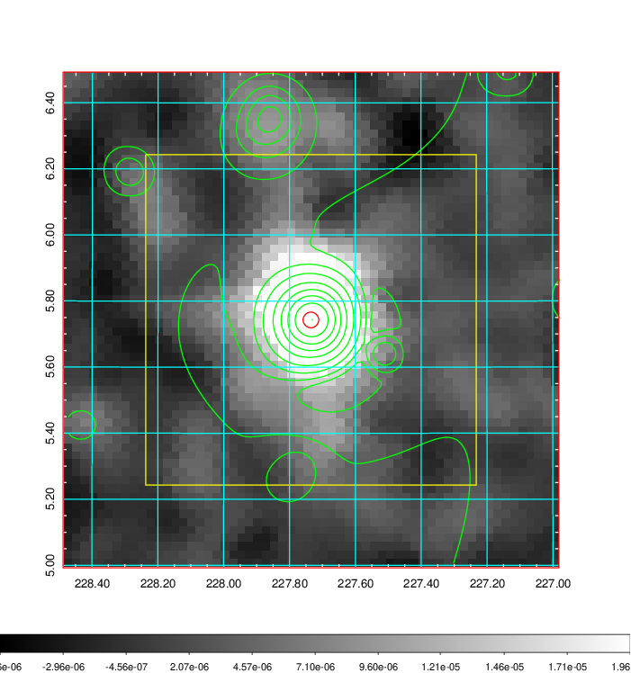
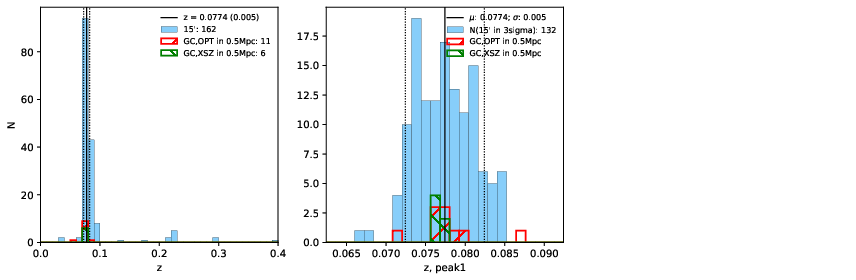
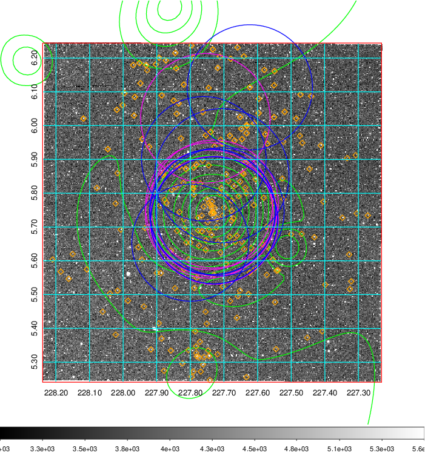
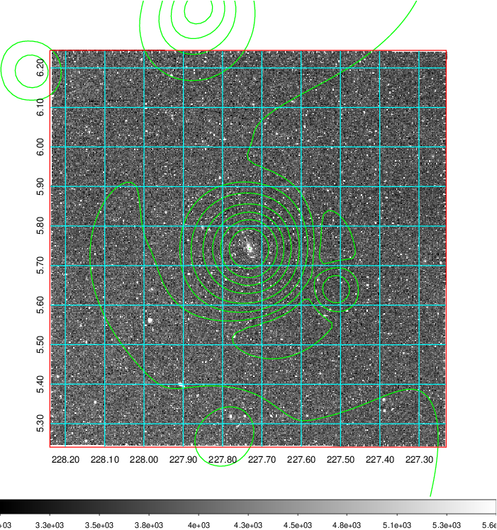
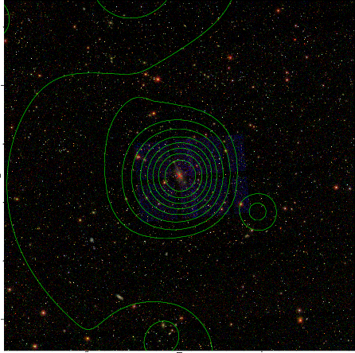

### 593

|Name|RAJ2000[deg]|DEJ2000[deg] |Ext[arcmin]| Ext,ml | z | z_src| C|GC(XSZ,Delta_z<0.01)| GC(OPT,Delta_z<0.01)|GC| R_sig[arcmin] | R500[arcmin] | R500[Mpc]| CRsig[c/s] | CR500[c/s] |L500[1E44 erg/s]|F500[1E-12 erg/s/cm^2]| M500[1E14 Msun]|Tx[keV]|Cnt_sig|Beta|Rc[arcmin]|Comment|Alias|
|---|---|---|---|---|---|------|---|--------|---------|----------|---|---|---|---|---|---|---|---|---|---|---|---|---|---|
|593| 227.735| 5.743| 1.42| 781.46| 0.0774(0.005)| z1, z_xsz| B| L03, MCXC, PSZ2, Tar, XB| A, N, W| A, C, F20, L03, MCXC, N, PSZ2, Tar, W, XB| 26.181| 16.199| 1.424| 3.082(0.121)| 2.900(0.114)| 8.244(0.111)| 55.977(0.751)| 8.84(0.06)| 8.42(0.03)| 1295.3| 0.734(-0.022+0.025)| 2.600(-0.169+0.179)| -| k098|

|[RASS image](../image/593/593_img.pdf)|[filtered image](../image/593/593_fil.pdf)|[Segment image](../image/593/593_seg.pdf)|
|-------------------|--------------------|-------------------|
|   |    |   |

|[Exposure image](../image/593/593_mex.pdf)| [nH image](../image/593/593_nh.pdf)| [Planck image](../image/593/593_p.pdf)|
|-------------------|--------------------|-------------------|
|   |     |  |

|[Redshift Histogram](../image/593/593_zg.pdf) | [DSS image(z1)](../image/593/593_dss_z1.pdf)      |  [DSS image(z2)](../image/593/593_dss_z2.pdf)    |
|-------------------|--------------------|-------------------|
| |  Blue circle for optical clusters;  Magenta circle for XSZ clusters;  all with r=1Mpc;  Only GC with Delta_z<0.01 are shown. |  Blue circle for optical clusters;  Magenta circle for XSZ clusters;  all with r=1Mpc;  Only GC with Delta_z<0.01 are shown.  |

|[known Abell/XSZ clusters](../image/593/593_gc.pdf) | [2MASS image](../image/593/593_2mass.pdf)      |[SDSS image](../image/593/593_sdss.pdf)   |
|-------------------|-------------------|-------------------|
|  Magenta, blue and green circles  for optical, X-ray and SZ clusters  respectively, with redshift of clusters  labelled. The radius of circles  are 1Mpc.|  |   |

