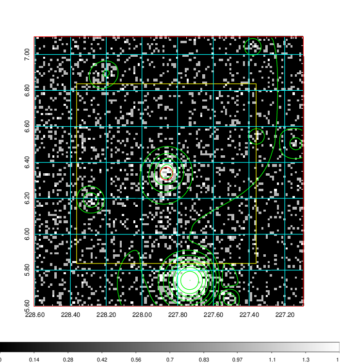
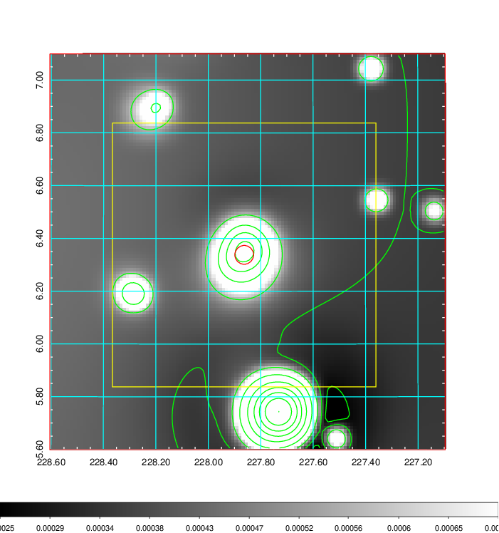
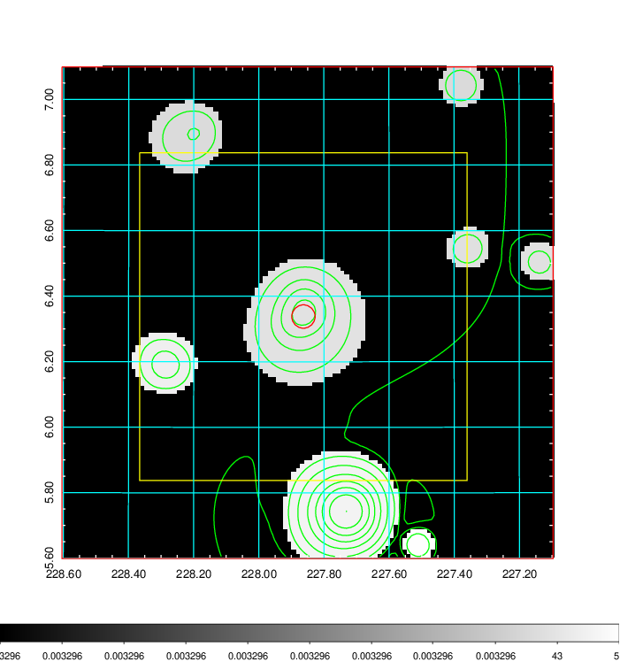
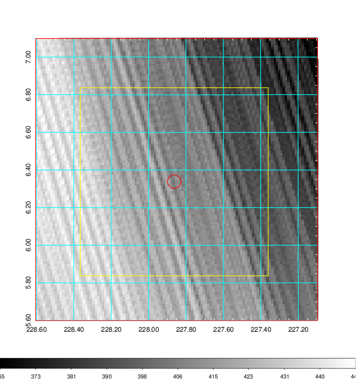
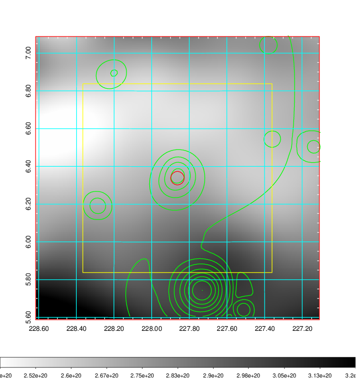
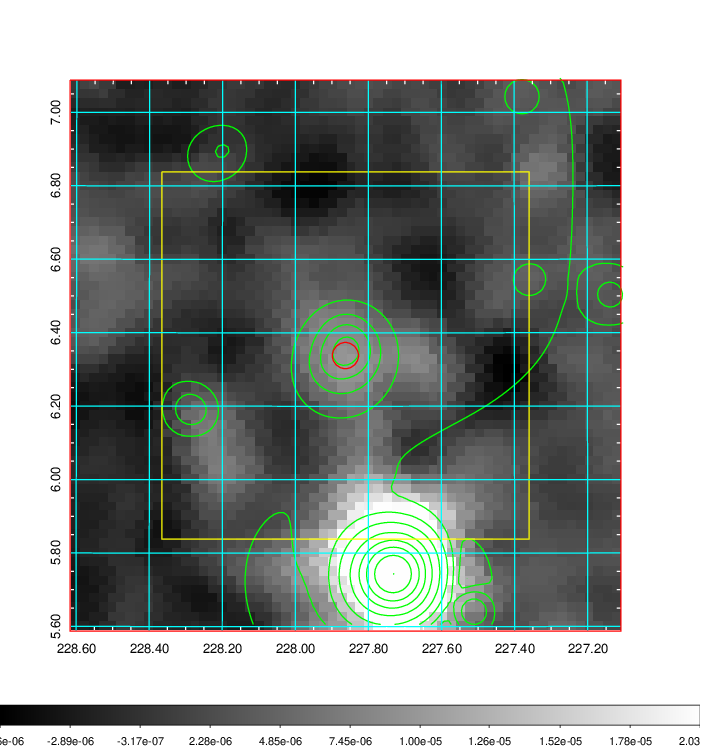
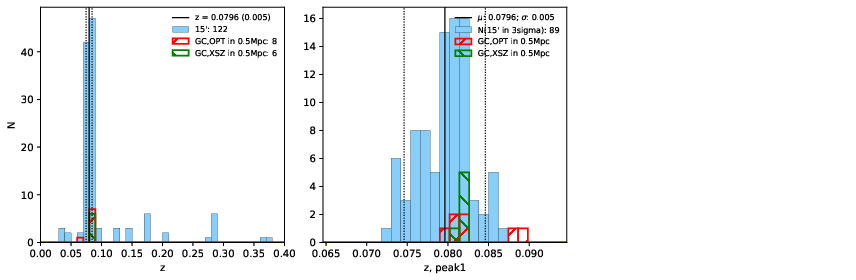
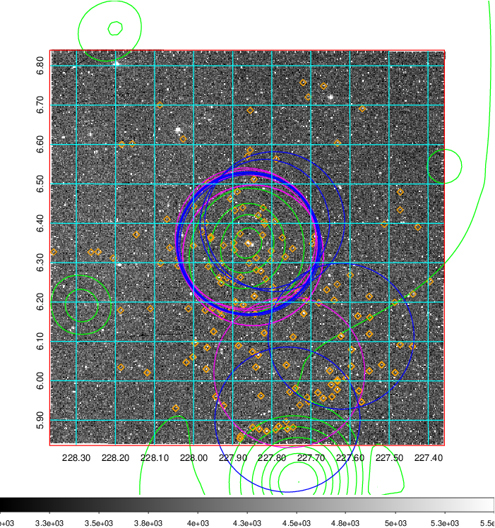
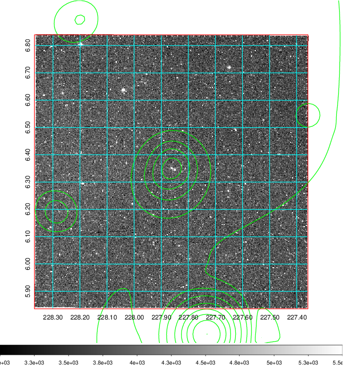
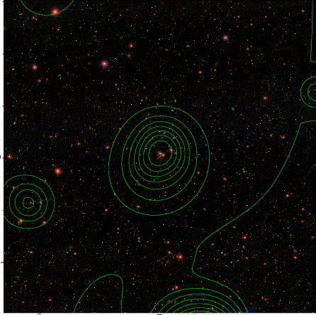

### 594

|Name|RAJ2000[deg]|DEJ2000[deg] |Ext[arcmin]| Ext,ml | z | z_src| C|GC(XSZ,Delta_z<0.01)| GC(OPT,Delta_z<0.01)|GC| R_sig[arcmin] | R500[arcmin] | R500[Mpc]| CRsig[c/s] | CR500[c/s] |L500[1E44 erg/s]|F500[1E-12 erg/s/cm^2]| M500[1E14 Msun]|Tx[keV]|Cnt_sig|Beta|Rc[arcmin]|Comment|Alias|
|---|---|---|---|---|---|------|---|--------|---------|----------|---|---|---|---|---|---|---|---|---|---|---|---|---|---|
|594| 227.863| 6.338| 2.14| 110.07| 0.0796(0.005)| z1, z_xsz| B| F20, L03, MCXC, Tar, XB| A, N, RM, W| A, C, F20, L03, MCXC, N, Tar, W, XB| 12.212| 11.010| 0.993| 0.515(0.058)| 0.507(0.057)| 1.501(0.081)| 9.606(0.517)| 3.00(0.08)| 4.33(0.07)| 194.3| 0.922(-0.085+0.055)| 4.810(-0.540+0.385)| -| k243|

|[RASS image](../image/594/594_img.pdf)|[filtered image](../image/594/594_fil.pdf)|[Segment image](../image/594/594_seg.pdf)|
|-------------------|--------------------|-------------------|
|   |    |   |

|[Exposure image](../image/594/594_mex.pdf)| [nH image](../image/594/594_nh.pdf)| [Planck image](../image/594/594_p.pdf)|
|-------------------|--------------------|-------------------|
|   |     |  |

|[Redshift Histogram](../image/594/594_zg.pdf) | [DSS image(z1)](../image/594/594_dss_z1.pdf)      |  [DSS image(z2)](../image/594/594_dss_z2.pdf)    |
|-------------------|--------------------|-------------------|
| |  Blue circle for optical clusters;  Magenta circle for XSZ clusters;  all with r=1Mpc;  Only GC with Delta_z<0.01 are shown. |  Blue circle for optical clusters;  Magenta circle for XSZ clusters;  all with r=1Mpc;  Only GC with Delta_z<0.01 are shown.  |

|[Previous-identified clusters](../image/594/594_gc.pdf) | [2MASS image](../image/594/594_2mass.pdf)      |[SDSS image](../image/594/594_sdss.pdf)   |
|-------------------|-------------------|-------------------|
|  Green, magenta, and blue circles  for optical, X-ray and SZ clusters  respectively, with redshift of clusters  labelled. The radius of circles  are 1Mpc.|  |   |

