

### 595

|Name|RAJ2000[deg]|DEJ2000[deg] |Ext[arcmin]| Ext,ml | z | z_src| C|GC(XSZ,Delta_z<0.01)| GC(OPT,Delta_z<0.01)|GC| R_sig[arcmin] | R500[arcmin] | R500[Mpc]| CRsig[c/s] | CR500[c/s] |L500[1E44 erg/s]|F500[1E-12 erg/s/cm^2]| M500[1E14 Msun]|Tx[keV]|Cnt_sig|Beta|Rc[arcmin]|Comment|Alias|
|---|---|---|---|---|---|------|---|--------|---------|----------|---|---|---|---|---|---|---|---|---|---|---|---|---|---|
|595| 228.177| 7.419| 4.21| 37.29| 0.0460(0.005)| z1, z_xsz| B| L03| A, N| A, C, F20, L03, N, W| 16.112| 13.244| 0.718| 0.314(0.054)| 0.305(0.053)| 0.275(0.032)| 5.525(0.648)| 1.10(0.07)| 2.30(0.09)| 121.7| 0.833(-0.153+0.116)| 7.683(-1.587+1.197)| -| t212|

|[RASS image](../image/595/595_img.pdf)|[filtered image](../image/595/595_fil.pdf)|[Segment image](../image/595/595_seg.pdf)|
|-------------------|--------------------|-------------------|
| 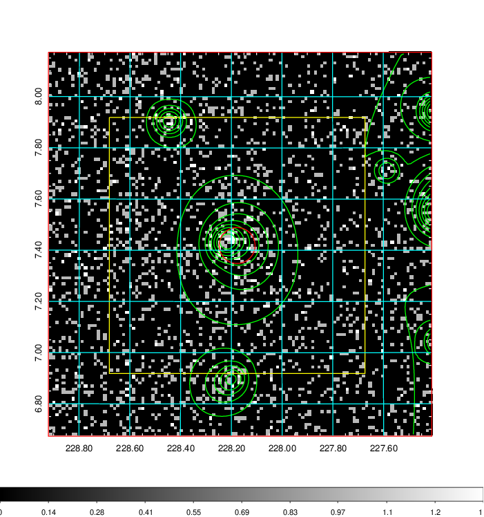  | 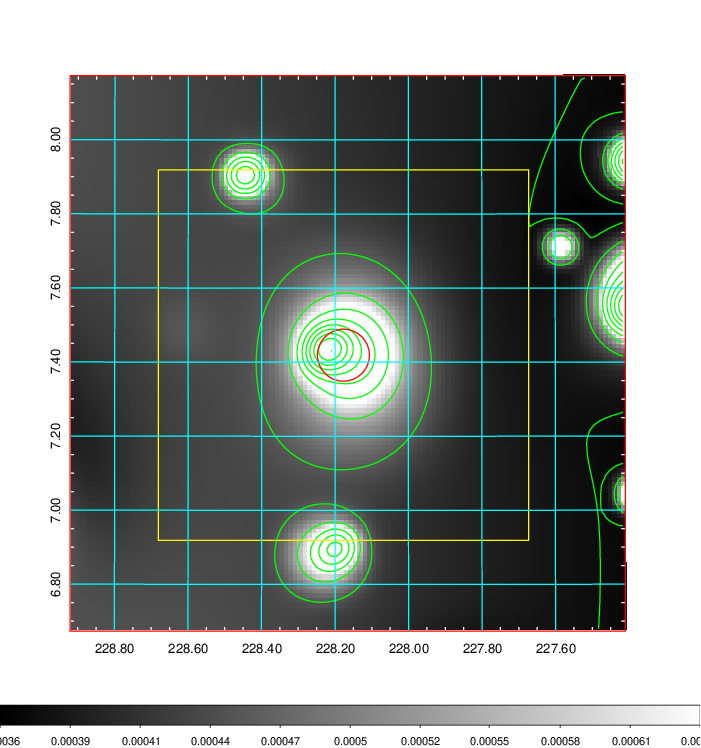   | 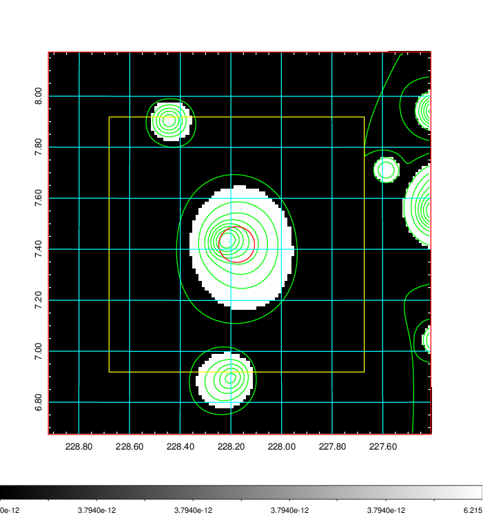  |

|[Exposure image](../image/595/595_mex.pdf)| [nH image](../image/595/595_nh.pdf)| [Planck image](../image/595/595_p.pdf)|
|-------------------|--------------------|-------------------|
|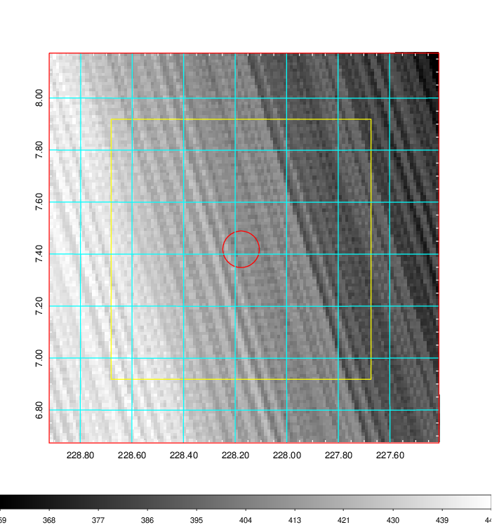   | 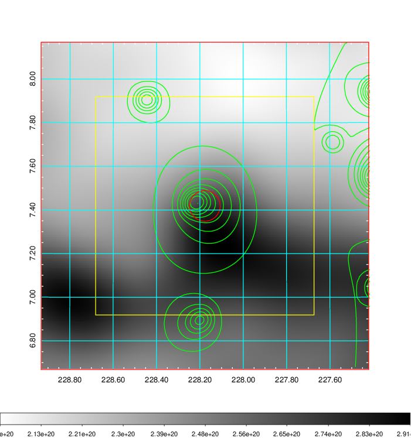    | 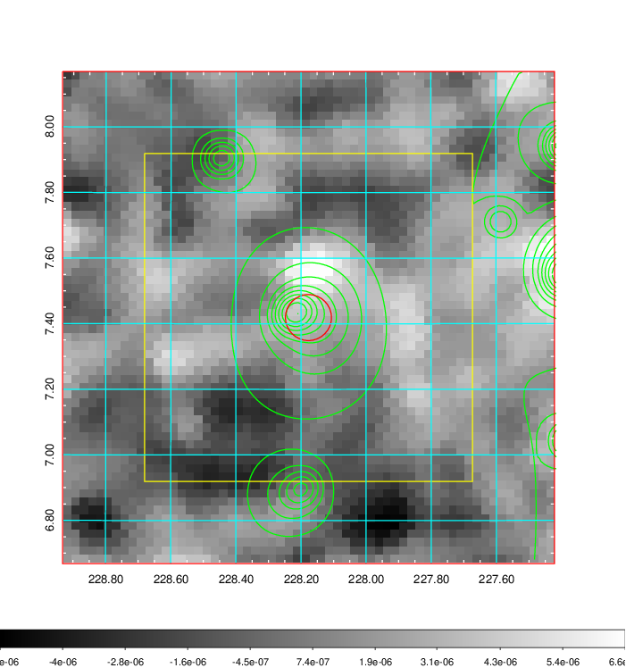 |

|[Redshift Histogram](../image/595/595_zg.pdf) | [DSS image(z1)](../image/595/595_dss_z1.pdf)      |  [DSS image(z2)](../image/595/595_dss_z2.pdf)    |
|-------------------|--------------------|-------------------|
|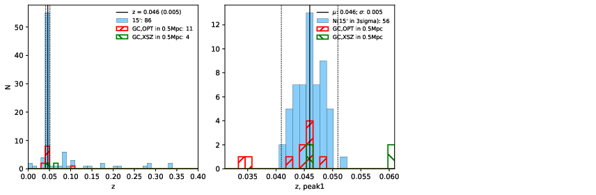 |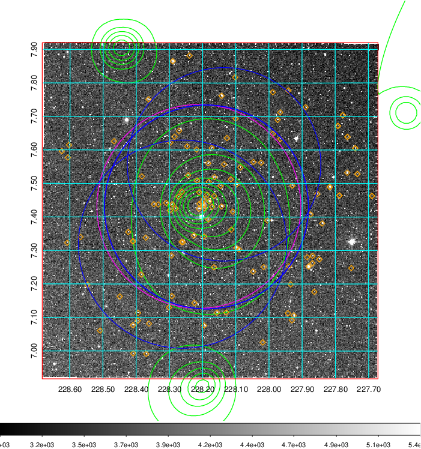  Blue circle for optical clusters;  Magenta circle for XSZ clusters;  all with r=1Mpc;  Only GC with Delta_z<0.01 are shown. | 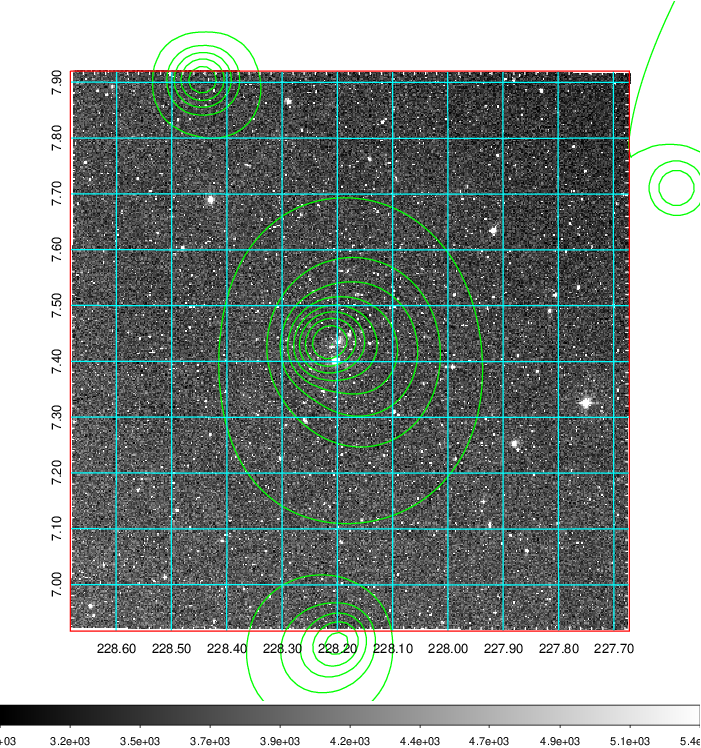 Blue circle for optical clusters;  Magenta circle for XSZ clusters;  all with r=1Mpc;  Only GC with Delta_z<0.01 are shown.  |

|[known Abell/XSZ clusters](../image/595/595_gc.pdf) | [2MASS image](../image/595/595_2mass.pdf)      |[SDSS image](../image/595/595_sdss.pdf)   |
|-------------------|-------------------|-------------------|
|  Magenta, blue and green circles  for optical, X-ray and SZ clusters  respectively, with redshift of clusters  labelled. The radius of circles  are 1Mpc.|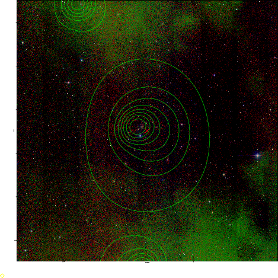  | 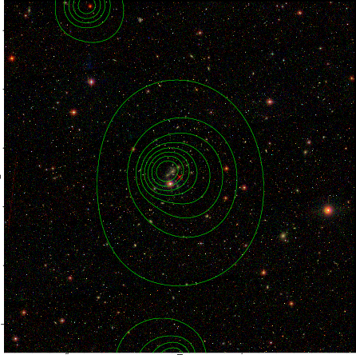  |

