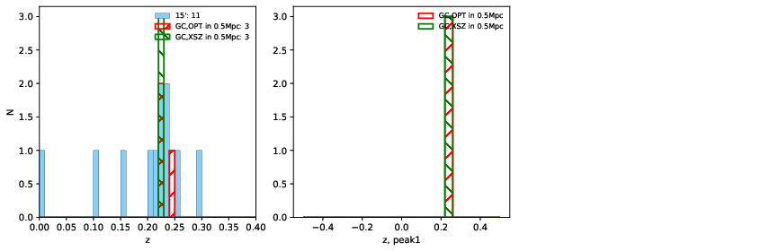

### 596

|Name|RAJ2000[deg]|DEJ2000[deg] |Ext[arcmin]| Ext,ml | z | z_src| C|GC(XSZ,Delta_z<0.01)| GC(OPT,Delta_z<0.01)|GC| R_sig[arcmin] | R500[arcmin] | R500[Mpc]| CRsig[c/s] | CR500[c/s] |L500[1E44 erg/s]|F500[1E-12 erg/s/cm^2]| M500[1E14 Msun]|Tx[keV]|Cnt_sig|Beta|Rc[arcmin]|Comment|Alias|
|---|---|---|---|---|---|------|---|--------|---------|----------|---|---|---|---|---|---|---|---|---|---|---|---|---|---|
|596| 228.738| -15.386| 2.15| 28.42| 0.2226(0.000)| z_xsz| B| MCXC, PSZ2, Tar| N| MCXC, N, PSZ2, Tar, W| 13.675| 5.581| 1.200| 0.193(0.052)| 0.176(0.047)| 4.736(0.423)| 3.241(0.290)| 6.14(0.26)| 7.06(0.19)| 55.5| 0.944(-0.075+0.041)| 4.710(-0.492+0.446)| -| k249|

|[RASS image](../image/596/596_img.pdf)|[filtered image](../image/596/596_fil.pdf)|[Segment image](../image/596/596_seg.pdf)|
|-------------------|--------------------|-------------------|
|   |    |   |

|[Exposure image](../image/596/596_mex.pdf)| [nH image](../image/596/596_nh.pdf)| [Planck image](../image/596/596_p.pdf)|
|-------------------|--------------------|-------------------|
|   |     |  |

|[Redshift Histogram](../image/596/596_zg.pdf) | [DSS image(z1)](../image/596/596_dss_z1.pdf)      |  [DSS image(z2)](../image/596/596_dss_z2.pdf)    |
|-------------------|--------------------|-------------------|
| |  Blue circle for optical clusters;  Magenta circle for XSZ clusters;  all with r=1Mpc;  Only GC with Delta_z<0.01 are shown. |  Blue circle for optical clusters;  Magenta circle for XSZ clusters;  all with r=1Mpc;  Only GC with Delta_z<0.01 are shown.  |

|[known Abell/XSZ clusters](../image/596/596_gc.pdf) | [2MASS image](../image/596/596_2mass.pdf)      |
|-------------------|-------------------|
|  Magenta, blue and green circles  for optical, X-ray and SZ clusters  respectively, with redshift of clusters  labelled. The radius of circles  are 1Mpc.|  |

|[ATLAS image](../image/596/596_s.pdf)        |
|-------------------|
|   |
