

### 597

|Name|RAJ2000[deg]|DEJ2000[deg] |Ext[arcmin]| Ext,ml | z | z_src| C|GC(XSZ,Delta_z<0.01)| GC(OPT,Delta_z<0.01)|GC| R_sig[arcmin] | R500[arcmin] | R500[Mpc]| CRsig[c/s] | CR500[c/s] |L500[1E44 erg/s]|F500[1E-12 erg/s/cm^2]| M500[1E14 Msun]|Tx[keV]|Cnt_sig|Beta|Rc[arcmin]|Comment|Alias|
|---|---|---|---|---|---|------|---|--------|---------|----------|---|---|---|---|---|---|---|---|---|---|---|---|---|---|
|597| 228.810| 50.490| 18.62| 38.65| 0.3960(0.005)| z1,| G| -| -| C, N, W| 16.600| 3.833| 1.228| 0.110(0.024)| 0.097(0.021)| 11.222(16.872)| 2.036(3.060)| 7.99(5.33)| 8.84(3.79)| 102.3| 0.509(-0.007+0.017)| 3.346(-0.222+0.262)| -| t570|

|[RASS image](../image/597/597_img.pdf)|[filtered image](../image/597/597_fil.pdf)|[Segment image](../image/597/597_seg.pdf)|
|-------------------|--------------------|-------------------|
| 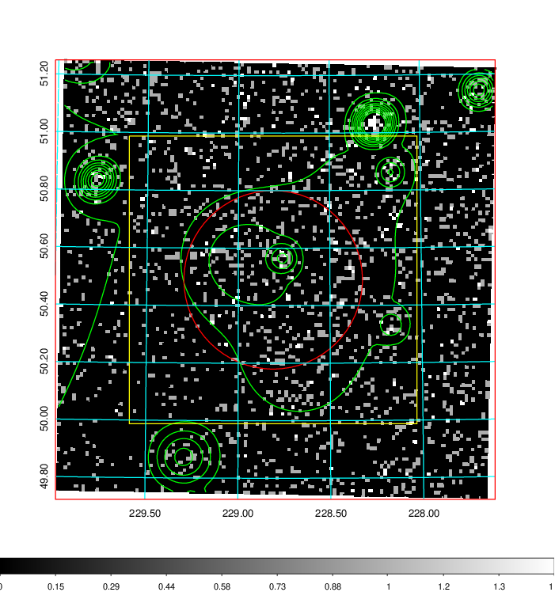  | 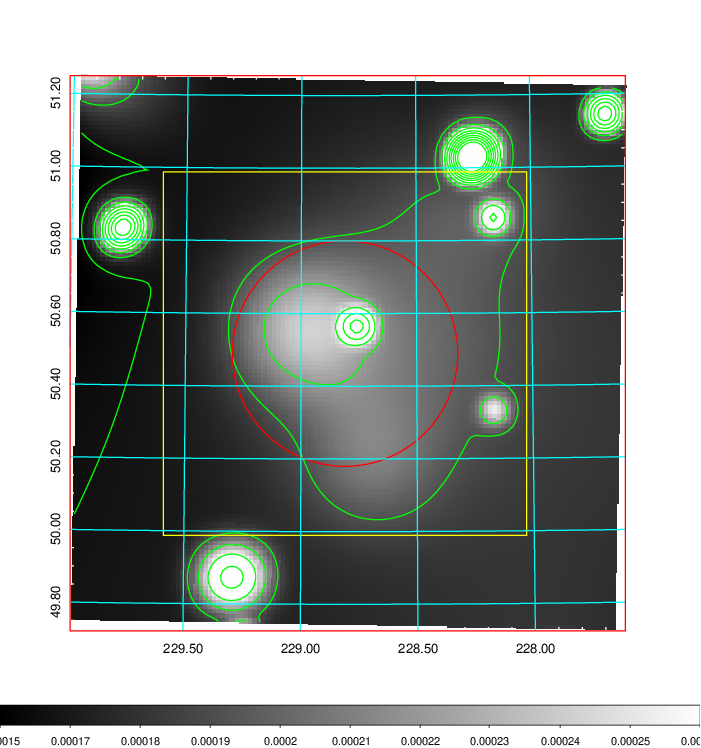   | 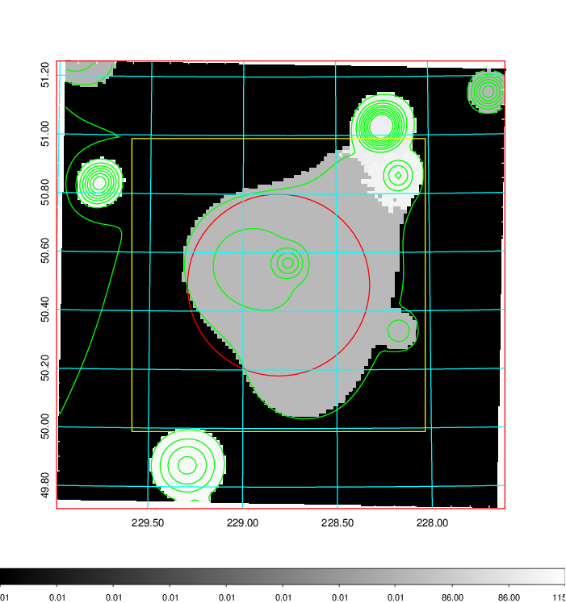  |

|[Exposure image](../image/597/597_mex.pdf)| [nH image](../image/597/597_nh.pdf)| [Planck image](../image/597/597_p.pdf)|
|-------------------|--------------------|-------------------|
|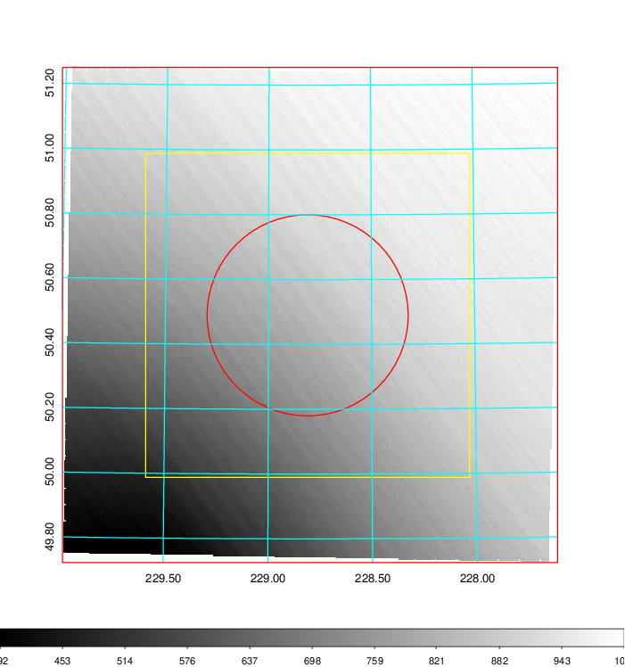   | 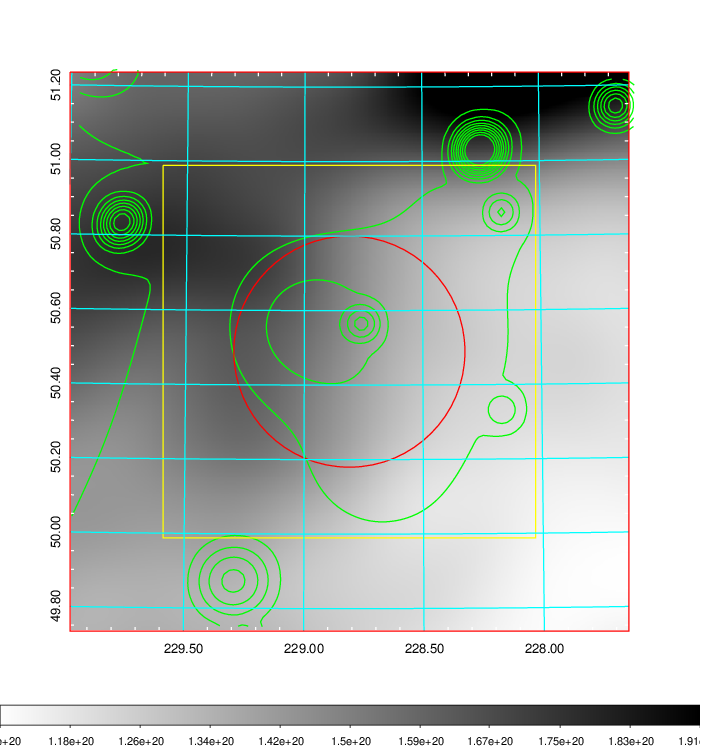    | 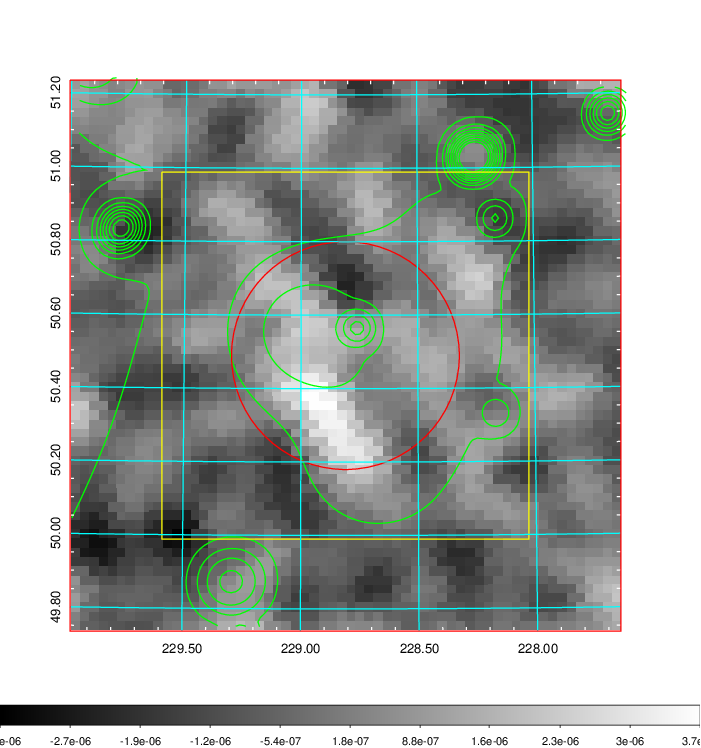 |

|[Redshift Histogram](../image/597/597_zg.pdf) | [DSS image(z1)](../image/597/597_dss_z1.pdf)      |  [DSS image(z2)](../image/597/597_dss_z2.pdf)    |
|-------------------|--------------------|-------------------|
|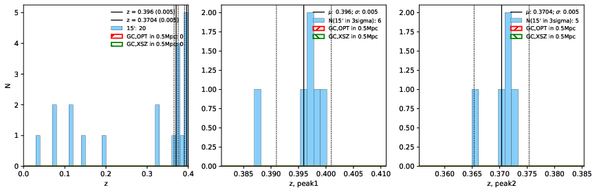 |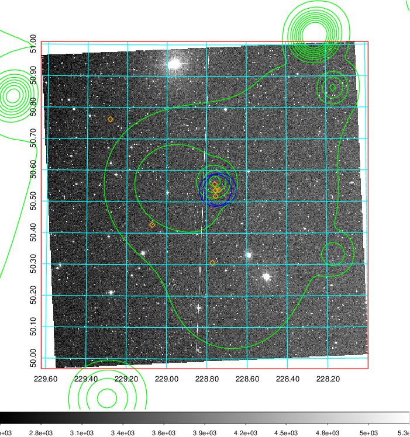  Blue circle for optical clusters;  Magenta circle for XSZ clusters;  all with r=1Mpc;  Only GC with Delta_z<0.01 are shown. | 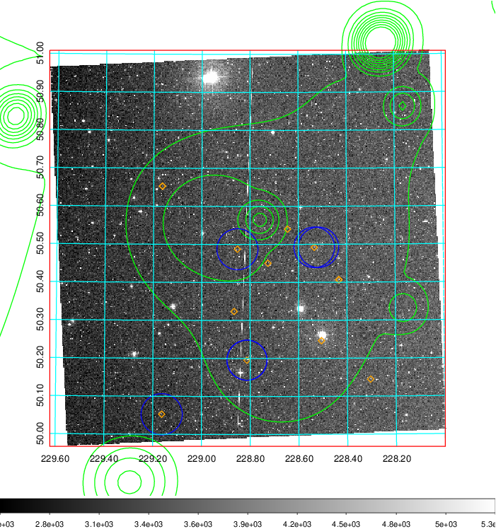 Blue circle for optical clusters;  Magenta circle for XSZ clusters;  all with r=1Mpc;  Only GC with Delta_z<0.01 are shown.  |

|[known Abell/XSZ clusters](../image/597/597_gc.pdf) | [2MASS image](../image/597/597_2mass.pdf)      |[SDSS image](../image/597/597_sdss.pdf)   |
|-------------------|-------------------|-------------------|
|  Magenta, blue and green circles  for optical, X-ray and SZ clusters  respectively, with redshift of clusters  labelled. The radius of circles  are 1Mpc.|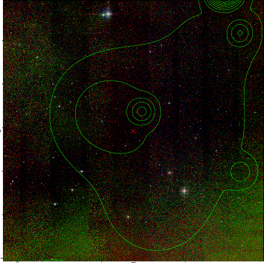  | 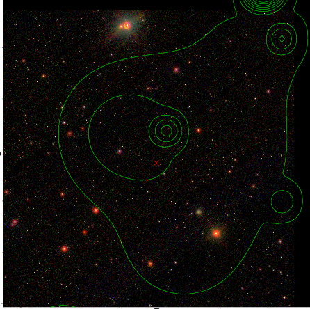  |

