

### 598

|Name|RAJ2000[deg]|DEJ2000[deg] |Ext[arcmin]| Ext,ml | z | z_src| C|GC(XSZ,Delta_z<0.01)| GC(OPT,Delta_z<0.01)|GC| R_sig[arcmin] | R500[arcmin] | R500[Mpc]| CRsig[c/s] | CR500[c/s] |L500[1E44 erg/s]|F500[1E-12 erg/s/cm^2]| M500[1E14 Msun]|Tx[keV]|Cnt_sig|Beta|Rc[arcmin]|Comment|Alias|
|---|---|---|---|---|---|------|---|--------|---------|----------|---|---|---|---|---|---|---|---|---|---|---|---|---|---|
|598| 228.833| 4.391| 2.32| 32.38| 0.0977(0.005)| z1, z_xsz| B| F20| A, N, RM, W| A, C, F20, N, W| 34.165| 9.608| 1.041| 0.472(0.131)| 0.422(0.117)| 1.898(0.435)| 7.869(1.804)| 3.53(0.40)| 4.81(0.35)| 233.8| 0.509(-0.006+0.012)| 3.141(-0.260+0.309)| -| t082|

|[RASS image](../image/598/598_img.pdf)|[filtered image](../image/598/598_fil.pdf)|[Segment image](../image/598/598_seg.pdf)|
|-------------------|--------------------|-------------------|
| 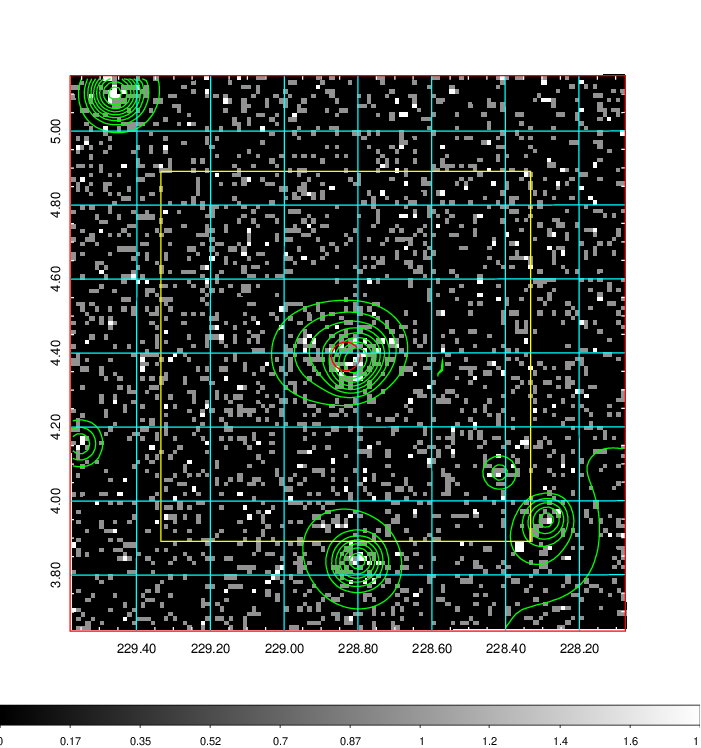  | 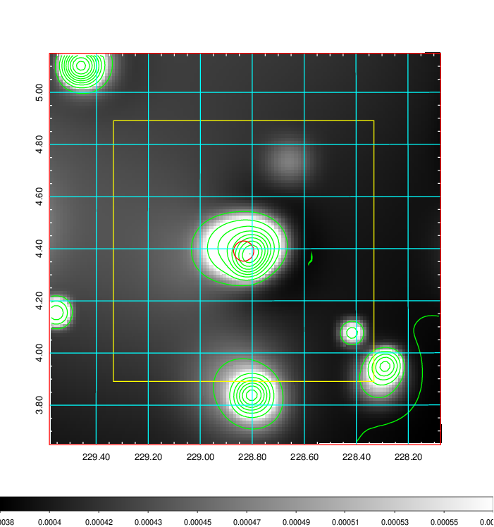   | 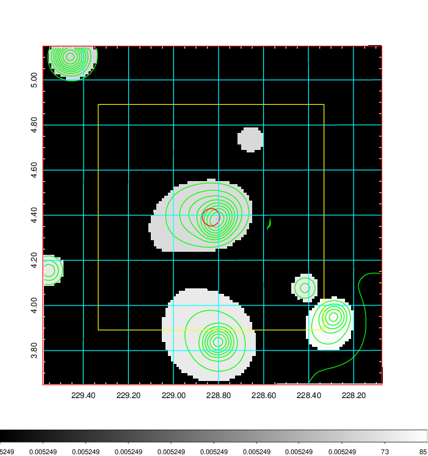  |

|[Exposure image](../image/598/598_mex.pdf)| [nH image](../image/598/598_nh.pdf)| [Planck image](../image/598/598_p.pdf)|
|-------------------|--------------------|-------------------|
|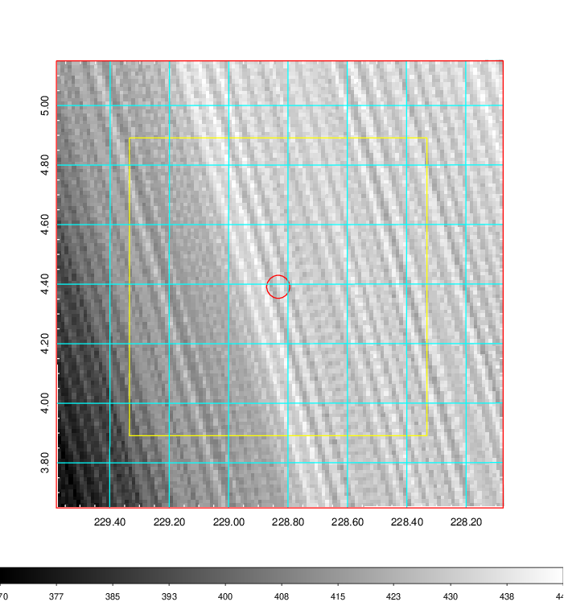   | 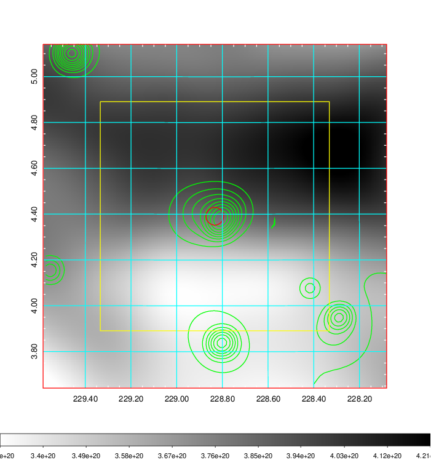    | 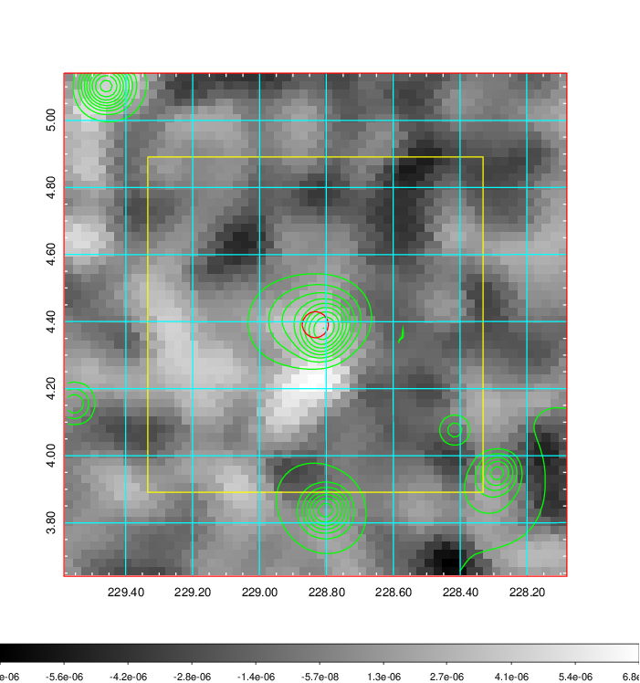 |

|[Redshift Histogram](../image/598/598_zg.pdf) | [DSS image(z1)](../image/598/598_dss_z1.pdf)      |  [DSS image(z2)](../image/598/598_dss_z2.pdf)    |
|-------------------|--------------------|-------------------|
|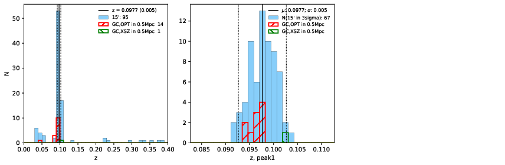 |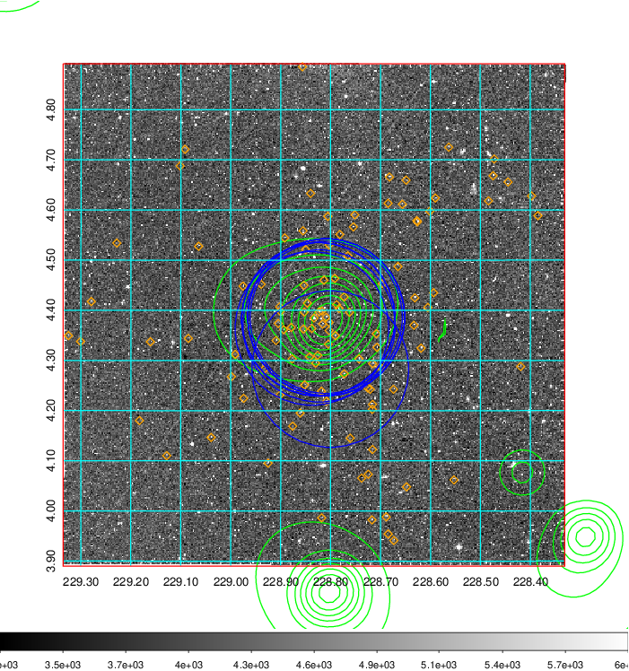  Blue circle for optical clusters;  Magenta circle for XSZ clusters;  all with r=1Mpc;  Only GC with Delta_z<0.01 are shown. | 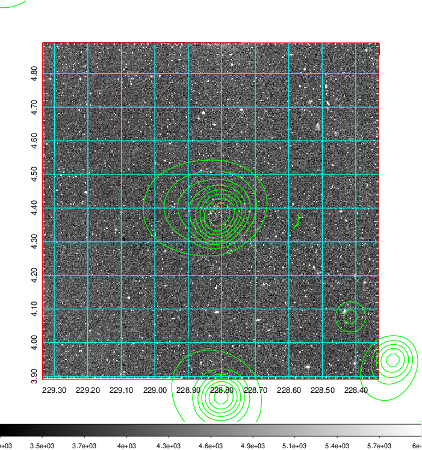 Blue circle for optical clusters;  Magenta circle for XSZ clusters;  all with r=1Mpc;  Only GC with Delta_z<0.01 are shown.  |

|[Previous-identified clusters](../image/598/598_gc.pdf) | [2MASS image](../image/598/598_2mass.pdf)      |[SDSS image](../image/598/598_sdss.pdf)   |
|-------------------|-------------------|-------------------|
|  Green, magenta, and blue circles  for optical, X-ray and SZ clusters  respectively, with redshift of clusters  labelled. The radius of circles  are 1Mpc.|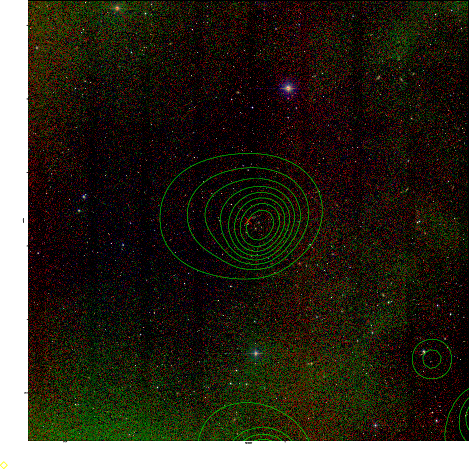  | 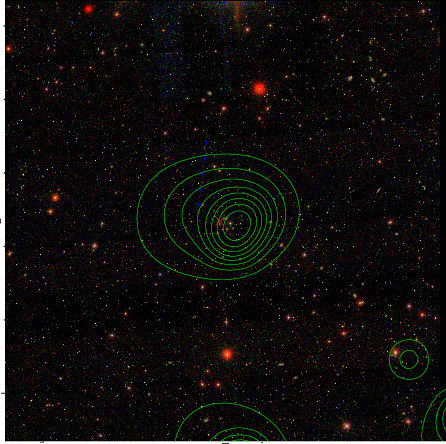  |

