

### 599

|Name|RAJ2000[deg]|DEJ2000[deg] |Ext[arcmin]| Ext,ml | z | z_src| C|GC(XSZ,Delta_z<0.01)| GC(OPT,Delta_z<0.01)|GC| R_sig[arcmin] | R500[arcmin] | R500[Mpc]| CRsig[c/s] | CR500[c/s] |L500[1E44 erg/s]|F500[1E-12 erg/s/cm^2]| M500[1E14 Msun]|Tx[keV]|Cnt_sig|Beta|Rc[arcmin]|Comment|Alias|
|---|---|---|---|---|---|------|---|--------|---------|----------|---|---|---|---|---|---|---|---|---|---|---|---|---|---|
|599| 229.076| 0.098| 1.57| 32.86| 0.1199(0.005)| z1, z_xsz| B| F20, MCXC, XB, XCS| A, C, N, RM, W| A, C, F20, MCXC, N, W, XB, XCS| 10.262| 7.788| 1.010| 0.255(0.056)| 0.246(0.054)| 1.707(0.179)| 4.563(0.479)| 3.29(0.17)| 4.64(0.15)| 76.4| 0.921(-0.095+0.057)| 4.314(-0.541+0.438)| -| k131|

|[RASS image](../image/599/599_img.pdf)|[filtered image](../image/599/599_fil.pdf)|[Segment image](../image/599/599_seg.pdf)|
|-------------------|--------------------|-------------------|
| 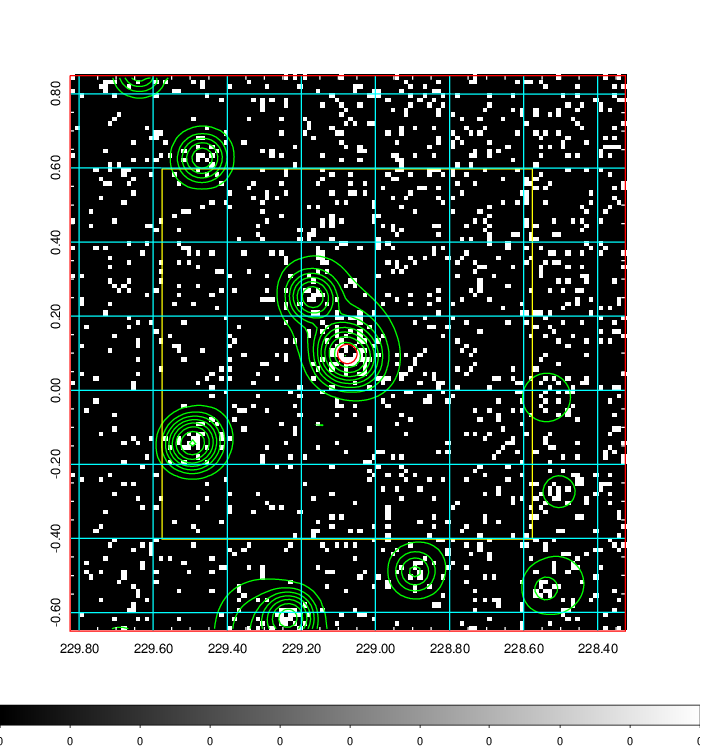  | 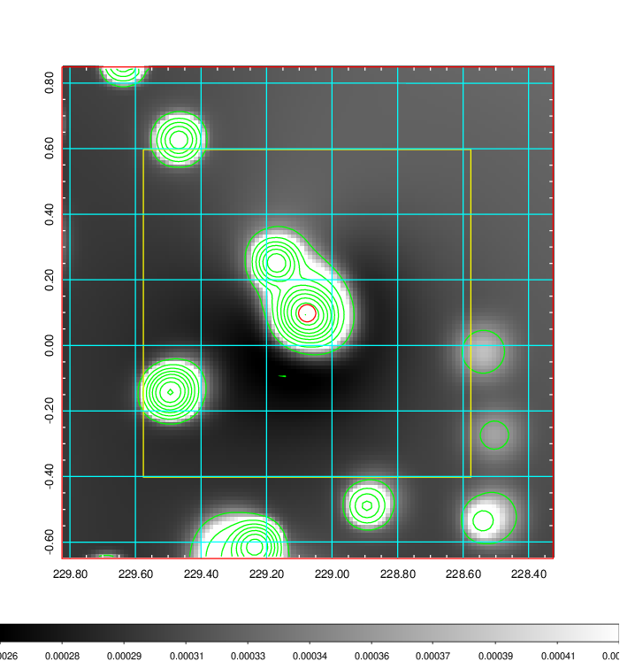   | 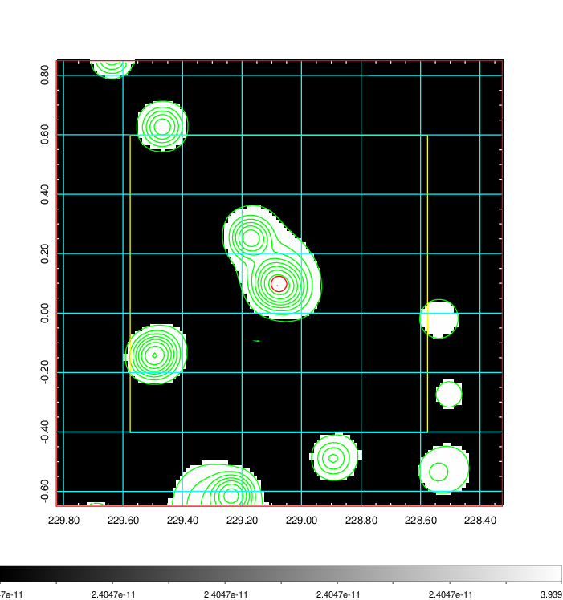  |

|[Exposure image](../image/599/599_mex.pdf)| [nH image](../image/599/599_nh.pdf)| [Planck image](../image/599/599_p.pdf)|
|-------------------|--------------------|-------------------|
|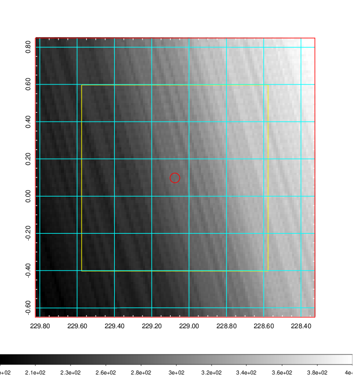   | 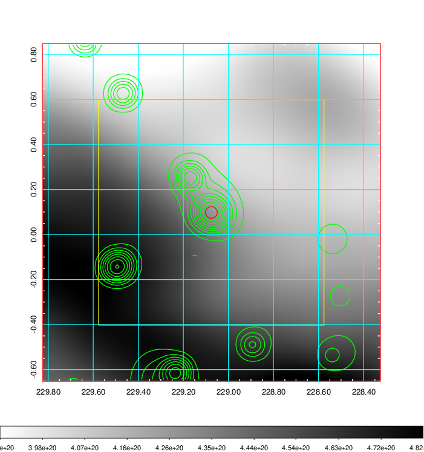    | 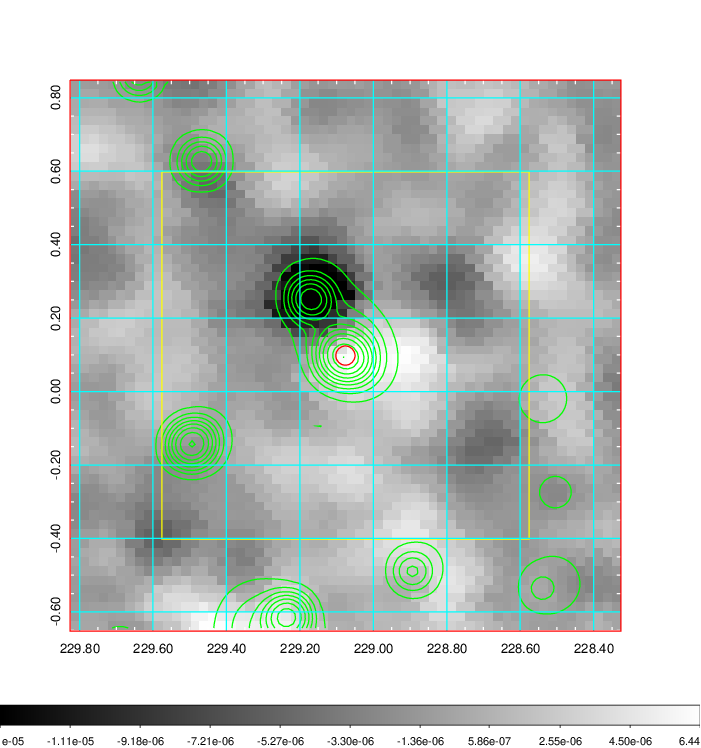 |

|[Redshift Histogram](../image/599/599_zg.pdf) | [DSS image(z1)](../image/599/599_dss_z1.pdf)      |  [DSS image(z2)](../image/599/599_dss_z2.pdf)    |
|-------------------|--------------------|-------------------|
|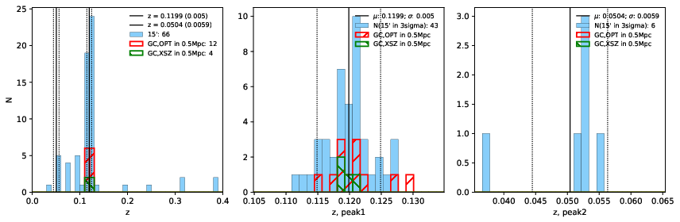 |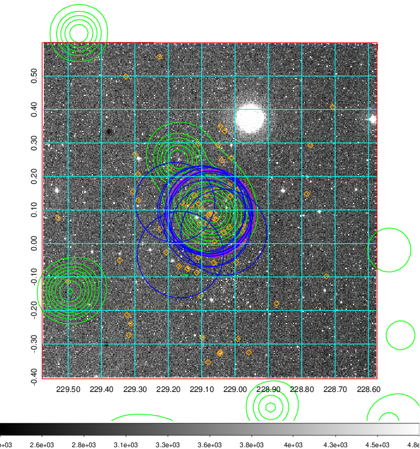  Blue circle for optical clusters;  Magenta circle for XSZ clusters;  all with r=1Mpc;  Only GC with Delta_z<0.01 are shown. | 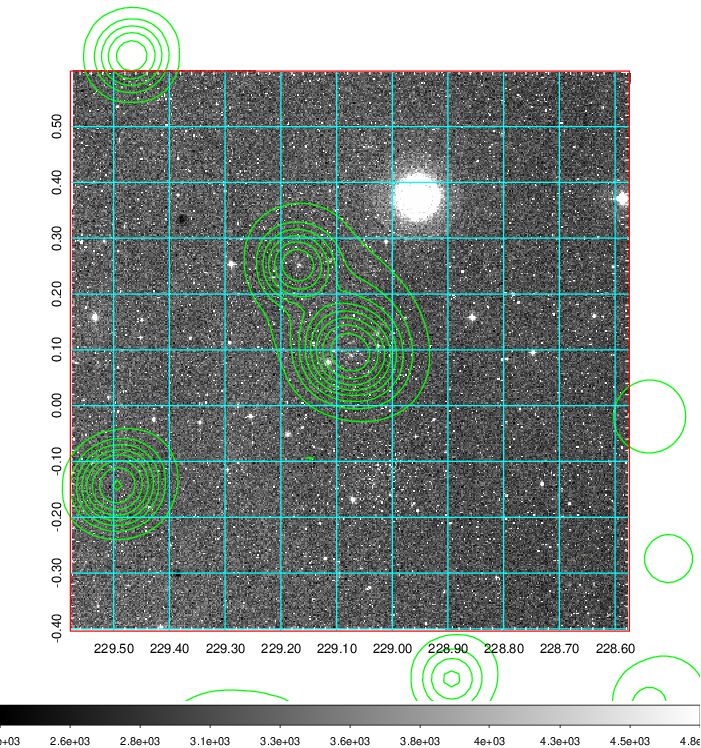 Blue circle for optical clusters;  Magenta circle for XSZ clusters;  all with r=1Mpc;  Only GC with Delta_z<0.01 are shown.  |

|[known Abell/XSZ clusters](../image/599/599_gc.pdf) | [2MASS image](../image/599/599_2mass.pdf)      |[SDSS image](../image/599/599_sdss.pdf)   |
|-------------------|-------------------|-------------------|
|  Magenta, blue and green circles  for optical, X-ray and SZ clusters  respectively, with redshift of clusters  labelled. The radius of circles  are 1Mpc.|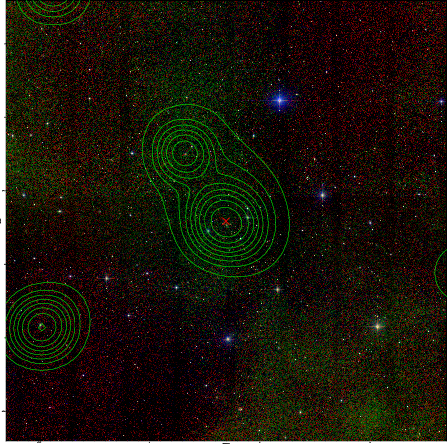  | 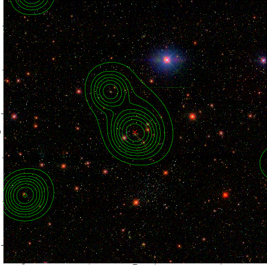  |

