

### 6

|Name|RAJ2000[deg]|DEJ2000[deg] |Ext[arcmin]| Ext,ml | z | z_src| C|GC(XSZ,Delta_z<0.01)| GC(OPT,Delta_z<0.01)|GC| R_sig[arcmin] | R500[arcmin] | R500[Mpc]| CRsig[c/s] | CR500[c/s] |L500[1E44 erg/s]|F500[1E-12 erg/s/cm^2]| M500[1E14 Msun]|Tx[keV]|Cnt_sig|Beta|Rc[arcmin]|Comment|Alias|
|---|---|---|---|---|---|------|---|--------|---------|----------|---|---|---|---|---|---|---|---|---|---|---|---|---|---|
|6| 1.585| 10.866| 1.73| 28.41| 0.1666(0.005)| z1, z_xsz| B| F20, MCXC, PSZ2, SPI, Tar| C, N, RM, W, Zw| C, F20, MCXC, N, PSZ2, SPI, Tar, W| 28.156| 6.397| 1.094| 0.221(0.056)| 0.196(0.050)| 2.790(0.436)| 3.641(0.568)| 4.39(0.33)| 5.62(0.27)| 120.9| 0.550(-0.036+0.068)| 1.422(-0.454+0.693)| -| k164|

|[RASS image](../image/6/6_img.pdf)|[filtered image](../image/6/6_fil.pdf)|[Segment image](../image/6/6_seg.pdf)|
|-------------------|--------------------|-------------------|
| 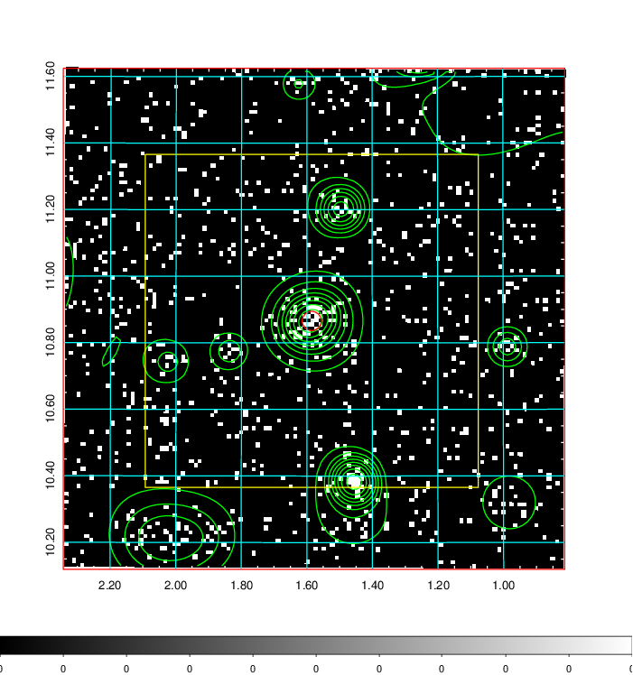  | 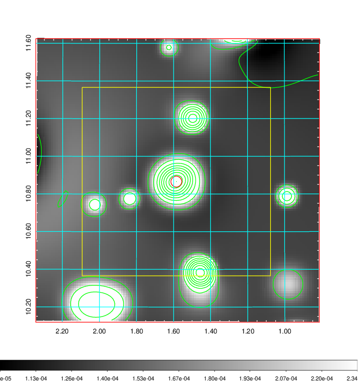   | 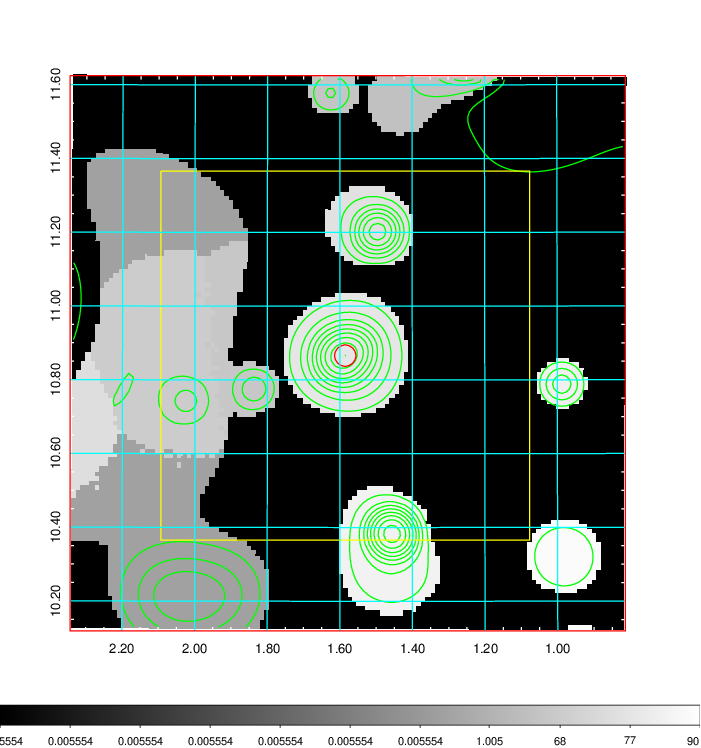  |

|[Exposure image](../image/6/6_mex.pdf)| [nH image](../image/6/6_nh.pdf)| [Planck image](../image/6/6_p.pdf)|
|-------------------|--------------------|-------------------|
|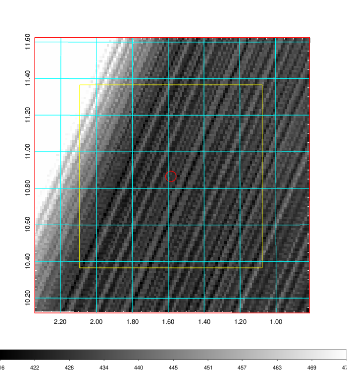   | 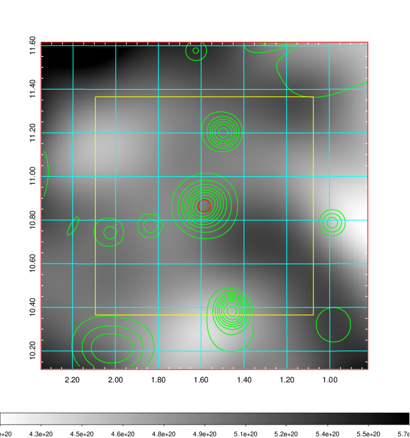    | 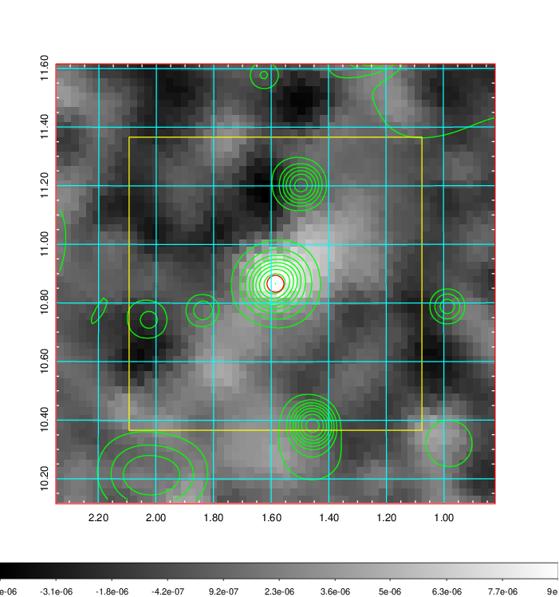 |

|[Redshift Histogram](../image/6/6_zg.pdf) | [DSS image(z1)](../image/6/6_dss_z1.pdf)      |  [DSS image(z2)](../image/6/6_dss_z2.pdf)    |
|-------------------|--------------------|-------------------|
|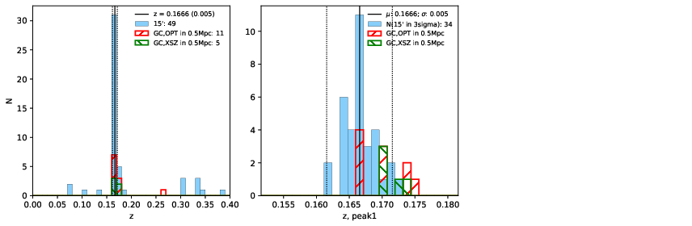 |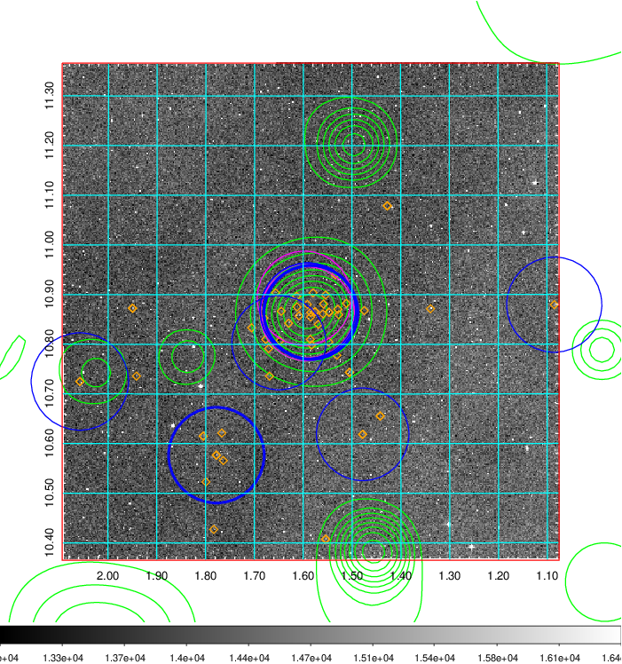  Blue circle for optical clusters;  Magenta circle for XSZ clusters;  all with r=1Mpc;  Only GC with Delta_z<0.01 are shown. | 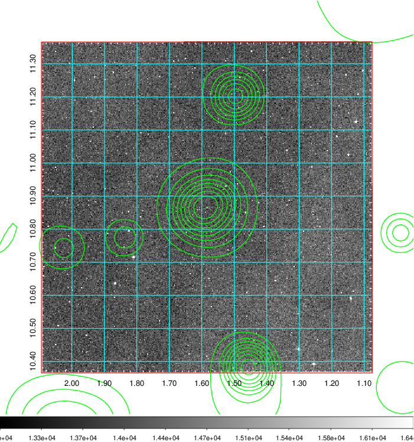 Blue circle for optical clusters;  Magenta circle for XSZ clusters;  all with r=1Mpc;  Only GC with Delta_z<0.01 are shown.  |

|[Previous-identified clusters](../image/6/6_gc.pdf) | [2MASS image](../image/6/6_2mass.pdf)      |[SDSS image](../image/6/6_sdss.pdf)   |
|-------------------|-------------------|-------------------|
|  Green, magenta, and blue circles  for optical, X-ray and SZ clusters  respectively, with redshift of clusters  labelled. The radius of circles  are 1Mpc.|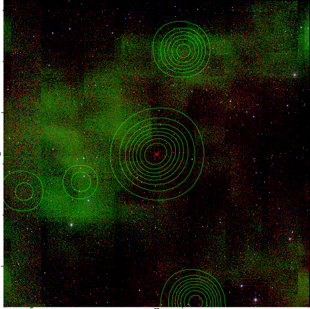  | 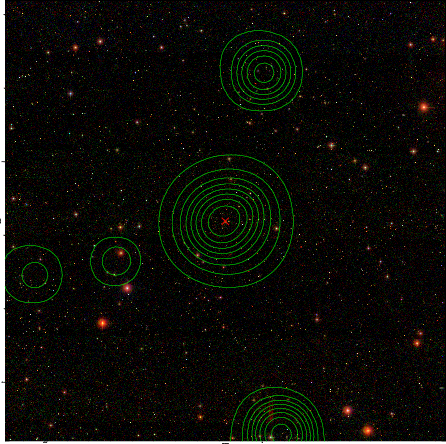  |

