

### 60

|Name|RAJ2000[deg]|DEJ2000[deg] |Ext[arcmin]| Ext,ml | z | z_src| C|GC(XSZ,Delta_z<0.01)| GC(OPT,Delta_z<0.01)|GC| R_sig[arcmin] | R500[arcmin] | R500[Mpc]| CRsig[c/s] | CR500[c/s] |L500[1E44 erg/s]|F500[1E-12 erg/s/cm^2]| M500[1E14 Msun]|Tx[keV]|Cnt_sig|Beta|Rc[arcmin]|Comment|Alias|
|---|---|---|---|---|---|------|---|--------|---------|----------|---|---|---|---|---|---|---|---|---|---|---|---|---|---|
|60| 17.917| 33.455| 3.47| 66.20| 0.1110(0.009)| z2, z_xsz| B| MCXC, Tar| A, N, RM, W| A, C, F20, MCXC, N, SPI, Tar, W| 24.700| 7.433| 0.902| 0.179(0.060)| 0.160(0.054)| 0.923(0.174)| 2.913(0.549)| 2.32(0.22)| 3.73(0.22)| 221.6| 0.929(-0.083+0.051)| 5.220(-0.628+0.512)| -| k426|

|[RASS image](../image/60/60_img.pdf)|[filtered image](../image/60/60_fil.pdf)|[Segment image](../image/60/60_seg.pdf)|
|-------------------|--------------------|-------------------|
| 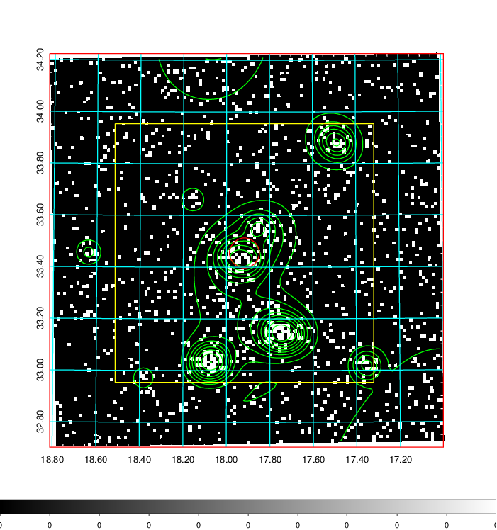  | 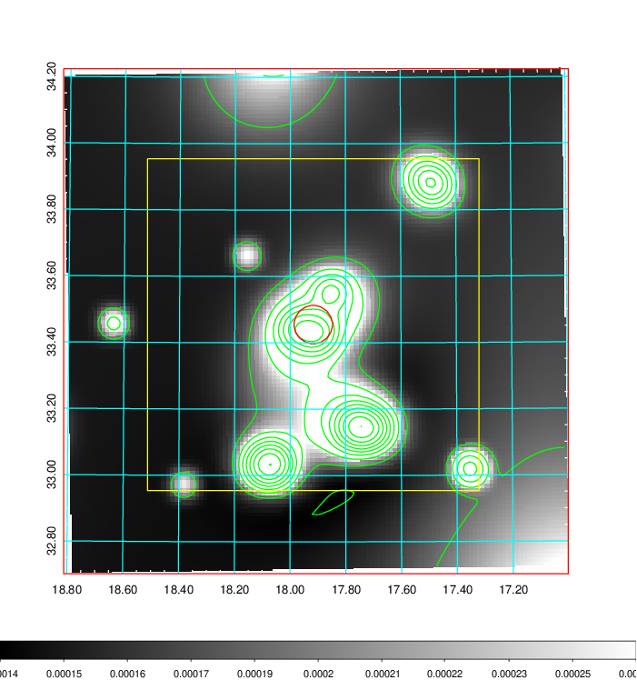   | 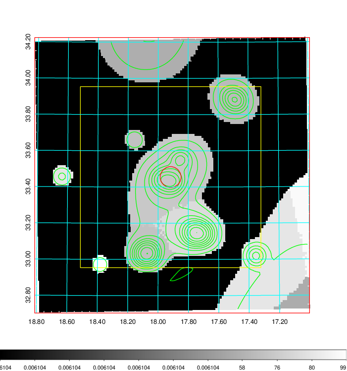  |

|[Exposure image](../image/60/60_mex.pdf)| [nH image](../image/60/60_nh.pdf)| [Planck image](../image/60/60_p.pdf)|
|-------------------|--------------------|-------------------|
|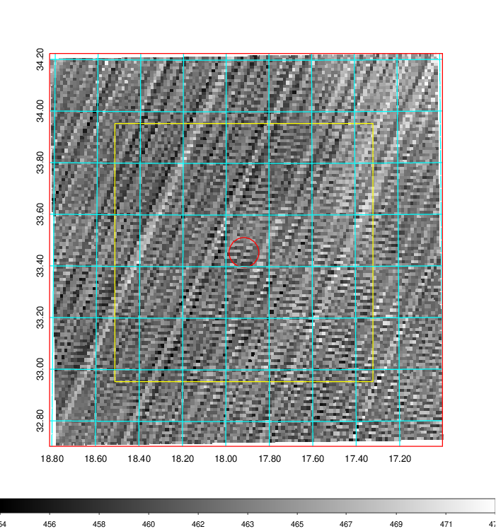   | 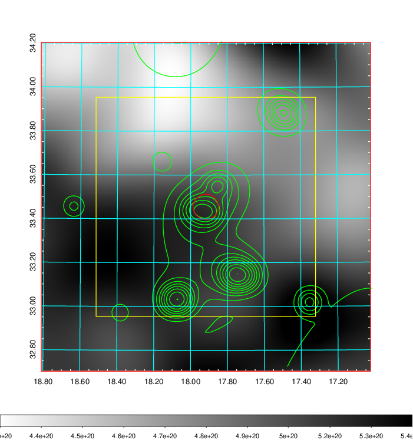    | 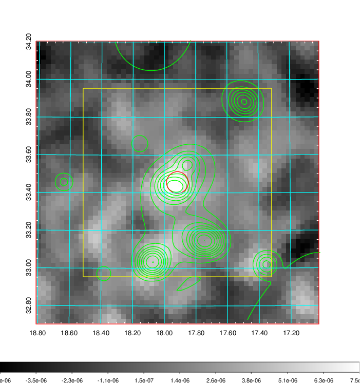 |

|[Redshift Histogram](../image/60/60_zg.pdf) | [DSS image(z1)](../image/60/60_dss_z1.pdf)      |  [DSS image(z2)](../image/60/60_dss_z2.pdf)    |
|-------------------|--------------------|-------------------|
|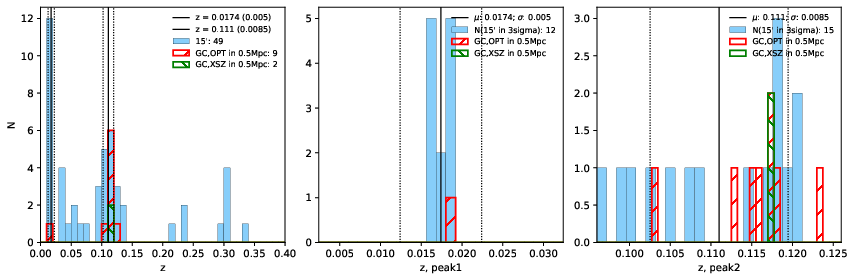 |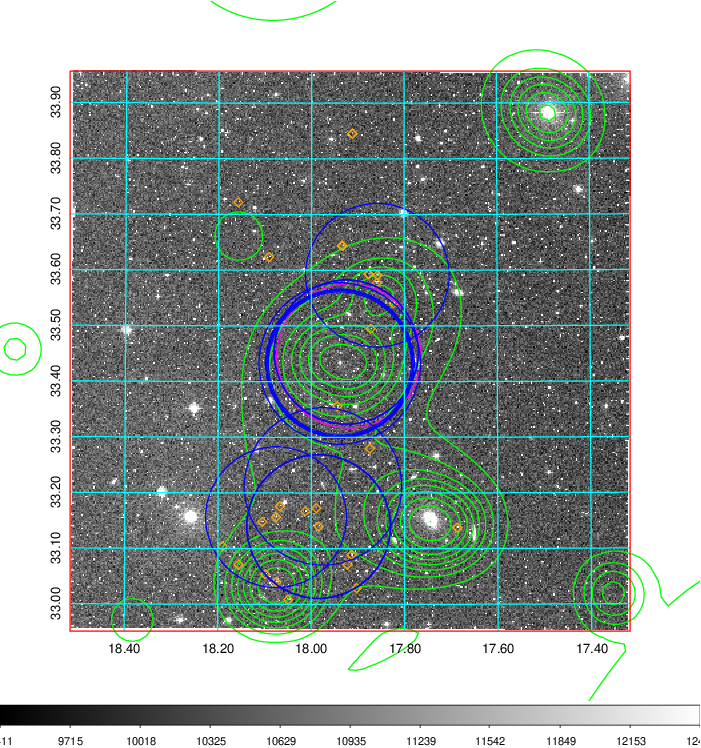  Blue circle for optical clusters;  Magenta circle for XSZ clusters;  all with r=1Mpc;  Only GC with Delta_z<0.01 are shown. | 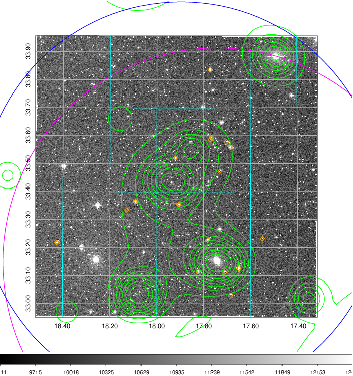 Blue circle for optical clusters;  Magenta circle for XSZ clusters;  all with r=1Mpc;  Only GC with Delta_z<0.01 are shown.  |

|[Previous-identified clusters](../image/60/60_gc.pdf) | [2MASS image](../image/60/60_2mass.pdf)      |[SDSS image](../image/60/60_sdss.pdf)   |
|-------------------|-------------------|-------------------|
|  Green, magenta, and blue circles  for optical, X-ray and SZ clusters  respectively, with redshift of clusters  labelled. The radius of circles  are 1Mpc.|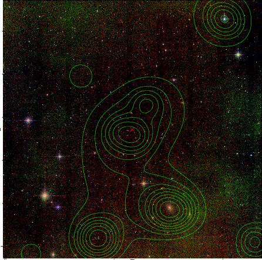  | 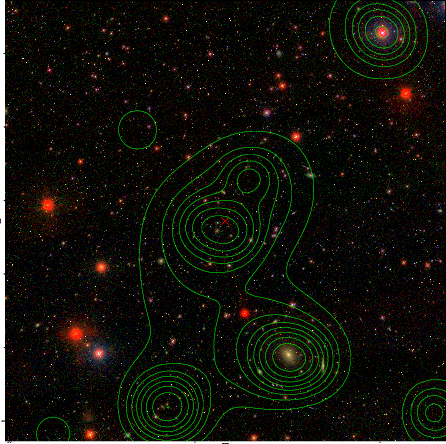  |

