

### 600

|Name|RAJ2000[deg]|DEJ2000[deg] |Ext[arcmin]| Ext,ml | z | z_src| C|GC(XSZ,Delta_z<0.01)| GC(OPT,Delta_z<0.01)|GC| R_sig[arcmin] | R500[arcmin] | R500[Mpc]| CRsig[c/s] | CR500[c/s] |L500[1E44 erg/s]|F500[1E-12 erg/s/cm^2]| M500[1E14 Msun]|Tx[keV]|Cnt_sig|Beta|Rc[arcmin]|Comment|Alias|
|---|---|---|---|---|---|------|---|--------|---------|----------|---|---|---|---|---|---|---|---|---|---|---|---|---|---|
|600| 229.185| 7.025| 1.60| 566.41| 0.0348(0.005)| z1, z_xsz| B| L03, MCXC, XB| A, N| A, C, F20, L03, MCXC, N, W, XB| 14.650| 23.867| 0.992| 2.255(0.086)| 2.516(0.095)| 1.332(0.026)| 47.534(0.916)| 2.87(0.03)| 4.15(0.03)| 974.6| 0.742(-0.042+0.050)| 3.085(-0.300+0.338)| -| k139|

|[RASS image](../image/600/600_img.pdf)|[filtered image](../image/600/600_fil.pdf)|[Segment image](../image/600/600_seg.pdf)|
|-------------------|--------------------|-------------------|
| 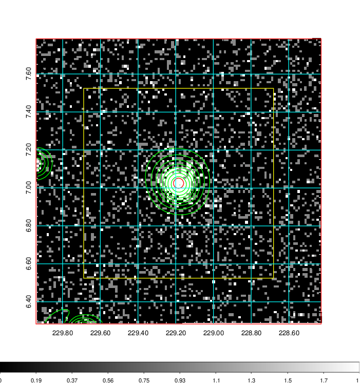  | 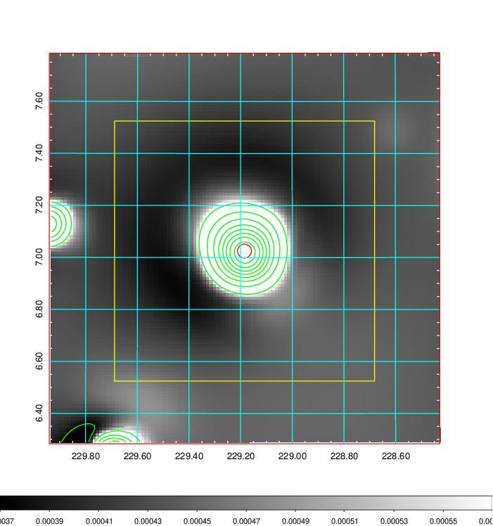   | 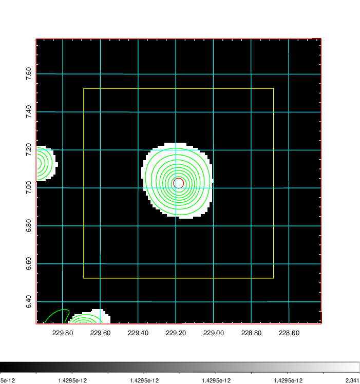  |

|[Exposure image](../image/600/600_mex.pdf)| [nH image](../image/600/600_nh.pdf)| [Planck image](../image/600/600_p.pdf)|
|-------------------|--------------------|-------------------|
|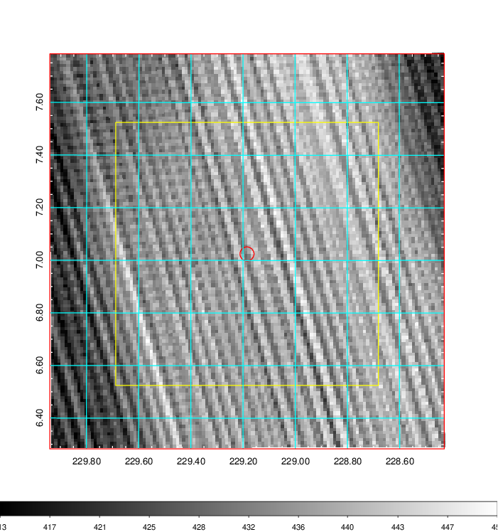   | 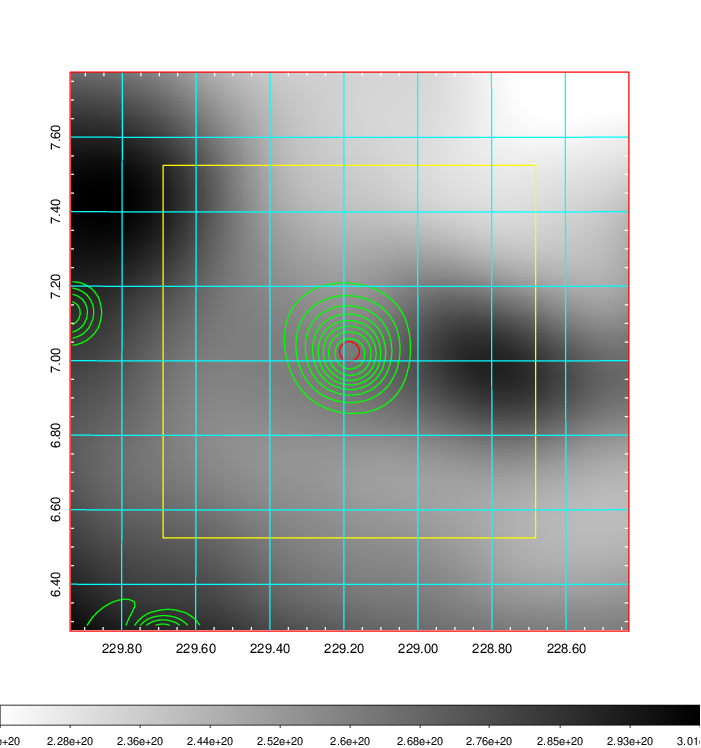    | 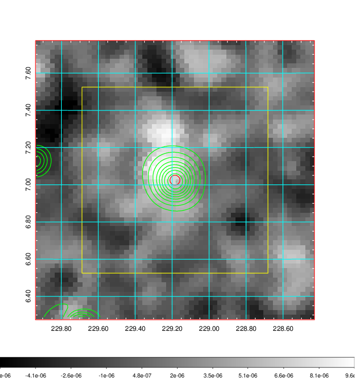 |

|[Redshift Histogram](../image/600/600_zg.pdf) | [DSS image(z1)](../image/600/600_dss_z1.pdf)      |  [DSS image(z2)](../image/600/600_dss_z2.pdf)    |
|-------------------|--------------------|-------------------|
|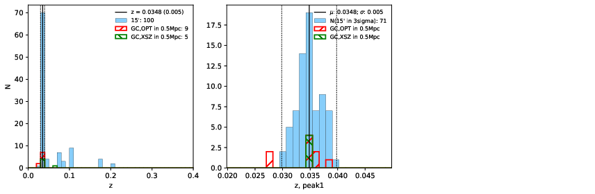 |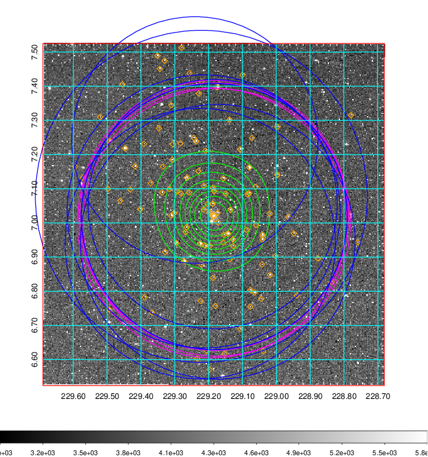  Blue circle for optical clusters;  Magenta circle for XSZ clusters;  all with r=1Mpc;  Only GC with Delta_z<0.01 are shown. | 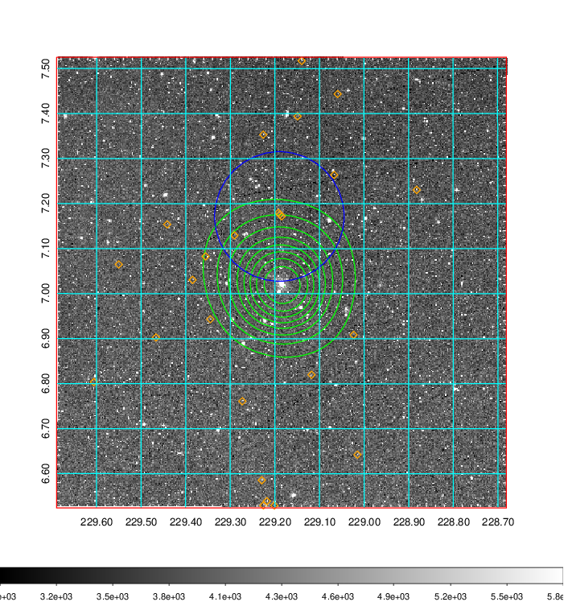 Blue circle for optical clusters;  Magenta circle for XSZ clusters;  all with r=1Mpc;  Only GC with Delta_z<0.01 are shown.  |

|[known Abell/XSZ clusters](../image/600/600_gc.pdf) | [2MASS image](../image/600/600_2mass.pdf)      |[SDSS image](../image/600/600_sdss.pdf)   |
|-------------------|-------------------|-------------------|
|  Magenta, blue and green circles  for optical, X-ray and SZ clusters  respectively, with redshift of clusters  labelled. The radius of circles  are 1Mpc.|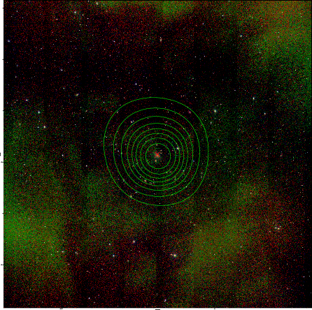  | 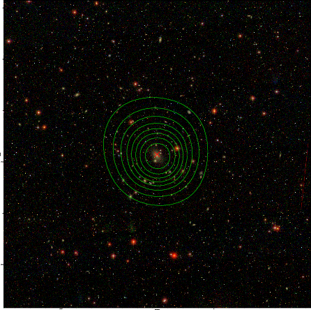  |

