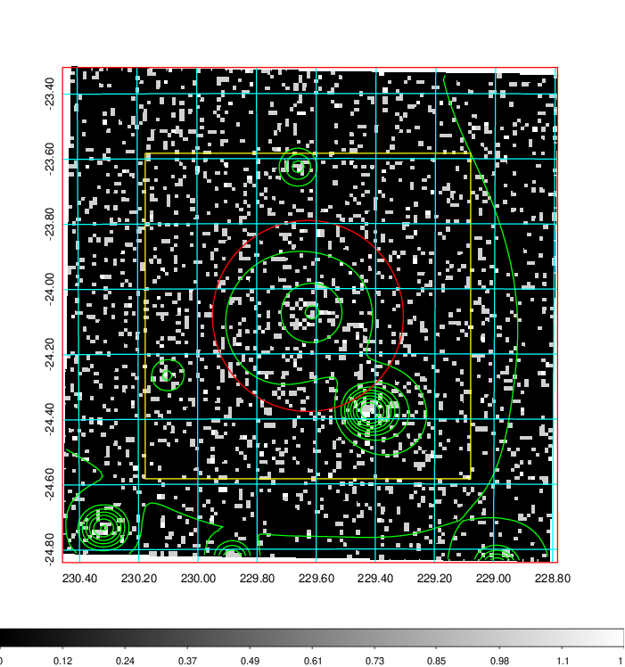
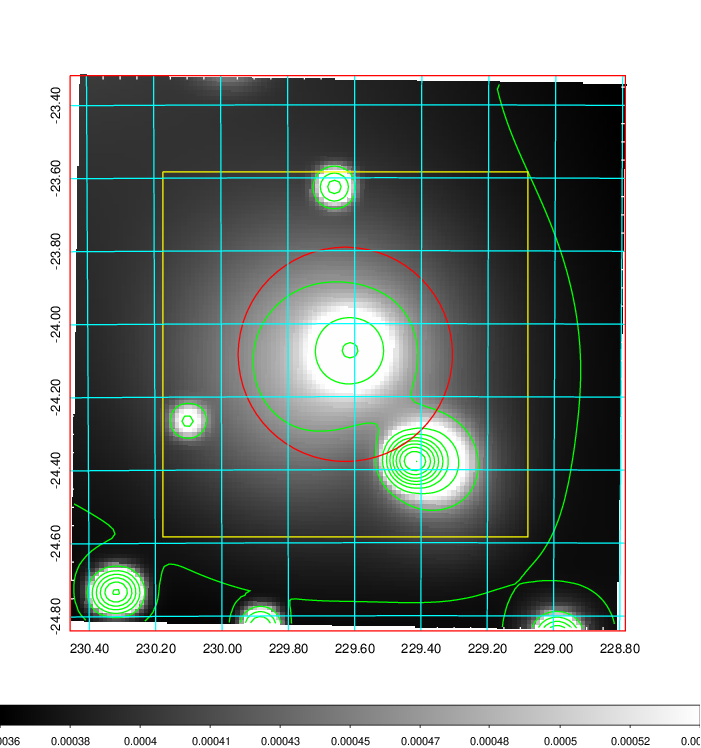
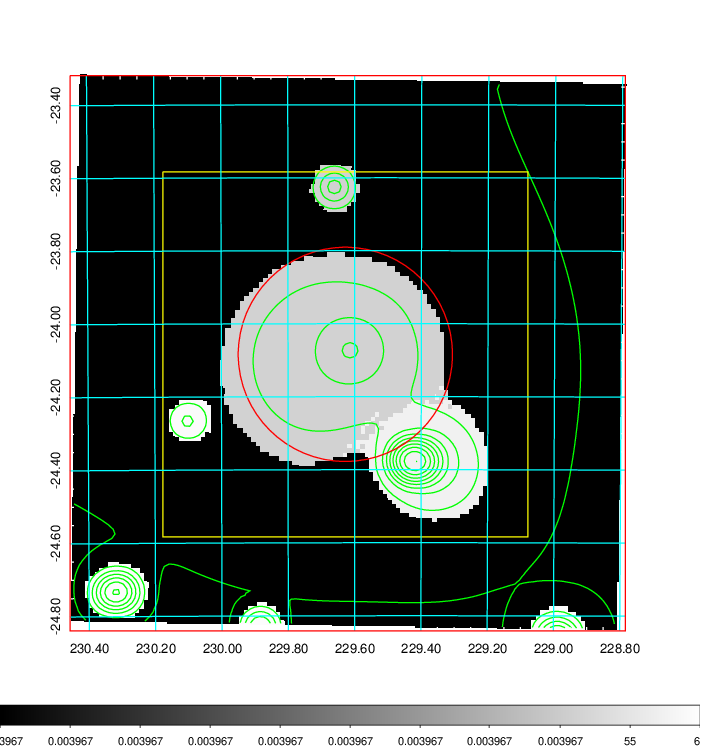
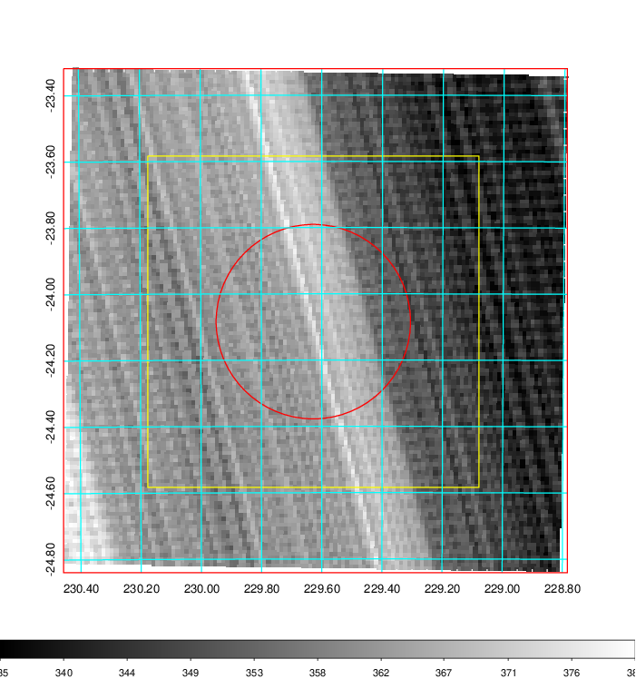
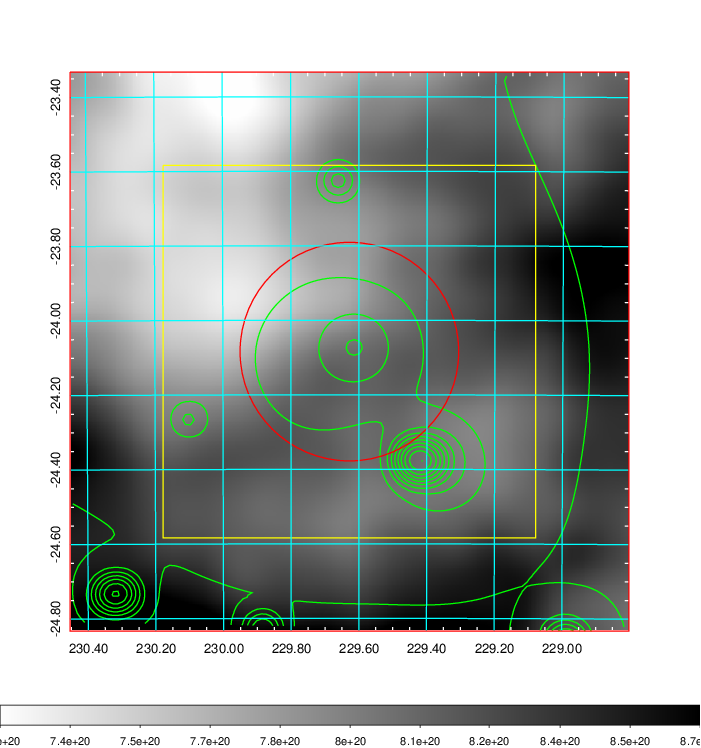
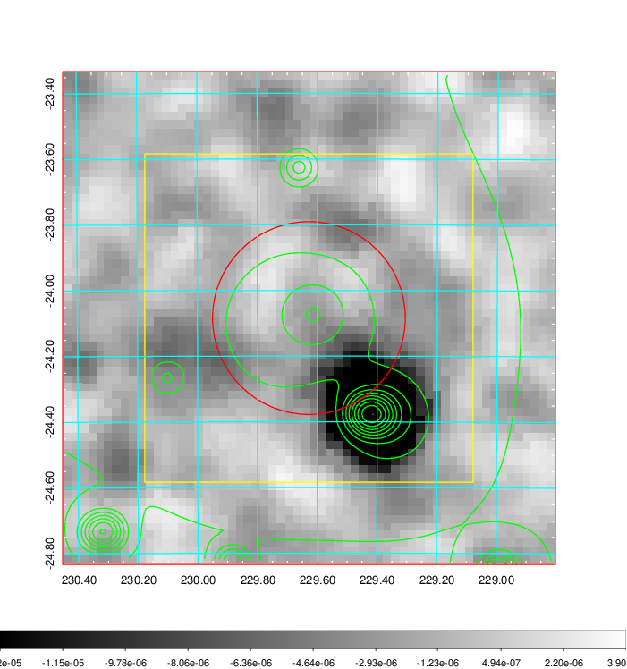
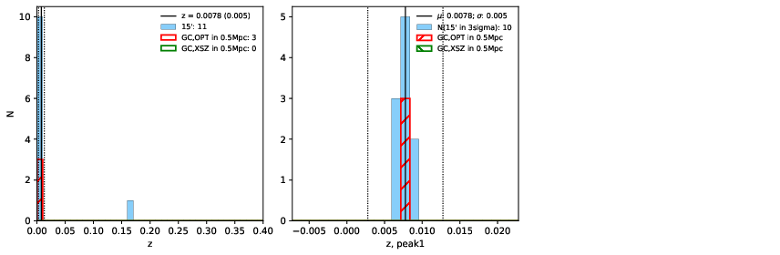
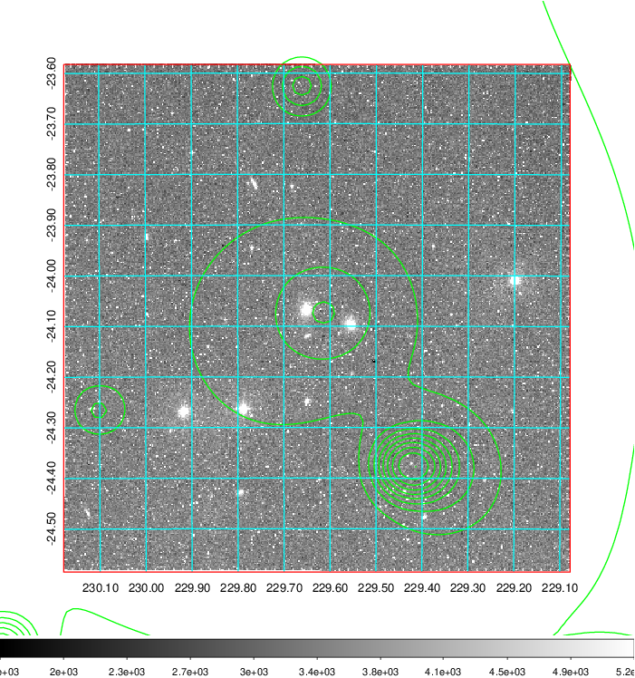
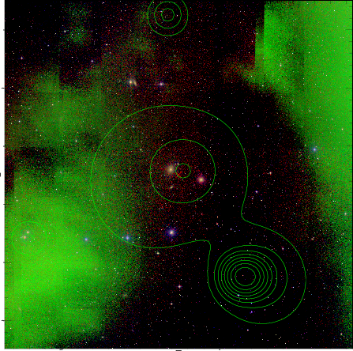
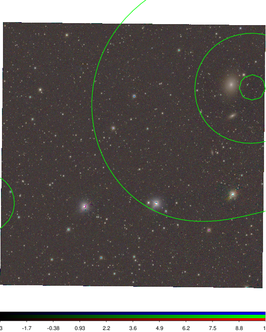

### 601

|Name|RAJ2000[deg]|DEJ2000[deg] |Ext[arcmin]| Ext,ml | z | z_src| C|GC(XSZ,Delta_z<0.01)| GC(OPT,Delta_z<0.01)|GC| R_sig[arcmin] | R500[arcmin] | R500[Mpc]| CRsig[c/s] | CR500[c/s] |L500[1E44 erg/s]|F500[1E-12 erg/s/cm^2]| M500[1E14 Msun]|Tx[keV]|Cnt_sig|Beta|Rc[arcmin]|Comment|Alias|
|---|---|---|---|---|---|------|---|--------|---------|----------|---|---|---|---|---|---|---|---|---|---|---|---|---|---|
|601| 229.628| -24.084| 17.61| 33.42| 0.0078(0.005)| z1, z_opt| S| -| N| N| 30.131| 41.629| 0.401| 0.479(0.100)| 0.511(0.107)| 0.009(0.001)| 6.407(0.834)| 0.18(0.01)| 0.76(0.03)| 233.5| 0.518(-0.013+0.031)| 11.484(-0.697+0.931)| -| t563|

|[RASS image](../image/601/601_img.pdf)|[filtered image](../image/601/601_fil.pdf)|[Segment image](../image/601/601_seg.pdf)|
|-------------------|--------------------|-------------------|
|   |    |   |

|[Exposure image](../image/601/601_mex.pdf)| [nH image](../image/601/601_nh.pdf)| [Planck image](../image/601/601_p.pdf)|
|-------------------|--------------------|-------------------|
|   |     |  |

|[Redshift Histogram](../image/601/601_zg.pdf) | [DSS image(z1)](../image/601/601_dss_z1.pdf)      |  [DSS image(z2)](../image/601/601_dss_z2.pdf)    |
|-------------------|--------------------|-------------------|
| |  Blue circle for optical clusters;  Magenta circle for XSZ clusters;  all with r=1Mpc;  Only GC with Delta_z<0.01 are shown. |  Blue circle for optical clusters;  Magenta circle for XSZ clusters;  all with r=1Mpc;  Only GC with Delta_z<0.01 are shown.  |

|[Previous-identified clusters](../image/601/601_gc.pdf) | [2MASS image](../image/601/601_2mass.pdf)      |
|-------------------|-------------------|
|  Green, magenta, and blue circles  for optical, X-ray and SZ clusters  respectively, with redshift of clusters  labelled. The radius of circles  are 1Mpc.|  |

|[PS1 image](../image/601/601_ps1.pdf)            |
|-------------------|
|   |
