

### 602

|Name|RAJ2000[deg]|DEJ2000[deg] |Ext[arcmin]| Ext,ml | z | z_src| C|GC(XSZ,Delta_z<0.01)| GC(OPT,Delta_z<0.01)|GC| R_sig[arcmin] | R500[arcmin] | R500[Mpc]| CRsig[c/s] | CR500[c/s] |L500[1E44 erg/s]|F500[1E-12 erg/s/cm^2]| M500[1E14 Msun]|Tx[keV]|Cnt_sig|Beta|Rc[arcmin]|Comment|Alias|
|---|---|---|---|---|---|------|---|--------|---------|----------|---|---|---|---|---|---|---|---|---|---|---|---|---|---|
|602| 230.228| 48.668| 0.84| 32.14| 0.0736(0.005)| z1, z_xsz| B| F20, SPI| N, W| A, C, F20, MCXC, N, SPI, W, XB| 14.650| 10.390| 0.872| 0.340(0.038)| 0.324(0.037)| 0.835(0.054)| 6.305(0.411)| 2.03(0.07)| 3.39(0.07)| 148.4| 0.711(-0.096+0.138)| 2.014(-0.652+0.748)| An X-ray cluster with $z$ = 0.1076 and offset = 0.01 Mpc| k017|

|[RASS image](../image/602/602_img.pdf)|[filtered image](../image/602/602_fil.pdf)|[Segment image](../image/602/602_seg.pdf)|
|-------------------|--------------------|-------------------|
| 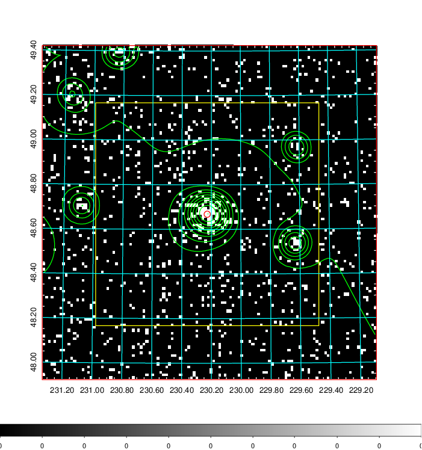  | 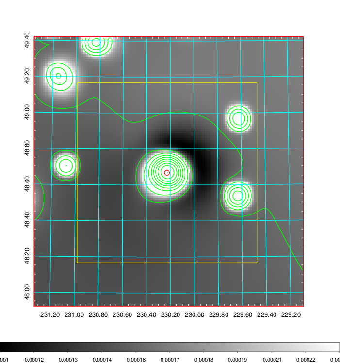   | 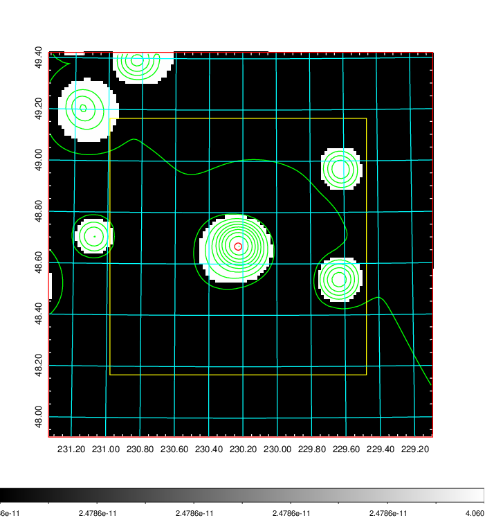  |

|[Exposure image](../image/602/602_mex.pdf)| [nH image](../image/602/602_nh.pdf)| [Planck image](../image/602/602_p.pdf)|
|-------------------|--------------------|-------------------|
|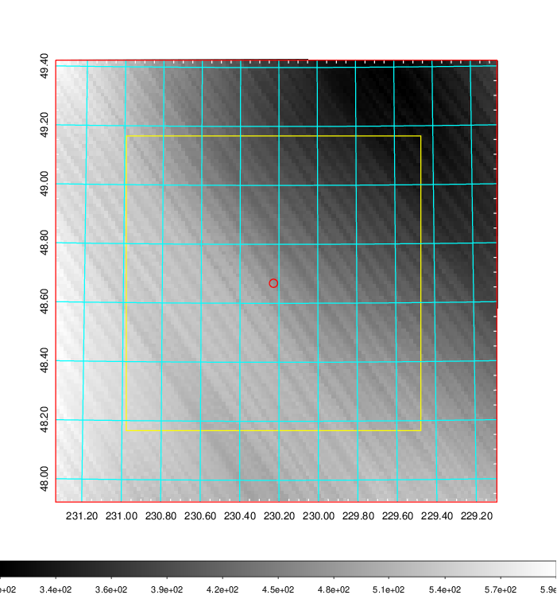   | 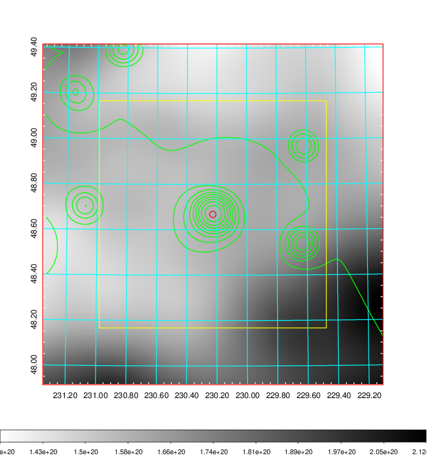    | 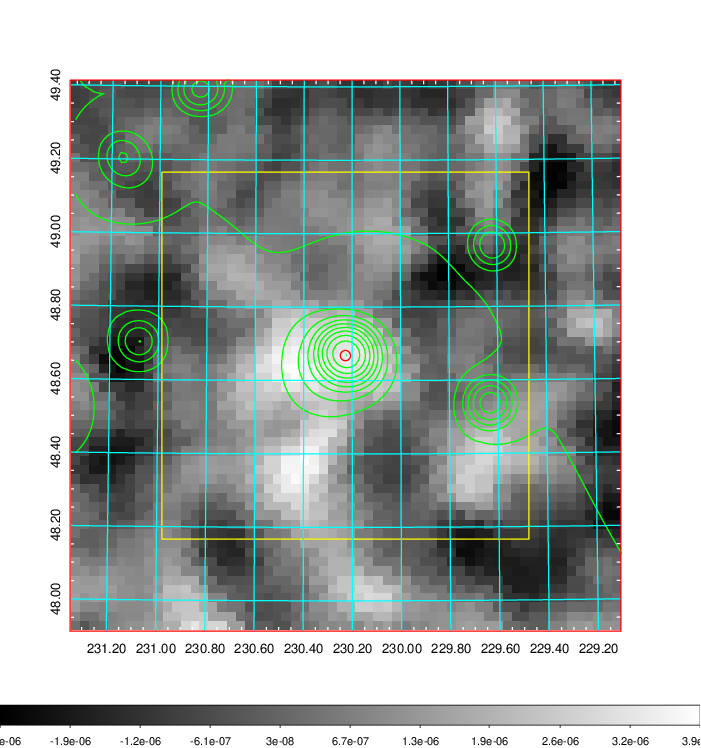 |

|[Redshift Histogram](../image/602/602_zg.pdf) | [DSS image(z1)](../image/602/602_dss_z1.pdf)      |  [DSS image(z2)](../image/602/602_dss_z2.pdf)    |
|-------------------|--------------------|-------------------|
|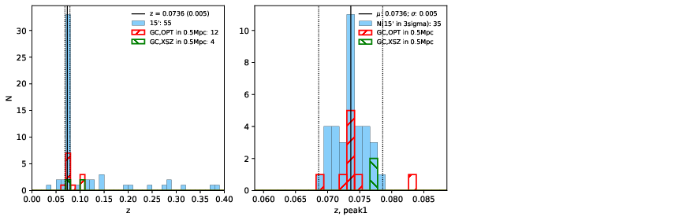 |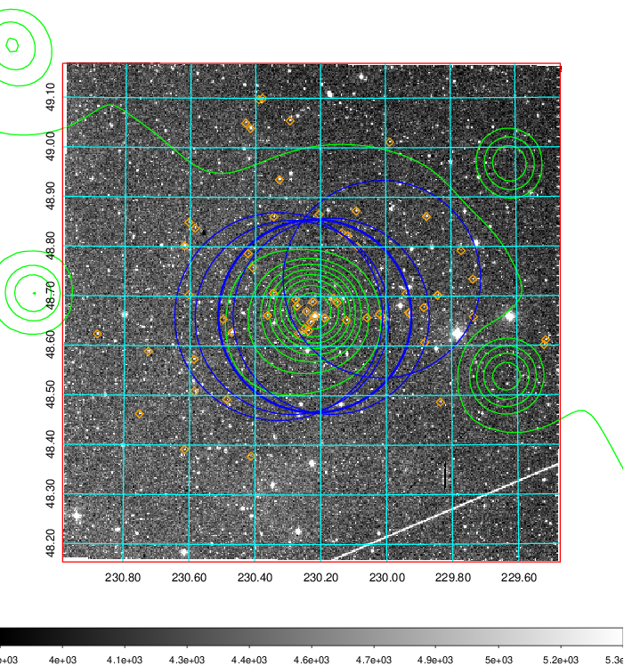  Blue circle for optical clusters;  Magenta circle for XSZ clusters;  all with r=1Mpc;  Only GC with Delta_z<0.01 are shown. | 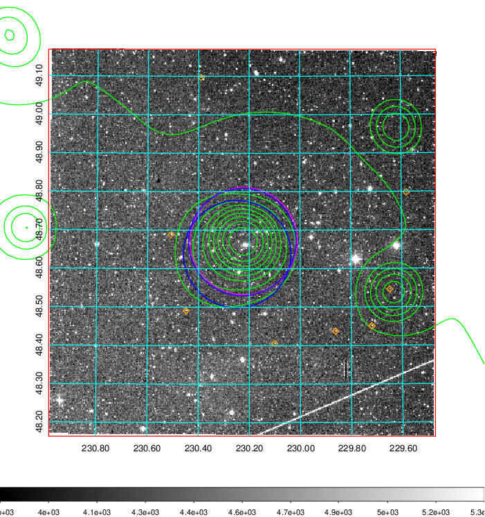 Blue circle for optical clusters;  Magenta circle for XSZ clusters;  all with r=1Mpc;  Only GC with Delta_z<0.01 are shown.  |

|[Previous-identified clusters](../image/602/602_gc.pdf) | [2MASS image](../image/602/602_2mass.pdf)      |
|-------------------|-------------------|
|  Green, magenta, and blue circles  for optical, X-ray and SZ clusters  respectively, with redshift of clusters  labelled. The radius of circles  are 1Mpc.|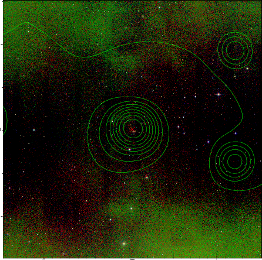  |

|[PS1 image](../image/602/602_ps1.pdf)            |
|-------------------|
| 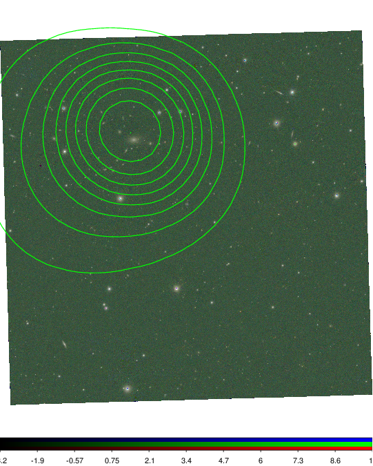  |
