

### 604

|Name|RAJ2000[deg]|DEJ2000[deg] |Ext[arcmin]| Ext,ml | z | z_src| C|GC(XSZ,Delta_z<0.01)| GC(OPT,Delta_z<0.01)|GC| R_sig[arcmin] | R500[arcmin] | R500[Mpc]| CRsig[c/s] | CR500[c/s] |L500[1E44 erg/s]|F500[1E-12 erg/s/cm^2]| M500[1E14 Msun]|Tx[keV]|Cnt_sig|Beta|Rc[arcmin]|Comment|Alias|
|---|---|---|---|---|---|------|---|--------|---------|----------|---|---|---|---|---|---|---|---|---|---|---|---|---|---|
|604| 230.470| 7.701| 1.62| 361.11| 0.0448(0.005)| z1, z_xsz| B| MCXC, PSZ2, Tar| N, W, Zw| C, F20, MCXC, N, PSZ2, Tar, W| 12.212| 19.040| 1.007| 1.488(0.077)| 1.639(0.085)| 1.454(0.037)| 30.859(0.785)| 3.03(0.04)| 4.30(0.03)| 598.3| 0.885(-0.075+0.071)| 3.677(-0.432+0.376)| -| k142|

|[RASS image](../image/604/604_img.pdf)|[filtered image](../image/604/604_fil.pdf)|[Segment image](../image/604/604_seg.pdf)|
|-------------------|--------------------|-------------------|
| 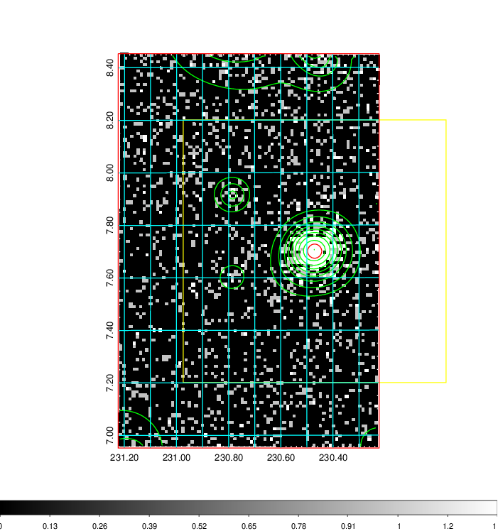  | 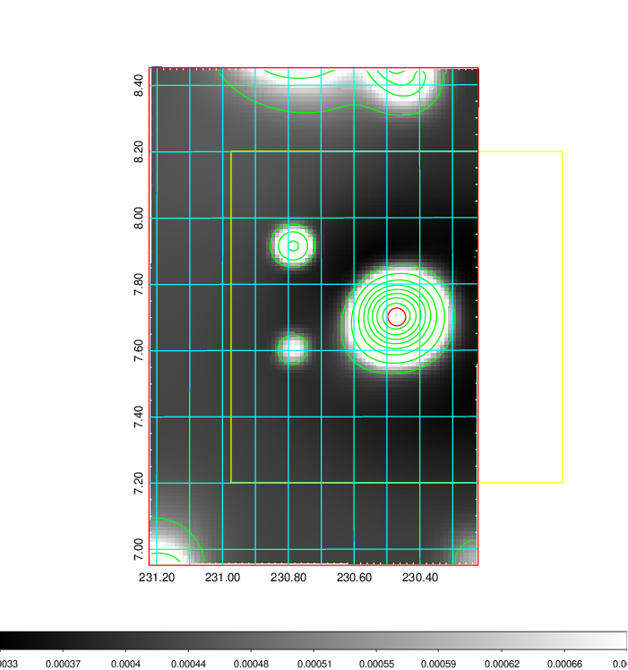   | 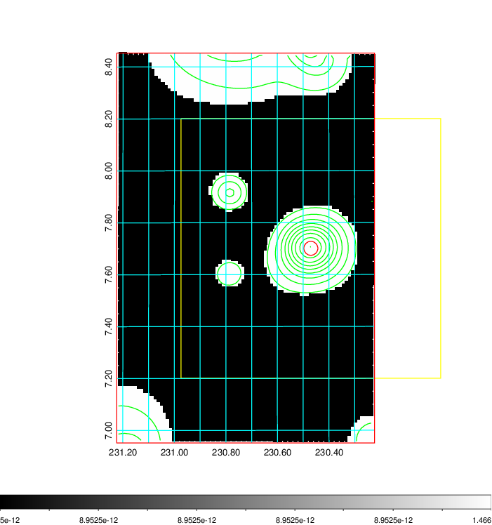  |

|[Exposure image](../image/604/604_mex.pdf)| [nH image](../image/604/604_nh.pdf)| [Planck image](../image/604/604_p.pdf)|
|-------------------|--------------------|-------------------|
|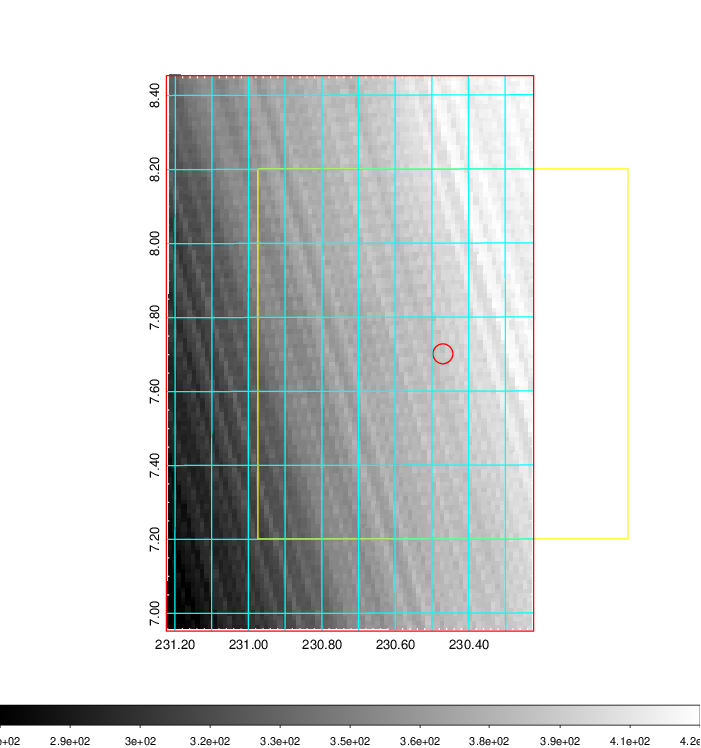   | 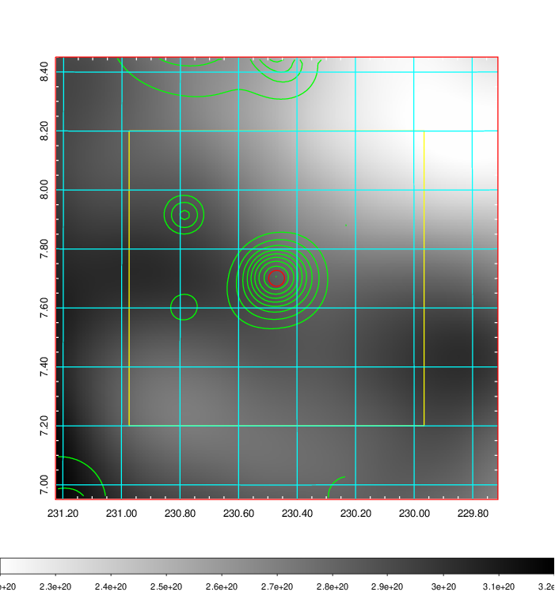    | 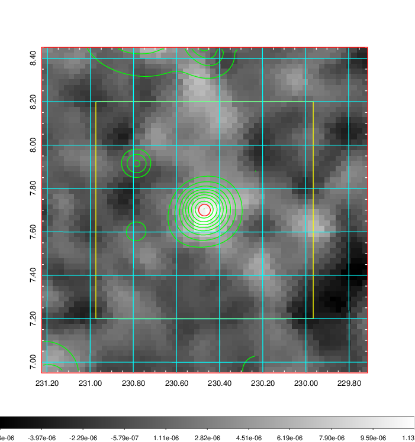 |

|[Redshift Histogram](../image/604/604_zg.pdf) | [DSS image(z1)](../image/604/604_dss_z1.pdf)      |  [DSS image(z2)](../image/604/604_dss_z2.pdf)    |
|-------------------|--------------------|-------------------|
|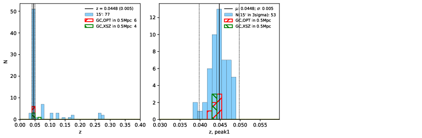 |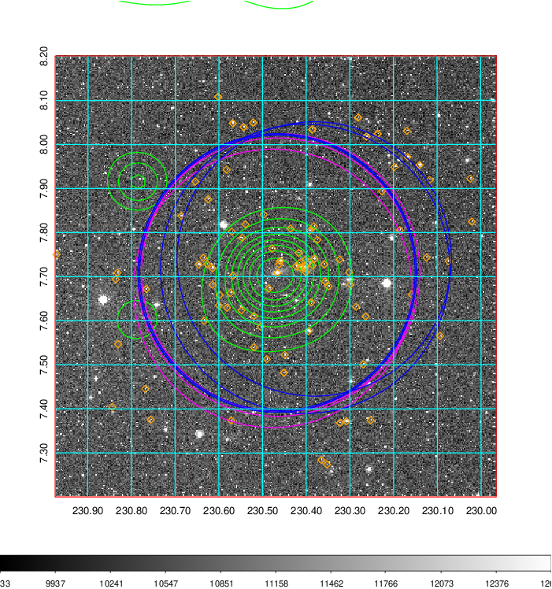  Blue circle for optical clusters;  Magenta circle for XSZ clusters;  all with r=1Mpc;  Only GC with Delta_z<0.01 are shown. | 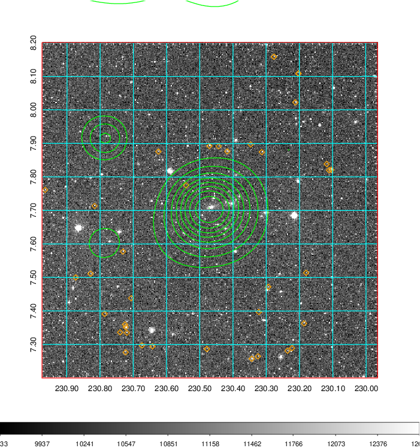 Blue circle for optical clusters;  Magenta circle for XSZ clusters;  all with r=1Mpc;  Only GC with Delta_z<0.01 are shown.  |

|[Previous-identified clusters](../image/604/604_gc.pdf) | [2MASS image](../image/604/604_2mass.pdf)      |[SDSS image](../image/604/604_sdss.pdf)   |
|-------------------|-------------------|-------------------|
|  Green, magenta, and blue circles  for optical, X-ray and SZ clusters  respectively, with redshift of clusters  labelled. The radius of circles  are 1Mpc.|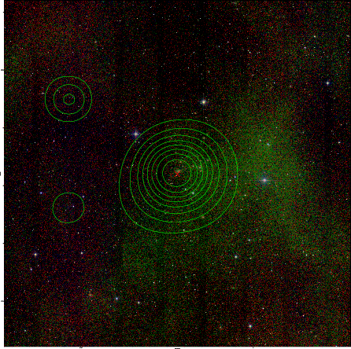  | 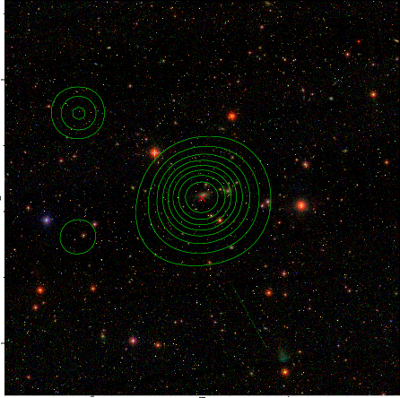  |

