

### 605

|Name|RAJ2000[deg]|DEJ2000[deg] |Ext[arcmin]| Ext,ml | z | z_src| C|GC(XSZ,Delta_z<0.01)| GC(OPT,Delta_z<0.01)|GC| R_sig[arcmin] | R500[arcmin] | R500[Mpc]| CRsig[c/s] | CR500[c/s] |L500[1E44 erg/s]|F500[1E-12 erg/s/cm^2]| M500[1E14 Msun]|Tx[keV]|Cnt_sig|Beta|Rc[arcmin]|Comment|Alias|
|---|---|---|---|---|---|------|---|--------|---------|----------|---|---|---|---|---|---|---|---|---|---|---|---|---|---|
|605| 230.476| 8.459| 3.28| 33.50| 0.0360(0.005)| z1, z_opt| S| -| N| A, C, F20, N, W| 24.700| 18.578| 0.798| 0.866(0.080)| 0.883(0.076)| 0.482(0.050)| 16.062(1.661)| 1.49(0.08)| 2.77(0.09)| 739.0| 0.781(-0.210+0.160)| 20.912(-6.905+4.269)| -| t148|

|[RASS image](../image/605/605_img.pdf)|[filtered image](../image/605/605_fil.pdf)|[Segment image](../image/605/605_seg.pdf)|
|-------------------|--------------------|-------------------|
| 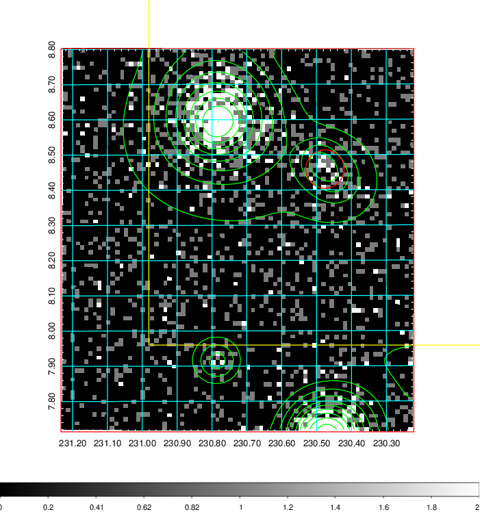  | 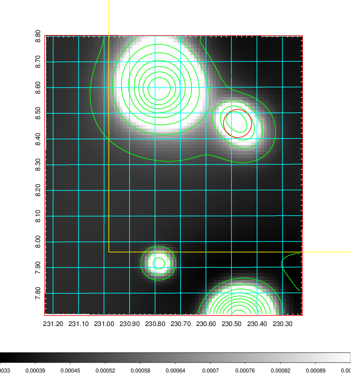   | 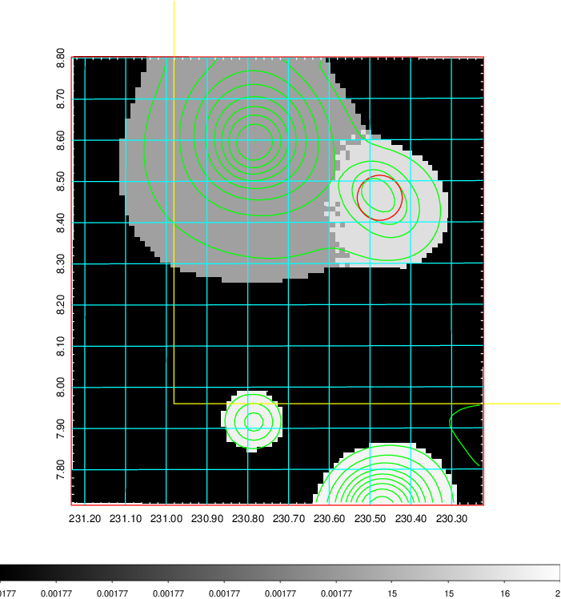  |

|[Exposure image](../image/605/605_mex.pdf)| [nH image](../image/605/605_nh.pdf)| [Planck image](../image/605/605_p.pdf)|
|-------------------|--------------------|-------------------|
|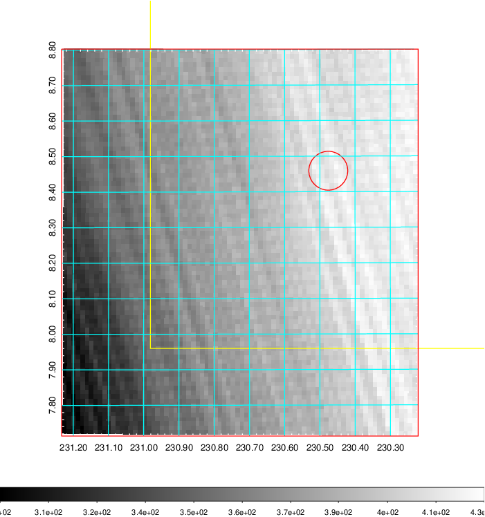   | 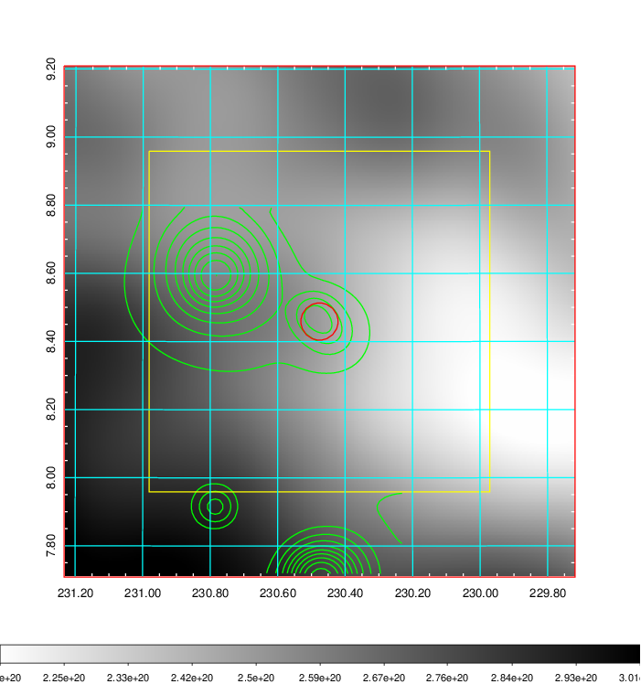    | 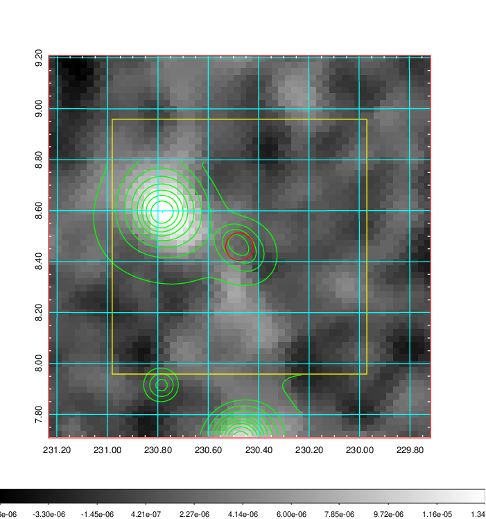 |

|[Redshift Histogram](../image/605/605_zg.pdf) | [DSS image(z1)](../image/605/605_dss_z1.pdf)      |  [DSS image(z2)](../image/605/605_dss_z2.pdf)    |
|-------------------|--------------------|-------------------|
|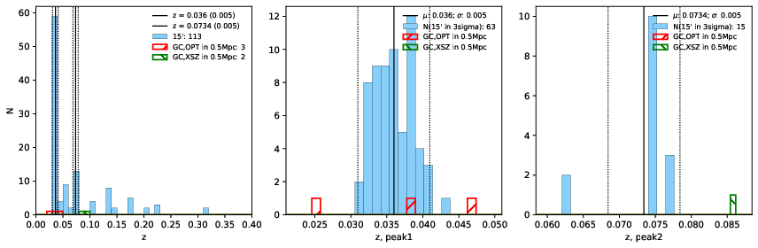 |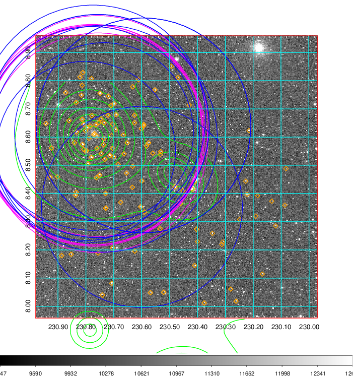  Blue circle for optical clusters;  Magenta circle for XSZ clusters;  all with r=1Mpc;  Only GC with Delta_z<0.01 are shown. | 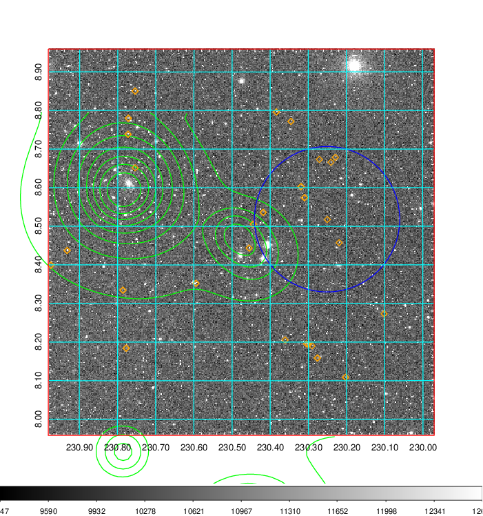 Blue circle for optical clusters;  Magenta circle for XSZ clusters;  all with r=1Mpc;  Only GC with Delta_z<0.01 are shown.  |

|[known Abell/XSZ clusters](../image/605/605_gc.pdf) | [2MASS image](../image/605/605_2mass.pdf)      |[SDSS image](../image/605/605_sdss.pdf)   |
|-------------------|-------------------|-------------------|
|  Magenta, blue and green circles  for optical, X-ray and SZ clusters  respectively, with redshift of clusters  labelled. The radius of circles  are 1Mpc.|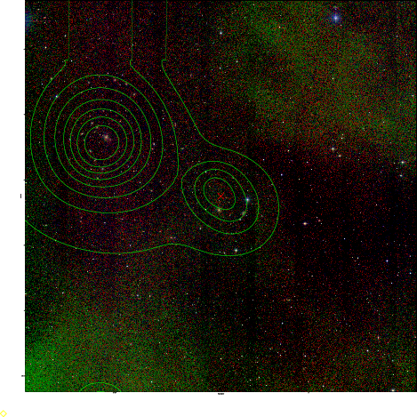  | 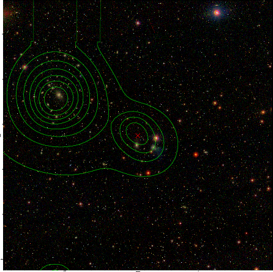  |

