

### 606

|Name|RAJ2000[deg]|DEJ2000[deg] |Ext[arcmin]| Ext,ml | z | z_src| C|GC(XSZ,Delta_z<0.01)| GC(OPT,Delta_z<0.01)|GC| R_sig[arcmin] | R500[arcmin] | R500[Mpc]| CRsig[c/s] | CR500[c/s] |L500[1E44 erg/s]|F500[1E-12 erg/s/cm^2]| M500[1E14 Msun]|Tx[keV]|Cnt_sig|Beta|Rc[arcmin]|Comment|Alias|
|---|---|---|---|---|---|------|---|--------|---------|----------|---|---|---|---|---|---|---|---|---|---|---|---|---|---|
|606| 230.611| 27.714| 2.56| 429.87| 0.0730(0.005)| z1, z_xsz| B| F20, L03, MCXC, PSZ2, Tar, XB| A, N, W| A, F20, L03, MCXC, N, PSZ2, Tar, W, XB| 26.181| 13.713| 1.143| 1.236(0.086)| 1.146(0.080)| 2.831(0.084)| 21.741(0.644)| 4.55(0.07)| 5.58(0.05)| 426.6| 0.784(-0.043+0.053)| 4.508(-0.410+0.481)| -| k312|

|[RASS image](../image/606/606_img.pdf)|[filtered image](../image/606/606_fil.pdf)|[Segment image](../image/606/606_seg.pdf)|
|-------------------|--------------------|-------------------|
| 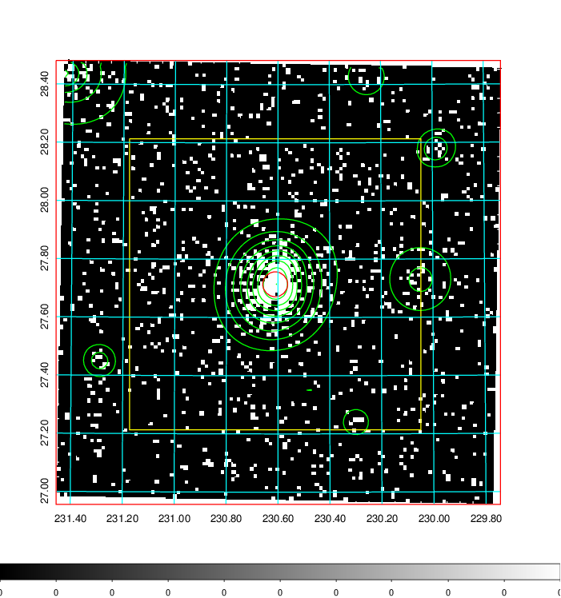  | 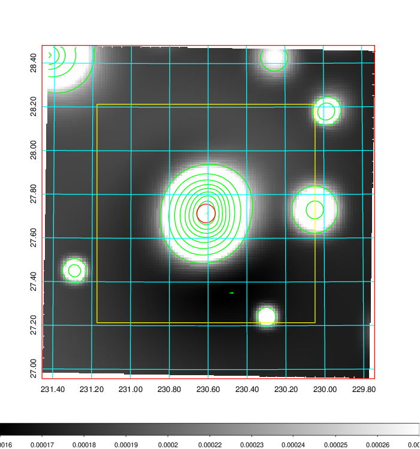   | 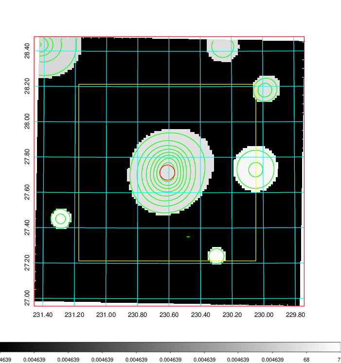  |

|[Exposure image](../image/606/606_mex.pdf)| [nH image](../image/606/606_nh.pdf)| [Planck image](../image/606/606_p.pdf)|
|-------------------|--------------------|-------------------|
|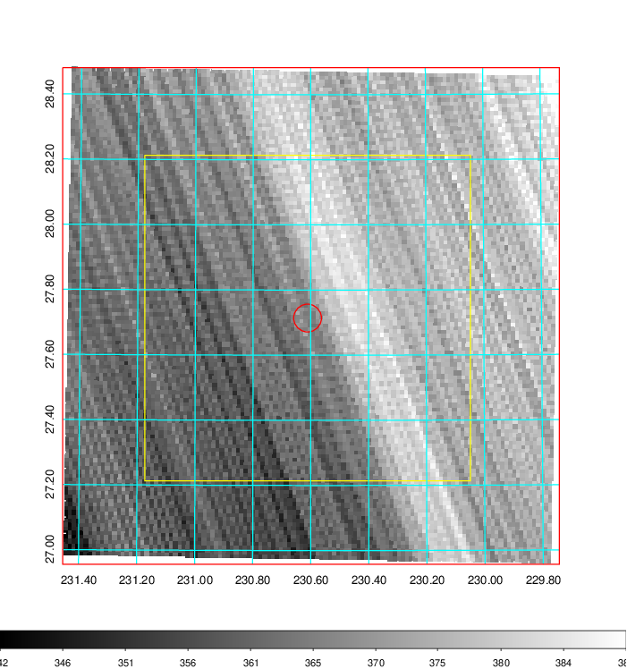   | 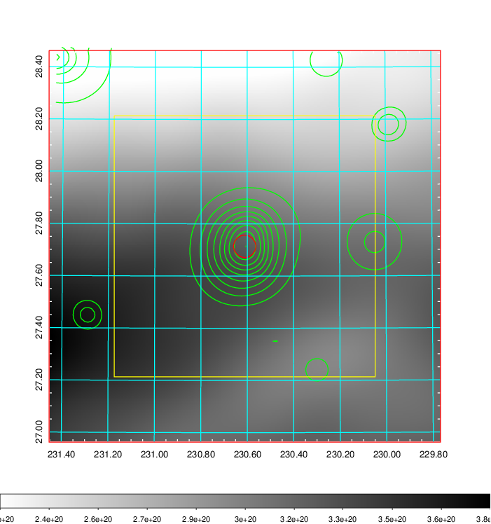    | 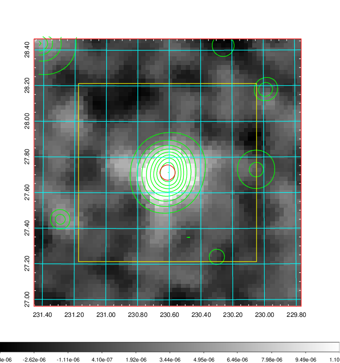 |

|[Redshift Histogram](../image/606/606_zg.pdf) | [DSS image(z1)](../image/606/606_dss_z1.pdf)      |  [DSS image(z2)](../image/606/606_dss_z2.pdf)    |
|-------------------|--------------------|-------------------|
|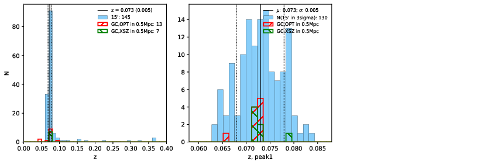 |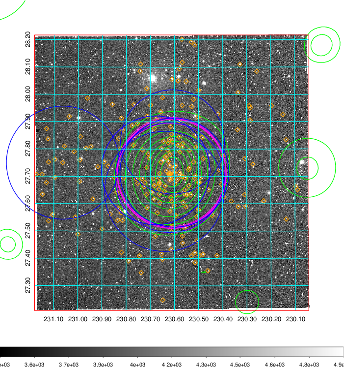  Blue circle for optical clusters;  Magenta circle for XSZ clusters;  all with r=1Mpc;  Only GC with Delta_z<0.01 are shown. | 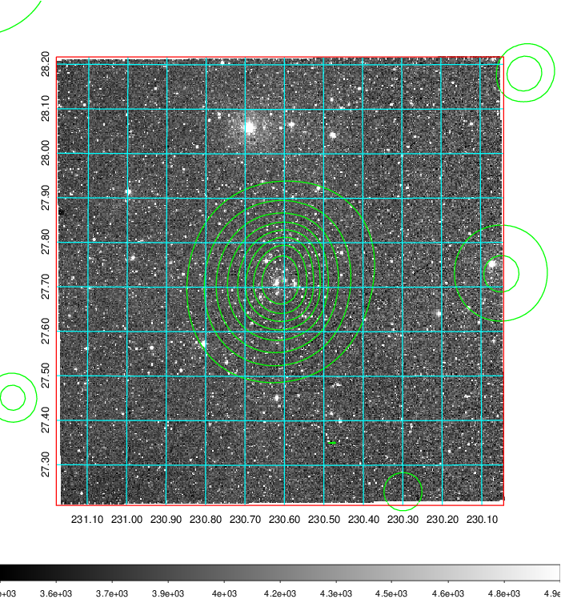 Blue circle for optical clusters;  Magenta circle for XSZ clusters;  all with r=1Mpc;  Only GC with Delta_z<0.01 are shown.  |

|[known Abell/XSZ clusters](../image/606/606_gc.pdf) | [2MASS image](../image/606/606_2mass.pdf)      |[SDSS image](../image/606/606_sdss.pdf)   |
|-------------------|-------------------|-------------------|
|  Magenta, blue and green circles  for optical, X-ray and SZ clusters  respectively, with redshift of clusters  labelled. The radius of circles  are 1Mpc.|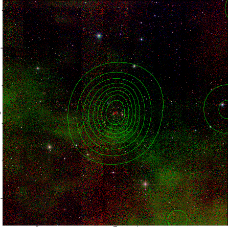  | 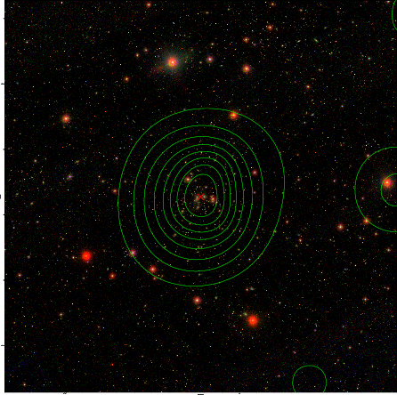  |

