

### 608

|Name|RAJ2000[deg]|DEJ2000[deg] |Ext[arcmin]| Ext,ml | z | z_src| C|GC(XSZ,Delta_z<0.01)| GC(OPT,Delta_z<0.01)|GC| R_sig[arcmin] | R500[arcmin] | R500[Mpc]| CRsig[c/s] | CR500[c/s] |L500[1E44 erg/s]|F500[1E-12 erg/s/cm^2]| M500[1E14 Msun]|Tx[keV]|Cnt_sig|Beta|Rc[arcmin]|Comment|Alias|
|---|---|---|---|---|---|------|---|--------|---------|----------|---|---|---|---|---|---|---|---|---|---|---|---|---|---|
|608| 231.053| 29.904| 4.02| 245.44| 0.1143(0.005)| z1, z_xsz| B| MCXC, PSZ2, Tar, XB| A, C, N, RM, W| A, C, F20, MCXC, N, PSZ2, Tar, W, XB| 13.344| 9.378| 1.167| 0.590(0.071)| 0.562(0.068)| 3.759(0.216)| 11.137(0.641)| 5.04(0.14)| 6.03(0.11)| 215.2| 0.977(-0.034+0.017)| 7.409(-0.325+0.276)| -| k480|

|[RASS image](../image/608/608_img.pdf)|[filtered image](../image/608/608_fil.pdf)|[Segment image](../image/608/608_seg.pdf)|
|-------------------|--------------------|-------------------|
| 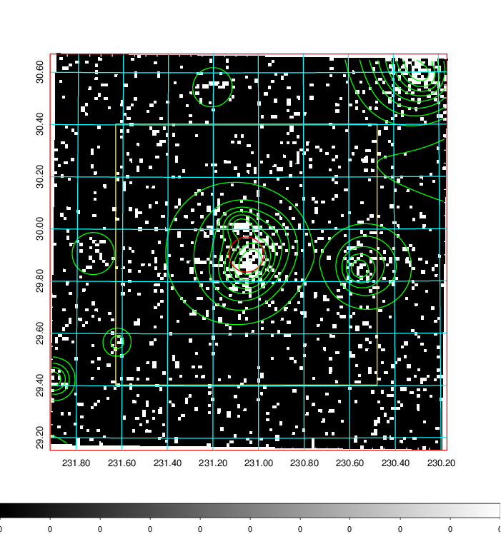  | 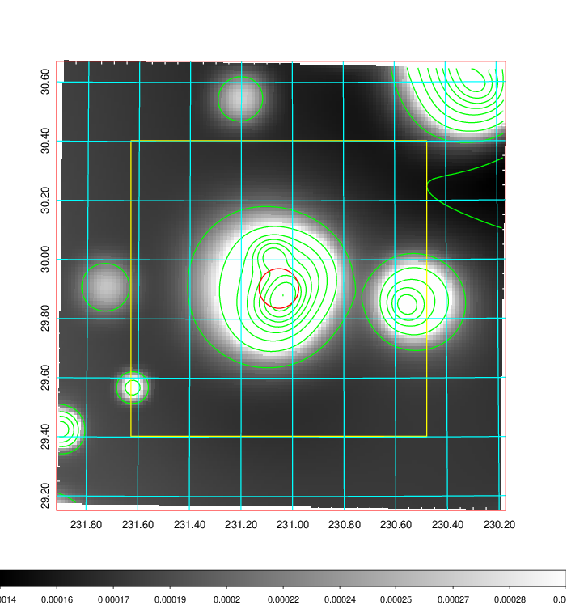   | 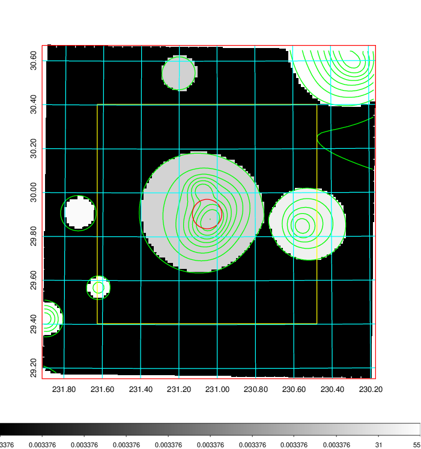  |

|[Exposure image](../image/608/608_mex.pdf)| [nH image](../image/608/608_nh.pdf)| [Planck image](../image/608/608_p.pdf)|
|-------------------|--------------------|-------------------|
|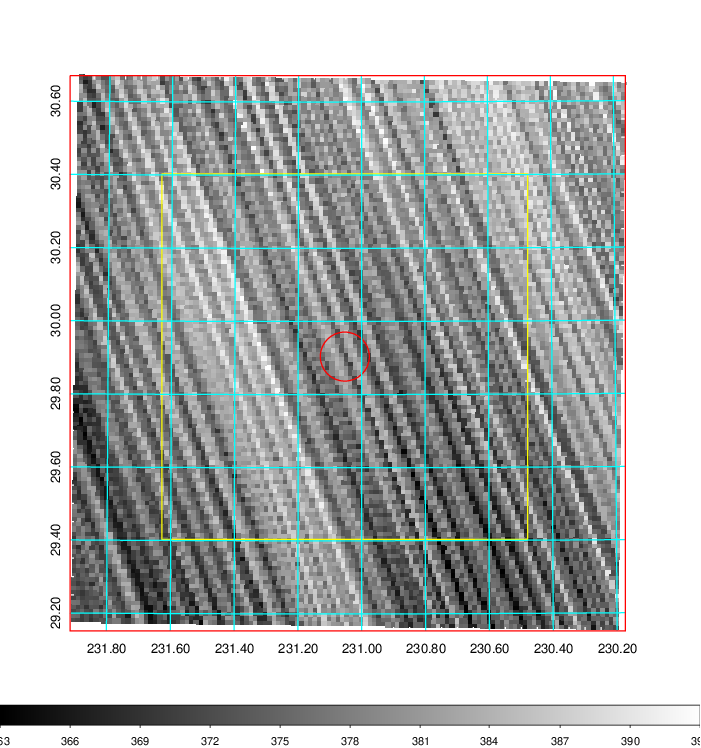   | 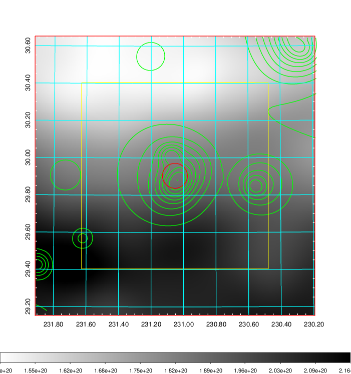    | 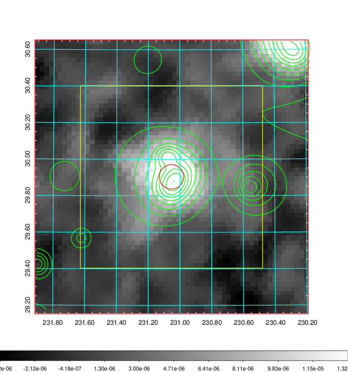 |

|[Redshift Histogram](../image/608/608_zg.pdf) | [DSS image(z1)](../image/608/608_dss_z1.pdf)      |  [DSS image(z2)](../image/608/608_dss_z2.pdf)    |
|-------------------|--------------------|-------------------|
|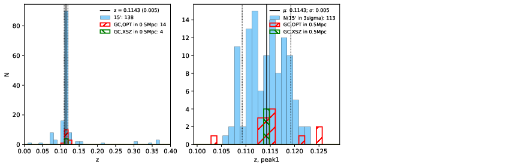 |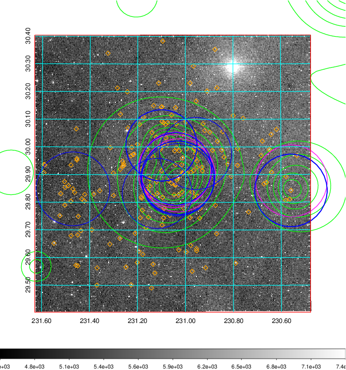  Blue circle for optical clusters;  Magenta circle for XSZ clusters;  all with r=1Mpc;  Only GC with Delta_z<0.01 are shown. | 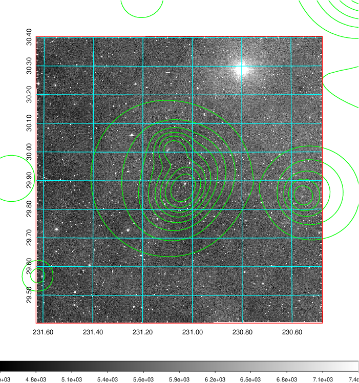 Blue circle for optical clusters;  Magenta circle for XSZ clusters;  all with r=1Mpc;  Only GC with Delta_z<0.01 are shown.  |

|[Previous-identified clusters](../image/608/608_gc.pdf) | [2MASS image](../image/608/608_2mass.pdf)      |[SDSS image](../image/608/608_sdss.pdf)   |
|-------------------|-------------------|-------------------|
|  Green, magenta, and blue circles  for optical, X-ray and SZ clusters  respectively, with redshift of clusters  labelled. The radius of circles  are 1Mpc.|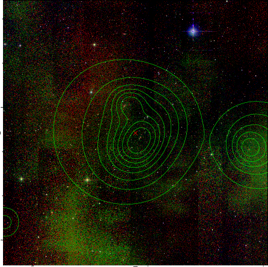  | 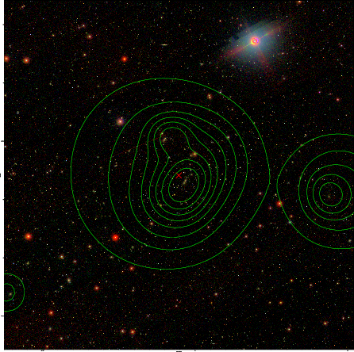  |

