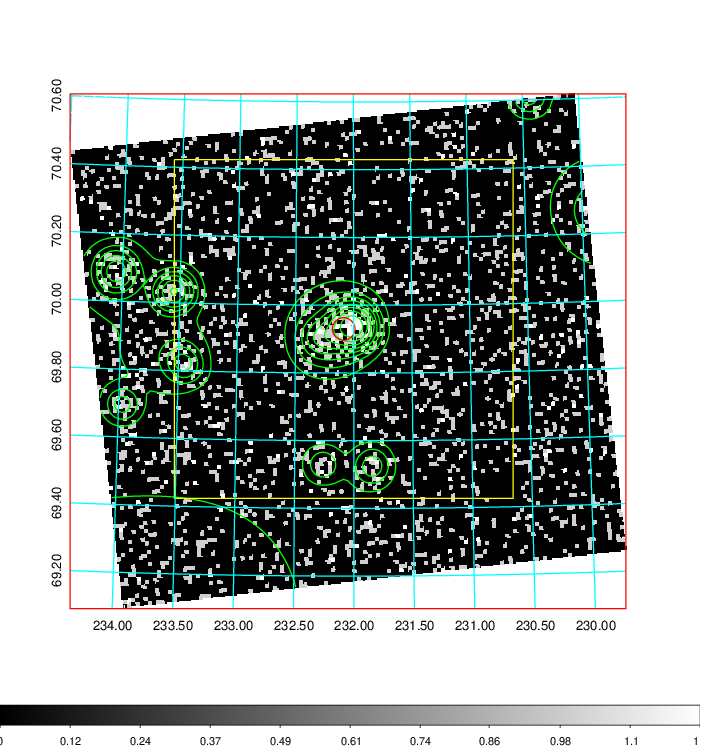
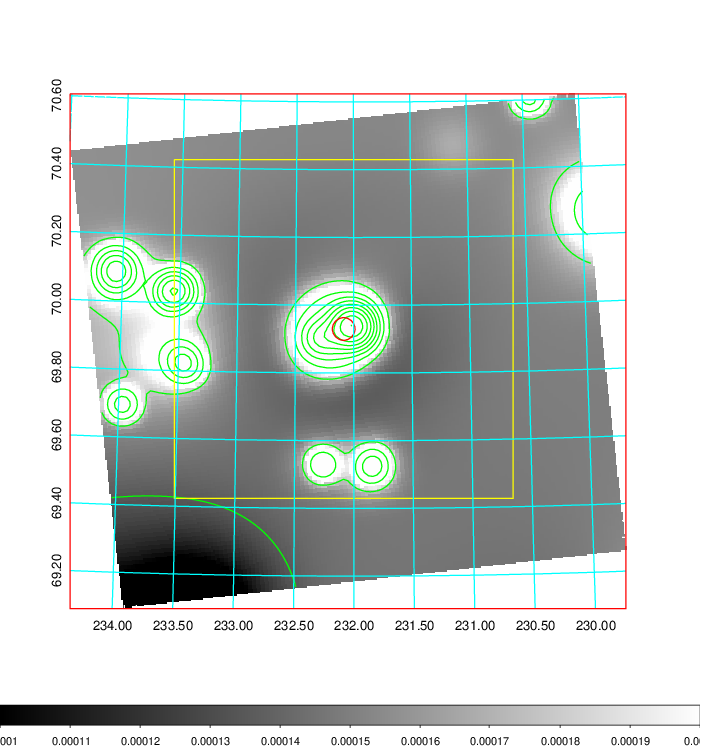
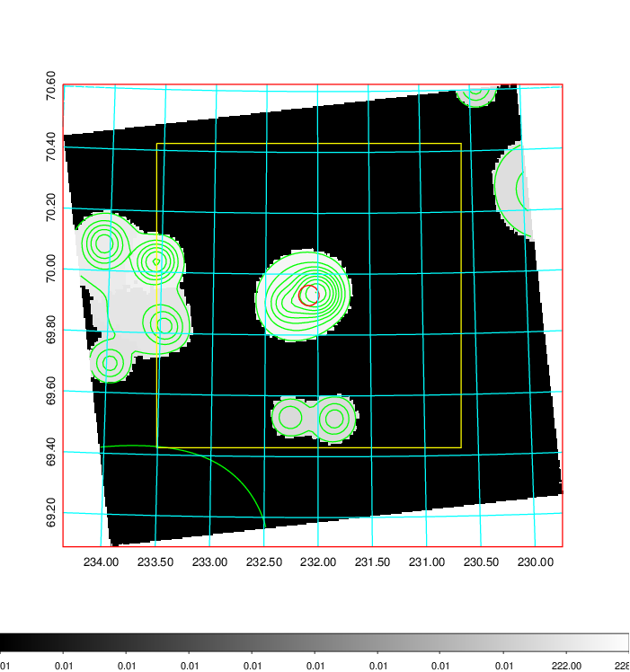
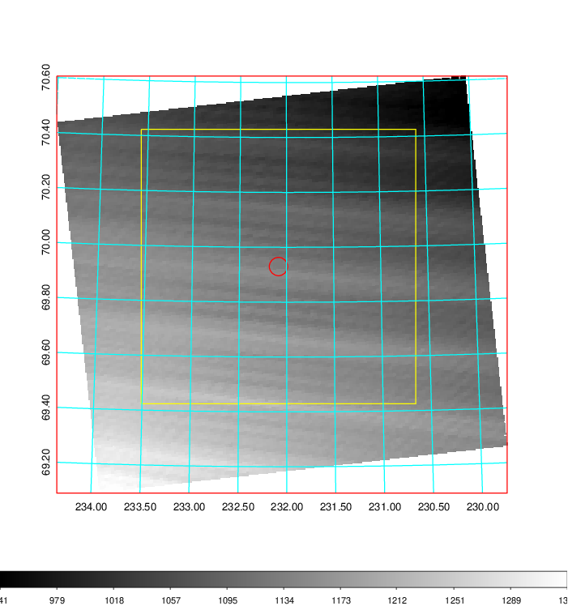
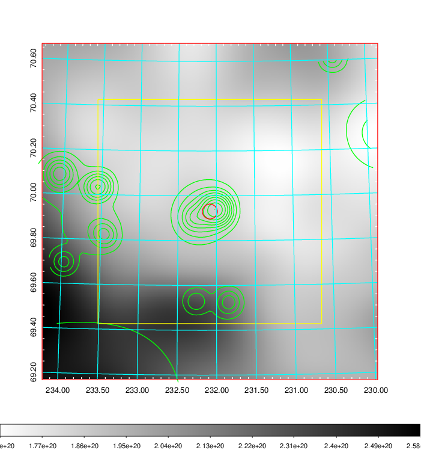
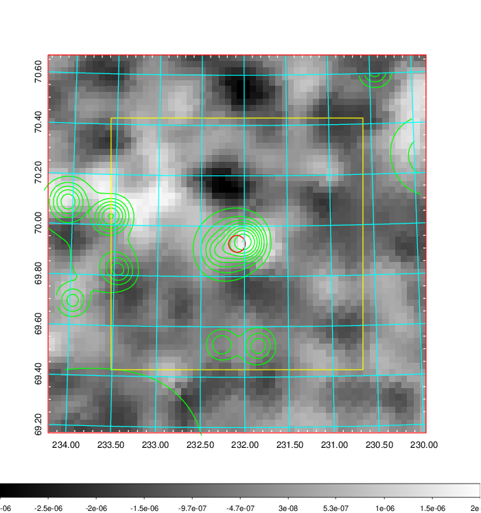
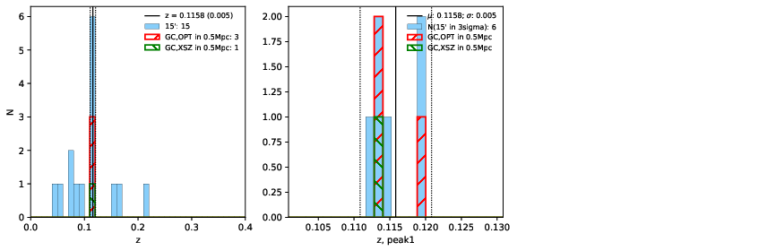
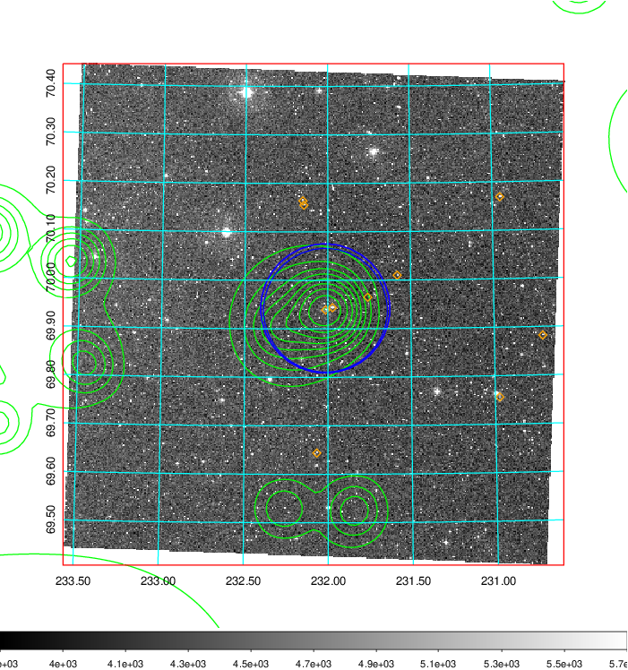
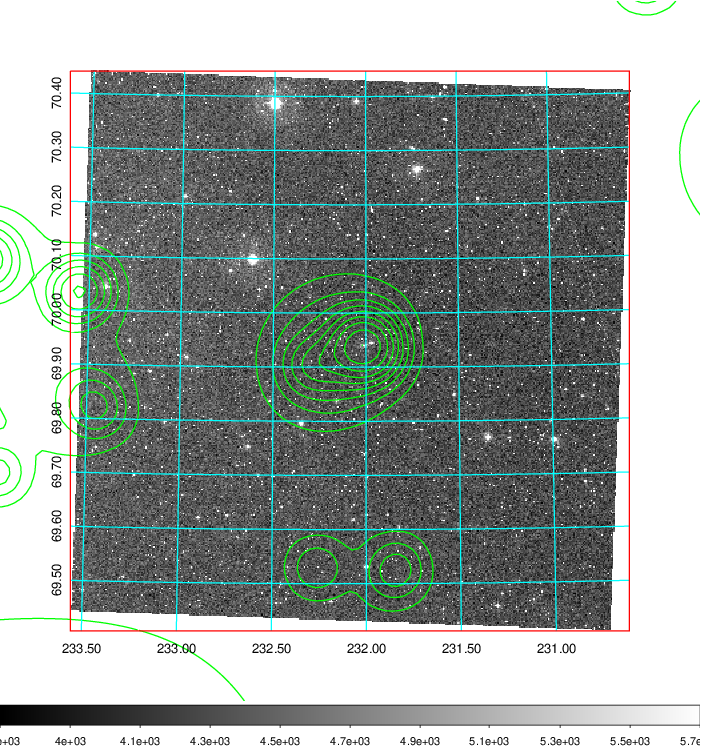
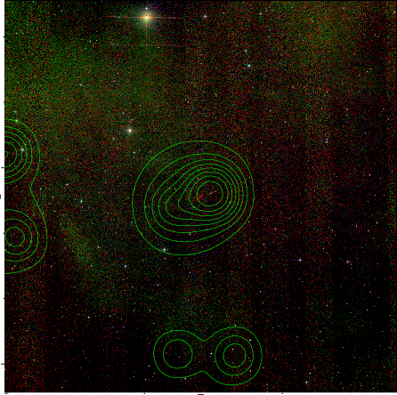

### 609

|Name|RAJ2000[deg]|DEJ2000[deg] |Ext[arcmin]| Ext,ml | z | z_src| C|GC(XSZ,Delta_z<0.01)| GC(OPT,Delta_z<0.01)|GC| R_sig[arcmin] | R500[arcmin] | R500[Mpc]| CRsig[c/s] | CR500[c/s] |L500[1E44 erg/s]|F500[1E-12 erg/s/cm^2]| M500[1E14 Msun]|Tx[keV]|Cnt_sig|Beta|Rc[arcmin]|Comment|Alias|
|---|---|---|---|---|---|------|---|--------|---------|----------|---|---|---|---|---|---|---|---|---|---|---|---|---|---|
|609| 232.086| 69.930| 2.00| 62.09| 0.1158(0.005)| z1, z_xsz| B| MCXC| N, W, Zw| MCXC, N, W| 9.288| 6.604| 0.831| 0.114(0.019)| 0.109(0.018)| 0.727(0.066)| 2.095(0.191)| 1.83(0.08)| 3.22(0.09)| 159.2| 0.933(-0.084+0.049)| 4.264(-0.474+0.357)| -| k222|

|[RASS image](../image/609/609_img.pdf)|[filtered image](../image/609/609_fil.pdf)|[Segment image](../image/609/609_seg.pdf)|
|-------------------|--------------------|-------------------|
|   |    |   |

|[Exposure image](../image/609/609_mex.pdf)| [nH image](../image/609/609_nh.pdf)| [Planck image](../image/609/609_p.pdf)|
|-------------------|--------------------|-------------------|
|   |     |  |

|[Redshift Histogram](../image/609/609_zg.pdf) | [DSS image(z1)](../image/609/609_dss_z1.pdf)      |  [DSS image(z2)](../image/609/609_dss_z2.pdf)    |
|-------------------|--------------------|-------------------|
| |  Blue circle for optical clusters;  Magenta circle for XSZ clusters;  all with r=1Mpc;  Only GC with Delta_z<0.01 are shown. |  Blue circle for optical clusters;  Magenta circle for XSZ clusters;  all with r=1Mpc;  Only GC with Delta_z<0.01 are shown.  |

|[known Abell/XSZ clusters](../image/609/609_gc.pdf) | [2MASS image](../image/609/609_2mass.pdf)      |
|-------------------|-------------------|
|  Magenta, blue and green circles  for optical, X-ray and SZ clusters  respectively, with redshift of clusters  labelled. The radius of circles  are 1Mpc.|  |

|[PS1 image](../image/609/609_ps1.pdf)            |
|-------------------|
|   |
