

### 61

|Name|RAJ2000[deg]|DEJ2000[deg] |Ext[arcmin]| Ext,ml | z | z_src| C|GC(XSZ,Delta_z<0.01)| GC(OPT,Delta_z<0.01)|GC| R_sig[arcmin] | R500[arcmin] | R500[Mpc]| CRsig[c/s] | CR500[c/s] |L500[1E44 erg/s]|F500[1E-12 erg/s/cm^2]| M500[1E14 Msun]|Tx[keV]|Cnt_sig|Beta|Rc[arcmin]|Comment|Alias|
|---|---|---|---|---|---|------|---|--------|---------|----------|---|---|---|---|---|---|---|---|---|---|---|---|---|---|
|61| 18.049| 34.333| 4.38| 28.00| 0.0534(0.008)| z1,| G| -| -| C, W| 13.675| 9.824| 0.613| 0.108(0.032)| 0.103(0.031)| 0.114(0.027)| 1.685(0.405)| 0.69(0.09)| 1.73(0.13)| 70.2| 0.624(-0.092+0.191)| 3.125(-1.049+1.635)| -| t224|

|[RASS image](../image/61/61_img.pdf)|[filtered image](../image/61/61_fil.pdf)|[Segment image](../image/61/61_seg.pdf)|
|-------------------|--------------------|-------------------|
| 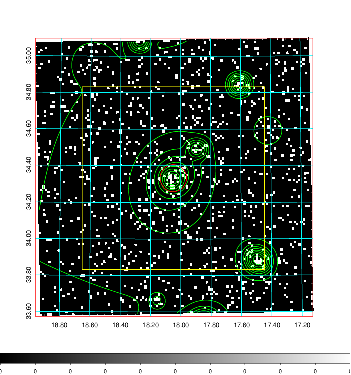  | 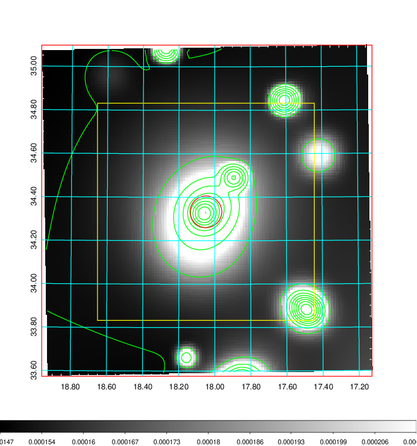   | 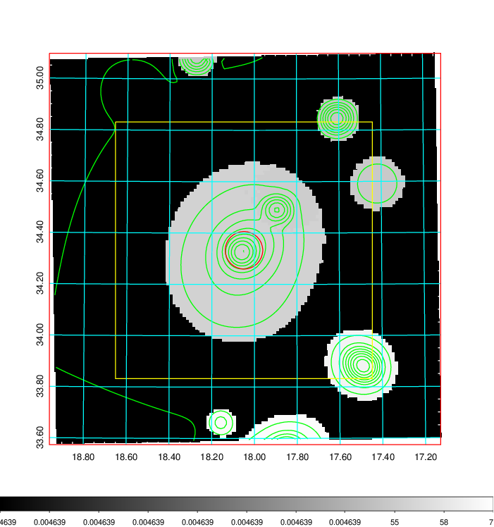  |

|[Exposure image](../image/61/61_mex.pdf)| [nH image](../image/61/61_nh.pdf)| [Planck image](../image/61/61_p.pdf)|
|-------------------|--------------------|-------------------|
|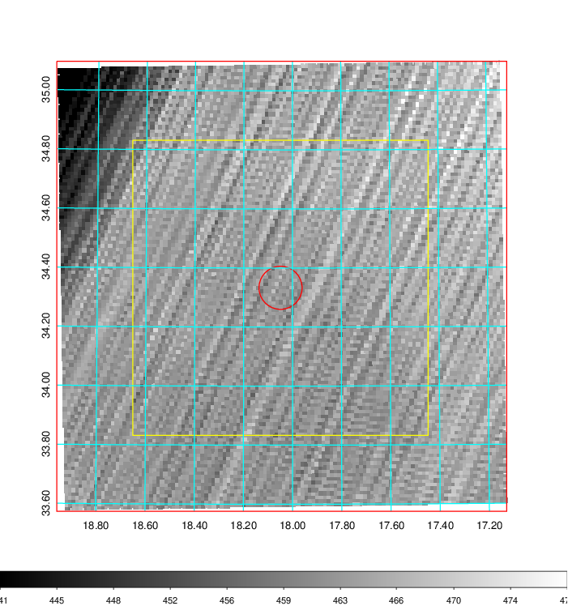   | 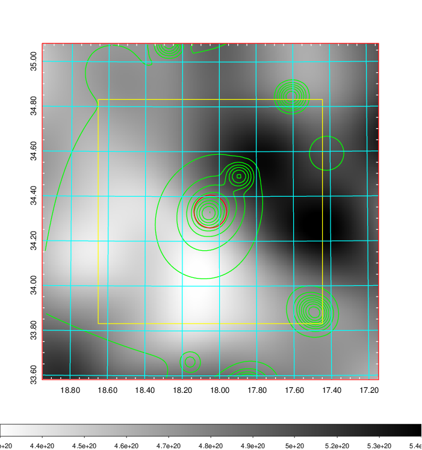    | 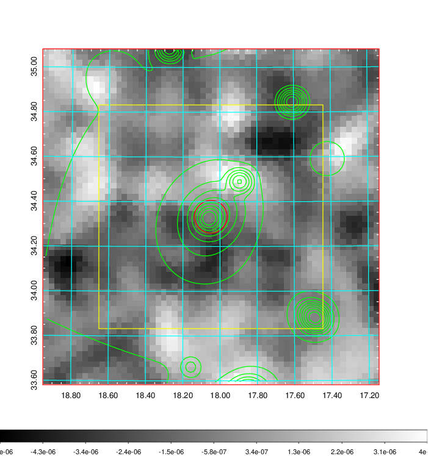 |

|[Redshift Histogram](../image/61/61_zg.pdf) | [DSS image(z1)](../image/61/61_dss_z1.pdf)      |  [DSS image(z2)](../image/61/61_dss_z2.pdf)    |
|-------------------|--------------------|-------------------|
|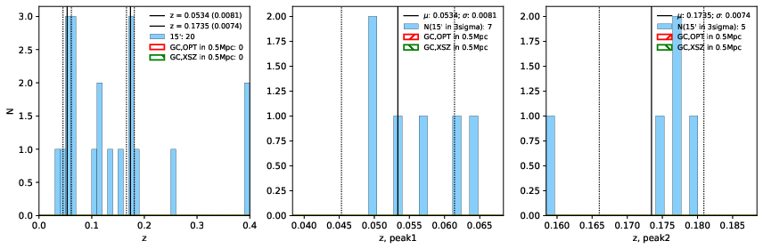 |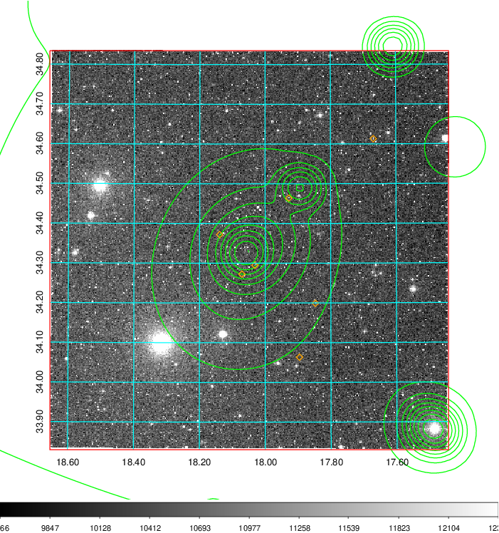  Blue circle for optical clusters;  Magenta circle for XSZ clusters;  all with r=1Mpc;  Only GC with Delta_z<0.01 are shown. | 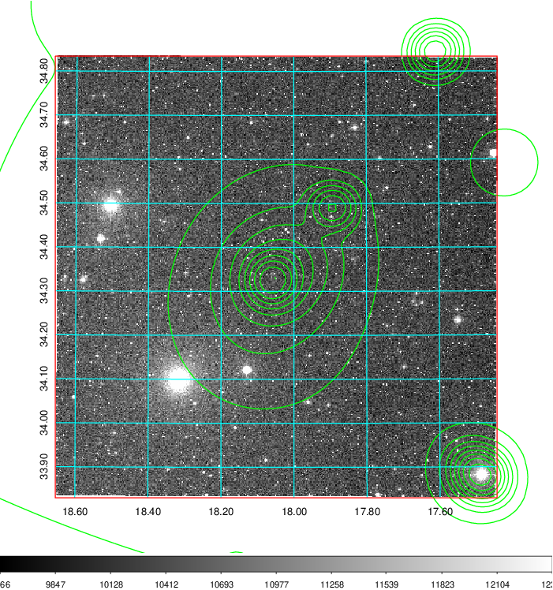 Blue circle for optical clusters;  Magenta circle for XSZ clusters;  all with r=1Mpc;  Only GC with Delta_z<0.01 are shown.  |

|[known Abell/XSZ clusters](../image/61/61_gc.pdf) | [2MASS image](../image/61/61_2mass.pdf)      |[SDSS image](../image/61/61_sdss.pdf)   |
|-------------------|-------------------|-------------------|
|  Magenta, blue and green circles  for optical, X-ray and SZ clusters  respectively, with redshift of clusters  labelled. The radius of circles  are 1Mpc.|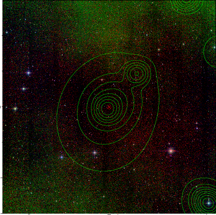  | 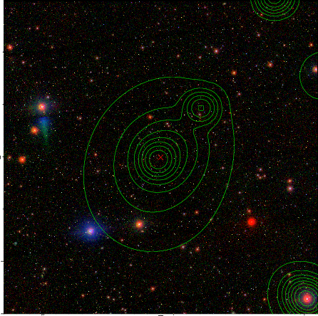  |

