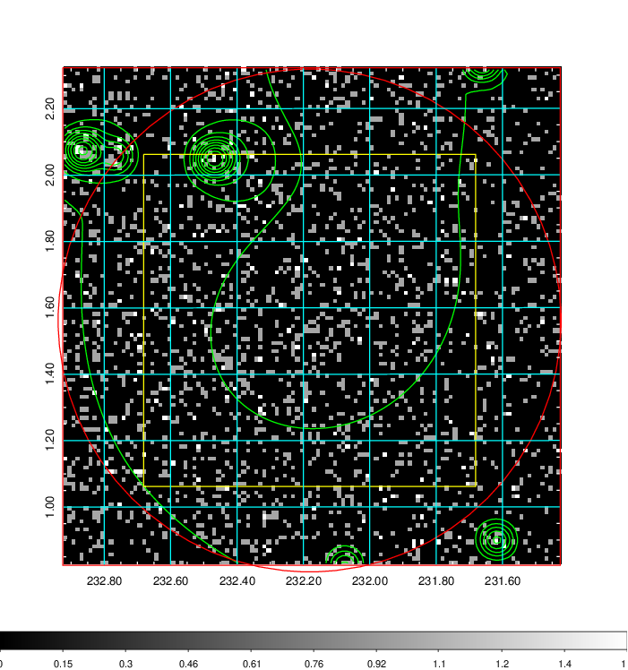
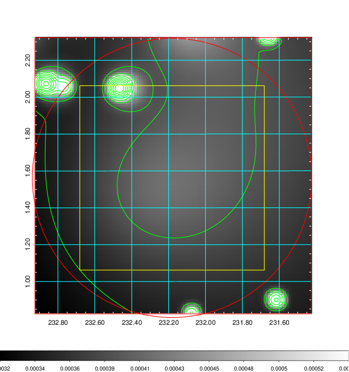
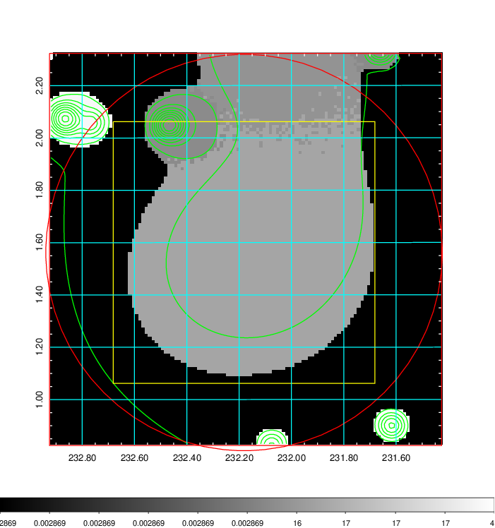
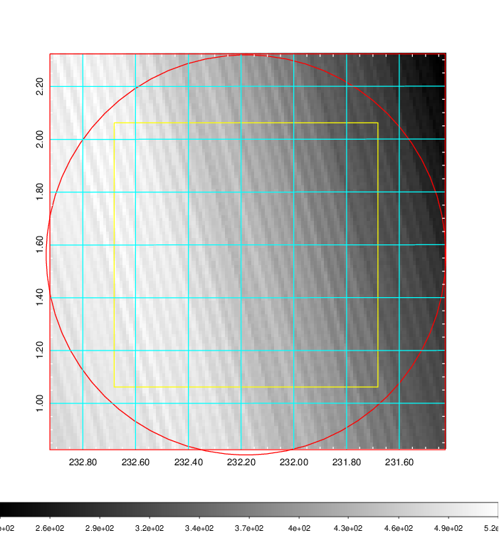
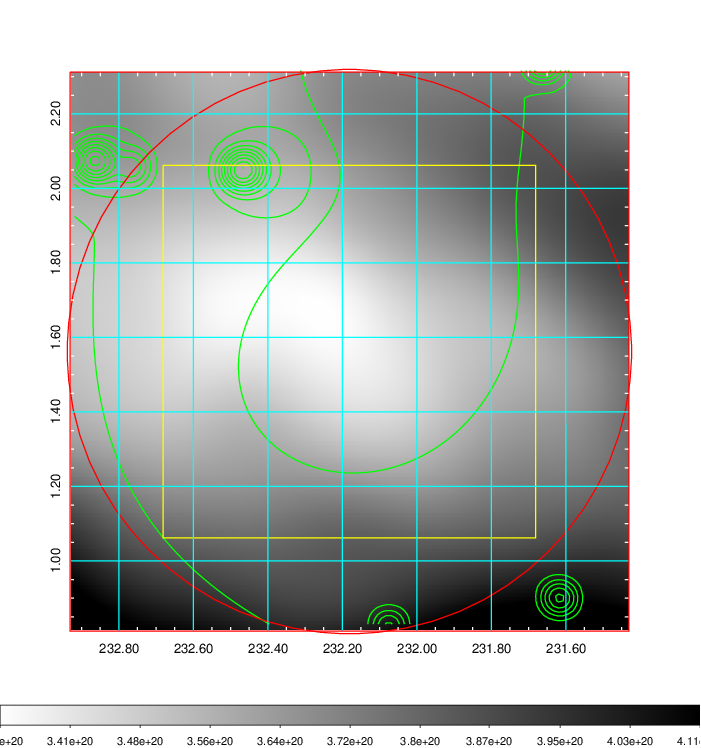
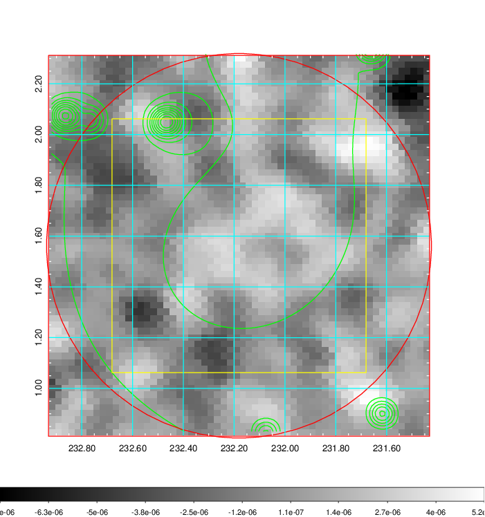
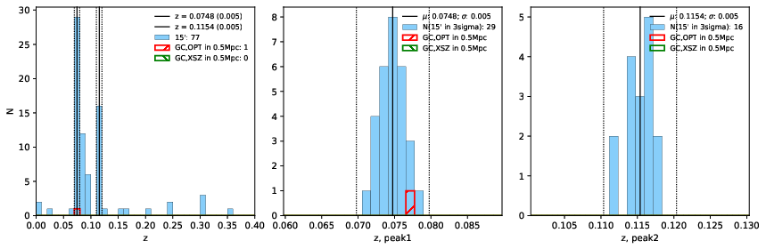
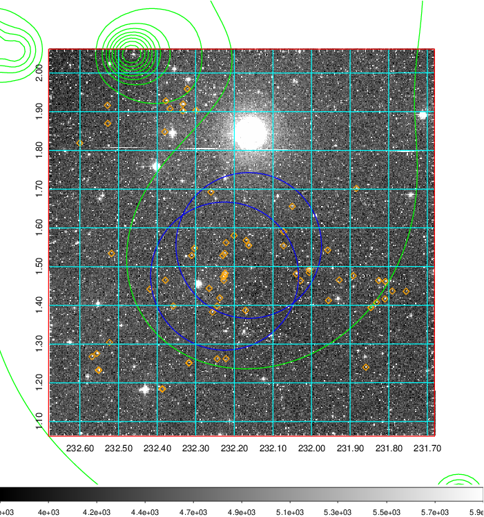
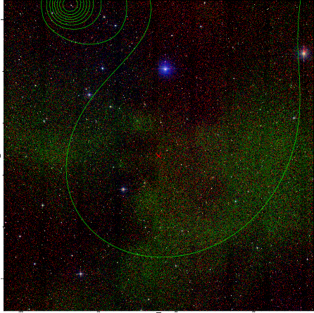
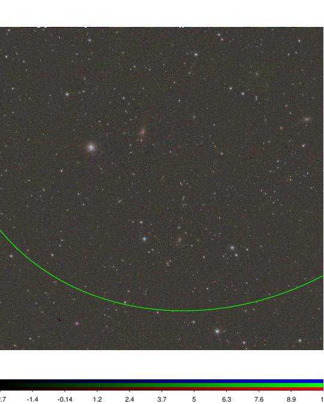

### 610

|Name|RAJ2000[deg]|DEJ2000[deg] |Ext[arcmin]| Ext,ml | z | z_src| C|GC(XSZ,Delta_z<0.01)| GC(OPT,Delta_z<0.01)|GC| R_sig[arcmin] | R500[arcmin] | R500[Mpc]| CRsig[c/s] | CR500[c/s] |L500[1E44 erg/s]|F500[1E-12 erg/s/cm^2]| M500[1E14 Msun]|Tx[keV]|Cnt_sig|Beta|Rc[arcmin]|Comment|Alias|
|---|---|---|---|---|---|------|---|--------|---------|----------|---|---|---|---|---|---|---|---|---|---|---|---|---|---|
|610| 232.181| 1.562| 45.44| 163.85| 0.0748(0.005)| z1, z_opt| S| -| N| C, N, W| 28.156| 9.050| 0.771| 0.185(0.086)| 0.166(0.078)| 0.412(0.314)| 3.009(2.293)| 1.40(0.54)| 2.70(0.66)| 252.5| 0.512(-0.009+0.021)| 4.892(-0.348+0.386)| -| t690|

|[RASS image](../image/610/610_img.pdf)|[filtered image](../image/610/610_fil.pdf)|[Segment image](../image/610/610_seg.pdf)|
|-------------------|--------------------|-------------------|
|   |    |   |

|[Exposure image](../image/610/610_mex.pdf)| [nH image](../image/610/610_nh.pdf)| [Planck image](../image/610/610_p.pdf)|
|-------------------|--------------------|-------------------|
|   |     |  |

|[Redshift Histogram](../image/610/610_zg.pdf) | [DSS image(z1)](../image/610/610_dss_z1.pdf)      |  [DSS image(z2)](../image/610/610_dss_z2.pdf)    |
|-------------------|--------------------|-------------------|
| |  Blue circle for optical clusters;  Magenta circle for XSZ clusters;  all with r=1Mpc;  Only GC with Delta_z<0.01 are shown. |  Blue circle for optical clusters;  Magenta circle for XSZ clusters;  all with r=1Mpc;  Only GC with Delta_z<0.01 are shown.  |

|[Previous-identified clusters](../image/610/610_gc.pdf) | [2MASS image](../image/610/610_2mass.pdf)      |
|-------------------|-------------------|
|  Green, magenta, and blue circles  for optical, X-ray and SZ clusters  respectively, with redshift of clusters  labelled. The radius of circles  are 1Mpc.|  |

|[PS1 image](../image/610/610_ps1.pdf)            |
|-------------------|
|   |
