

### 611

|Name|RAJ2000[deg]|DEJ2000[deg] |Ext[arcmin]| Ext,ml | z | z_src| C|GC(XSZ,Delta_z<0.01)| GC(OPT,Delta_z<0.01)|GC| R_sig[arcmin] | R500[arcmin] | R500[Mpc]| CRsig[c/s] | CR500[c/s] |L500[1E44 erg/s]|F500[1E-12 erg/s/cm^2]| M500[1E14 Msun]|Tx[keV]|Cnt_sig|Beta|Rc[arcmin]|Comment|Alias|
|---|---|---|---|---|---|------|---|--------|---------|----------|---|---|---|---|---|---|---|---|---|---|---|---|---|---|
|611| 232.274| 52.826| 4.63| 114.91| 0.0738(0.005)| z1, z_xsz| B| F20, SPI| N, W| C, F20, N, SPI, W| 18.775| 8.798| 0.741| 0.161(0.031)| 0.148(0.028)| 0.381(0.056)| 2.863(0.421)| 1.24(0.09)| 2.50(0.12)| 230.4| 0.764(-0.101+0.125)| 6.030(-1.205+1.315)| -| t236|

|[RASS image](../image/611/611_img.pdf)|[filtered image](../image/611/611_fil.pdf)|[Segment image](../image/611/611_seg.pdf)|
|-------------------|--------------------|-------------------|
| 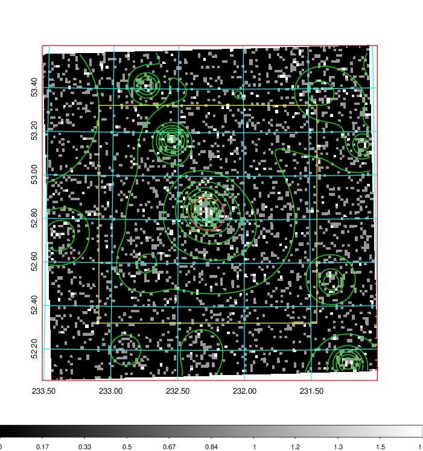  | 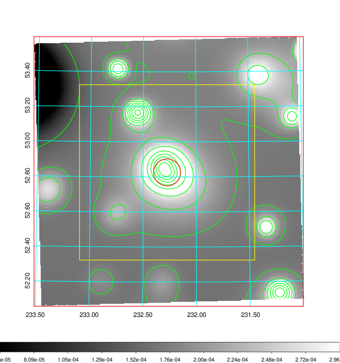   | 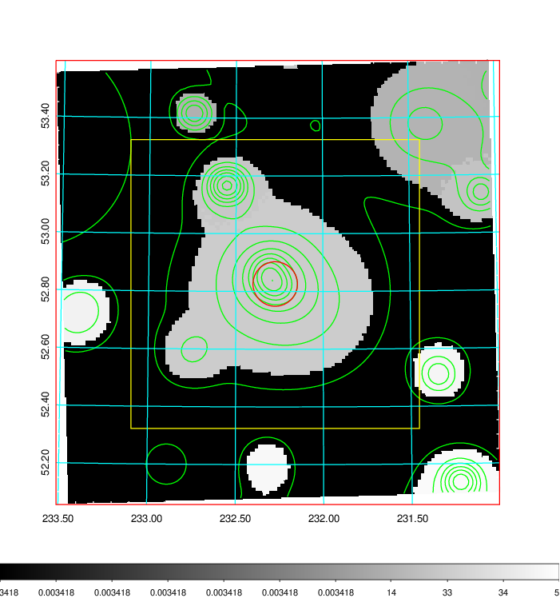  |

|[Exposure image](../image/611/611_mex.pdf)| [nH image](../image/611/611_nh.pdf)| [Planck image](../image/611/611_p.pdf)|
|-------------------|--------------------|-------------------|
|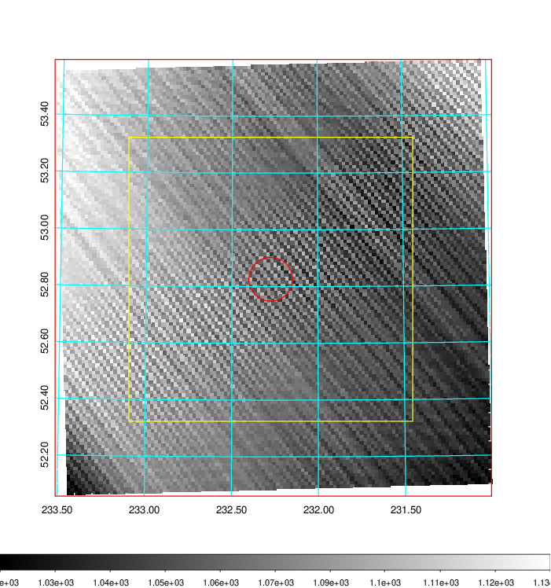   | 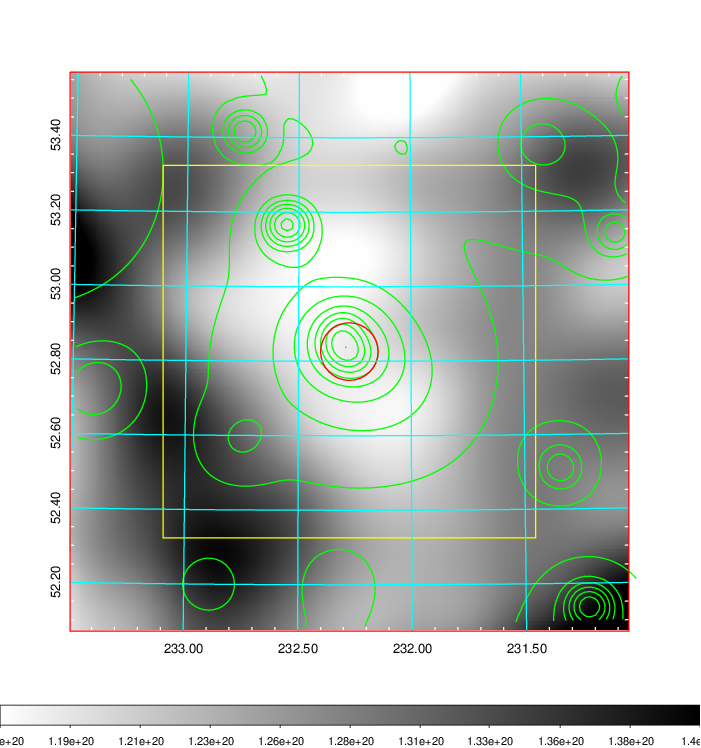    | 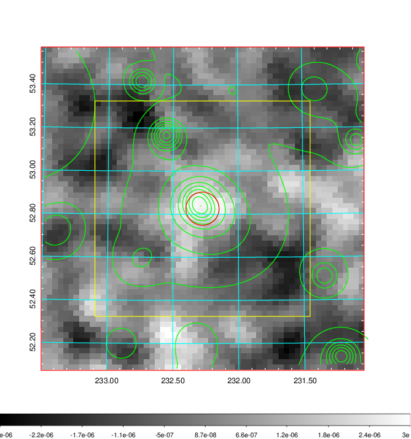 |

|[Redshift Histogram](../image/611/611_zg.pdf) | [DSS image(z1)](../image/611/611_dss_z1.pdf)      |  [DSS image(z2)](../image/611/611_dss_z2.pdf)    |
|-------------------|--------------------|-------------------|
|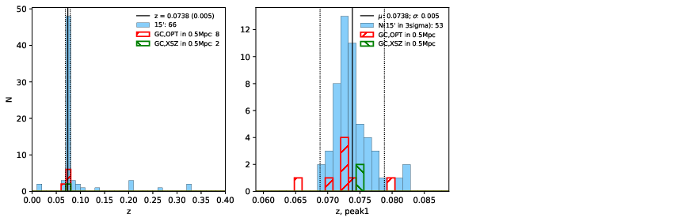 |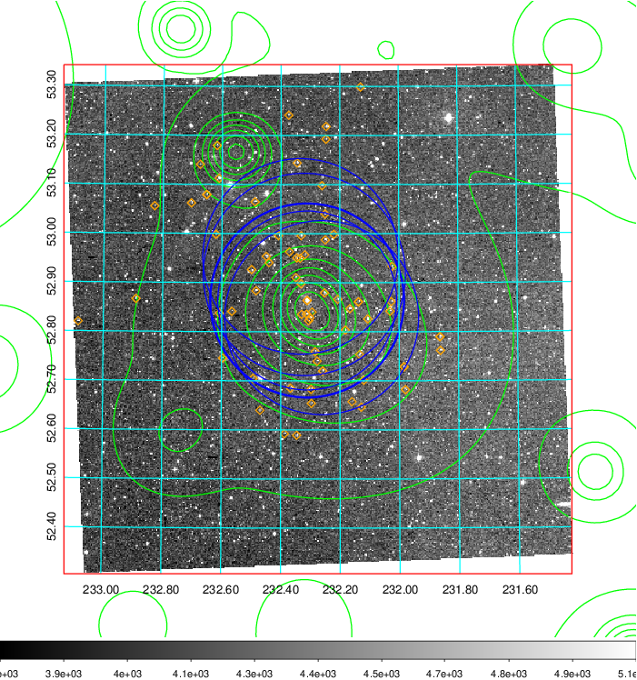  Blue circle for optical clusters;  Magenta circle for XSZ clusters;  all with r=1Mpc;  Only GC with Delta_z<0.01 are shown. | 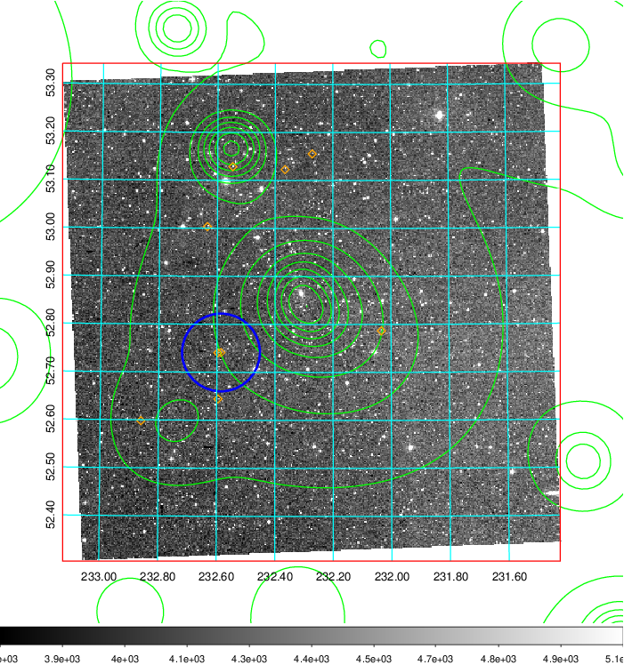 Blue circle for optical clusters;  Magenta circle for XSZ clusters;  all with r=1Mpc;  Only GC with Delta_z<0.01 are shown.  |

|[known Abell/XSZ clusters](../image/611/611_gc.pdf) | [2MASS image](../image/611/611_2mass.pdf)      |[SDSS image](../image/611/611_sdss.pdf)   |
|-------------------|-------------------|-------------------|
|  Magenta, blue and green circles  for optical, X-ray and SZ clusters  respectively, with redshift of clusters  labelled. The radius of circles  are 1Mpc.|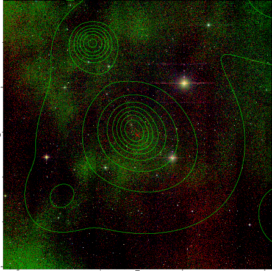  | 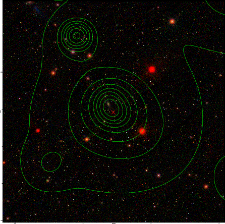  |

