

### 612

|Name|RAJ2000[deg]|DEJ2000[deg] |Ext[arcmin]| Ext,ml | z | z_src| C|GC(XSZ,Delta_z<0.01)| GC(OPT,Delta_z<0.01)|GC| R_sig[arcmin] | R500[arcmin] | R500[Mpc]| CRsig[c/s] | CR500[c/s] |L500[1E44 erg/s]|F500[1E-12 erg/s/cm^2]| M500[1E14 Msun]|Tx[keV]|Cnt_sig|Beta|Rc[arcmin]|Comment|Alias|
|---|---|---|---|---|---|------|---|--------|---------|----------|---|---|---|---|---|---|---|---|---|---|---|---|---|---|
|612| 233.107| 4.772| 7.29| 69.14| 0.0392(0.005)| z1, z_opt| S| -| N| C, F20, N, W, XCS| 29.638| 16.151| 0.752| 0.553(0.096)| 0.514(0.089)| 0.321(0.067)| 8.968(1.867)| 1.26(0.13)| 2.50(0.17)| 337.9| 0.512(-0.009+0.020)| 8.234(-0.772+0.962)| An X-ray cluster with $z$ = 0.39 and offset = 0.46 Mpc| t367|

|[RASS image](../image/612/612_img.pdf)|[filtered image](../image/612/612_fil.pdf)|[Segment image](../image/612/612_seg.pdf)|
|-------------------|--------------------|-------------------|
| 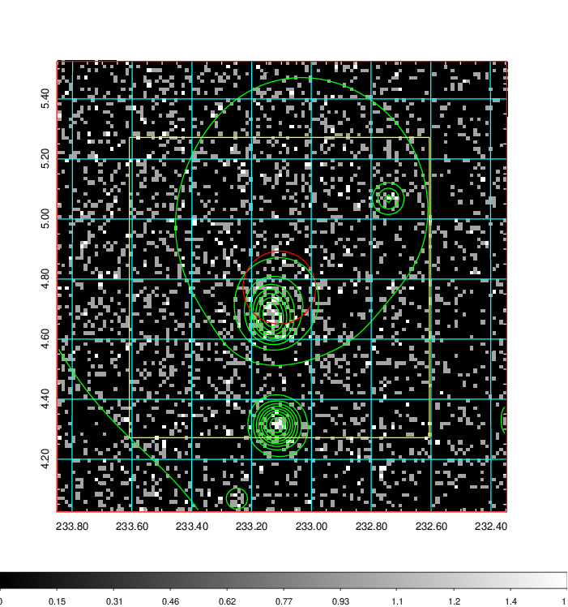  | 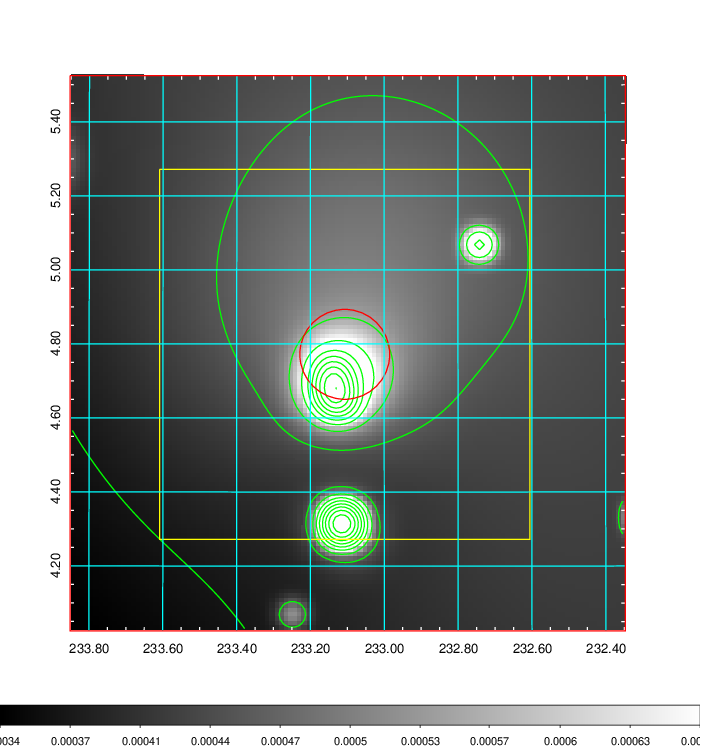   | 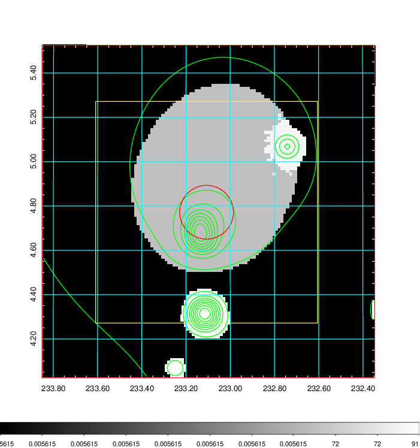  |

|[Exposure image](../image/612/612_mex.pdf)| [nH image](../image/612/612_nh.pdf)| [Planck image](../image/612/612_p.pdf)|
|-------------------|--------------------|-------------------|
|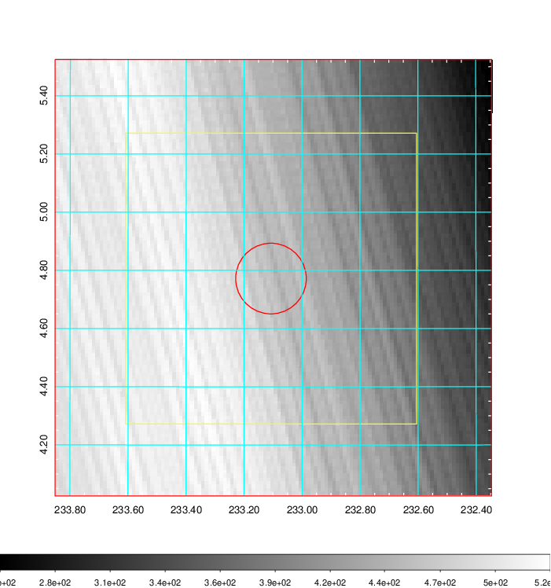   | 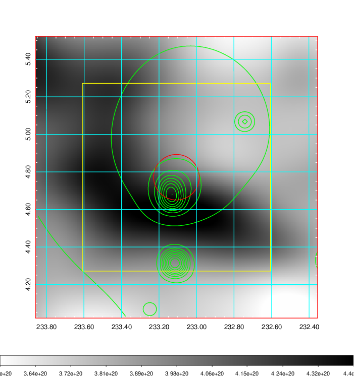    | 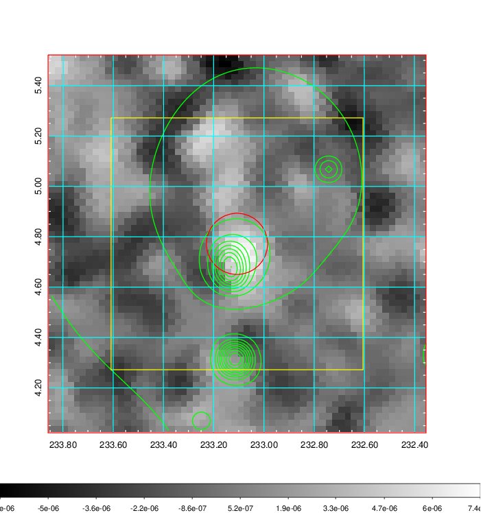 |

|[Redshift Histogram](../image/612/612_zg.pdf) | [DSS image(z1)](../image/612/612_dss_z1.pdf)      |  [DSS image(z2)](../image/612/612_dss_z2.pdf)    |
|-------------------|--------------------|-------------------|
|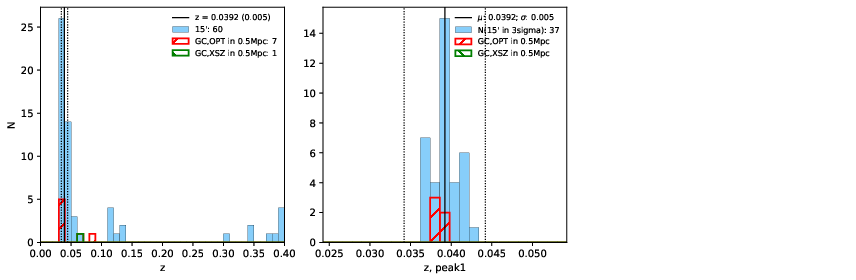 |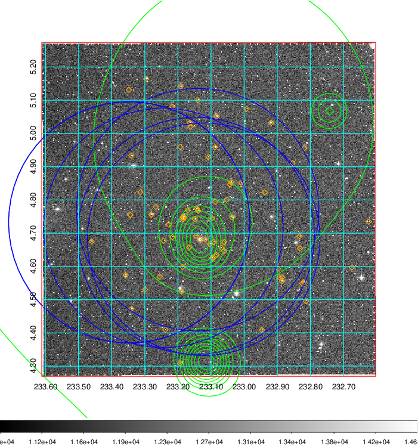  Blue circle for optical clusters;  Magenta circle for XSZ clusters;  all with r=1Mpc;  Only GC with Delta_z<0.01 are shown. | 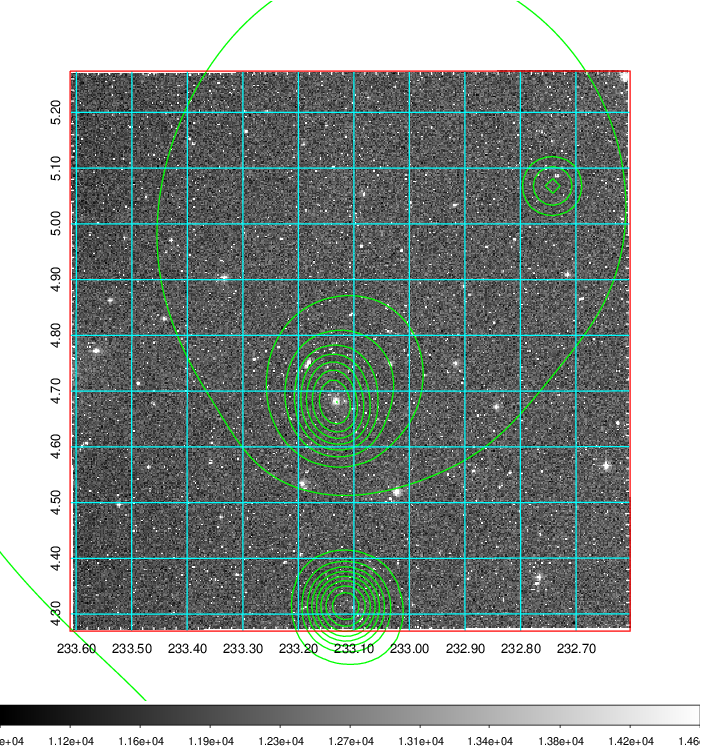 Blue circle for optical clusters;  Magenta circle for XSZ clusters;  all with r=1Mpc;  Only GC with Delta_z<0.01 are shown.  |

|[known Abell/XSZ clusters](../image/612/612_gc.pdf) | [2MASS image](../image/612/612_2mass.pdf)      |[SDSS image](../image/612/612_sdss.pdf)   |
|-------------------|-------------------|-------------------|
|  Magenta, blue and green circles  for optical, X-ray and SZ clusters  respectively, with redshift of clusters  labelled. The radius of circles  are 1Mpc.|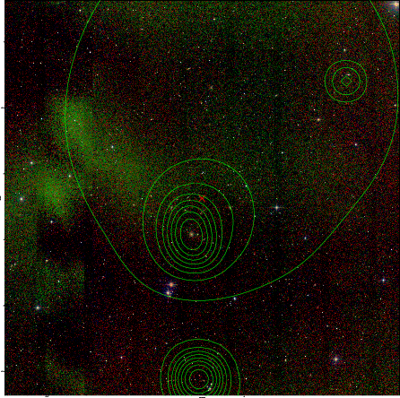  | 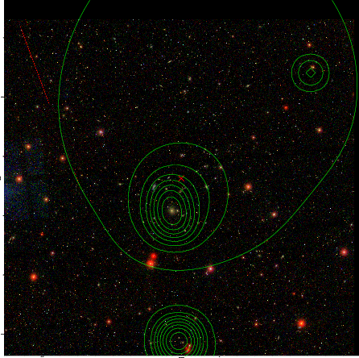  |

