

### 613

|Name|RAJ2000[deg]|DEJ2000[deg] |Ext[arcmin]| Ext,ml | z | z_src| C|GC(XSZ,Delta_z<0.01)| GC(OPT,Delta_z<0.01)|GC| R_sig[arcmin] | R500[arcmin] | R500[Mpc]| CRsig[c/s] | CR500[c/s] |L500[1E44 erg/s]|F500[1E-12 erg/s/cm^2]| M500[1E14 Msun]|Tx[keV]|Cnt_sig|Beta|Rc[arcmin]|Comment|Alias|
|---|---|---|---|---|---|------|---|--------|---------|----------|---|---|---|---|---|---|---|---|---|---|---|---|---|---|
|613| 233.332| 31.161| 2.13| 38.74| 0.0652(0.005)| z1, z_xsz| B| L03, MCXC| A, N, W| A, C, F20, L03, MCXC, N, W| 25.688| 9.606| 0.722| 0.178(0.069)| 0.161(0.063)| 0.307(0.081)| 2.991(0.786)| 1.14(0.15)| 2.36(0.20)| 73.2| 0.810(-0.161+0.129)| 3.481(-1.178+0.805)| -| k242|

|[RASS image](../image/613/613_img.pdf)|[filtered image](../image/613/613_fil.pdf)|[Segment image](../image/613/613_seg.pdf)|
|-------------------|--------------------|-------------------|
| 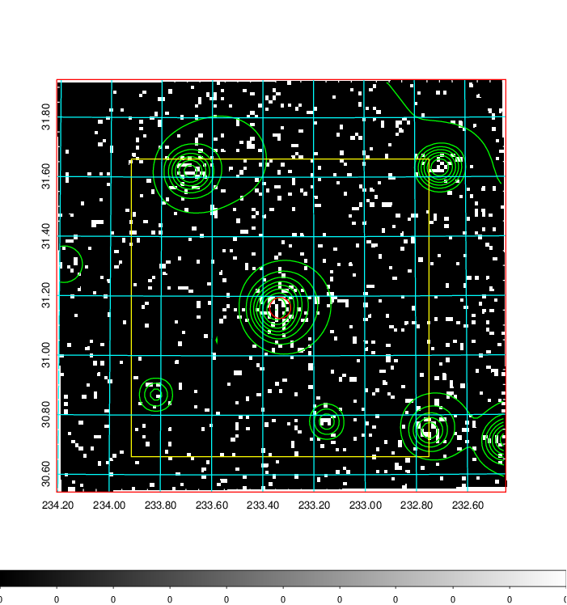  | 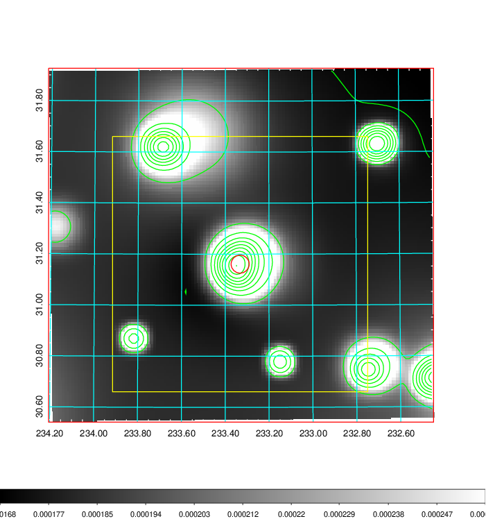   | 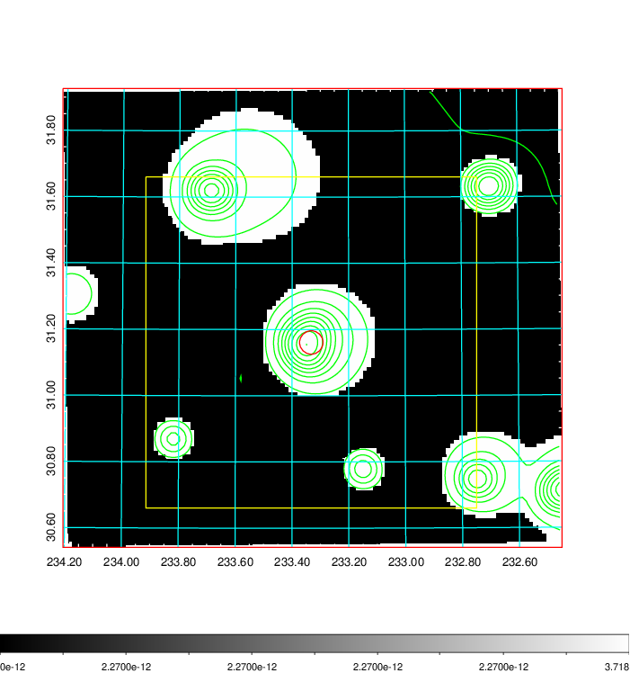  |

|[Exposure image](../image/613/613_mex.pdf)| [nH image](../image/613/613_nh.pdf)| [Planck image](../image/613/613_p.pdf)|
|-------------------|--------------------|-------------------|
|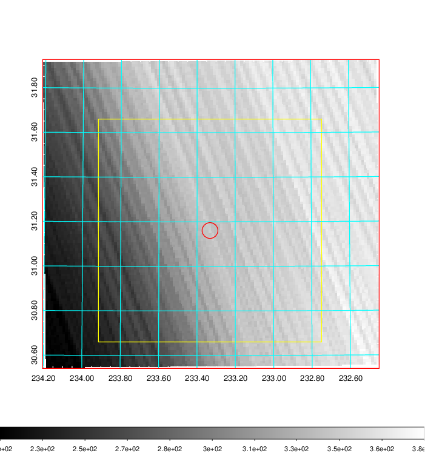   | 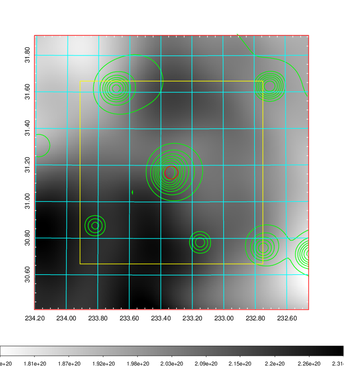    | 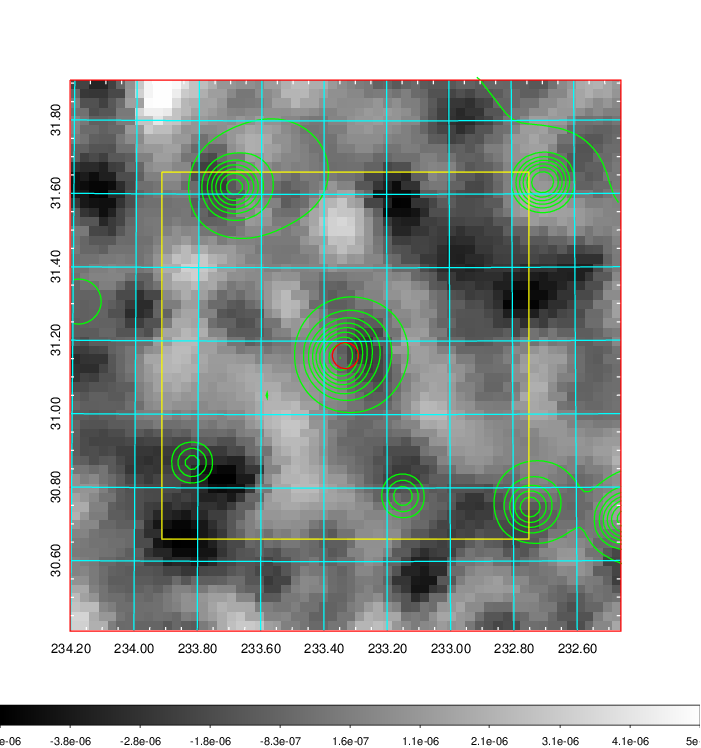 |

|[Redshift Histogram](../image/613/613_zg.pdf) | [DSS image(z1)](../image/613/613_dss_z1.pdf)      |  [DSS image(z2)](../image/613/613_dss_z2.pdf)    |
|-------------------|--------------------|-------------------|
|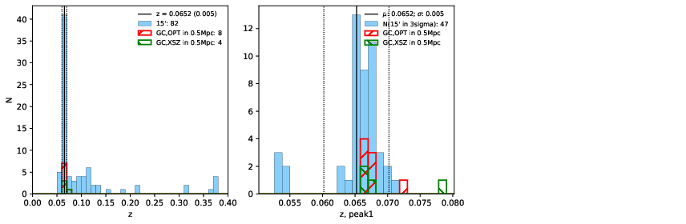 |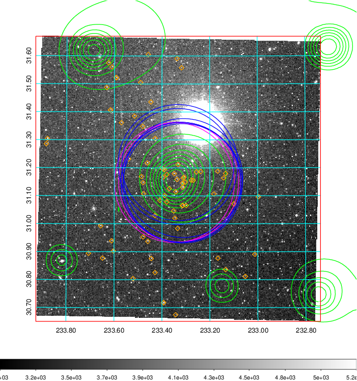  Blue circle for optical clusters;  Magenta circle for XSZ clusters;  all with r=1Mpc;  Only GC with Delta_z<0.01 are shown. | 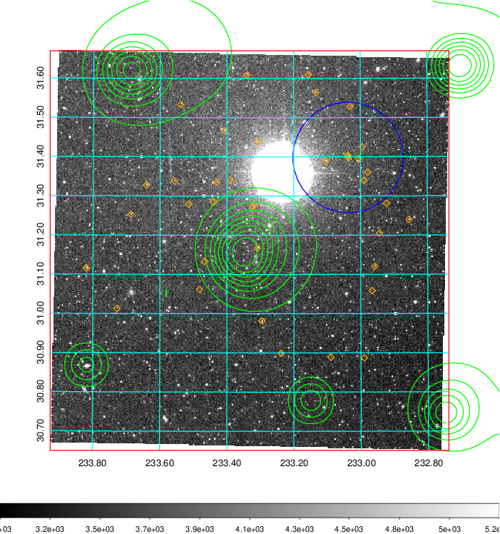 Blue circle for optical clusters;  Magenta circle for XSZ clusters;  all with r=1Mpc;  Only GC with Delta_z<0.01 are shown.  |

|[Previous-identified clusters](../image/613/613_gc.pdf) | [2MASS image](../image/613/613_2mass.pdf)      |[SDSS image](../image/613/613_sdss.pdf)   |
|-------------------|-------------------|-------------------|
|  Green, magenta, and blue circles  for optical, X-ray and SZ clusters  respectively, with redshift of clusters  labelled. The radius of circles  are 1Mpc.|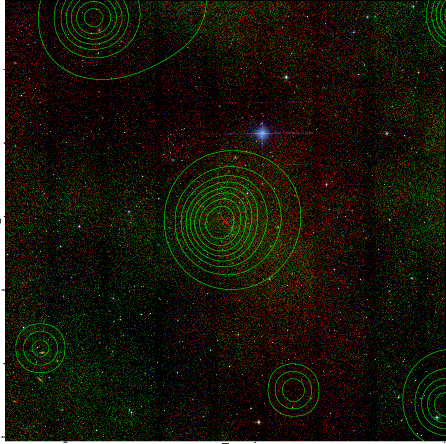  | 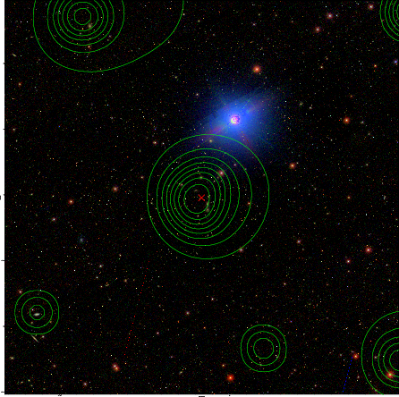  |

