

### 614

|Name|RAJ2000[deg]|DEJ2000[deg] |Ext[arcmin]| Ext,ml | z | z_src| C|GC(XSZ,Delta_z<0.01)| GC(OPT,Delta_z<0.01)|GC| R_sig[arcmin] | R500[arcmin] | R500[Mpc]| CRsig[c/s] | CR500[c/s] |L500[1E44 erg/s]|F500[1E-12 erg/s/cm^2]| M500[1E14 Msun]|Tx[keV]|Cnt_sig|Beta|Rc[arcmin]|Comment|Alias|
|---|---|---|---|---|---|------|---|--------|---------|----------|---|---|---|---|---|---|---|---|---|---|---|---|---|---|
|614| 233.886| 8.034| 52.92| 119.97| 0.1144(0.006)| z1, z_opt| S| -| N, W| C, N, W| 27.662| 6.993| 0.871| 0.150(0.093)| 0.142(0.083)| 0.870(0.536)| 2.572(1.585)| 2.10(0.64)| 3.50(0.68)| 272.5| 0.545(-0.035+0.126)| 1.814(-0.770+1.283)| -| t699|

|[RASS image](../image/614/614_img.pdf)|[filtered image](../image/614/614_fil.pdf)|[Segment image](../image/614/614_seg.pdf)|
|-------------------|--------------------|-------------------|
| 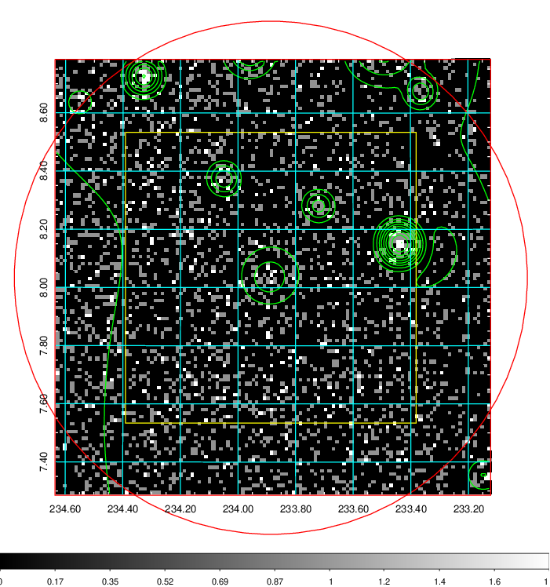  | 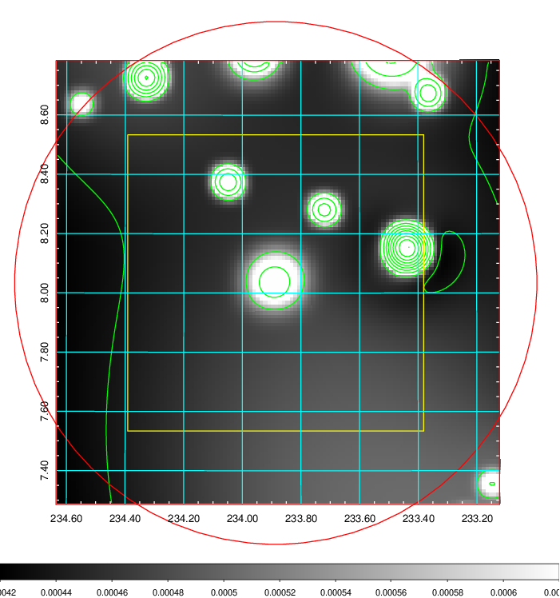   | 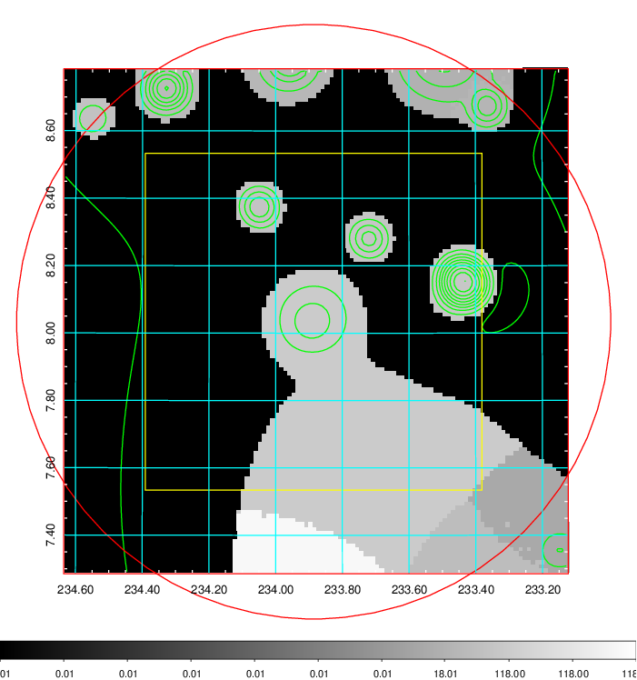  |

|[Exposure image](../image/614/614_mex.pdf)| [nH image](../image/614/614_nh.pdf)| [Planck image](../image/614/614_p.pdf)|
|-------------------|--------------------|-------------------|
|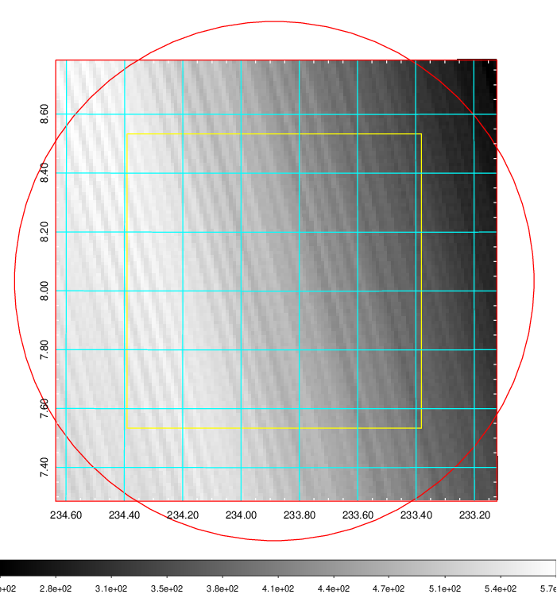   | 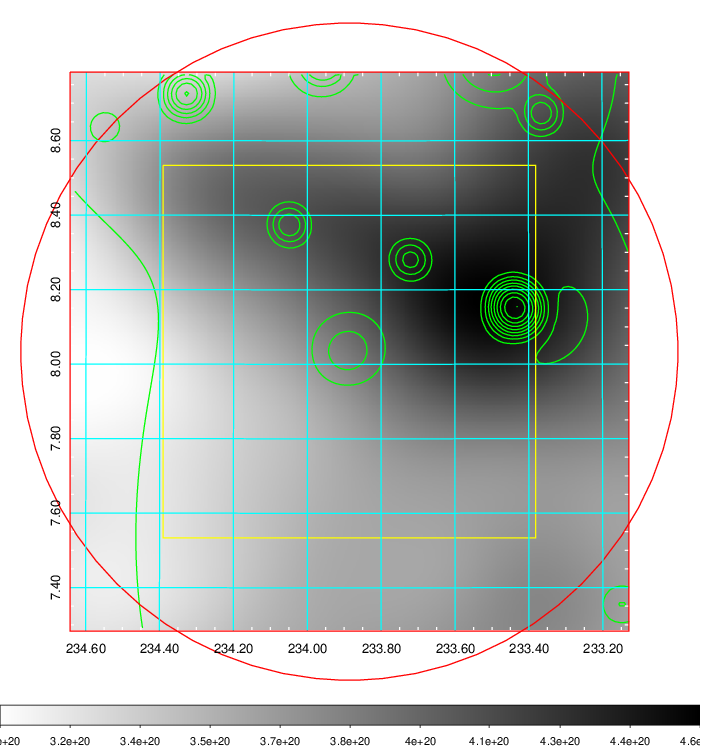    | 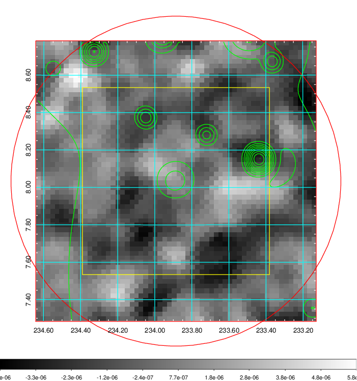 |

|[Redshift Histogram](../image/614/614_zg.pdf) | [DSS image(z1)](../image/614/614_dss_z1.pdf)      |  [DSS image(z2)](../image/614/614_dss_z2.pdf)    |
|-------------------|--------------------|-------------------|
|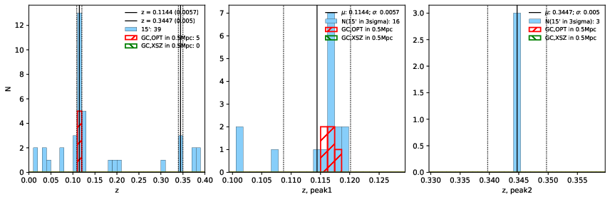 |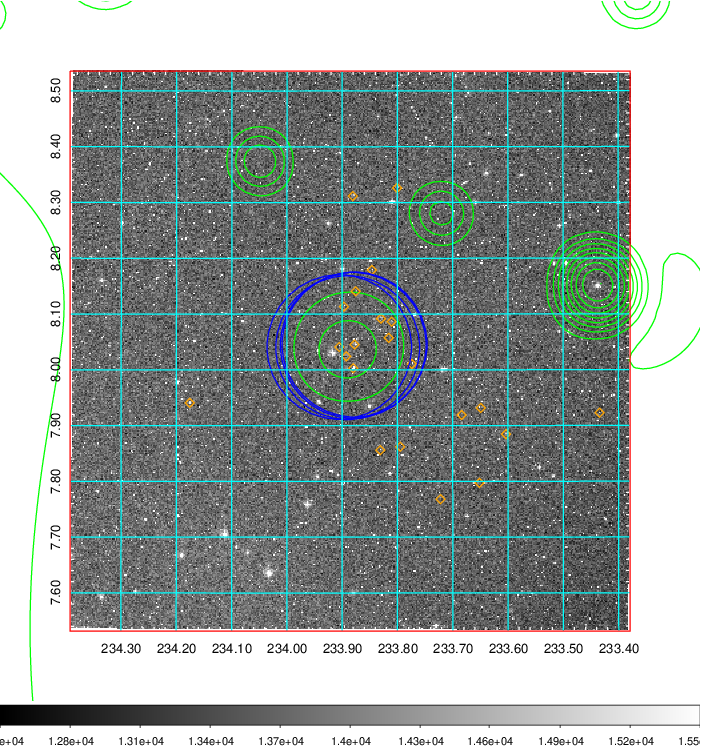  Blue circle for optical clusters;  Magenta circle for XSZ clusters;  all with r=1Mpc;  Only GC with Delta_z<0.01 are shown. | 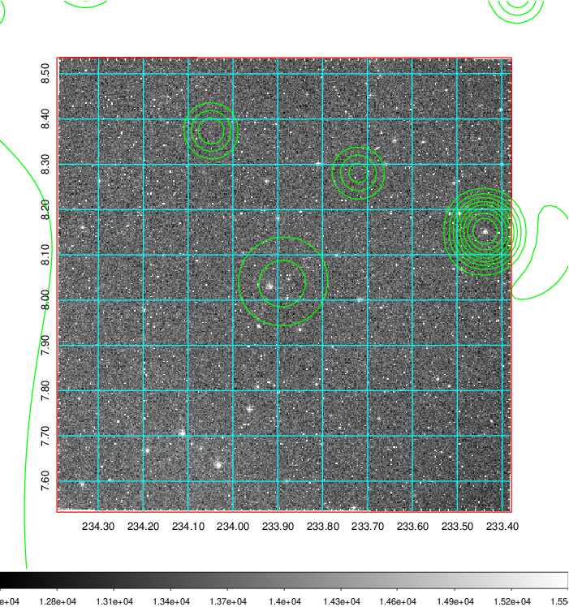 Blue circle for optical clusters;  Magenta circle for XSZ clusters;  all with r=1Mpc;  Only GC with Delta_z<0.01 are shown.  |

|[Previous-identified clusters](../image/614/614_gc.pdf) | [2MASS image](../image/614/614_2mass.pdf)      |
|-------------------|-------------------|
|  Green, magenta, and blue circles  for optical, X-ray and SZ clusters  respectively, with redshift of clusters  labelled. The radius of circles  are 1Mpc.|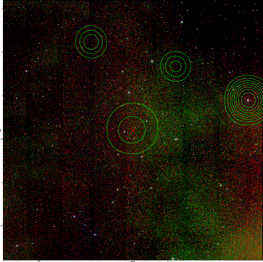  |

|[PS1 image](../image/614/614_ps1.pdf)            |
|-------------------|
| 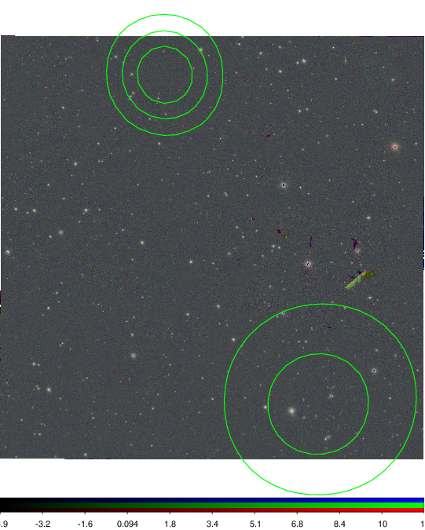  |
