

### 615

|Name|RAJ2000[deg]|DEJ2000[deg] |Ext[arcmin]| Ext,ml | z | z_src| C|GC(XSZ,Delta_z<0.01)| GC(OPT,Delta_z<0.01)|GC| R_sig[arcmin] | R500[arcmin] | R500[Mpc]| CRsig[c/s] | CR500[c/s] |L500[1E44 erg/s]|F500[1E-12 erg/s/cm^2]| M500[1E14 Msun]|Tx[keV]|Cnt_sig|Beta|Rc[arcmin]|Comment|Alias|
|---|---|---|---|---|---|------|---|--------|---------|----------|---|---|---|---|---|---|---|---|---|---|---|---|---|---|
|615| 234.917| 21.778| 2.80| 231.01| 0.0415(0.005)| z1, z_xsz| B| L03, MCXC, PSZ2, Tar, XB| A, N, W| A, F20, L03, MCXC, N, PSZ2, Tar, W, XB| 45.550| 18.466| 0.908| 1.244(0.135)| 1.133(0.123)| 0.809(0.054)| 20.108(1.347)| 2.21(0.07)| 3.54(0.08)| 456.9| 0.505(-0.004+0.007)| 2.046(-0.109+0.141)| -| k354|

|[RASS image](../image/615/615_img.pdf)|[filtered image](../image/615/615_fil.pdf)|[Segment image](../image/615/615_seg.pdf)|
|-------------------|--------------------|-------------------|
| 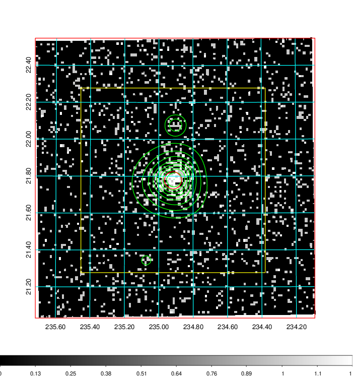  | 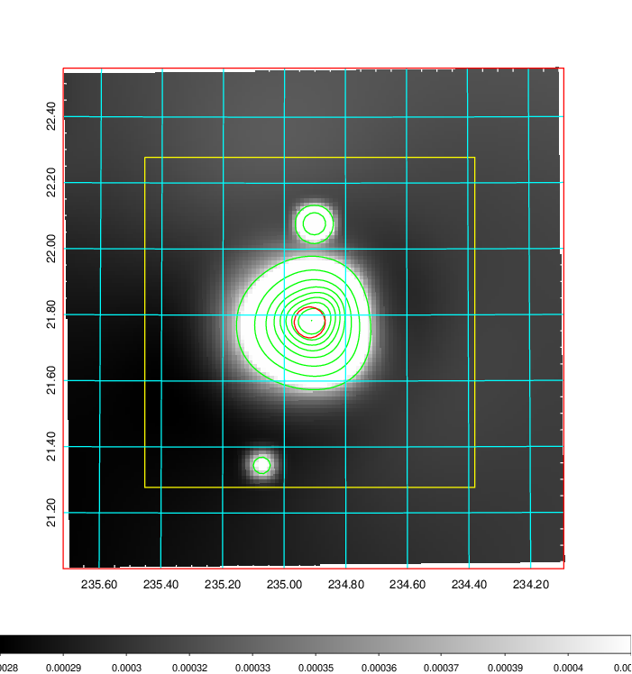   | 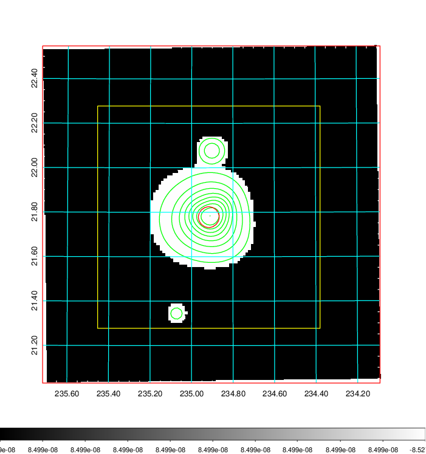  |

|[Exposure image](../image/615/615_mex.pdf)| [nH image](../image/615/615_nh.pdf)| [Planck image](../image/615/615_p.pdf)|
|-------------------|--------------------|-------------------|
|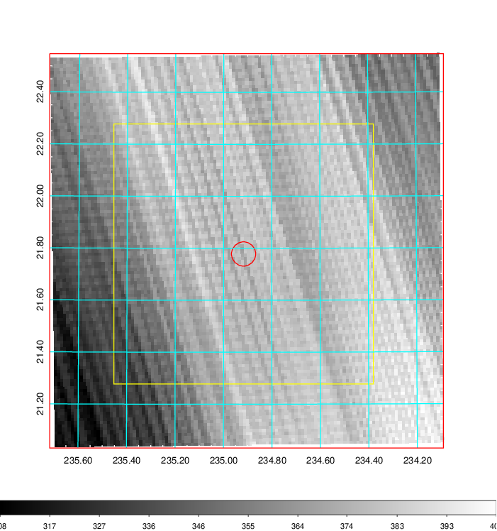   | 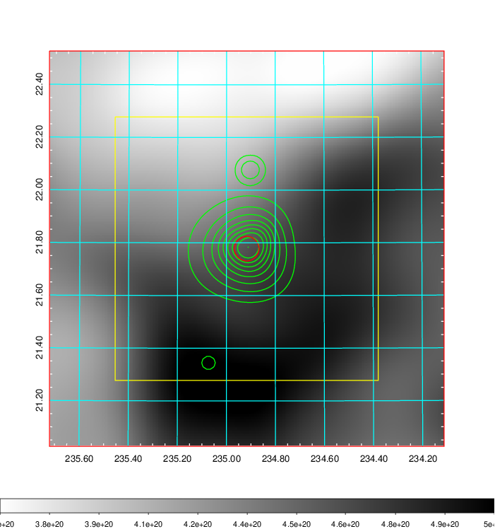    | 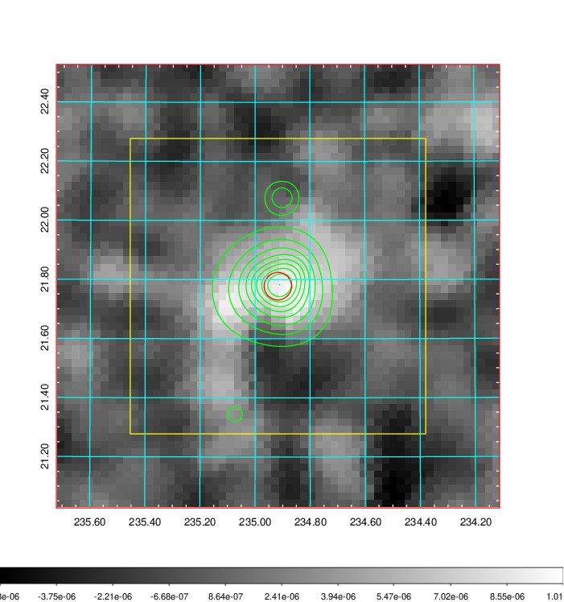 |

|[Redshift Histogram](../image/615/615_zg.pdf) | [DSS image(z1)](../image/615/615_dss_z1.pdf)      |  [DSS image(z2)](../image/615/615_dss_z2.pdf)    |
|-------------------|--------------------|-------------------|
|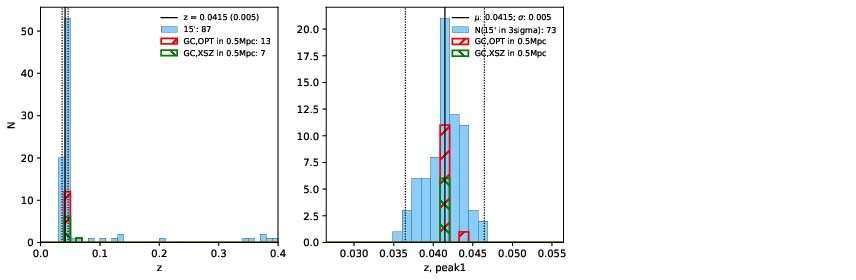 |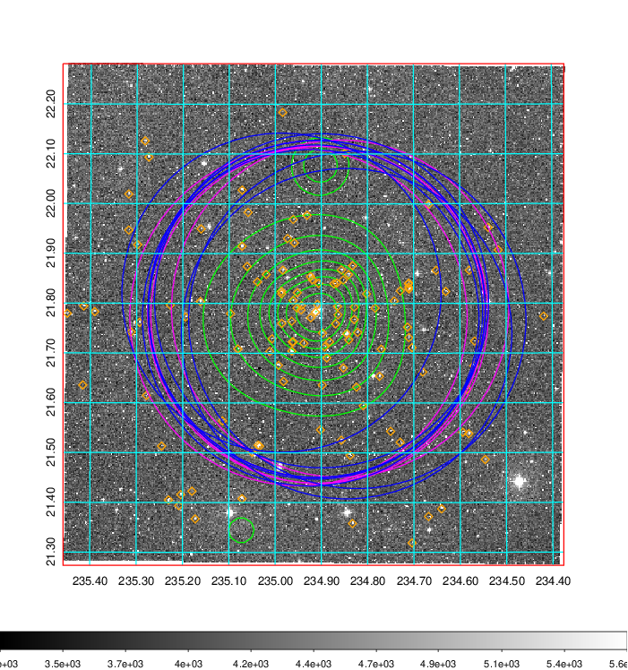  Blue circle for optical clusters;  Magenta circle for XSZ clusters;  all with r=1Mpc;  Only GC with Delta_z<0.01 are shown. | 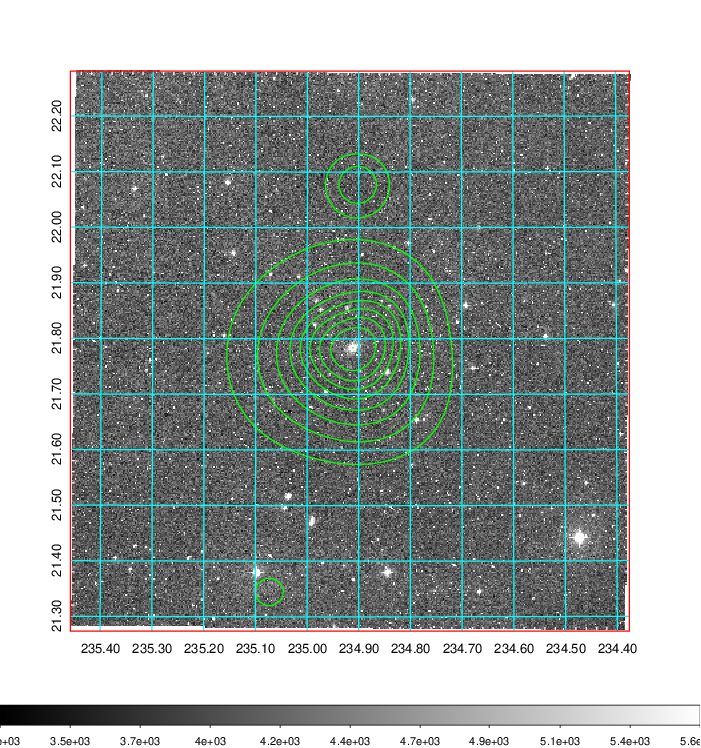 Blue circle for optical clusters;  Magenta circle for XSZ clusters;  all with r=1Mpc;  Only GC with Delta_z<0.01 are shown.  |

|[Previous-identified clusters](../image/615/615_gc.pdf) | [2MASS image](../image/615/615_2mass.pdf)      |[SDSS image](../image/615/615_sdss.pdf)   |
|-------------------|-------------------|-------------------|
|  Green, magenta, and blue circles  for optical, X-ray and SZ clusters  respectively, with redshift of clusters  labelled. The radius of circles  are 1Mpc.|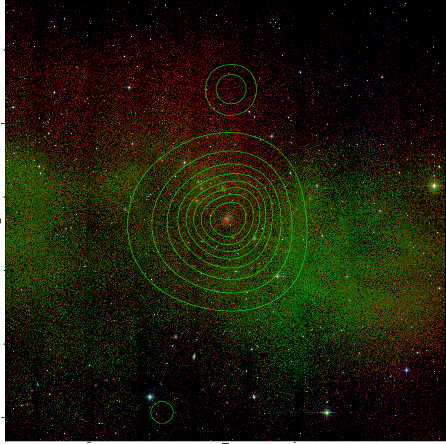  | 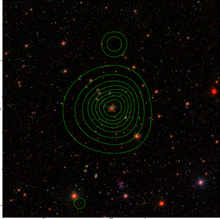  |

