

### 62

|Name|RAJ2000[deg]|DEJ2000[deg] |Ext[arcmin]| Ext,ml | z | z_src| C|GC(XSZ,Delta_z<0.01)| GC(OPT,Delta_z<0.01)|GC| R_sig[arcmin] | R500[arcmin] | R500[Mpc]| CRsig[c/s] | CR500[c/s] |L500[1E44 erg/s]|F500[1E-12 erg/s/cm^2]| M500[1E14 Msun]|Tx[keV]|Cnt_sig|Beta|Rc[arcmin]|Comment|Alias|
|---|---|---|---|---|---|------|---|--------|---------|----------|---|---|---|---|---|---|---|---|---|---|---|---|---|---|
|62| 18.265| 15.499| 3.55| 57.59| 0.0430(0.005)| z1, z_xsz| B| L03, MCXC| A, N, W, Zw| A, C, F20, L03, MCXC, N, W| 25.194| 12.682| 0.645| 0.225(0.063)| 0.208(0.059)| 0.149(0.029)| 3.451(0.659)| 0.79(0.08)| 1.88(0.12)| 84.6| 0.883(-0.119+0.082)| 5.273(-0.975+0.708)| -| k439|

|[RASS image](../image/62/62_img.pdf)|[filtered image](../image/62/62_fil.pdf)|[Segment image](../image/62/62_seg.pdf)|
|-------------------|--------------------|-------------------|
| 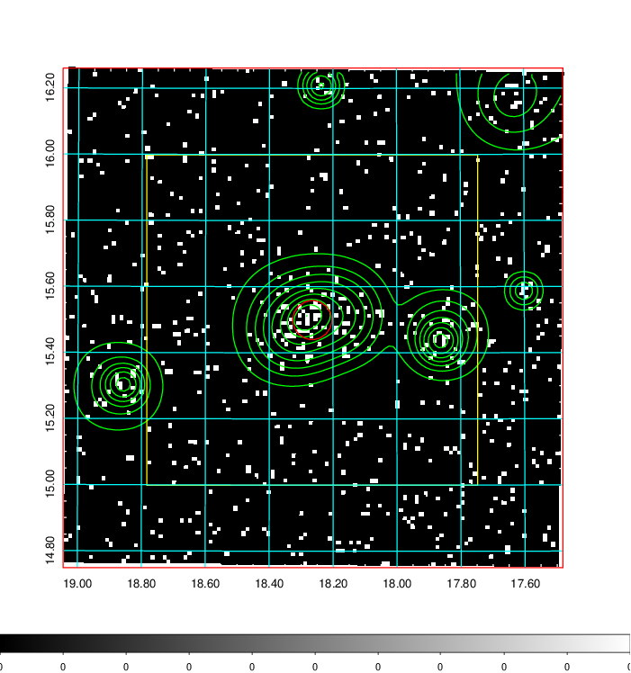  | 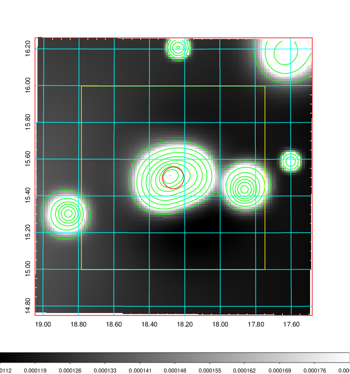   | 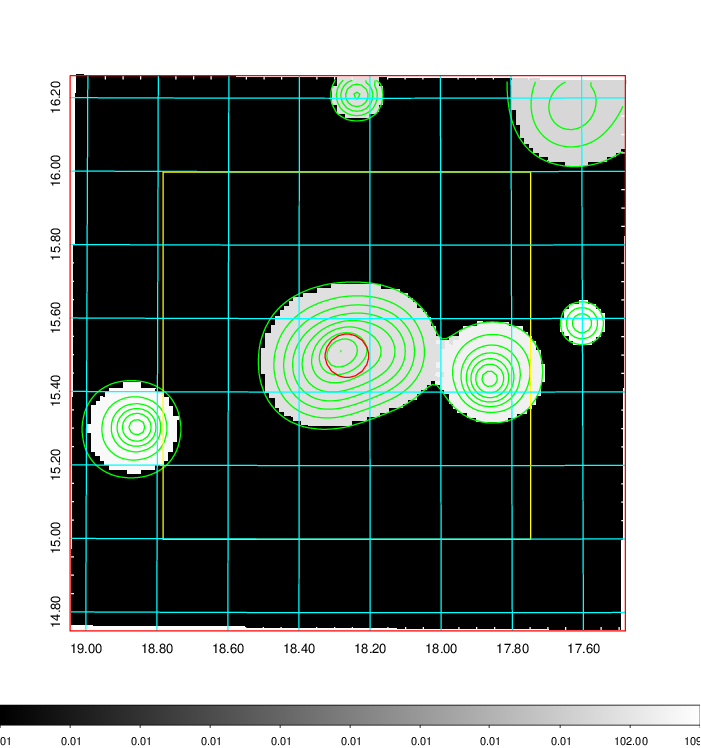  |

|[Exposure image](../image/62/62_mex.pdf)| [nH image](../image/62/62_nh.pdf)| [Planck image](../image/62/62_p.pdf)|
|-------------------|--------------------|-------------------|
|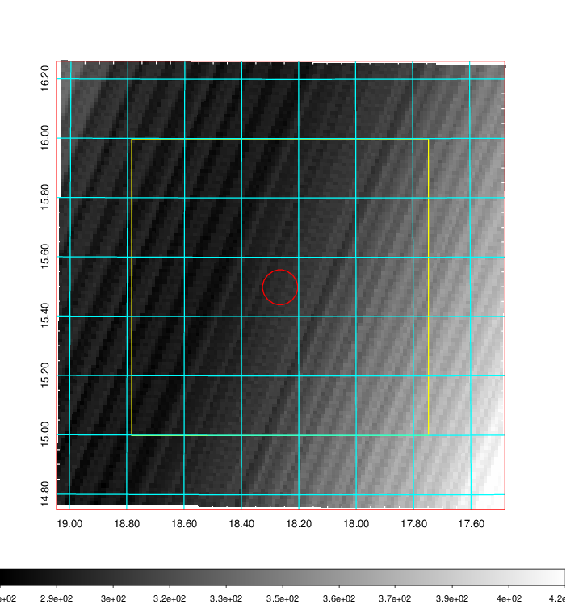   | 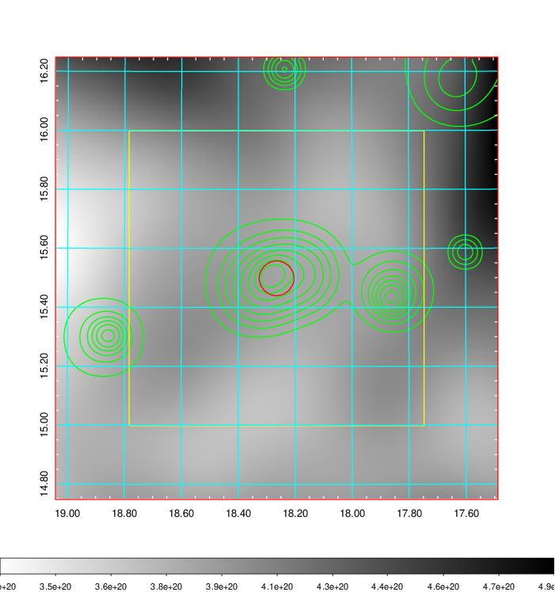    | 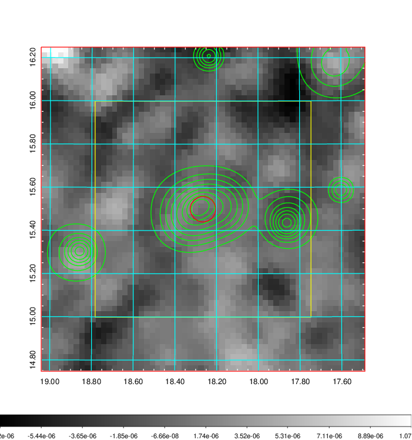 |

|[Redshift Histogram](../image/62/62_zg.pdf) | [DSS image(z1)](../image/62/62_dss_z1.pdf)      |  [DSS image(z2)](../image/62/62_dss_z2.pdf)    |
|-------------------|--------------------|-------------------|
|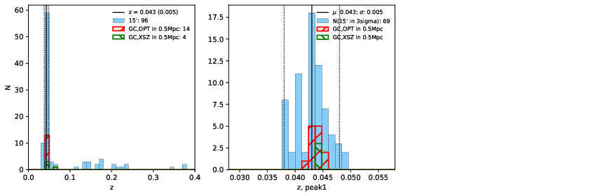 |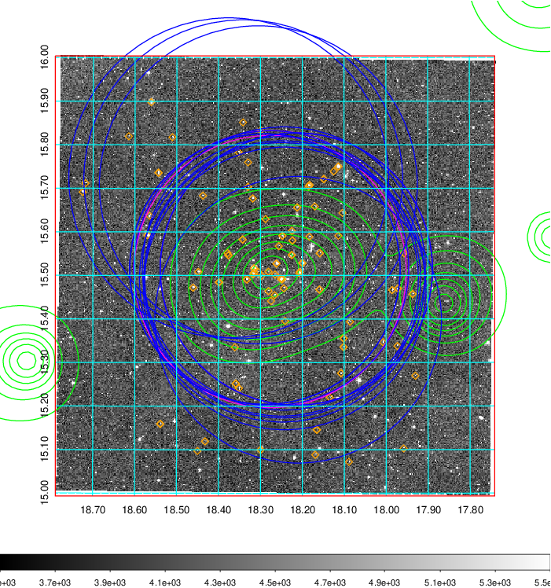  Blue circle for optical clusters;  Magenta circle for XSZ clusters;  all with r=1Mpc;  Only GC with Delta_z<0.01 are shown. | 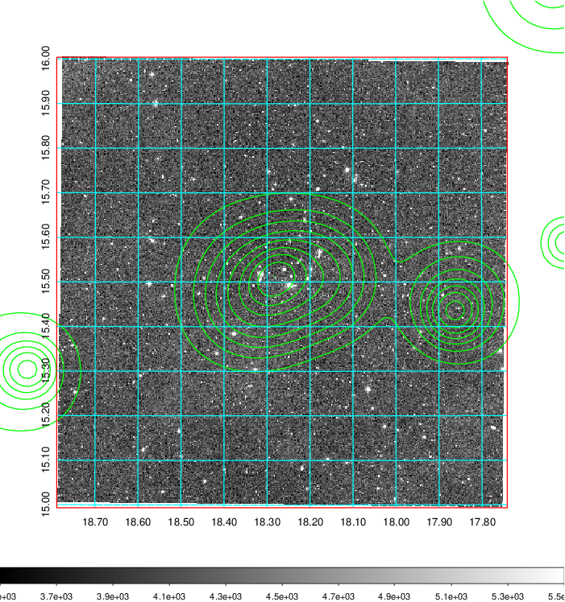 Blue circle for optical clusters;  Magenta circle for XSZ clusters;  all with r=1Mpc;  Only GC with Delta_z<0.01 are shown.  |

|[Previous-identified clusters](../image/62/62_gc.pdf) | [2MASS image](../image/62/62_2mass.pdf)      |[SDSS image](../image/62/62_sdss.pdf)   |
|-------------------|-------------------|-------------------|
|  Green, magenta, and blue circles  for optical, X-ray and SZ clusters  respectively, with redshift of clusters  labelled. The radius of circles  are 1Mpc.|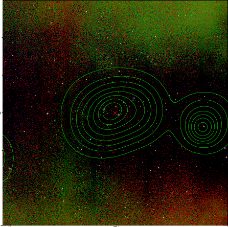  | 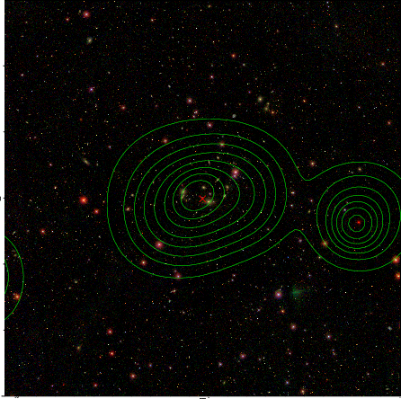  |

