

### 620

|Name|RAJ2000[deg]|DEJ2000[deg] |Ext[arcmin]| Ext,ml | z | z_src| C|GC(XSZ,Delta_z<0.01)| GC(OPT,Delta_z<0.01)|GC| R_sig[arcmin] | R500[arcmin] | R500[Mpc]| CRsig[c/s] | CR500[c/s] |L500[1E44 erg/s]|F500[1E-12 erg/s/cm^2]| M500[1E14 Msun]|Tx[keV]|Cnt_sig|Beta|Rc[arcmin]|Comment|Alias|
|---|---|---|---|---|---|------|---|--------|---------|----------|---|---|---|---|---|---|---|---|---|---|---|---|---|---|
|620| 235.764| 5.772| 1.64| 27.56| 0.1068(0.005)| z1, z_xsz| B| F20, Tar| C, N, RM, W, Zw| C, F20, N, Tar, W| 10.750| 7.783| 0.913| 0.199(0.043)| 0.190(0.041)| 1.021(0.107)| 3.500(0.367)| 2.40(0.12)| 3.80(0.13)| 92.3| 0.874(-0.122+0.088)| 3.897(-0.753+0.549)| -| t035|

|[RASS image](../image/620/620_img.pdf)|[filtered image](../image/620/620_fil.pdf)|[Segment image](../image/620/620_seg.pdf)|
|-------------------|--------------------|-------------------|
| 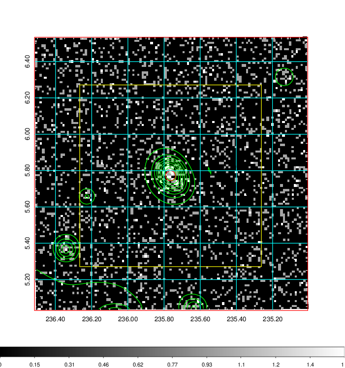  | 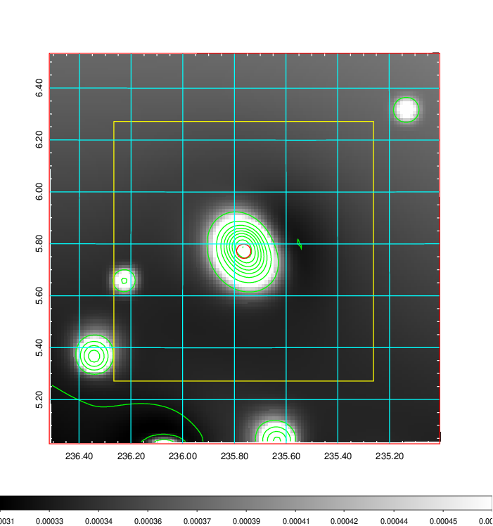   | 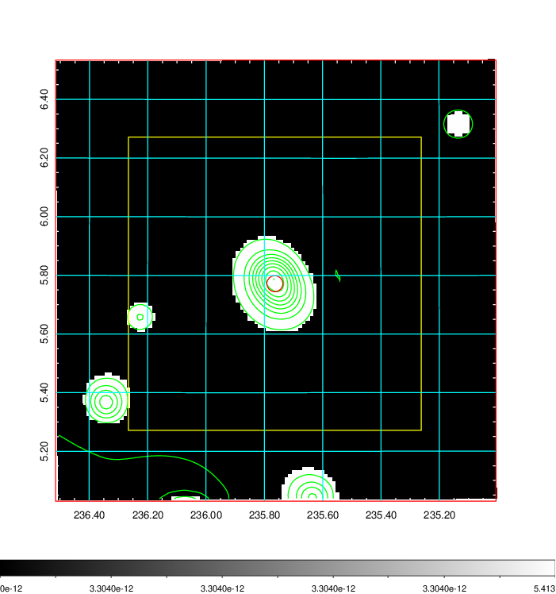  |

|[Exposure image](../image/620/620_mex.pdf)| [nH image](../image/620/620_nh.pdf)| [Planck image](../image/620/620_p.pdf)|
|-------------------|--------------------|-------------------|
|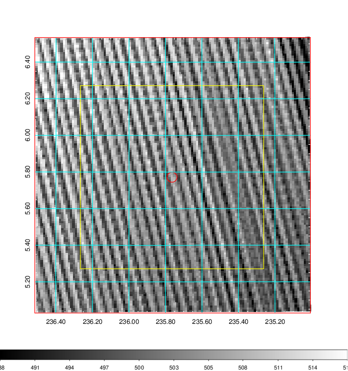   | 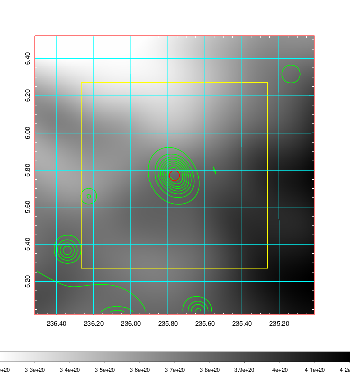    | 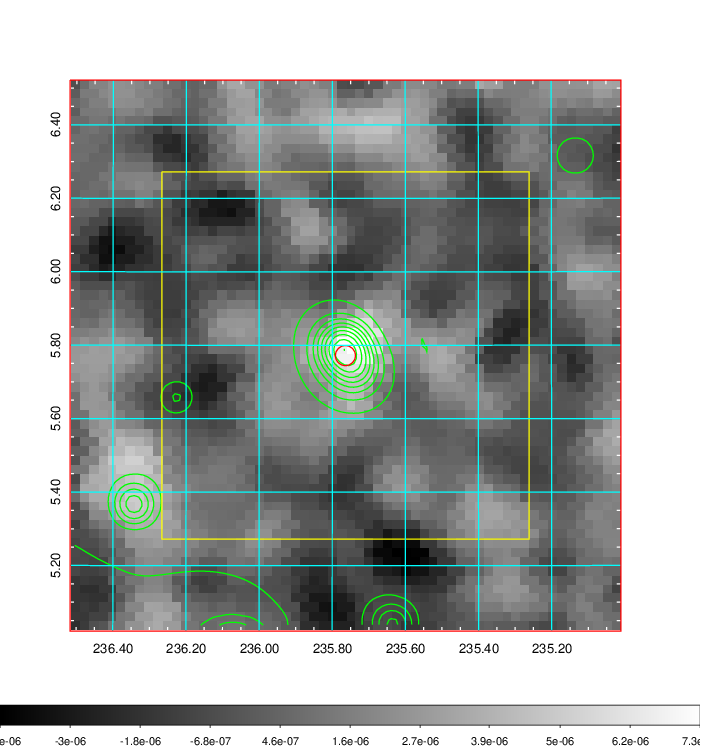 |

|[Redshift Histogram](../image/620/620_zg.pdf) | [DSS image(z1)](../image/620/620_dss_z1.pdf)      |  [DSS image(z2)](../image/620/620_dss_z2.pdf)    |
|-------------------|--------------------|-------------------|
|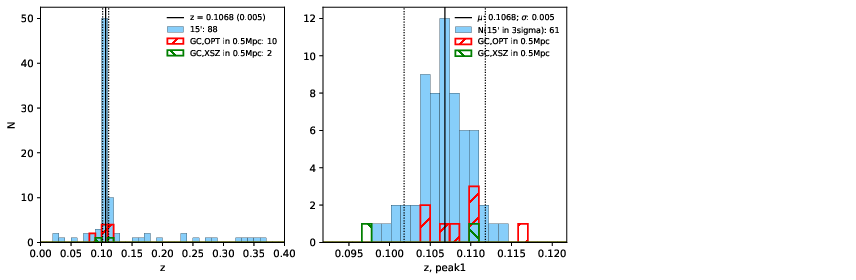 |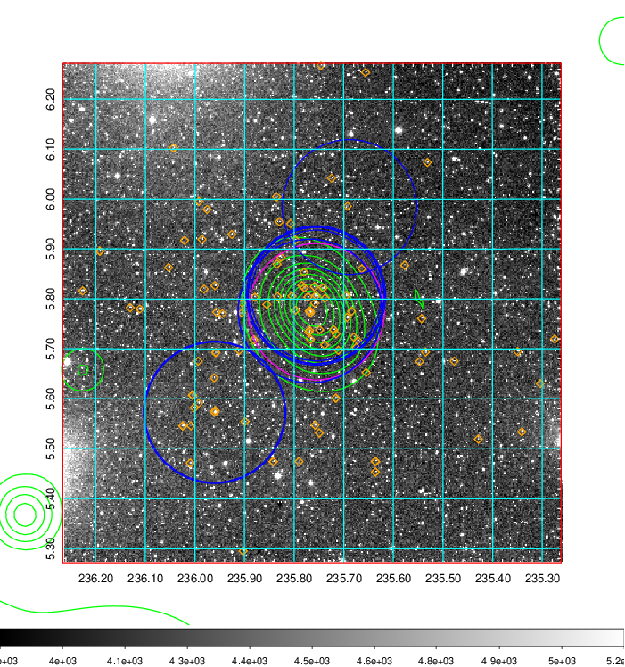  Blue circle for optical clusters;  Magenta circle for XSZ clusters;  all with r=1Mpc;  Only GC with Delta_z<0.01 are shown. | 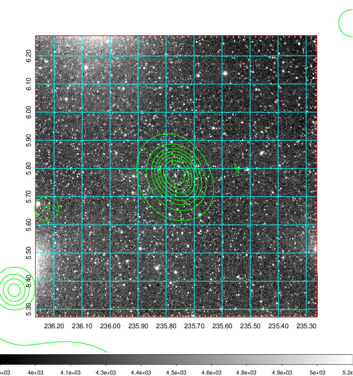 Blue circle for optical clusters;  Magenta circle for XSZ clusters;  all with r=1Mpc;  Only GC with Delta_z<0.01 are shown.  |

|[Previous-identified clusters](../image/620/620_gc.pdf) | [2MASS image](../image/620/620_2mass.pdf)      |[SDSS image](../image/620/620_sdss.pdf)   |
|-------------------|-------------------|-------------------|
|  Green, magenta, and blue circles  for optical, X-ray and SZ clusters  respectively, with redshift of clusters  labelled. The radius of circles  are 1Mpc.|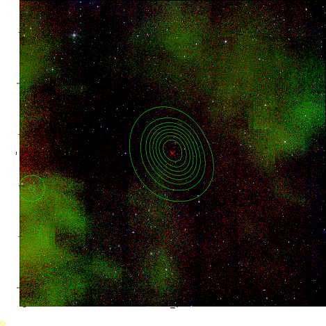  | 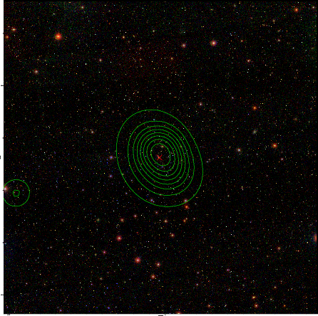  |

