

### 621

|Name|RAJ2000[deg]|DEJ2000[deg] |Ext[arcmin]| Ext,ml | z | z_src| C|GC(XSZ,Delta_z<0.01)| GC(OPT,Delta_z<0.01)|GC| R_sig[arcmin] | R500[arcmin] | R500[Mpc]| CRsig[c/s] | CR500[c/s] |L500[1E44 erg/s]|F500[1E-12 erg/s/cm^2]| M500[1E14 Msun]|Tx[keV]|Cnt_sig|Beta|Rc[arcmin]|Comment|Alias|
|---|---|---|---|---|---|------|---|--------|---------|----------|---|---|---|---|---|---|---|---|---|---|---|---|---|---|
|621| 236.106| 51.416| 4.09| 26.13| 0.1578(0.005)| z1, z_xsz| B| F20, SPI| C, RM, W| C, F20, N, SPI, W| 11.238| 5.699| 0.932| 0.118(0.022)| 0.109(0.020)| 1.498(0.242)| 2.203(0.356)| 2.69(0.21)| 4.15(0.21)| 98.3| 0.898(-0.116+0.073)| 7.329(-1.050+0.781)| -| t202|

|[RASS image](../image/621/621_img.pdf)|[filtered image](../image/621/621_fil.pdf)|[Segment image](../image/621/621_seg.pdf)|
|-------------------|--------------------|-------------------|
| 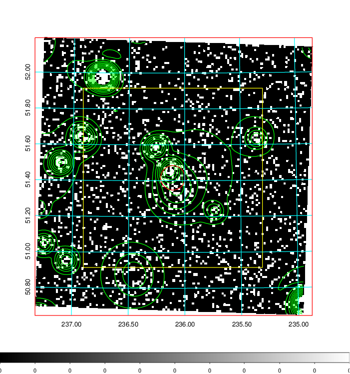  | 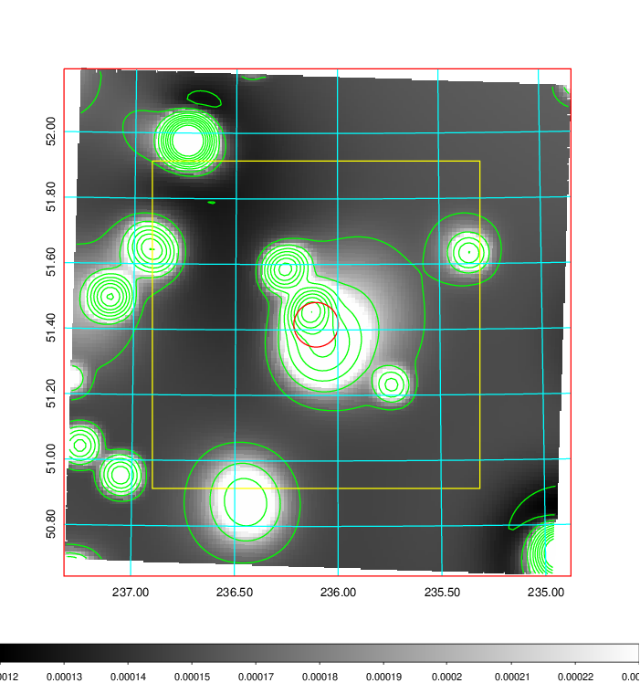   | 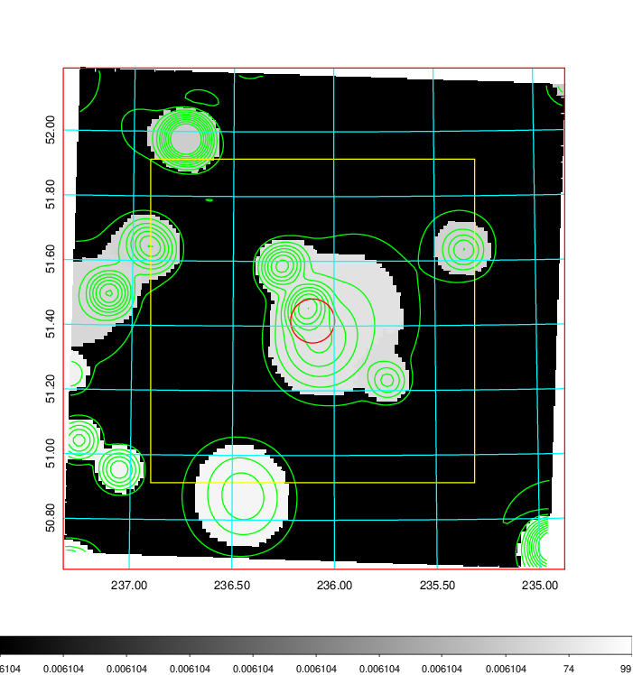  |

|[Exposure image](../image/621/621_mex.pdf)| [nH image](../image/621/621_nh.pdf)| [Planck image](../image/621/621_p.pdf)|
|-------------------|--------------------|-------------------|
|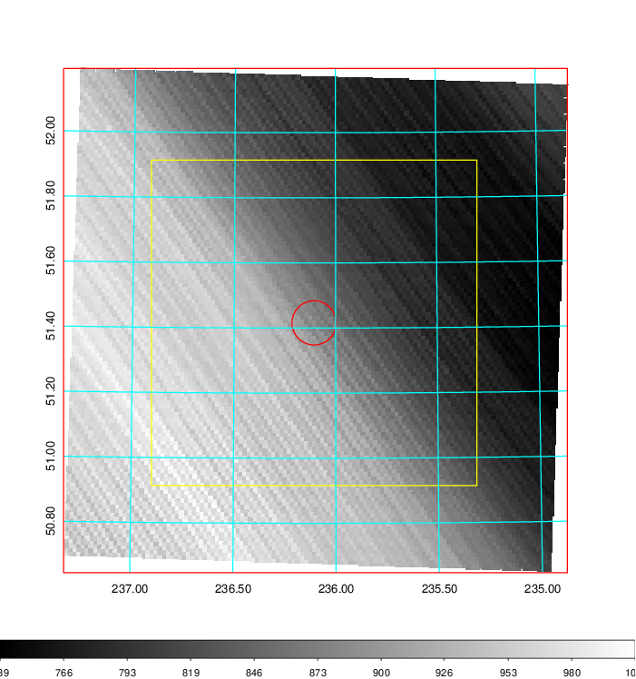   | 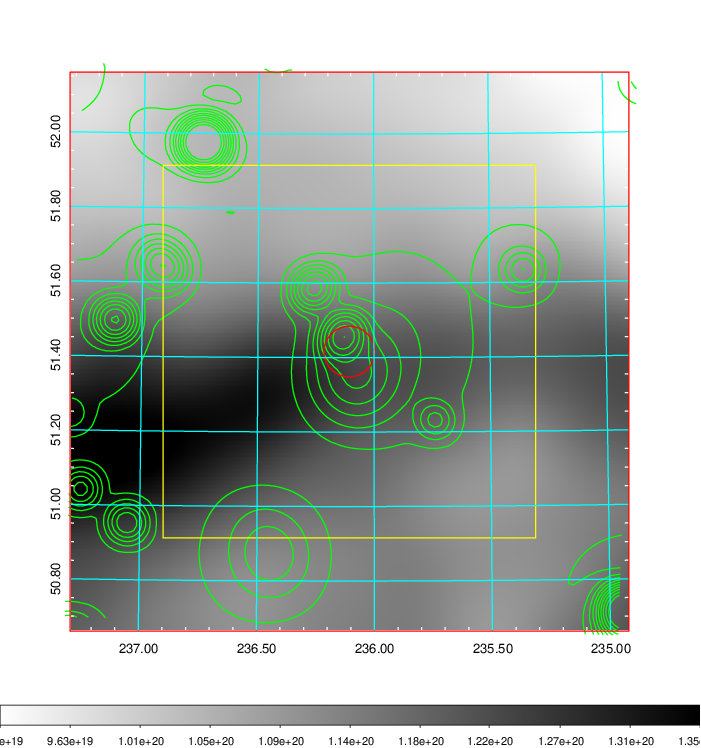    | 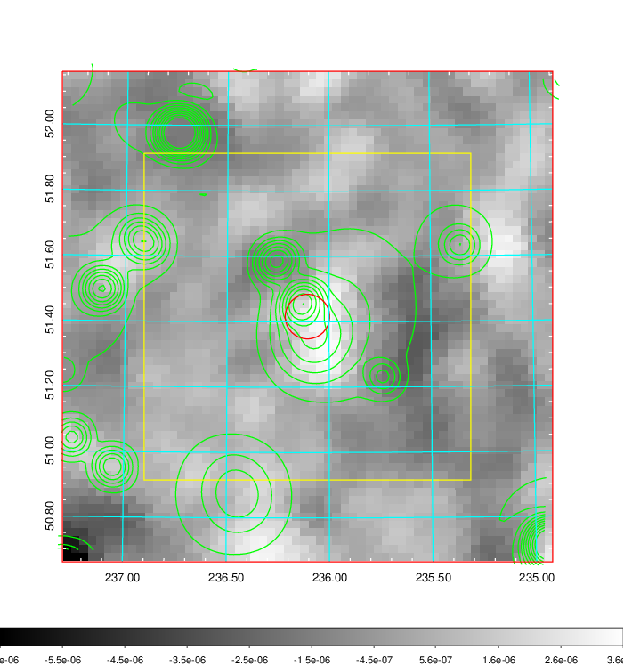 |

|[Redshift Histogram](../image/621/621_zg.pdf) | [DSS image(z1)](../image/621/621_dss_z1.pdf)      |  [DSS image(z2)](../image/621/621_dss_z2.pdf)    |
|-------------------|--------------------|-------------------|
|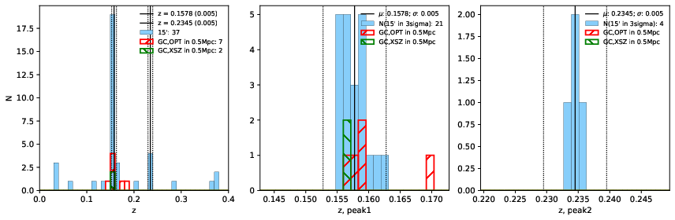 |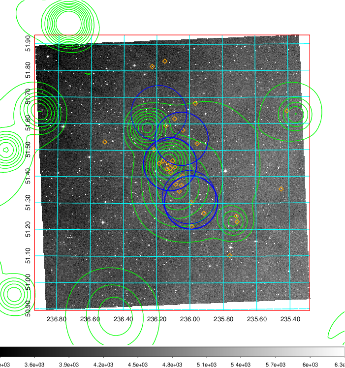  Blue circle for optical clusters;  Magenta circle for XSZ clusters;  all with r=1Mpc;  Only GC with Delta_z<0.01 are shown. | 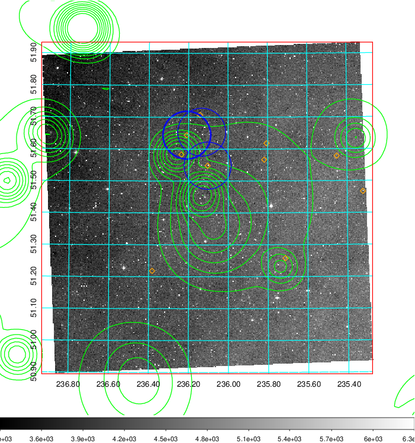 Blue circle for optical clusters;  Magenta circle for XSZ clusters;  all with r=1Mpc;  Only GC with Delta_z<0.01 are shown.  |

|[known Abell/XSZ clusters](../image/621/621_gc.pdf) | [2MASS image](../image/621/621_2mass.pdf)      |[SDSS image](../image/621/621_sdss.pdf)   |
|-------------------|-------------------|-------------------|
|  Magenta, blue and green circles  for optical, X-ray and SZ clusters  respectively, with redshift of clusters  labelled. The radius of circles  are 1Mpc.|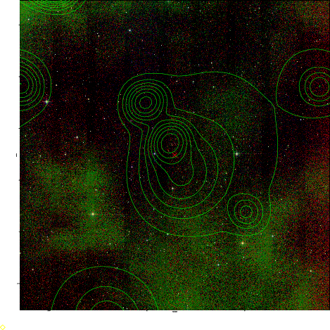  | 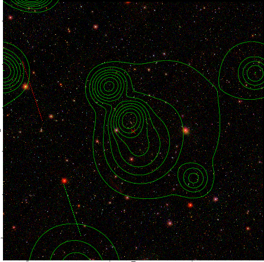  |

