

### 623

|Name|RAJ2000[deg]|DEJ2000[deg] |Ext[arcmin]| Ext,ml | z | z_src| C|GC(XSZ,Delta_z<0.01)| GC(OPT,Delta_z<0.01)|GC| R_sig[arcmin] | R500[arcmin] | R500[Mpc]| CRsig[c/s] | CR500[c/s] |L500[1E44 erg/s]|F500[1E-12 erg/s/cm^2]| M500[1E14 Msun]|Tx[keV]|Cnt_sig|Beta|Rc[arcmin]|Comment|Alias|
|---|---|---|---|---|---|------|---|--------|---------|----------|---|---|---|---|---|---|---|---|---|---|---|---|---|---|
|623| 239.204| 48.047| 7.99| 32.00| 0.0195(0.005)| z1, z_opt| S| -| N| N| 24.206| 19.106| 0.453| 0.208(0.053)| 0.200(0.051)| 0.024(0.006)| 2.785(0.652)| 0.27(0.03)| 0.96(0.07)| 85.7| 0.856(-0.123+0.098)| 11.571(-1.744+1.253)| -| t391|

|[RASS image](../image/623/623_img.pdf)|[filtered image](../image/623/623_fil.pdf)|[Segment image](../image/623/623_seg.pdf)|
|-------------------|--------------------|-------------------|
| 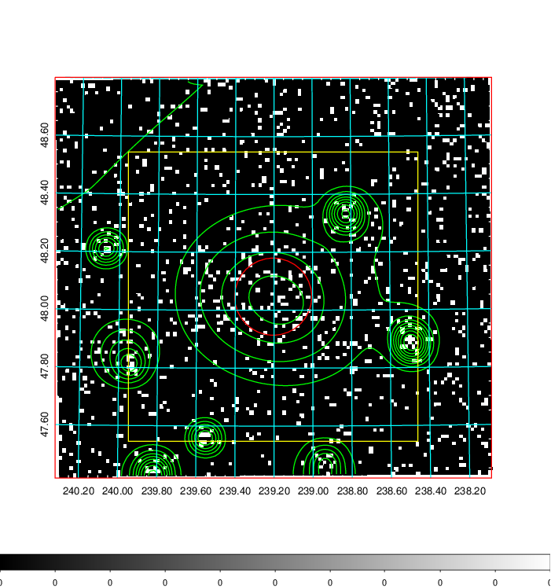  | 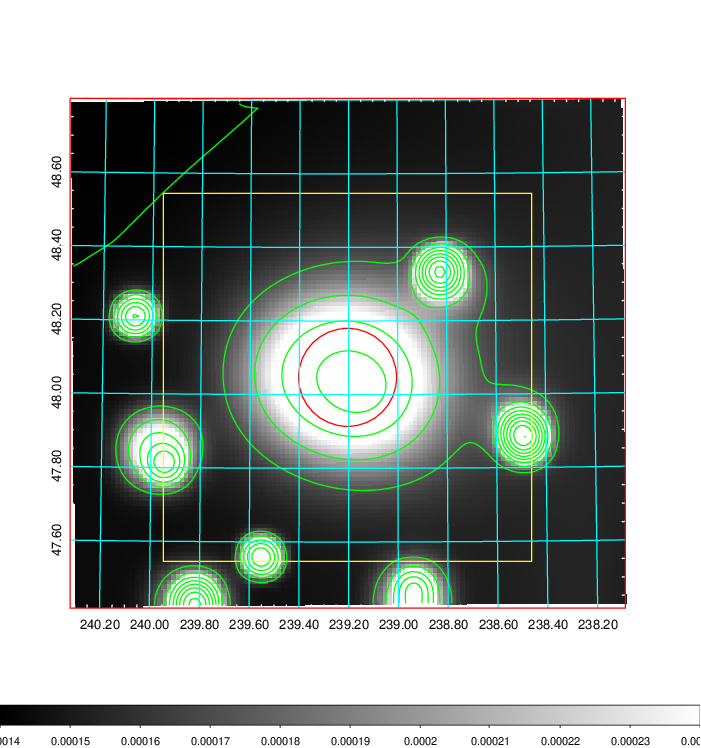   | 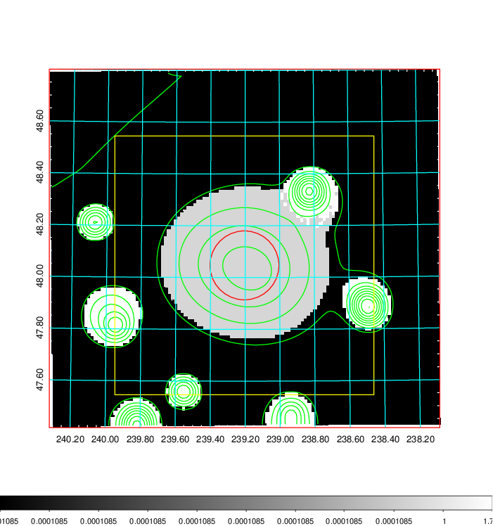  |

|[Exposure image](../image/623/623_mex.pdf)| [nH image](../image/623/623_nh.pdf)| [Planck image](../image/623/623_p.pdf)|
|-------------------|--------------------|-------------------|
|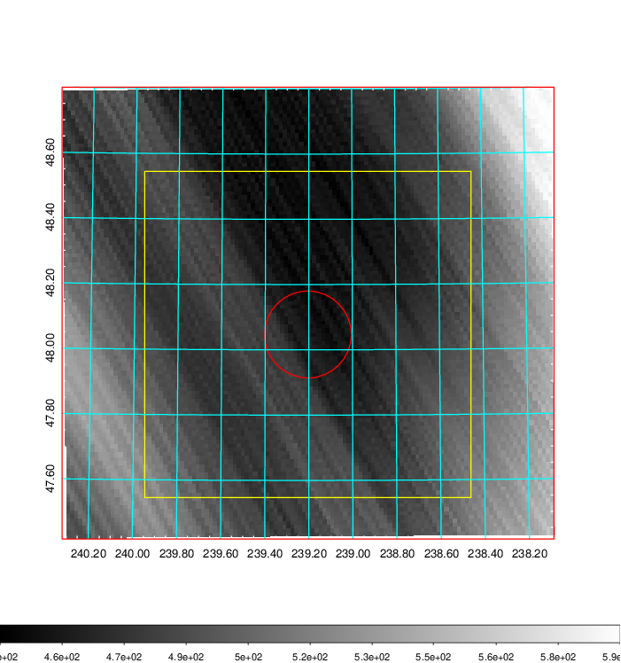   | 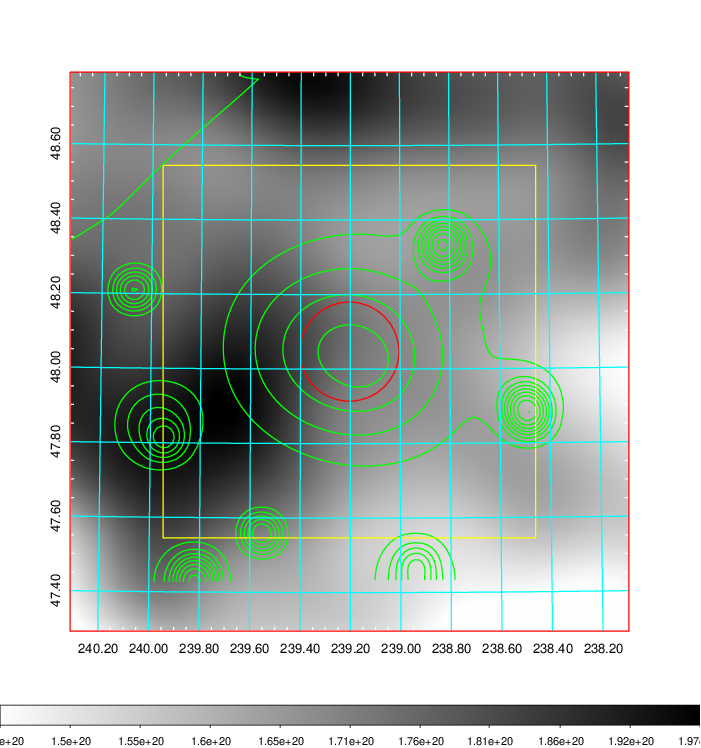    | 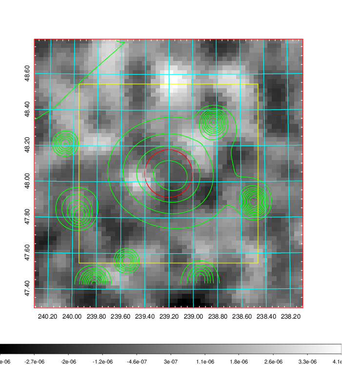 |

|[Redshift Histogram](../image/623/623_zg.pdf) | [DSS image(z1)](../image/623/623_dss_z1.pdf)      |  [DSS image(z2)](../image/623/623_dss_z2.pdf)    |
|-------------------|--------------------|-------------------|
|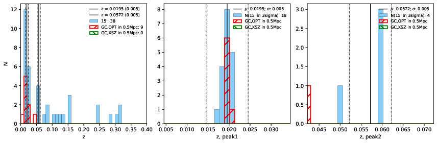 |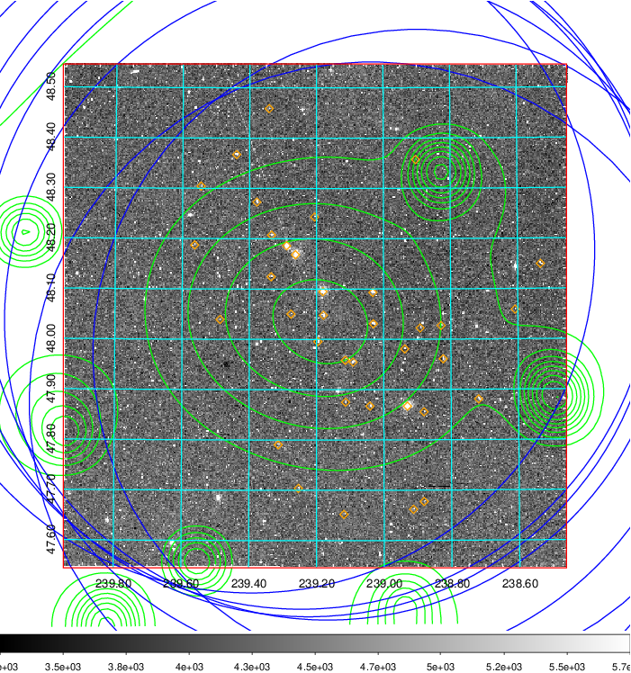  Blue circle for optical clusters;  Magenta circle for XSZ clusters;  all with r=1Mpc;  Only GC with Delta_z<0.01 are shown. | 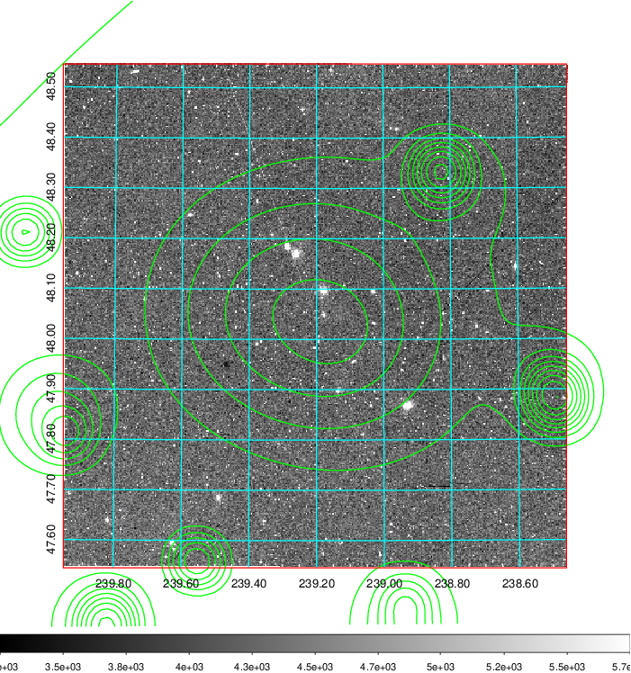 Blue circle for optical clusters;  Magenta circle for XSZ clusters;  all with r=1Mpc;  Only GC with Delta_z<0.01 are shown.  |

|[known Abell/XSZ clusters](../image/623/623_gc.pdf) | [2MASS image](../image/623/623_2mass.pdf)      |[SDSS image](../image/623/623_sdss.pdf)   |
|-------------------|-------------------|-------------------|
|  Magenta, blue and green circles  for optical, X-ray and SZ clusters  respectively, with redshift of clusters  labelled. The radius of circles  are 1Mpc.|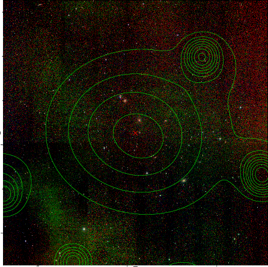  | 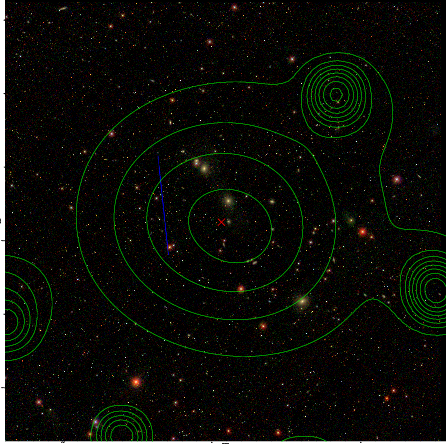  |

