

### 624

|Name|RAJ2000[deg]|DEJ2000[deg] |Ext[arcmin]| Ext,ml | z | z_src| C|GC(XSZ,Delta_z<0.01)| GC(OPT,Delta_z<0.01)|GC| R_sig[arcmin] | R500[arcmin] | R500[Mpc]| CRsig[c/s] | CR500[c/s] |L500[1E44 erg/s]|F500[1E-12 erg/s/cm^2]| M500[1E14 Msun]|Tx[keV]|Cnt_sig|Beta|Rc[arcmin]|Comment|Alias|
|---|---|---|---|---|---|------|---|--------|---------|----------|---|---|---|---|---|---|---|---|---|---|---|---|---|---|
|624| 239.592| -14.164| 0.93| 70.39| 0.0945(0.006)| z1, z_xsz| B| MCXC, PSZ2, Tar| N| MCXC, N, PSZ2, Tar| 6.850| 10.894| 1.146| 0.561(0.049)| 0.622(0.054)| 2.442(0.074)| 10.867(0.327)| 4.69(0.07)| 5.72(0.05)| 252.7| 0.881(-0.099+0.080)| 2.429(-0.446+0.339)| -| k027|

|[RASS image](../image/624/624_img.pdf)|[filtered image](../image/624/624_fil.pdf)|[Segment image](../image/624/624_seg.pdf)|
|-------------------|--------------------|-------------------|
| 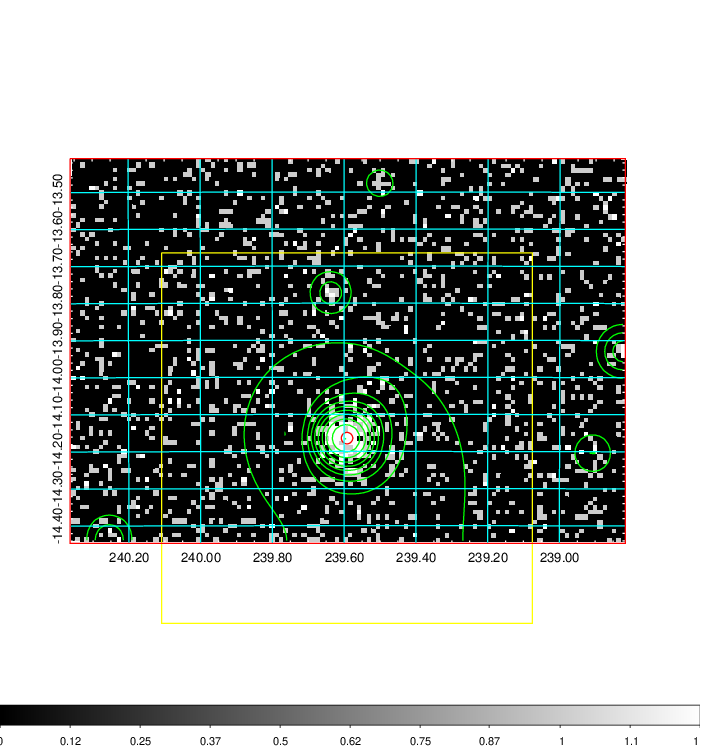  | 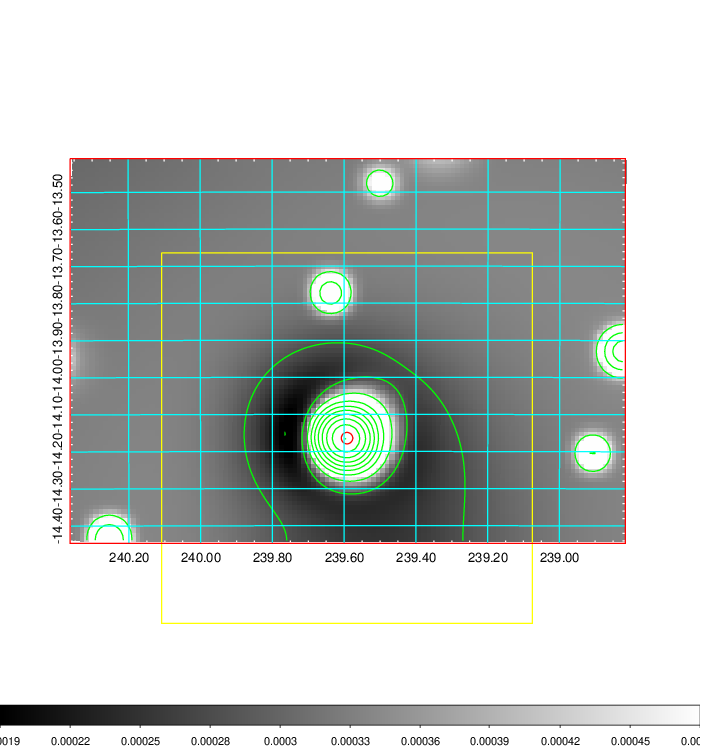   | 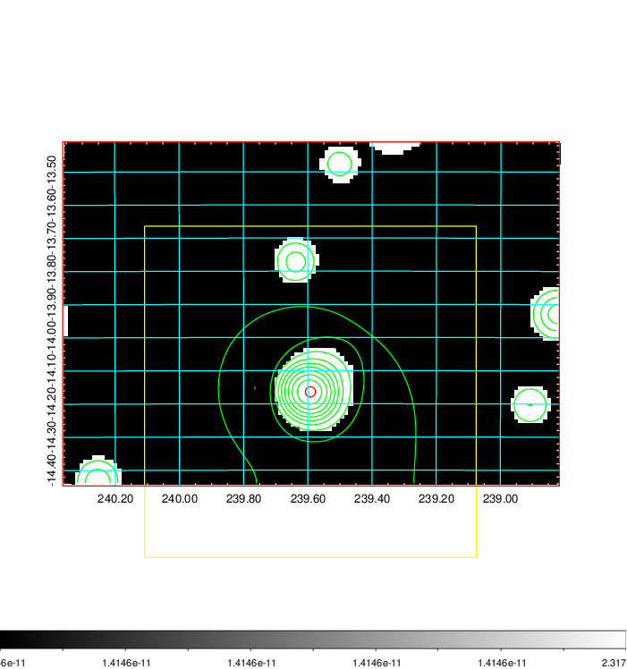  |

|[Exposure image](../image/624/624_mex.pdf)| [nH image](../image/624/624_nh.pdf)| [Planck image](../image/624/624_p.pdf)|
|-------------------|--------------------|-------------------|
|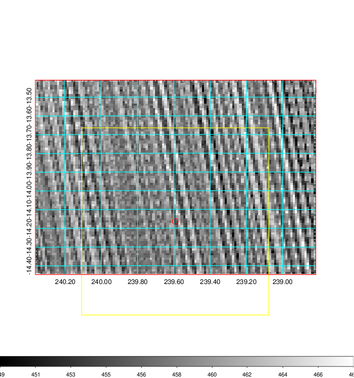   | 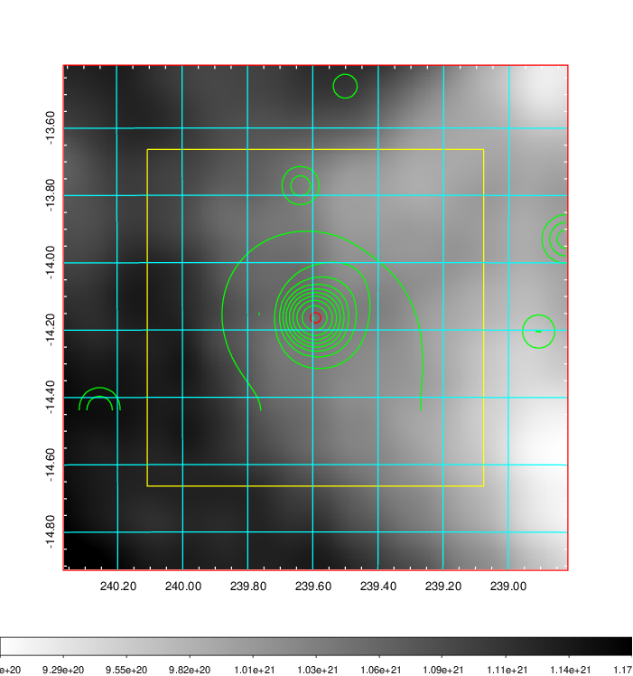    | 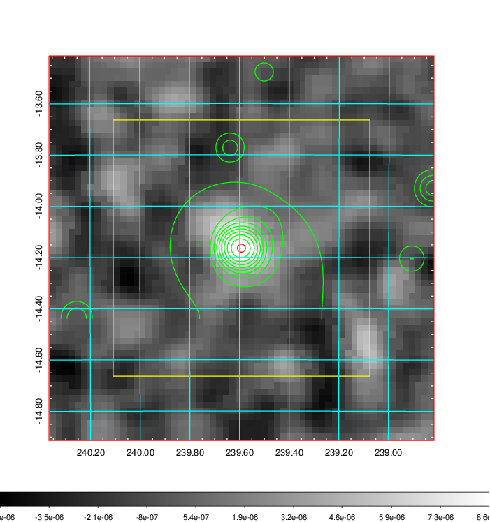 |

|[Redshift Histogram](../image/624/624_zg.pdf) | [DSS image(z1)](../image/624/624_dss_z1.pdf)      |  [DSS image(z2)](../image/624/624_dss_z2.pdf)    |
|-------------------|--------------------|-------------------|
|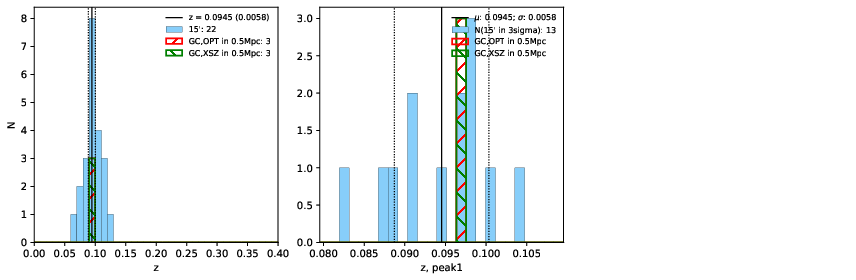 |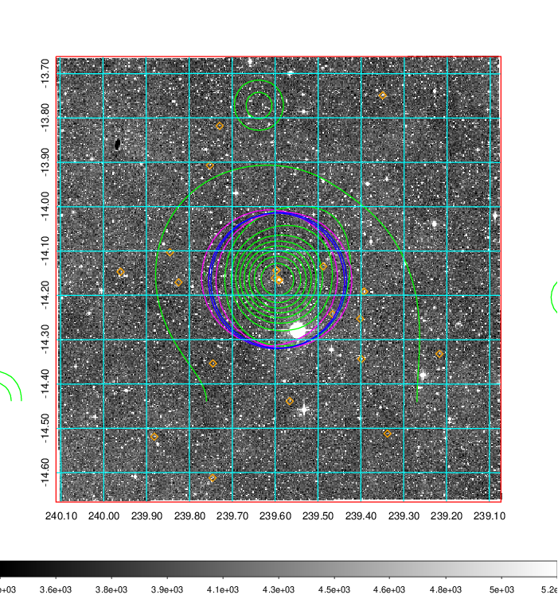  Blue circle for optical clusters;  Magenta circle for XSZ clusters;  all with r=1Mpc;  Only GC with Delta_z<0.01 are shown. | 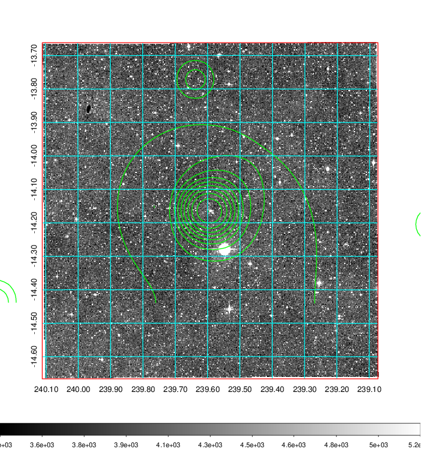 Blue circle for optical clusters;  Magenta circle for XSZ clusters;  all with r=1Mpc;  Only GC with Delta_z<0.01 are shown.  |

|[Previous-identified clusters](../image/624/624_gc.pdf) | [2MASS image](../image/624/624_2mass.pdf)      |
|-------------------|-------------------|
|  Green, magenta, and blue circles  for optical, X-ray and SZ clusters  respectively, with redshift of clusters  labelled. The radius of circles  are 1Mpc.|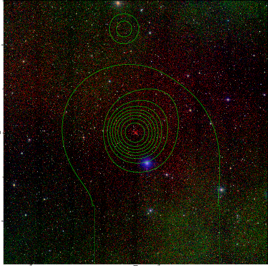  |

|[PS1 image](../image/624/624_ps1.pdf)            |
|-------------------|
| 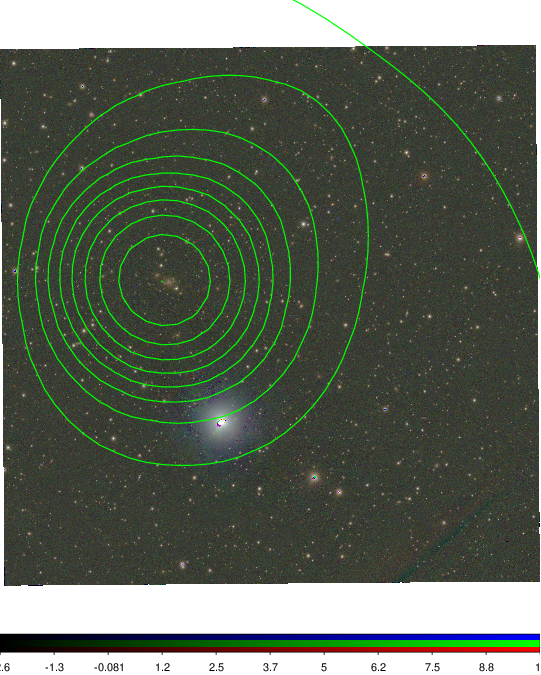  |
