

### 626

|Name|RAJ2000[deg]|DEJ2000[deg] |Ext[arcmin]| Ext,ml | z | z_src| C|GC(XSZ,Delta_z<0.01)| GC(OPT,Delta_z<0.01)|GC| R_sig[arcmin] | R500[arcmin] | R500[Mpc]| CRsig[c/s] | CR500[c/s] |L500[1E44 erg/s]|F500[1E-12 erg/s/cm^2]| M500[1E14 Msun]|Tx[keV]|Cnt_sig|Beta|Rc[arcmin]|Comment|Alias|
|---|---|---|---|---|---|------|---|--------|---------|----------|---|---|---|---|---|---|---|---|---|---|---|---|---|---|
|626| 239.641| 18.020| 4.37| 41.17| 0.0458(0.005)| z1, z_opt| S| -| N, W| C, F20, N, W| 12.700| 12.192| 0.658| 0.205(0.036)| 0.204(0.036)| 0.173(0.020)| 3.513(0.400)| 0.85(0.05)| 1.96(0.07)| 90.5| 0.879(-0.135+0.086)| 8.462(-1.399+0.983)| -| t223|

|[RASS image](../image/626/626_img.pdf)|[filtered image](../image/626/626_fil.pdf)|[Segment image](../image/626/626_seg.pdf)|
|-------------------|--------------------|-------------------|
| 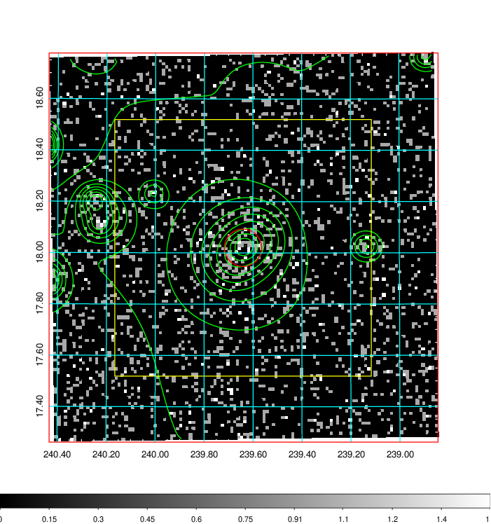  | 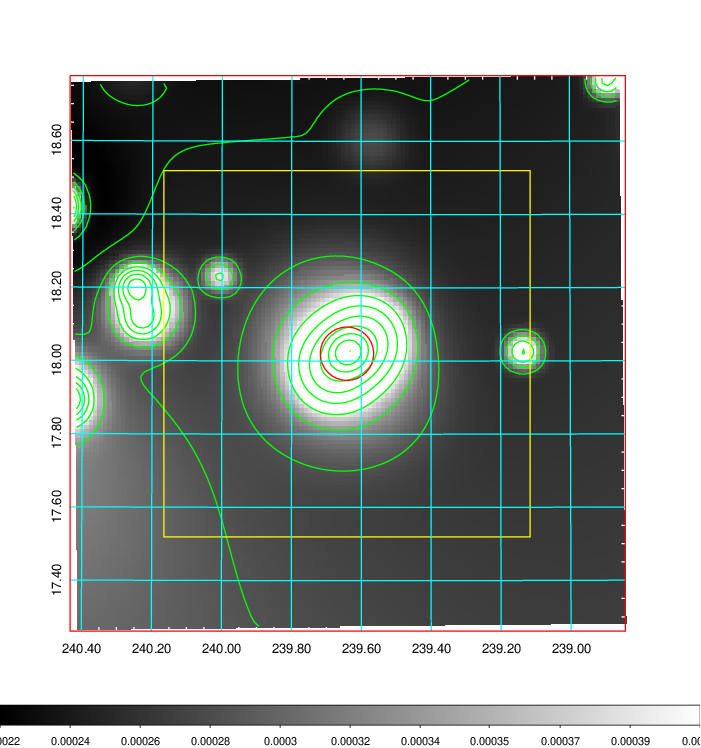   | 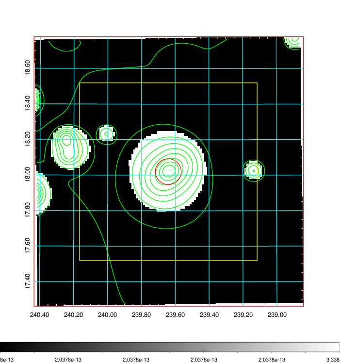  |

|[Exposure image](../image/626/626_mex.pdf)| [nH image](../image/626/626_nh.pdf)| [Planck image](../image/626/626_p.pdf)|
|-------------------|--------------------|-------------------|
|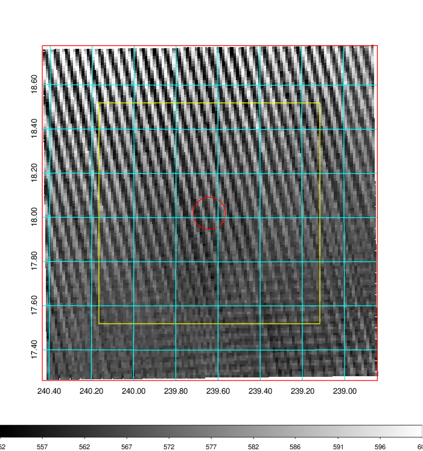   | 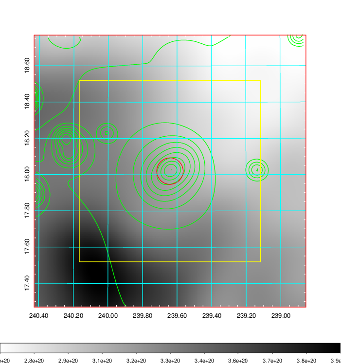    | 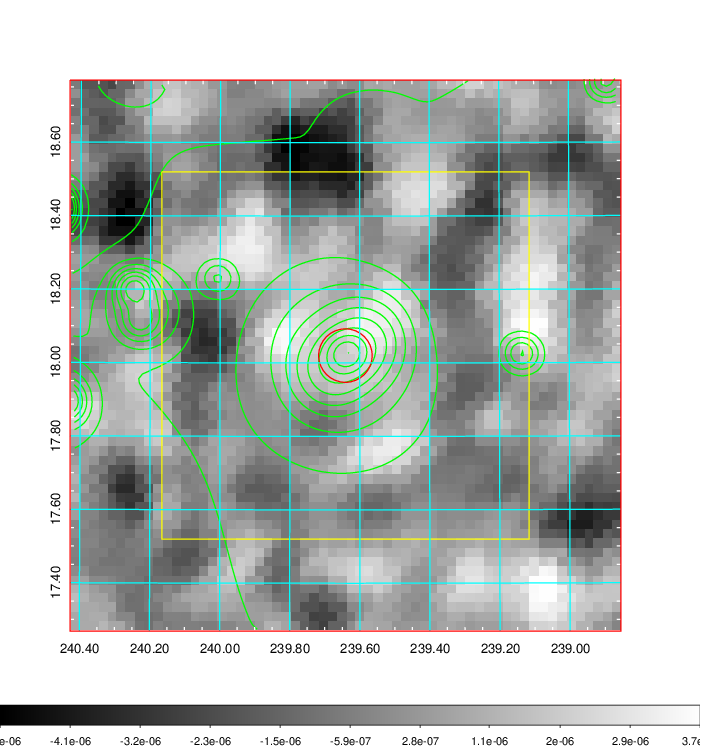 |

|[Redshift Histogram](../image/626/626_zg.pdf) | [DSS image(z1)](../image/626/626_dss_z1.pdf)      |  [DSS image(z2)](../image/626/626_dss_z2.pdf)    |
|-------------------|--------------------|-------------------|
|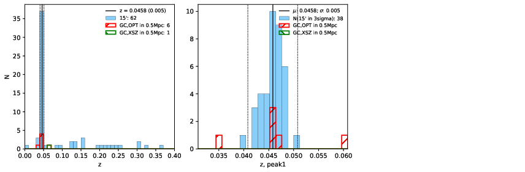 |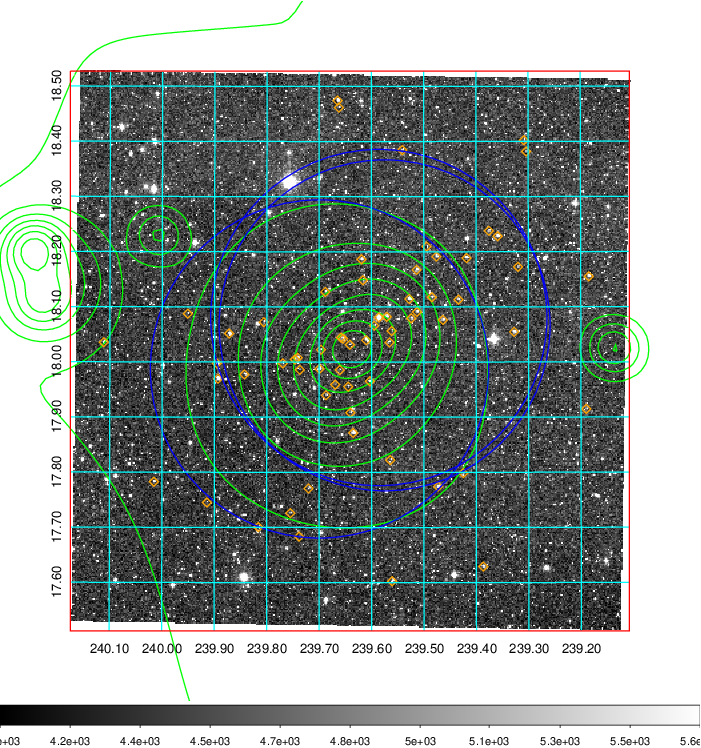  Blue circle for optical clusters;  Magenta circle for XSZ clusters;  all with r=1Mpc;  Only GC with Delta_z<0.01 are shown. | 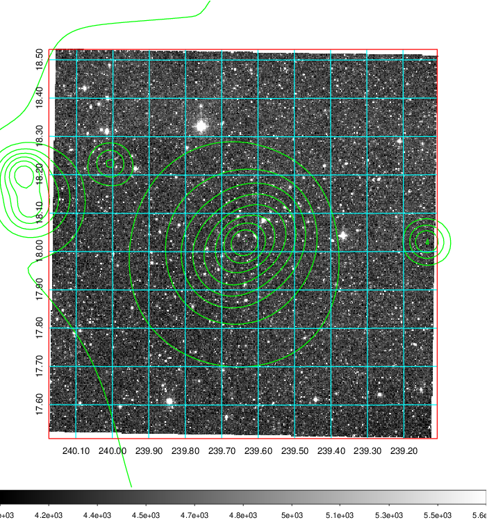 Blue circle for optical clusters;  Magenta circle for XSZ clusters;  all with r=1Mpc;  Only GC with Delta_z<0.01 are shown.  |

|[known Abell/XSZ clusters](../image/626/626_gc.pdf) | [2MASS image](../image/626/626_2mass.pdf)      |[SDSS image](../image/626/626_sdss.pdf)   |
|-------------------|-------------------|-------------------|
|  Magenta, blue and green circles  for optical, X-ray and SZ clusters  respectively, with redshift of clusters  labelled. The radius of circles  are 1Mpc.|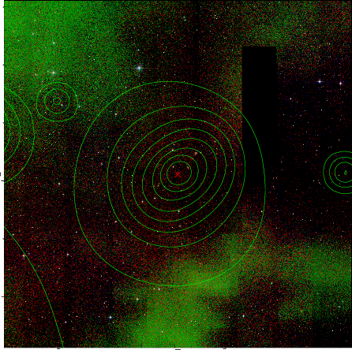  | 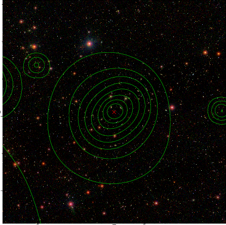  |

