

### 627

|Name|RAJ2000[deg]|DEJ2000[deg] |Ext[arcmin]| Ext,ml | z | z_src| C|GC(XSZ,Delta_z<0.01)| GC(OPT,Delta_z<0.01)|GC| R_sig[arcmin] | R500[arcmin] | R500[Mpc]| CRsig[c/s] | CR500[c/s] |L500[1E44 erg/s]|F500[1E-12 erg/s/cm^2]| M500[1E14 Msun]|Tx[keV]|Cnt_sig|Beta|Rc[arcmin]|Comment|Alias|
|---|---|---|---|---|---|------|---|--------|---------|----------|---|---|---|---|---|---|---|---|---|---|---|---|---|---|
|627| 240.152| 33.240| 3.43| 110.13| 0.0853(0.006)| z1, z_xsz| B| F20, MCXC, SPI| A, RM, W| A, C, F20, MCXC, N, SPI, W| 10.750| 9.114| 0.875| 0.251(0.039)| 0.245(0.038)| 0.819(0.062)| 4.529(0.343)| 2.07(0.08)| 3.44(0.08)| 124.8| 0.966(-0.050+0.025)| 6.975(-0.417+0.373)| -| k419|

|[RASS image](../image/627/627_img.pdf)|[filtered image](../image/627/627_fil.pdf)|[Segment image](../image/627/627_seg.pdf)|
|-------------------|--------------------|-------------------|
| 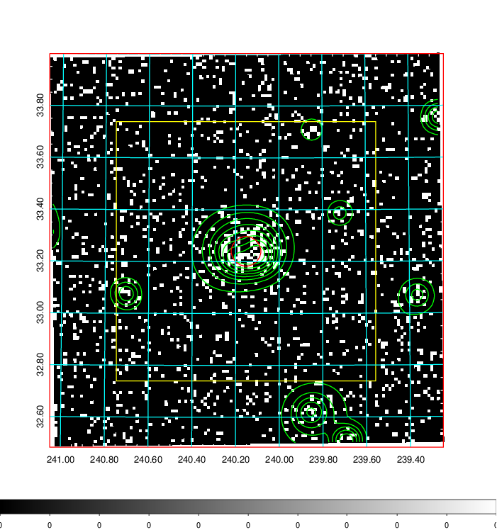  | 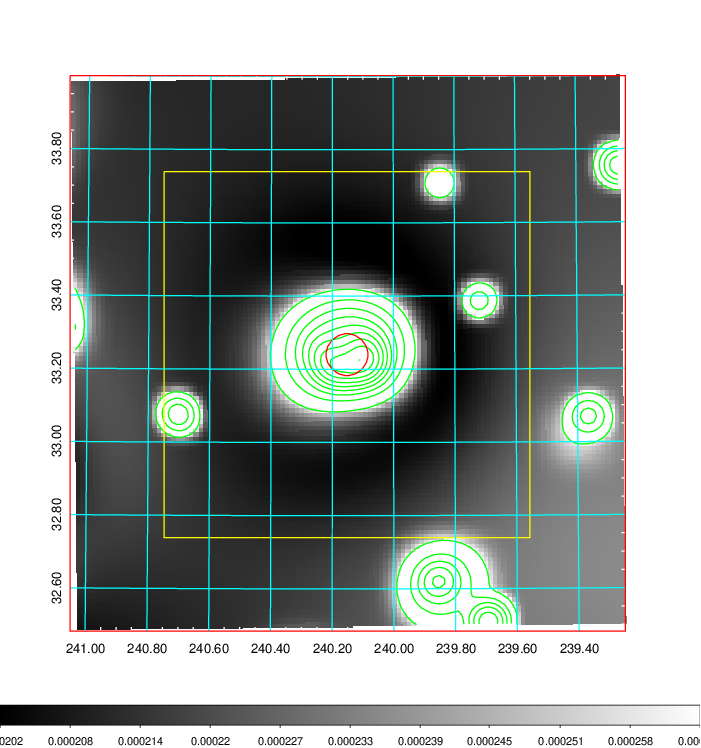   | 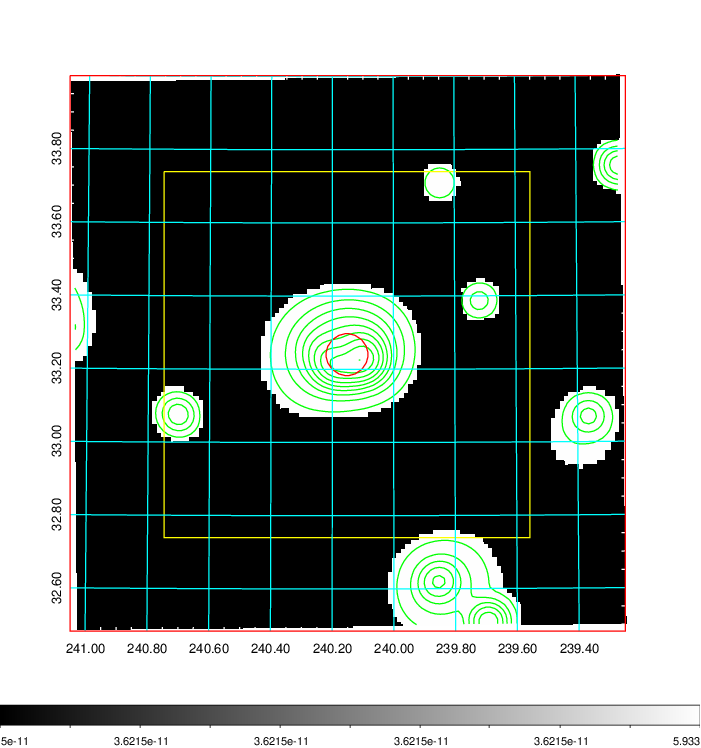  |

|[Exposure image](../image/627/627_mex.pdf)| [nH image](../image/627/627_nh.pdf)| [Planck image](../image/627/627_p.pdf)|
|-------------------|--------------------|-------------------|
|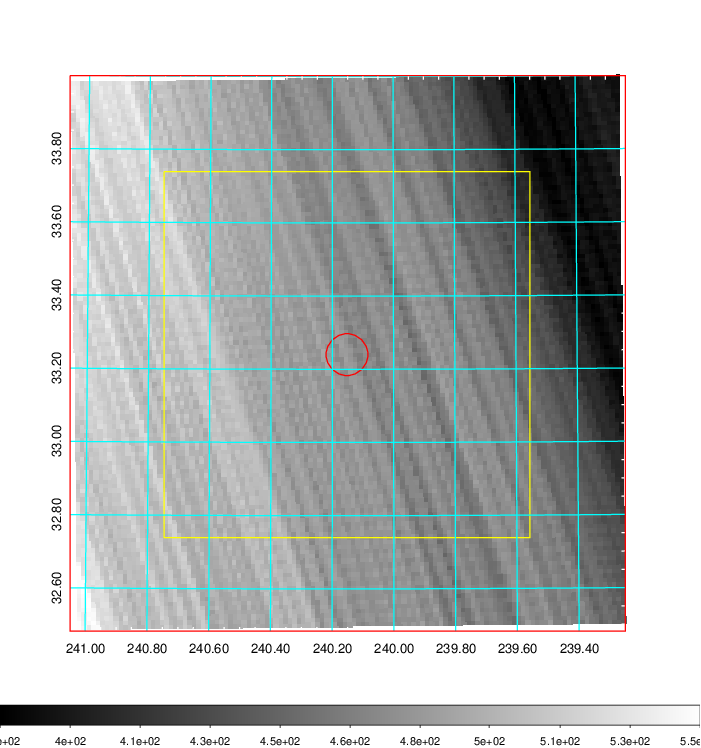   | 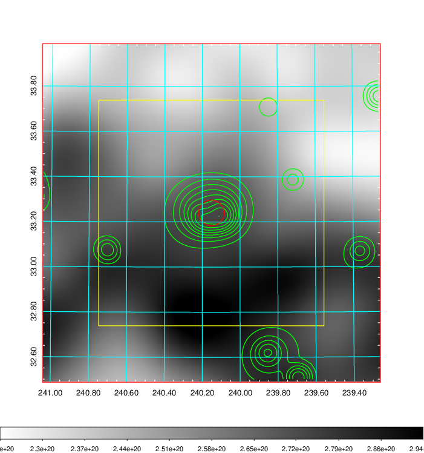    | 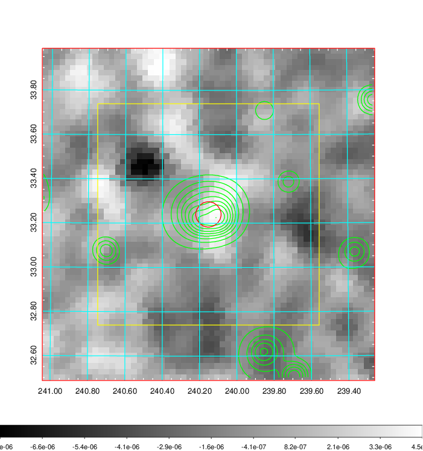 |

|[Redshift Histogram](../image/627/627_zg.pdf) | [DSS image(z1)](../image/627/627_dss_z1.pdf)      |  [DSS image(z2)](../image/627/627_dss_z2.pdf)    |
|-------------------|--------------------|-------------------|
|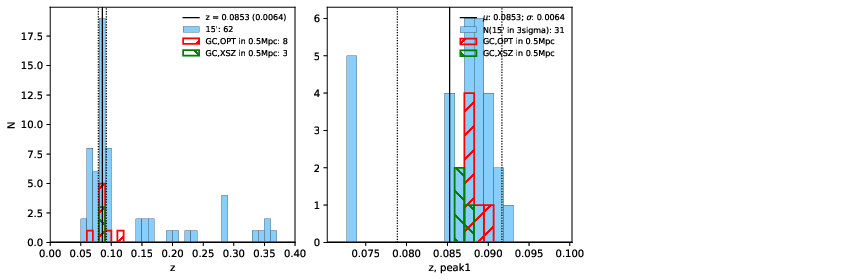 |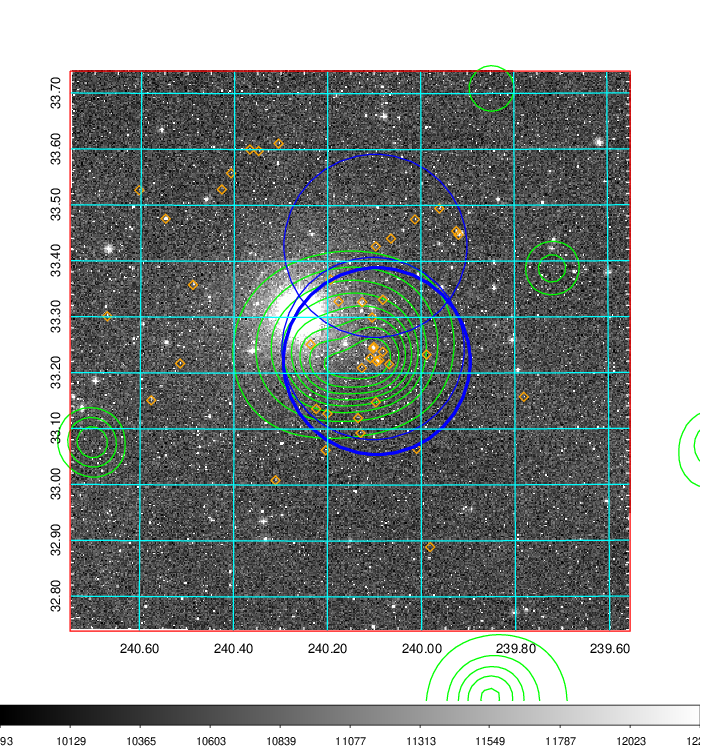  Blue circle for optical clusters;  Magenta circle for XSZ clusters;  all with r=1Mpc;  Only GC with Delta_z<0.01 are shown. | 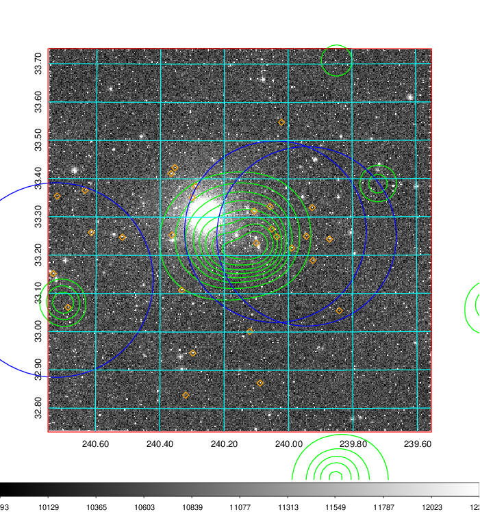 Blue circle for optical clusters;  Magenta circle for XSZ clusters;  all with r=1Mpc;  Only GC with Delta_z<0.01 are shown.  |

|[known Abell/XSZ clusters](../image/627/627_gc.pdf) | [2MASS image](../image/627/627_2mass.pdf)      |[SDSS image](../image/627/627_sdss.pdf)   |
|-------------------|-------------------|-------------------|
|  Magenta, blue and green circles  for optical, X-ray and SZ clusters  respectively, with redshift of clusters  labelled. The radius of circles  are 1Mpc.|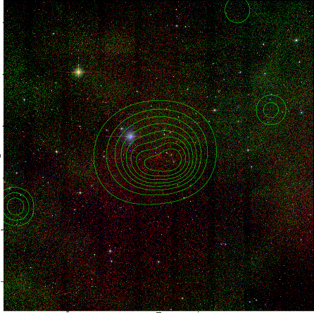  | 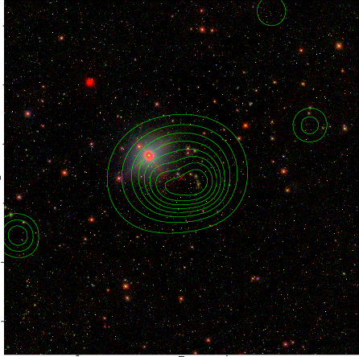  |

