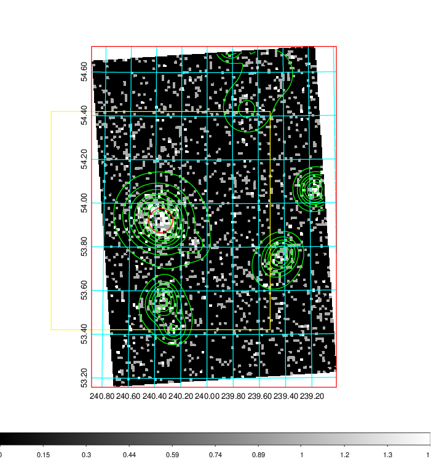
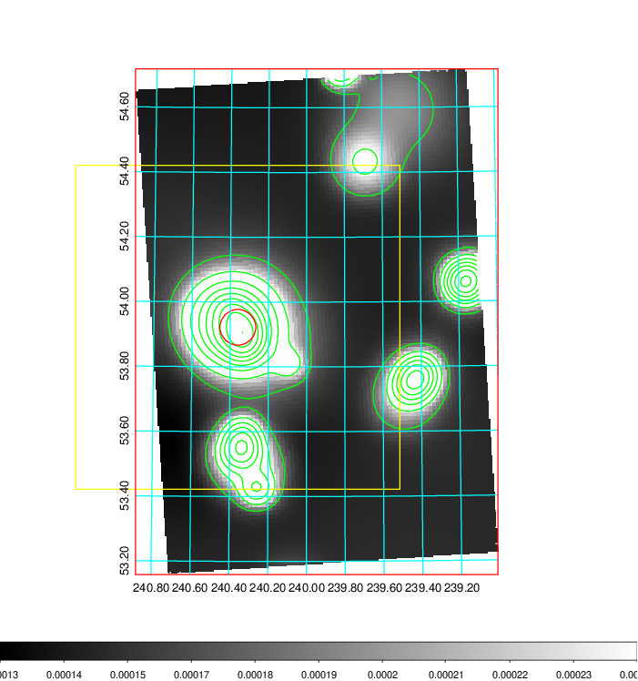
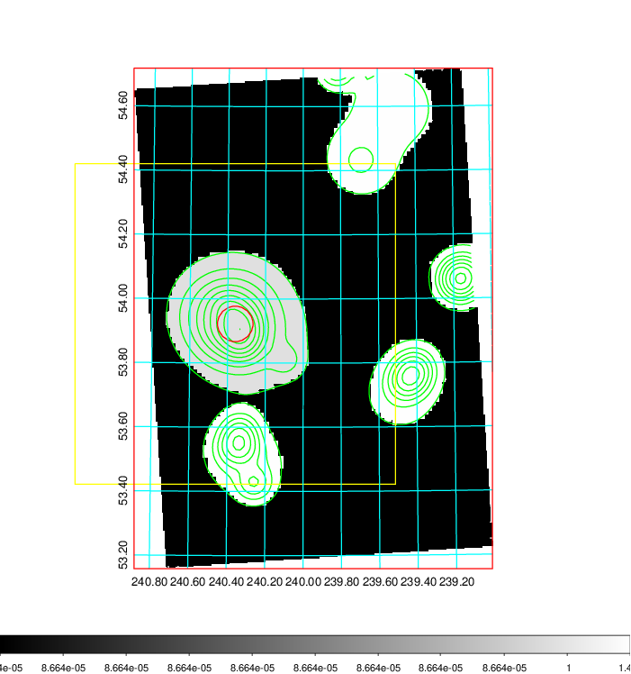
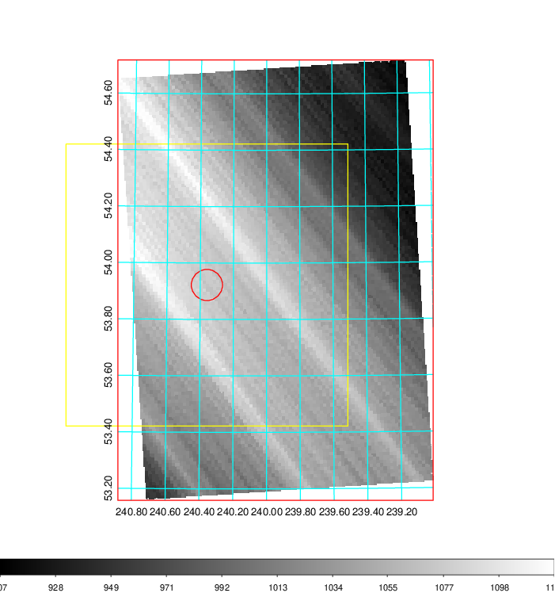
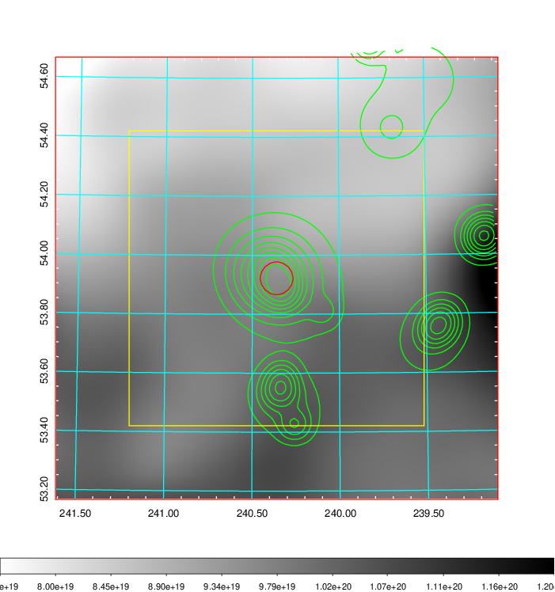
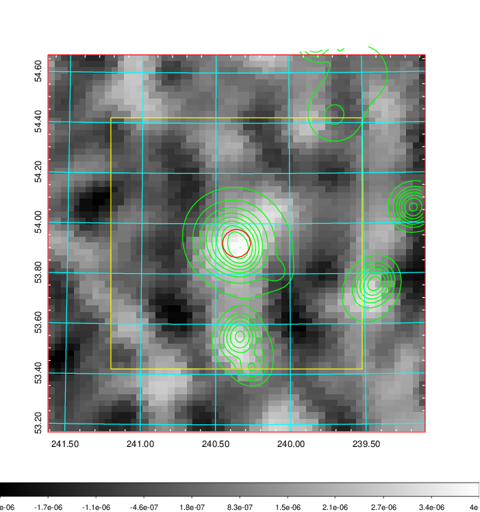
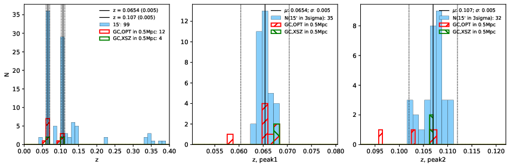
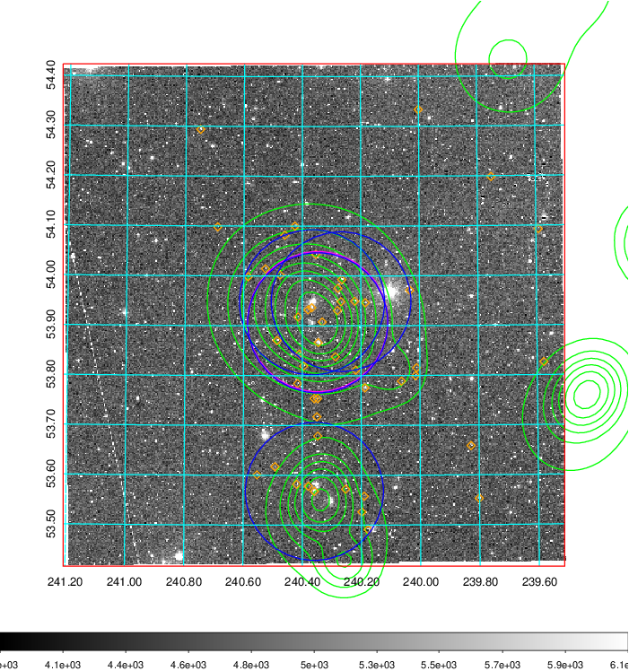
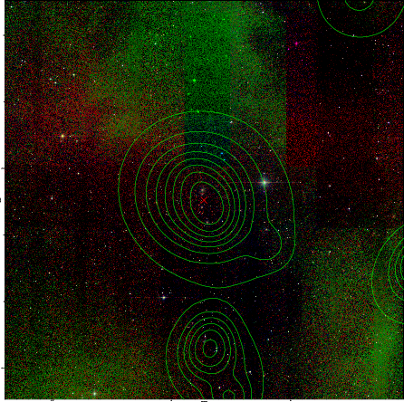
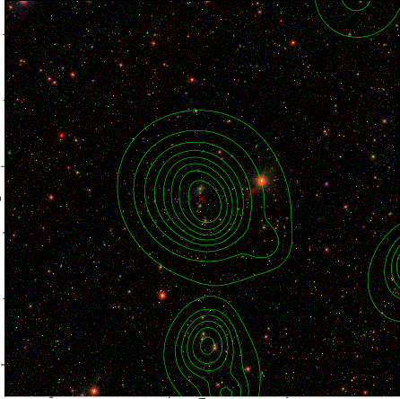

### 628

|Name|RAJ2000[deg]|DEJ2000[deg] |Ext[arcmin]| Ext,ml | z | z_src| C|GC(XSZ,Delta_z<0.01)| GC(OPT,Delta_z<0.01)|GC| R_sig[arcmin] | R500[arcmin] | R500[Mpc]| CRsig[c/s] | CR500[c/s] |L500[1E44 erg/s]|F500[1E-12 erg/s/cm^2]| M500[1E14 Msun]|Tx[keV]|Cnt_sig|Beta|Rc[arcmin]|Comment|Alias|
|---|---|---|---|---|---|------|---|--------|---------|----------|---|---|---|---|---|---|---|---|---|---|---|---|---|---|
|628| 240.360| 53.922| 3.32| 229.99| 0.0654(0.005)| z1, z_xsz| B| L03| A, N, W| A, C, F20, L03, MCXC, N, SPI, Tar, W| 13.188| 10.281| 0.775| 0.241(0.022)| 0.232(0.021)| 0.476(0.029)| 4.602(0.276)| 1.41(0.04)| 2.70(0.05)| 266.4| 0.955(-0.061+0.034)| 6.154(-0.441+0.330)| -| k406|

|[RASS image](../image/628/628_img.pdf)|[filtered image](../image/628/628_fil.pdf)|[Segment image](../image/628/628_seg.pdf)|
|-------------------|--------------------|-------------------|
|   |    |   |

|[Exposure image](../image/628/628_mex.pdf)| [nH image](../image/628/628_nh.pdf)| [Planck image](../image/628/628_p.pdf)|
|-------------------|--------------------|-------------------|
|   |     |  |

|[Redshift Histogram](../image/628/628_zg.pdf) | [DSS image(z1)](../image/628/628_dss_z1.pdf)      |  [DSS image(z2)](../image/628/628_dss_z2.pdf)    |
|-------------------|--------------------|-------------------|
| |  Blue circle for optical clusters;  Magenta circle for XSZ clusters;  all with r=1Mpc;  Only GC with Delta_z<0.01 are shown. |  Blue circle for optical clusters;  Magenta circle for XSZ clusters;  all with r=1Mpc;  Only GC with Delta_z<0.01 are shown.  |

|[Previous-identified clusters](../image/628/628_gc.pdf) | [2MASS image](../image/628/628_2mass.pdf)      |[SDSS image](../image/628/628_sdss.pdf)   |
|-------------------|-------------------|-------------------|
|  Green, magenta, and blue circles  for optical, X-ray and SZ clusters  respectively, with redshift of clusters  labelled. The radius of circles  are 1Mpc.|  |   |

