

### 629

|Name|RAJ2000[deg]|DEJ2000[deg] |Ext[arcmin]| Ext,ml | z | z_src| C|GC(XSZ,Delta_z<0.01)| GC(OPT,Delta_z<0.01)|GC| R_sig[arcmin] | R500[arcmin] | R500[Mpc]| CRsig[c/s] | CR500[c/s] |L500[1E44 erg/s]|F500[1E-12 erg/s/cm^2]| M500[1E14 Msun]|Tx[keV]|Cnt_sig|Beta|Rc[arcmin]|Comment|Alias|
|---|---|---|---|---|---|------|---|--------|---------|----------|---|---|---|---|---|---|---|---|---|---|---|---|---|---|
|629| 240.583| 16.030| 10.75| 2238.39| 0.0365(0.005)| z1, z_xsz| B| L03, MCXC, PSZ2, Tar, XB| A, N| A, C, F20, L03, MCXC, N, PSZ2, Tar, W, XB| 36.640| 23.058| 1.003| 2.560(0.119)| 2.412(0.113)| 1.407(0.032)| 45.540(1.035)| 2.97(0.03)| 4.24(0.03)| 1774.9| 0.995(-0.009+0.004)| 16.370(-0.191+0.169)| -| k571|

|[RASS image](../image/629/629_img.pdf)|[filtered image](../image/629/629_fil.pdf)|[Segment image](../image/629/629_seg.pdf)|
|-------------------|--------------------|-------------------|
| 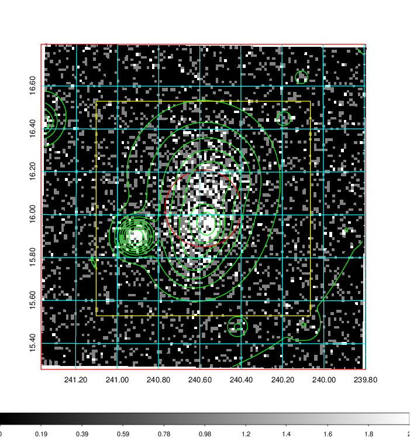  | 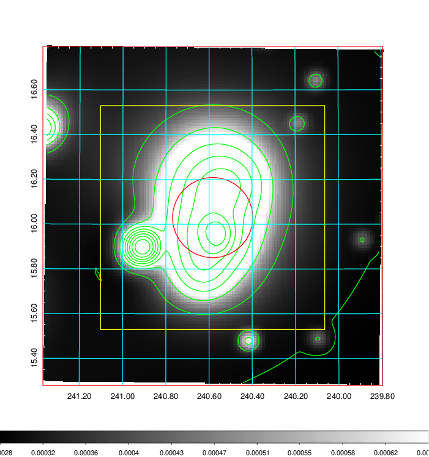   | 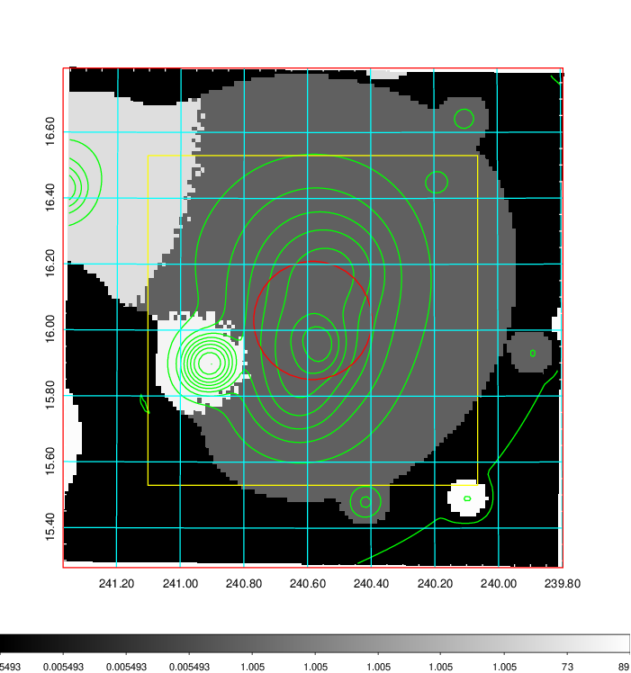  |

|[Exposure image](../image/629/629_mex.pdf)| [nH image](../image/629/629_nh.pdf)| [Planck image](../image/629/629_p.pdf)|
|-------------------|--------------------|-------------------|
|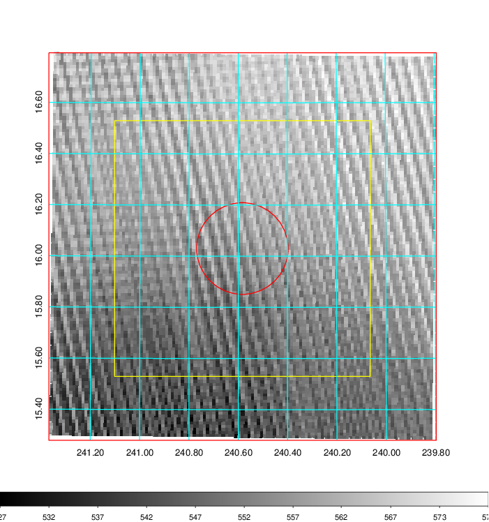   | 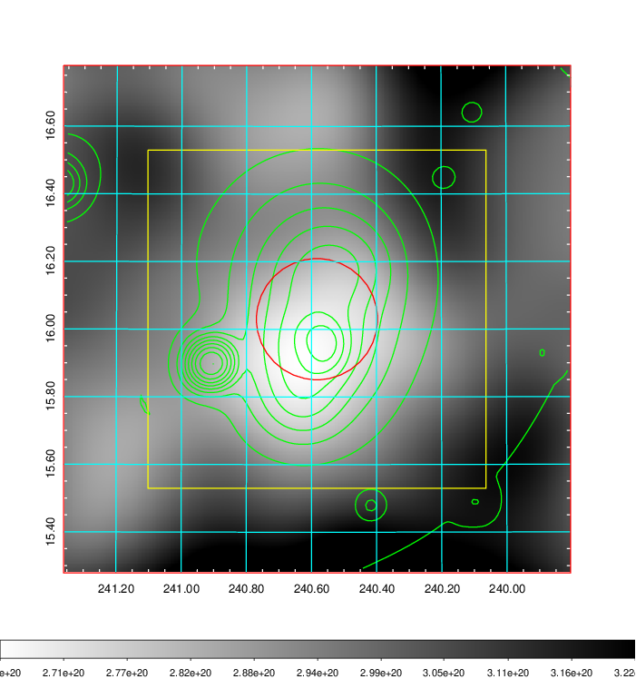    | 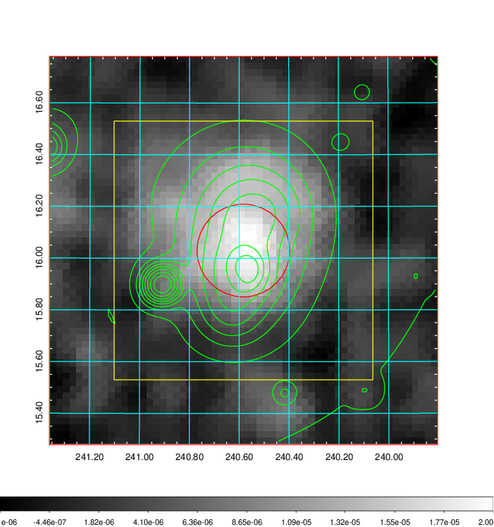 |

|[Redshift Histogram](../image/629/629_zg.pdf) | [DSS image(z1)](../image/629/629_dss_z1.pdf)      |  [DSS image(z2)](../image/629/629_dss_z2.pdf)    |
|-------------------|--------------------|-------------------|
|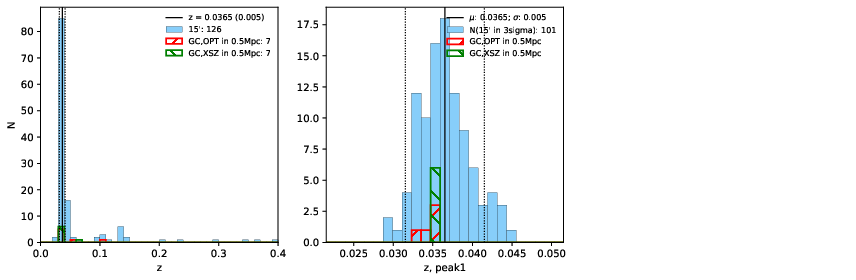 |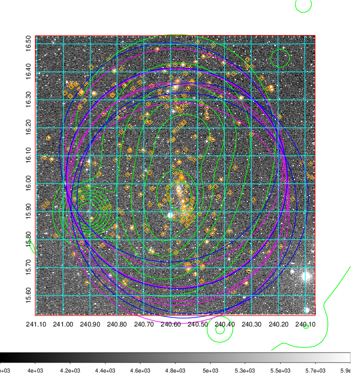  Blue circle for optical clusters;  Magenta circle for XSZ clusters;  all with r=1Mpc;  Only GC with Delta_z<0.01 are shown. | 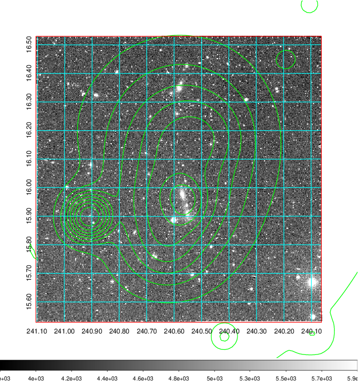 Blue circle for optical clusters;  Magenta circle for XSZ clusters;  all with r=1Mpc;  Only GC with Delta_z<0.01 are shown.  |

|[known Abell/XSZ clusters](../image/629/629_gc.pdf) | [2MASS image](../image/629/629_2mass.pdf)      |[SDSS image](../image/629/629_sdss.pdf)   |
|-------------------|-------------------|-------------------|
|  Magenta, blue and green circles  for optical, X-ray and SZ clusters  respectively, with redshift of clusters  labelled. The radius of circles  are 1Mpc.|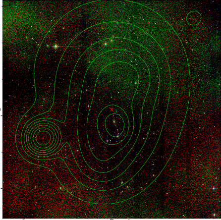  | 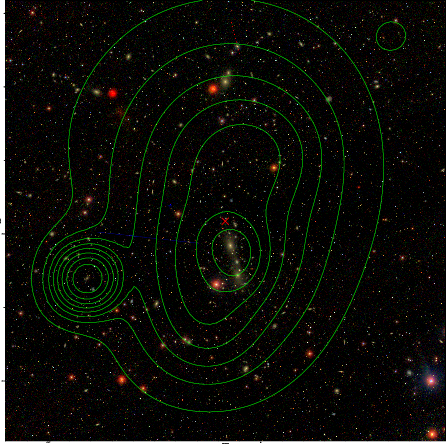  |

