

### 63

|Name|RAJ2000[deg]|DEJ2000[deg] |Ext[arcmin]| Ext,ml | z | z_src| C|GC(XSZ,Delta_z<0.01)| GC(OPT,Delta_z<0.01)|GC| R_sig[arcmin] | R500[arcmin] | R500[Mpc]| CRsig[c/s] | CR500[c/s] |L500[1E44 erg/s]|F500[1E-12 erg/s/cm^2]| M500[1E14 Msun]|Tx[keV]|Cnt_sig|Beta|Rc[arcmin]|Comment|Alias|
|---|---|---|---|---|---|------|---|--------|---------|----------|---|---|---|---|---|---|---|---|---|---|---|---|---|---|
|63| 18.778| 0.336| 6.10| 298.24| 0.0451(0.005)| z1, z_xsz| B| L03, MCXC, PSZ2, Tar, XB| A, N, W| A, C, F20, L03, MCXC, N, PSZ2, SPI, Tar, W, XB| 44.560| 15.758| 0.838| 0.741(0.085)| 0.670(0.077)| 0.589(0.048)| 12.341(1.014)| 1.75(0.07)| 3.07(0.08)| 382.7| 0.641(-0.028+0.032)| 6.918(-0.597+0.657)| -| k544|

|[RASS image](../image/63/63_img.pdf)|[filtered image](../image/63/63_fil.pdf)|[Segment image](../image/63/63_seg.pdf)|
|-------------------|--------------------|-------------------|
| 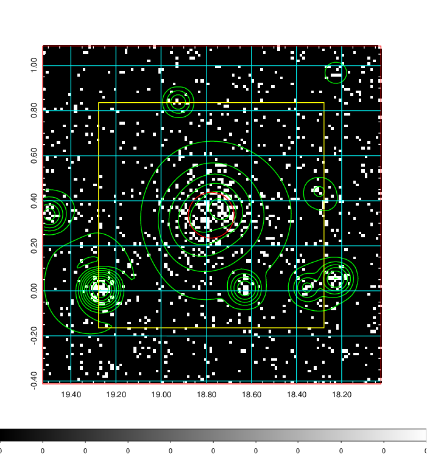  | 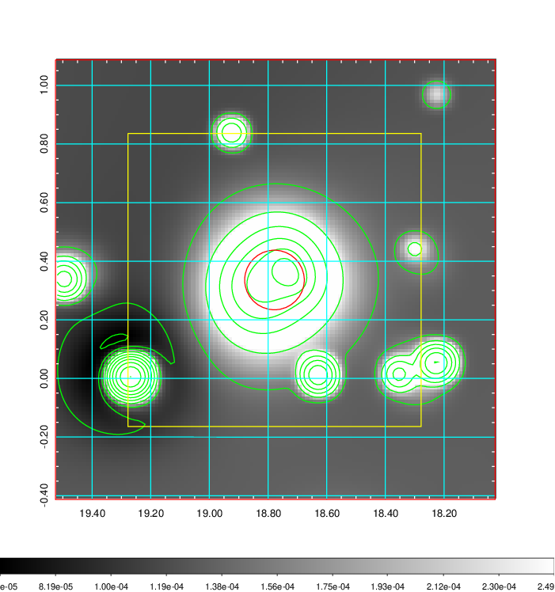   | 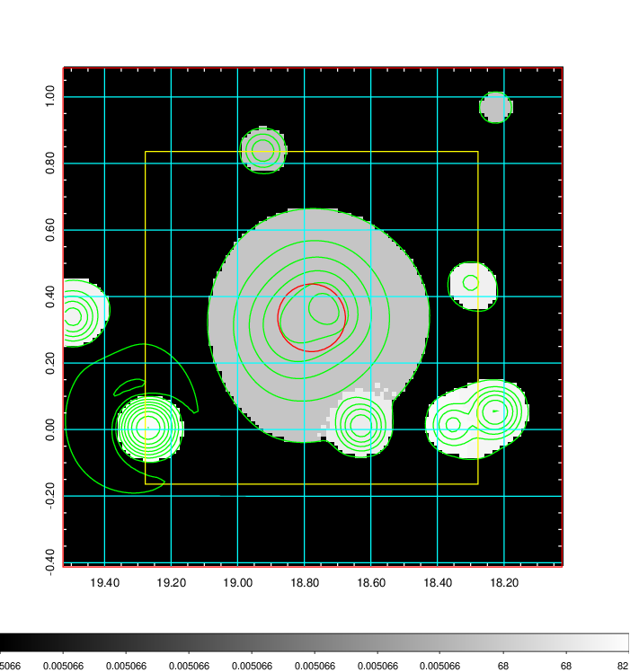  |

|[Exposure image](../image/63/63_mex.pdf)| [nH image](../image/63/63_nh.pdf)| [Planck image](../image/63/63_p.pdf)|
|-------------------|--------------------|-------------------|
|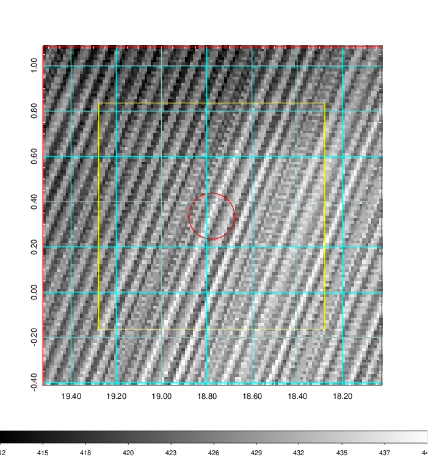   | 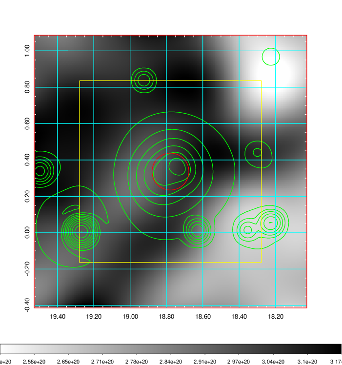    | 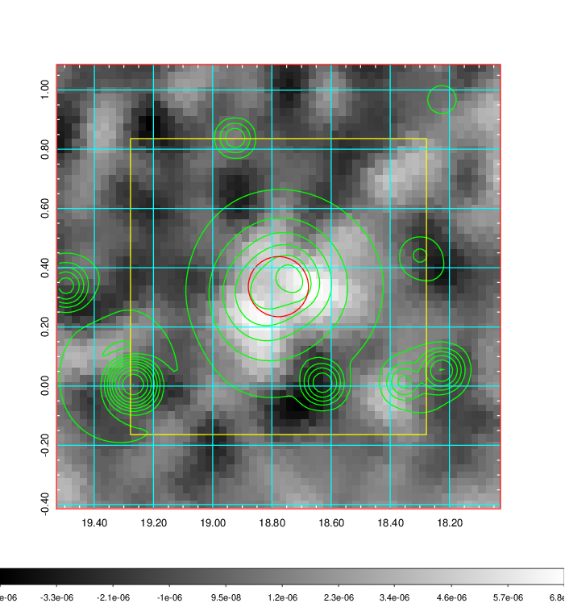 |

|[Redshift Histogram](../image/63/63_zg.pdf) | [DSS image(z1)](../image/63/63_dss_z1.pdf)      |  [DSS image(z2)](../image/63/63_dss_z2.pdf)    |
|-------------------|--------------------|-------------------|
|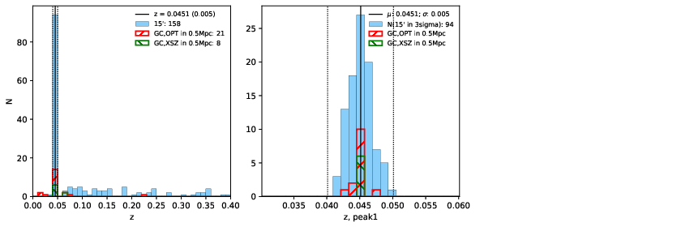 |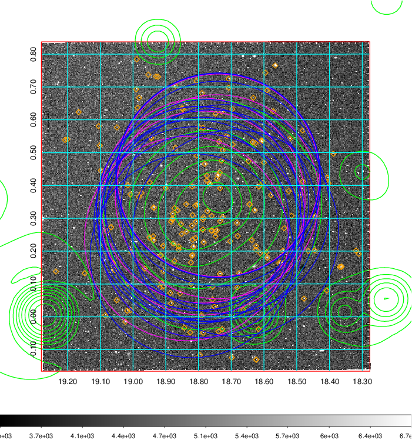  Blue circle for optical clusters;  Magenta circle for XSZ clusters;  all with r=1Mpc;  Only GC with Delta_z<0.01 are shown. | 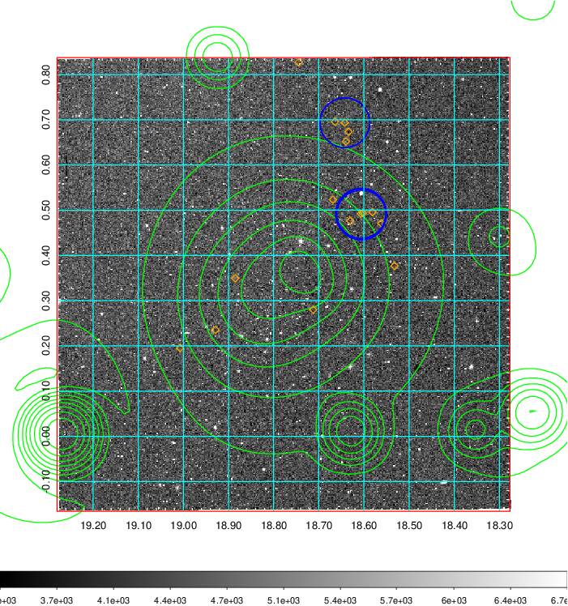 Blue circle for optical clusters;  Magenta circle for XSZ clusters;  all with r=1Mpc;  Only GC with Delta_z<0.01 are shown.  |

|[Previous-identified clusters](../image/63/63_gc.pdf) | [2MASS image](../image/63/63_2mass.pdf)      |[SDSS image](../image/63/63_sdss.pdf)   |
|-------------------|-------------------|-------------------|
|  Green, magenta, and blue circles  for optical, X-ray and SZ clusters  respectively, with redshift of clusters  labelled. The radius of circles  are 1Mpc.|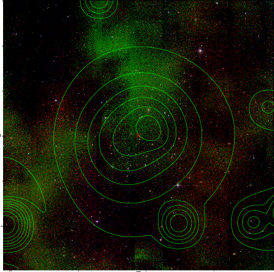  | 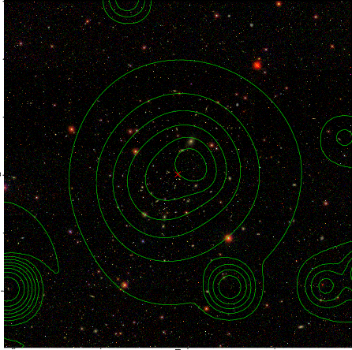  |

|[DES image](../image/63/63_des.pdf)   |
|-------------------|
| 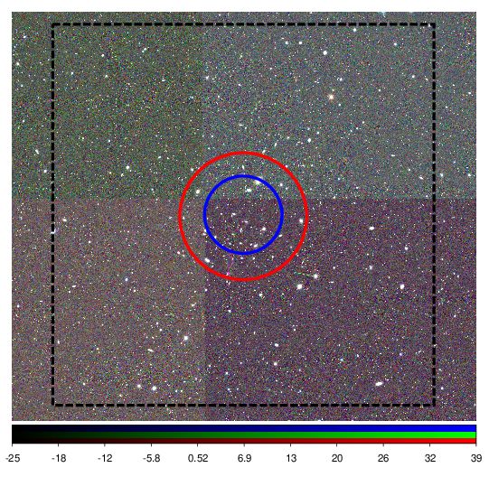  |
