

### 630

|Name|RAJ2000[deg]|DEJ2000[deg] |Ext[arcmin]| Ext,ml | z | z_src| C|GC(XSZ,Delta_z<0.01)| GC(OPT,Delta_z<0.01)|GC| R_sig[arcmin] | R500[arcmin] | R500[Mpc]| CRsig[c/s] | CR500[c/s] |L500[1E44 erg/s]|F500[1E-12 erg/s/cm^2]| M500[1E14 Msun]|Tx[keV]|Cnt_sig|Beta|Rc[arcmin]|Comment|Alias|
|---|---|---|---|---|---|------|---|--------|---------|----------|---|---|---|---|---|---|---|---|---|---|---|---|---|---|
|630| 241.211| 17.732| 3.36| 323.21| 0.0352(0.005)| z1, z_xsz| B| L03, MCXC, XB| A, N| A, C, F20, L03, MCXC, N, W, XB| 14.650| 18.533| 0.779| 0.728(0.048)| 0.762(0.050)| 0.394(0.015)| 13.726(0.511)| 1.39(0.03)| 2.65(0.03)| 459.9| 0.941(-0.074+0.043)| 9.691(-0.733+0.496)| -| k413|

|[RASS image](../image/630/630_img.pdf)|[filtered image](../image/630/630_fil.pdf)|[Segment image](../image/630/630_seg.pdf)|
|-------------------|--------------------|-------------------|
| 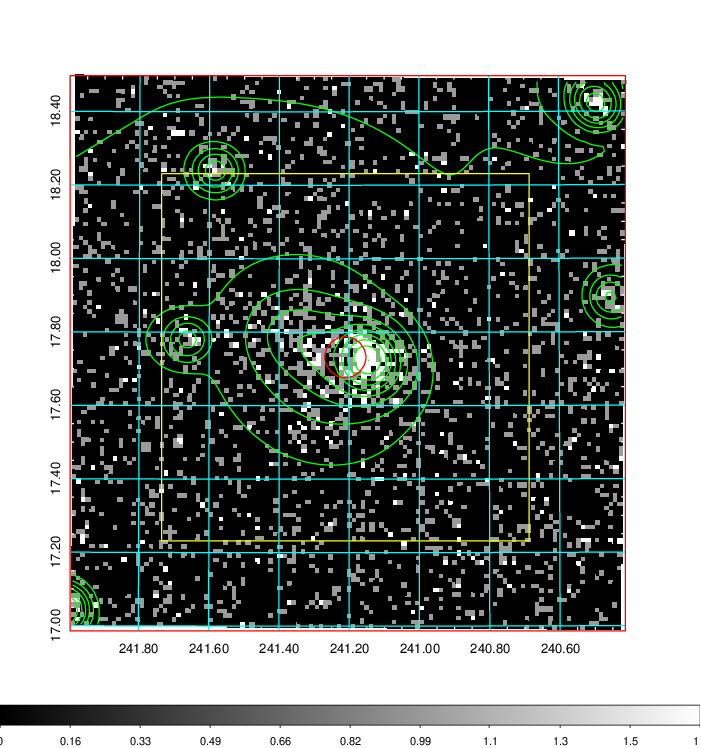  | 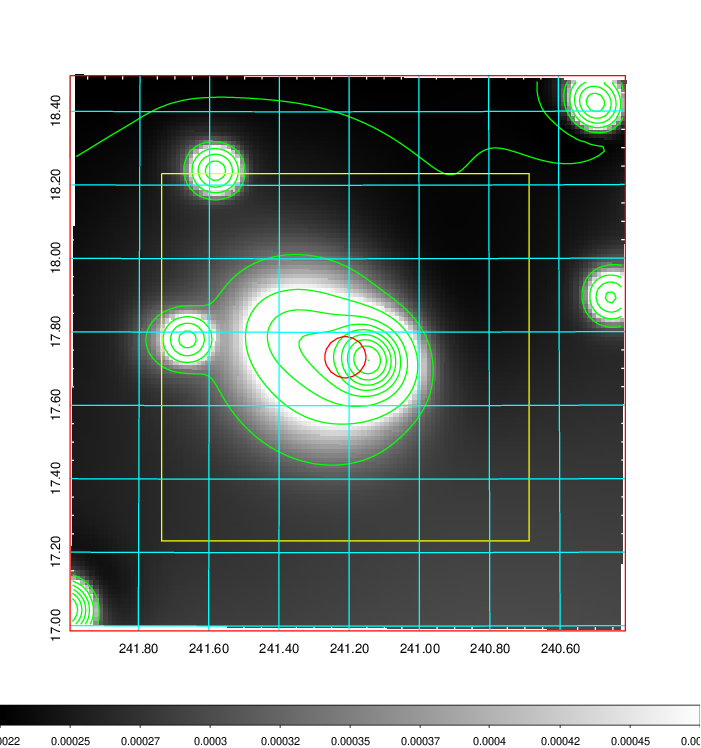   | 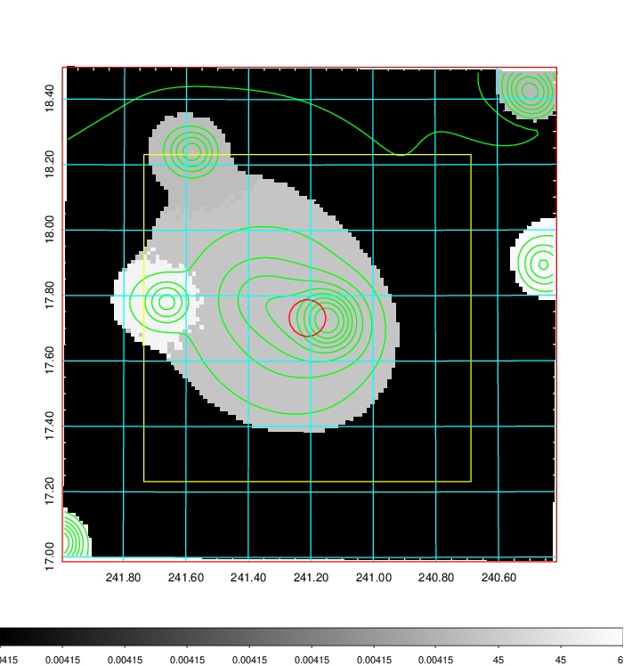  |

|[Exposure image](../image/630/630_mex.pdf)| [nH image](../image/630/630_nh.pdf)| [Planck image](../image/630/630_p.pdf)|
|-------------------|--------------------|-------------------|
|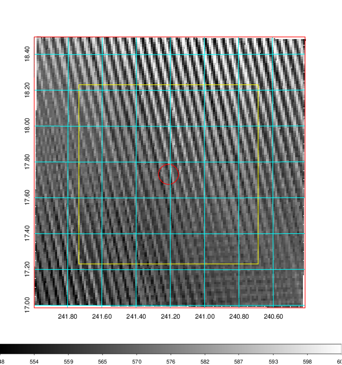   | 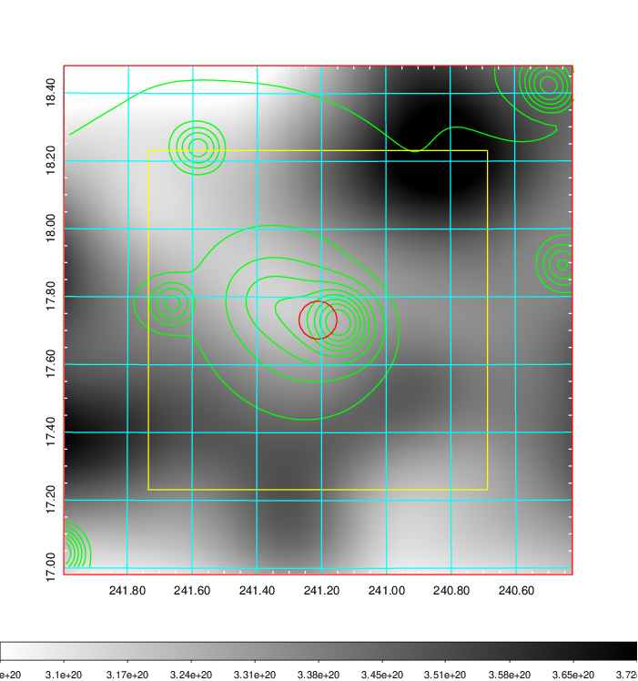    | 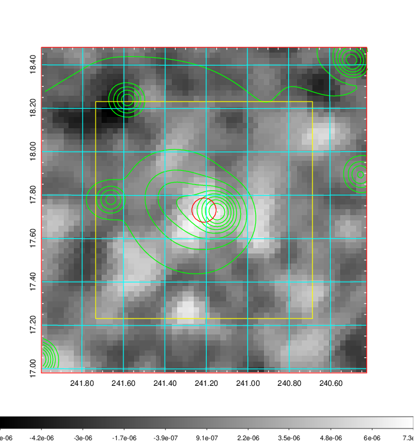 |

|[Redshift Histogram](../image/630/630_zg.pdf) | [DSS image(z1)](../image/630/630_dss_z1.pdf)      |  [DSS image(z2)](../image/630/630_dss_z2.pdf)    |
|-------------------|--------------------|-------------------|
|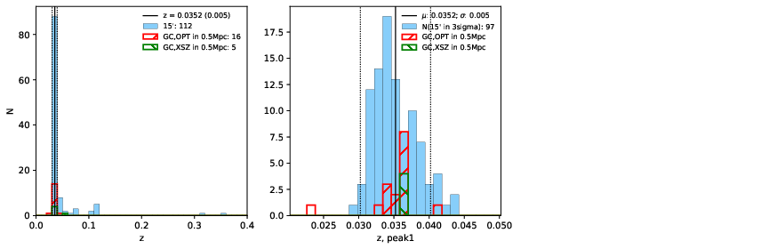 |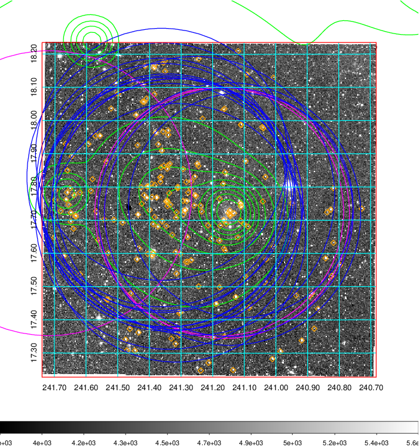  Blue circle for optical clusters;  Magenta circle for XSZ clusters;  all with r=1Mpc;  Only GC with Delta_z<0.01 are shown. | 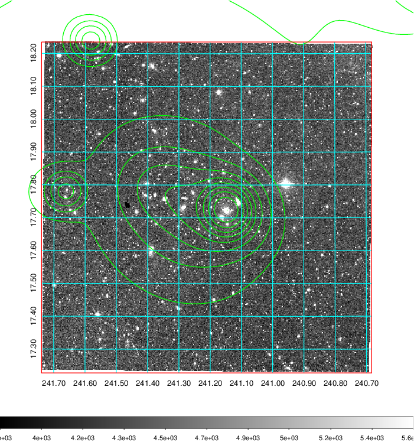 Blue circle for optical clusters;  Magenta circle for XSZ clusters;  all with r=1Mpc;  Only GC with Delta_z<0.01 are shown.  |

|[Previous-identified clusters](../image/630/630_gc.pdf) | [2MASS image](../image/630/630_2mass.pdf)      |[SDSS image](../image/630/630_sdss.pdf)   |
|-------------------|-------------------|-------------------|
|  Green, magenta, and blue circles  for optical, X-ray and SZ clusters  respectively, with redshift of clusters  labelled. The radius of circles  are 1Mpc.|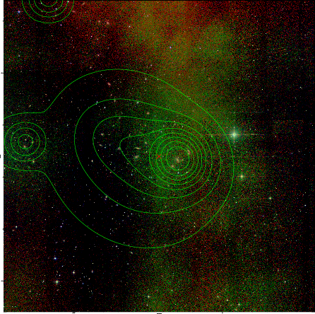  | 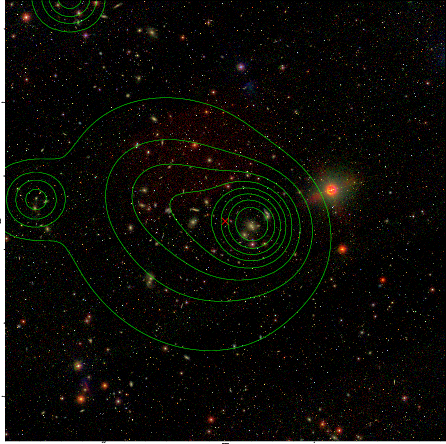  |

