

### 631

|Name|RAJ2000[deg]|DEJ2000[deg] |Ext[arcmin]| Ext,ml | z | z_src| C|GC(XSZ,Delta_z<0.01)| GC(OPT,Delta_z<0.01)|GC| R_sig[arcmin] | R500[arcmin] | R500[Mpc]| CRsig[c/s] | CR500[c/s] |L500[1E44 erg/s]|F500[1E-12 erg/s/cm^2]| M500[1E14 Msun]|Tx[keV]|Cnt_sig|Beta|Rc[arcmin]|Comment|Alias|
|---|---|---|---|---|---|------|---|--------|---------|----------|---|---|---|---|---|---|---|---|---|---|---|---|---|---|
|631| 241.232| 23.933| 2.43| 226.86| 0.0324(0.005)| z1, z_xsz| B| MCXC| N, W| C, F20, MCXC, N, W| 15.625| 17.856| 0.693| 0.475(0.038)| 0.486(0.038)| 0.197(0.008)| 8.141(0.339)| 0.98(0.02)| 2.13(0.03)| 302.3| 0.793(-0.091+0.109)| 4.274(-0.703+0.757)| -| k287|

|[RASS image](../image/631/631_img.pdf)|[filtered image](../image/631/631_fil.pdf)|[Segment image](../image/631/631_seg.pdf)|
|-------------------|--------------------|-------------------|
| 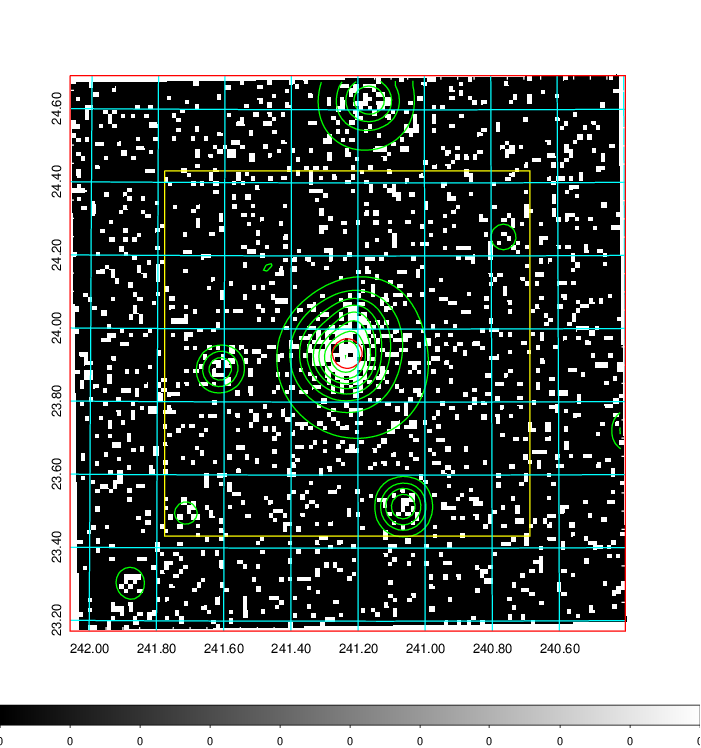  | 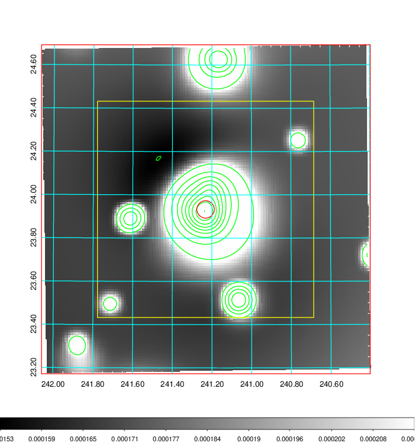   | 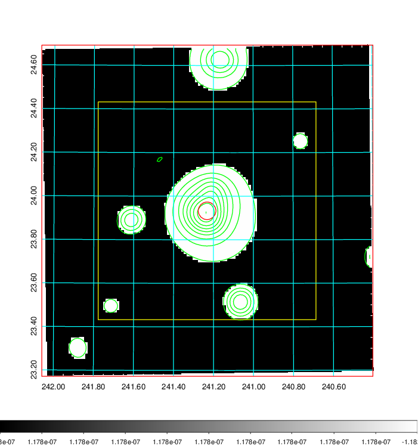  |

|[Exposure image](../image/631/631_mex.pdf)| [nH image](../image/631/631_nh.pdf)| [Planck image](../image/631/631_p.pdf)|
|-------------------|--------------------|-------------------|
|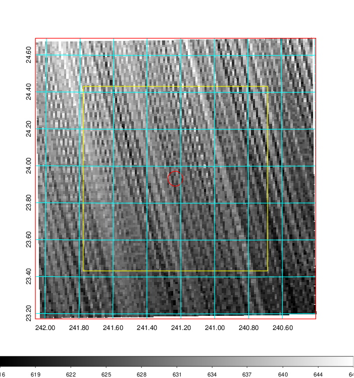   | 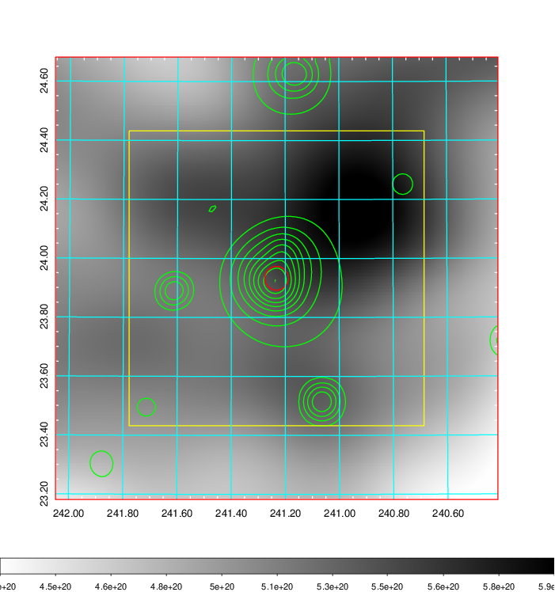    | 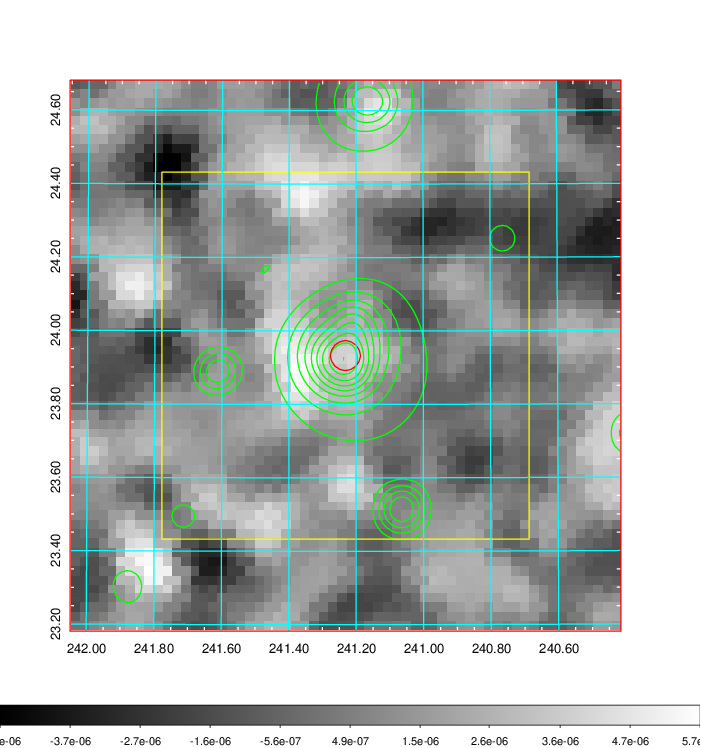 |

|[Redshift Histogram](../image/631/631_zg.pdf) | [DSS image(z1)](../image/631/631_dss_z1.pdf)      |  [DSS image(z2)](../image/631/631_dss_z2.pdf)    |
|-------------------|--------------------|-------------------|
|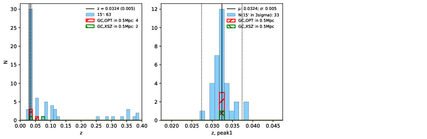 |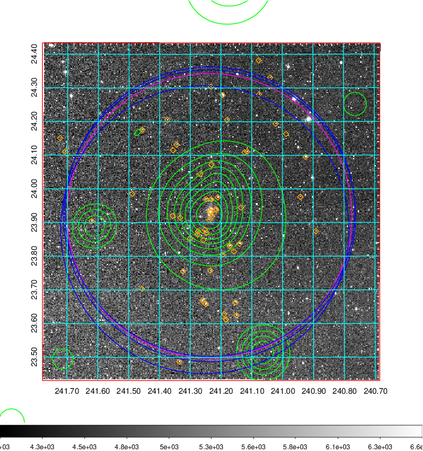  Blue circle for optical clusters;  Magenta circle for XSZ clusters;  all with r=1Mpc;  Only GC with Delta_z<0.01 are shown. | 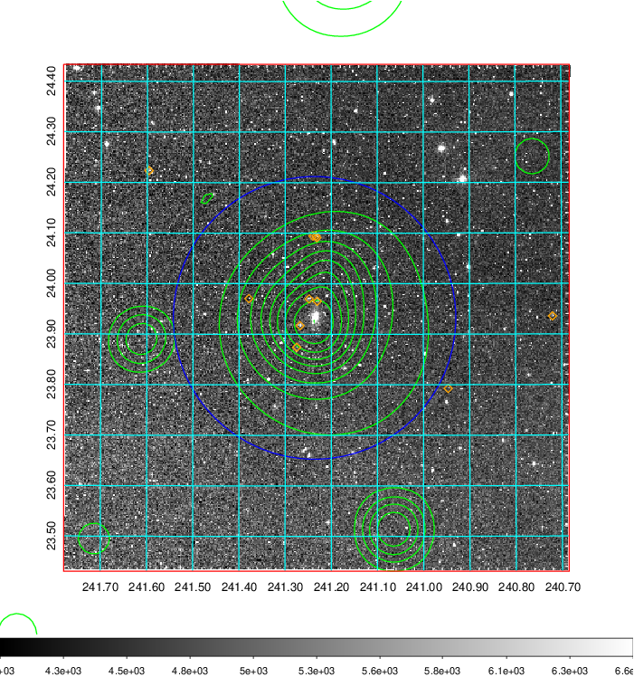 Blue circle for optical clusters;  Magenta circle for XSZ clusters;  all with r=1Mpc;  Only GC with Delta_z<0.01 are shown.  |

|[known Abell/XSZ clusters](../image/631/631_gc.pdf) | [2MASS image](../image/631/631_2mass.pdf)      |[SDSS image](../image/631/631_sdss.pdf)   |
|-------------------|-------------------|-------------------|
|  Magenta, blue and green circles  for optical, X-ray and SZ clusters  respectively, with redshift of clusters  labelled. The radius of circles  are 1Mpc.|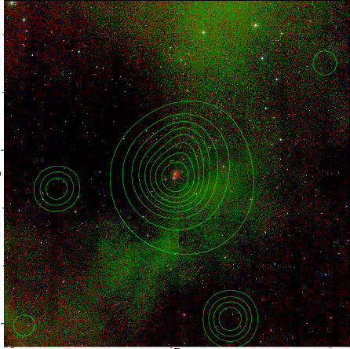  | 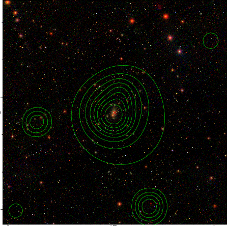  |

