

### 632

|Name|RAJ2000[deg]|DEJ2000[deg] |Ext[arcmin]| Ext,ml | z | z_src| C|GC(XSZ,Delta_z<0.01)| GC(OPT,Delta_z<0.01)|GC| R_sig[arcmin] | R500[arcmin] | R500[Mpc]| CRsig[c/s] | CR500[c/s] |L500[1E44 erg/s]|F500[1E-12 erg/s/cm^2]| M500[1E14 Msun]|Tx[keV]|Cnt_sig|Beta|Rc[arcmin]|Comment|Alias|
|---|---|---|---|---|---|------|---|--------|---------|----------|---|---|---|---|---|---|---|---|---|---|---|---|---|---|
|632| 241.381| 16.441| 2.94| 59.40| 0.0419(0.005)| z1, z_xsz| B| L03, MCXC| A, N| A, C, F20, L03, MCXC, N, W| 8.800| 12.279| 0.609| 0.158(0.038)| 0.170(0.040)| 0.115(0.019)| 2.814(0.471)| 0.67(0.06)| 1.69(0.09)| 98.3| 0.890(-0.116+0.077)| 4.183(-0.704+0.541)| -| k367|

|[RASS image](../image/632/632_img.pdf)|[filtered image](../image/632/632_fil.pdf)|[Segment image](../image/632/632_seg.pdf)|
|-------------------|--------------------|-------------------|
| 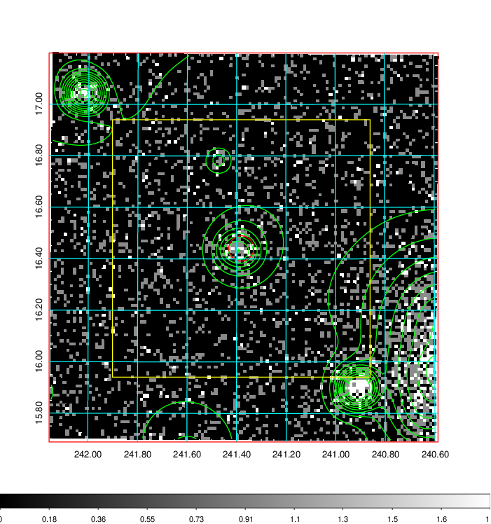  | 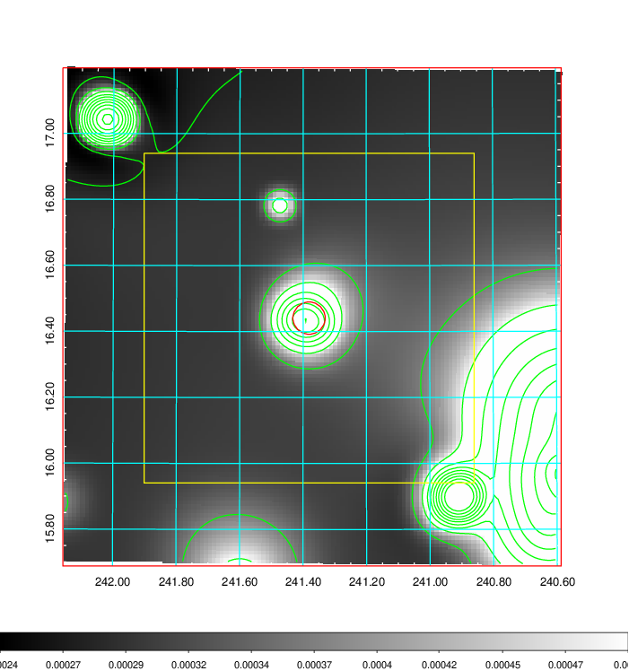   | 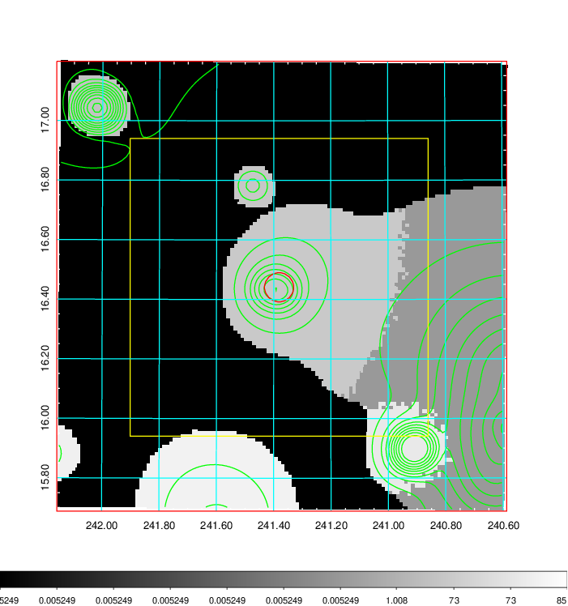  |

|[Exposure image](../image/632/632_mex.pdf)| [nH image](../image/632/632_nh.pdf)| [Planck image](../image/632/632_p.pdf)|
|-------------------|--------------------|-------------------|
|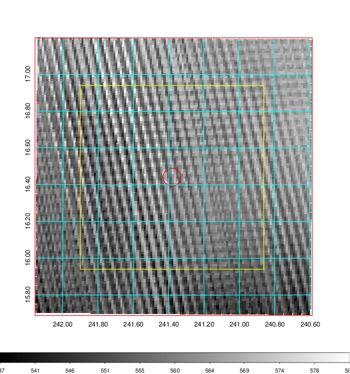   | 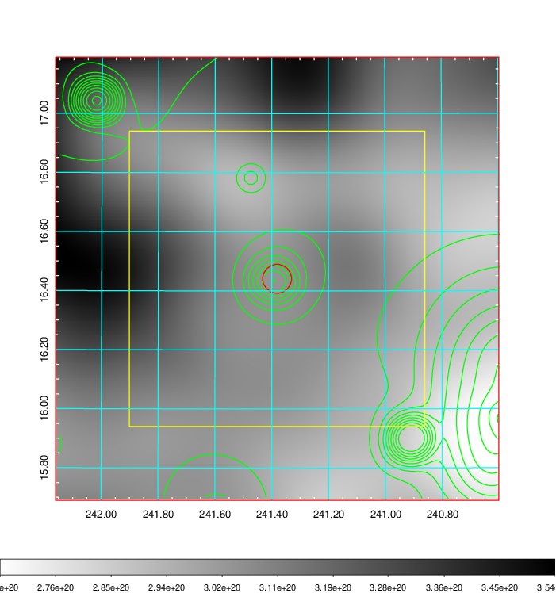    | 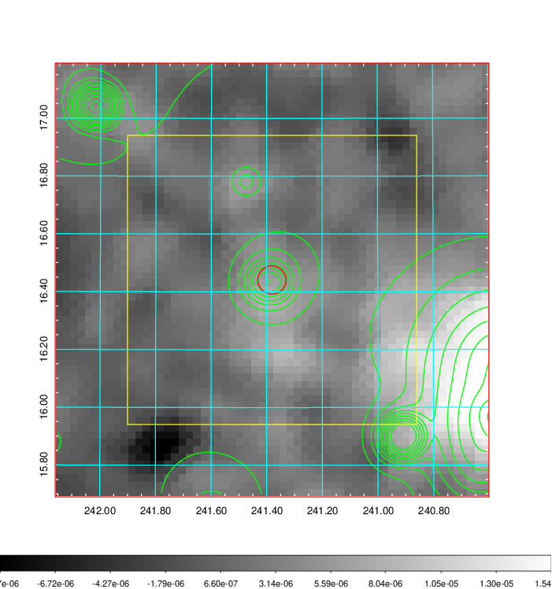 |

|[Redshift Histogram](../image/632/632_zg.pdf) | [DSS image(z1)](../image/632/632_dss_z1.pdf)      |  [DSS image(z2)](../image/632/632_dss_z2.pdf)    |
|-------------------|--------------------|-------------------|
|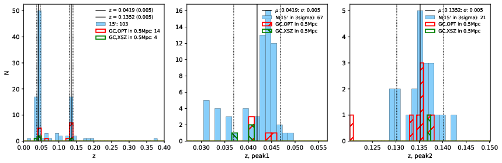 |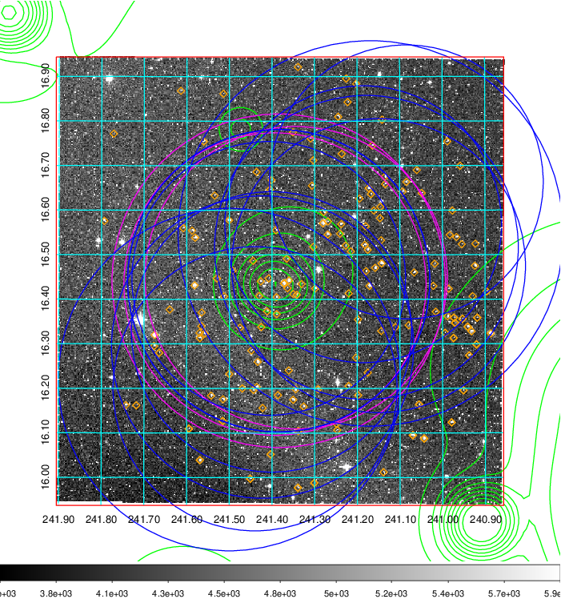  Blue circle for optical clusters;  Magenta circle for XSZ clusters;  all with r=1Mpc;  Only GC with Delta_z<0.01 are shown. | 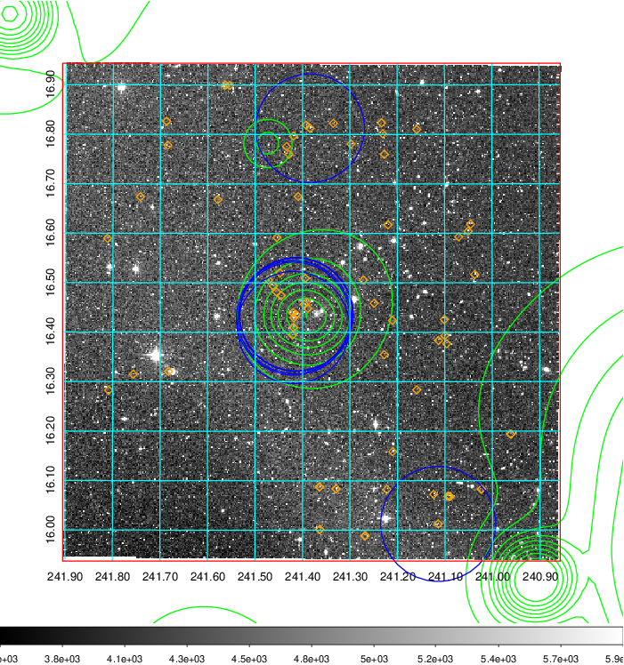 Blue circle for optical clusters;  Magenta circle for XSZ clusters;  all with r=1Mpc;  Only GC with Delta_z<0.01 are shown.  |

|[known Abell/XSZ clusters](../image/632/632_gc.pdf) | [2MASS image](../image/632/632_2mass.pdf)      |[SDSS image](../image/632/632_sdss.pdf)   |
|-------------------|-------------------|-------------------|
|  Magenta, blue and green circles  for optical, X-ray and SZ clusters  respectively, with redshift of clusters  labelled. The radius of circles  are 1Mpc.|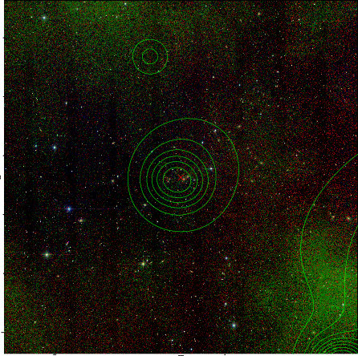  | 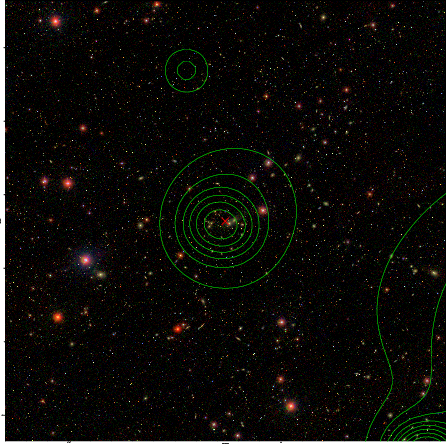  |

