

### 633

|Name|RAJ2000[deg]|DEJ2000[deg] |Ext[arcmin]| Ext,ml | z | z_src| C|GC(XSZ,Delta_z<0.01)| GC(OPT,Delta_z<0.01)|GC| R_sig[arcmin] | R500[arcmin] | R500[Mpc]| CRsig[c/s] | CR500[c/s] |L500[1E44 erg/s]|F500[1E-12 erg/s/cm^2]| M500[1E14 Msun]|Tx[keV]|Cnt_sig|Beta|Rc[arcmin]|Comment|Alias|
|---|---|---|---|---|---|------|---|--------|---------|----------|---|---|---|---|---|---|---|---|---|---|---|---|---|---|
|633| 241.600| 15.670| 13.36| 42.76| 0.0401(0.005)| z1, z_opt| S| -| N| N, W| 17.088| 12.586| 0.599| 0.173(0.039)| 0.166(0.037)| 0.105(0.023)| 2.810(0.606)| 0.63(0.07)| 1.64(0.11)| 120.3| 0.608(-0.082+0.190)| 7.970(-1.341+2.452)| -| t511|

|[RASS image](../image/633/633_img.pdf)|[filtered image](../image/633/633_fil.pdf)|[Segment image](../image/633/633_seg.pdf)|
|-------------------|--------------------|-------------------|
| 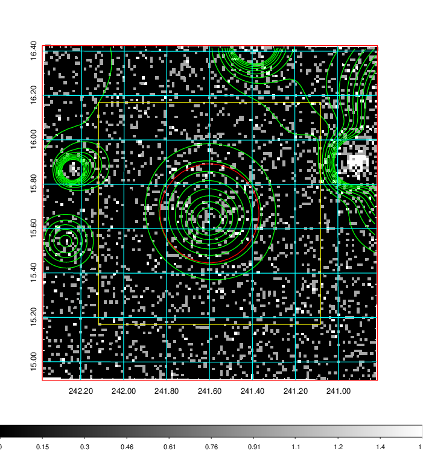  | 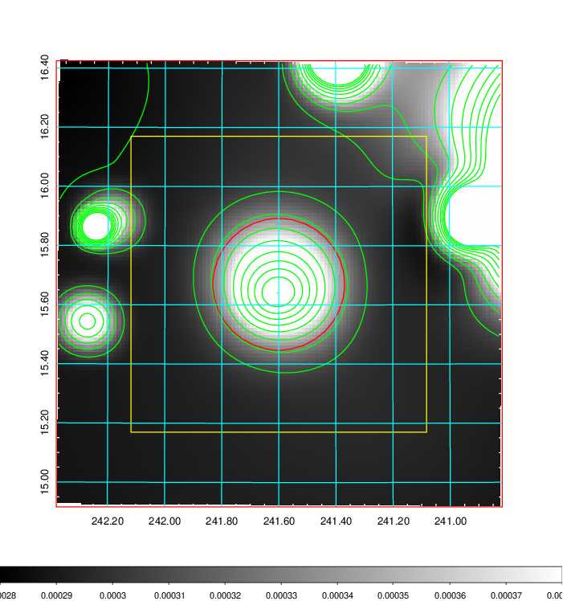   | 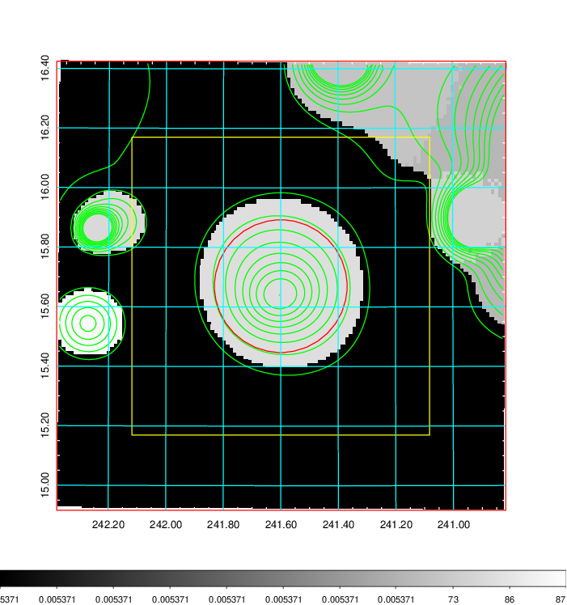  |

|[Exposure image](../image/633/633_mex.pdf)| [nH image](../image/633/633_nh.pdf)| [Planck image](../image/633/633_p.pdf)|
|-------------------|--------------------|-------------------|
|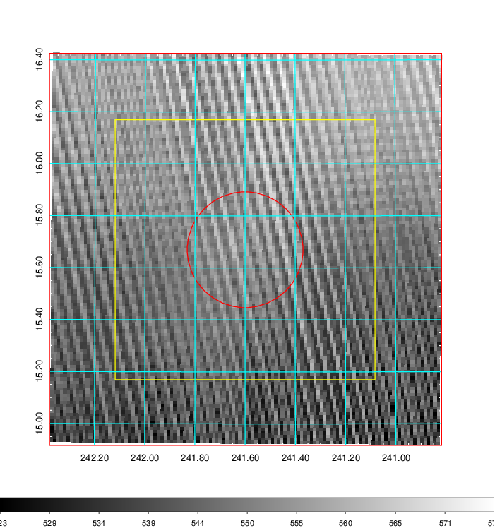   | 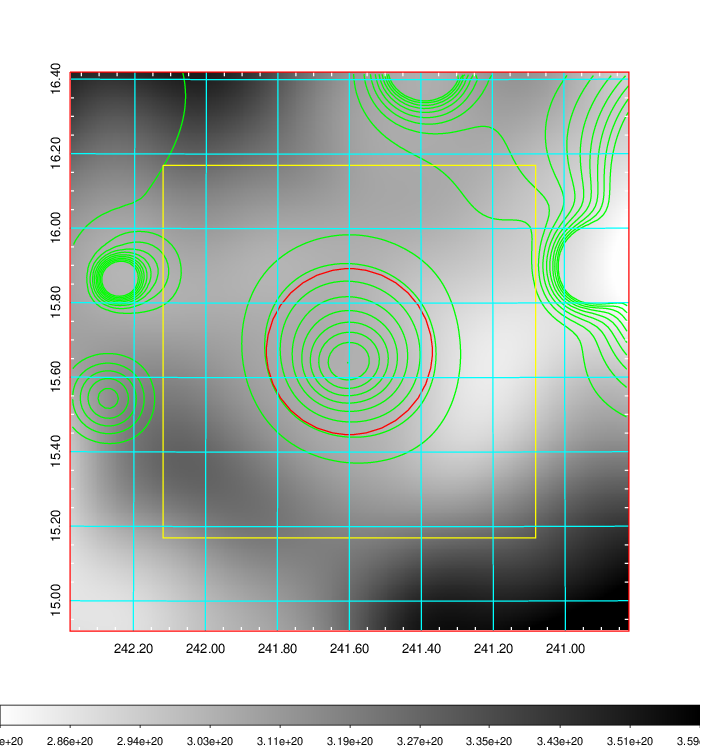    | 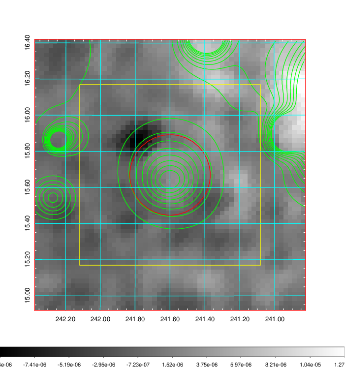 |

|[Redshift Histogram](../image/633/633_zg.pdf) | [DSS image(z1)](../image/633/633_dss_z1.pdf)      |  [DSS image(z2)](../image/633/633_dss_z2.pdf)    |
|-------------------|--------------------|-------------------|
|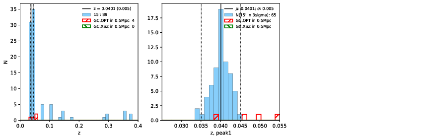 |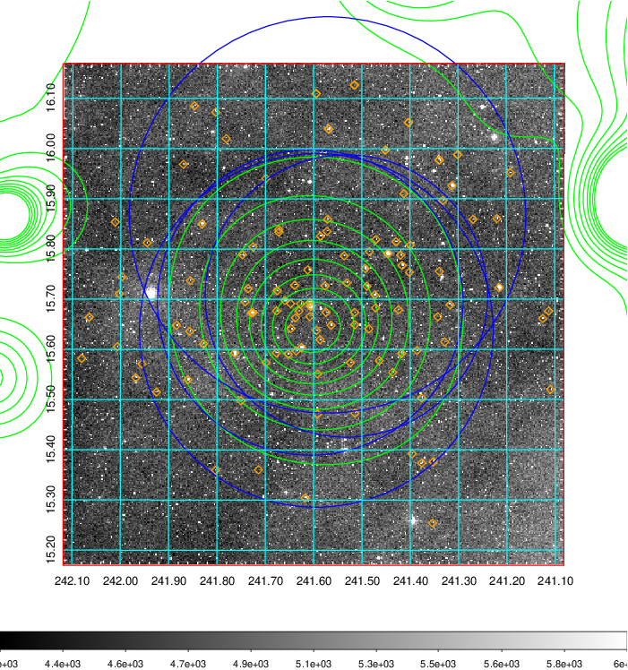  Blue circle for optical clusters;  Magenta circle for XSZ clusters;  all with r=1Mpc;  Only GC with Delta_z<0.01 are shown. | 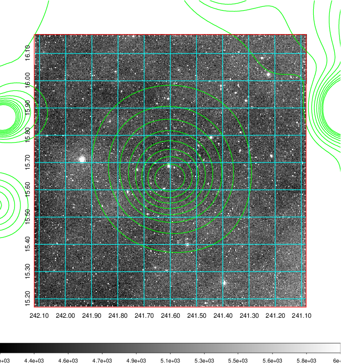 Blue circle for optical clusters;  Magenta circle for XSZ clusters;  all with r=1Mpc;  Only GC with Delta_z<0.01 are shown.  |

|[known Abell/XSZ clusters](../image/633/633_gc.pdf) | [2MASS image](../image/633/633_2mass.pdf)      |[SDSS image](../image/633/633_sdss.pdf)   |
|-------------------|-------------------|-------------------|
|  Magenta, blue and green circles  for optical, X-ray and SZ clusters  respectively, with redshift of clusters  labelled. The radius of circles  are 1Mpc.|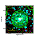  | 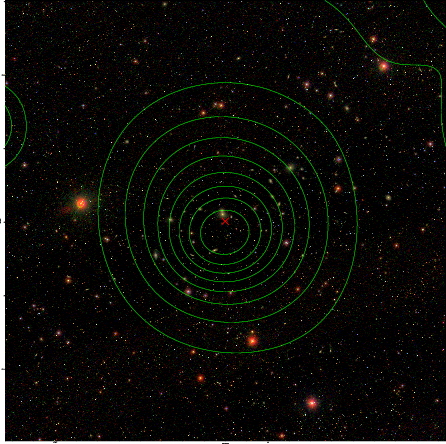  |

