

### 634

|Name|RAJ2000[deg]|DEJ2000[deg] |Ext[arcmin]| Ext,ml | z | z_src| C|GC(XSZ,Delta_z<0.01)| GC(OPT,Delta_z<0.01)|GC| R_sig[arcmin] | R500[arcmin] | R500[Mpc]| CRsig[c/s] | CR500[c/s] |L500[1E44 erg/s]|F500[1E-12 erg/s/cm^2]| M500[1E14 Msun]|Tx[keV]|Cnt_sig|Beta|Rc[arcmin]|Comment|Alias|
|---|---|---|---|---|---|------|---|--------|---------|----------|---|---|---|---|---|---|---|---|---|---|---|---|---|---|
|634| 241.841| 35.213| 10.44| 26.41| 0.0681(0.005)| z1,| G| -| -| C, N, W| 17.788| 6.172| 0.483| 0.027(0.044)| 0.024(0.040)| 0.040(0.048)| 0.354(0.427)| 0.34(0.21)| 1.13(0.44)| 85.9| 0.661(-0.114+0.191)| 3.378(-0.962+1.228)| -| t456|

|[RASS image](../image/634/634_img.pdf)|[filtered image](../image/634/634_fil.pdf)|[Segment image](../image/634/634_seg.pdf)|
|-------------------|--------------------|-------------------|
| 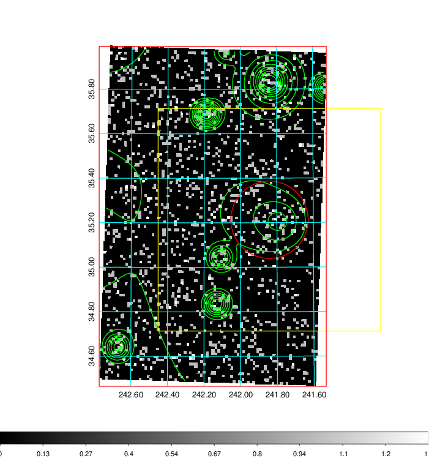  | 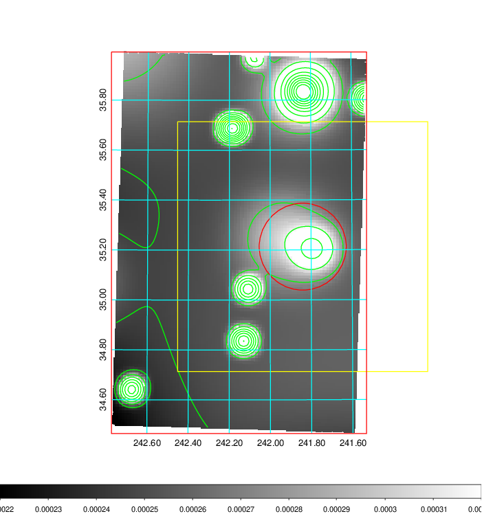   | 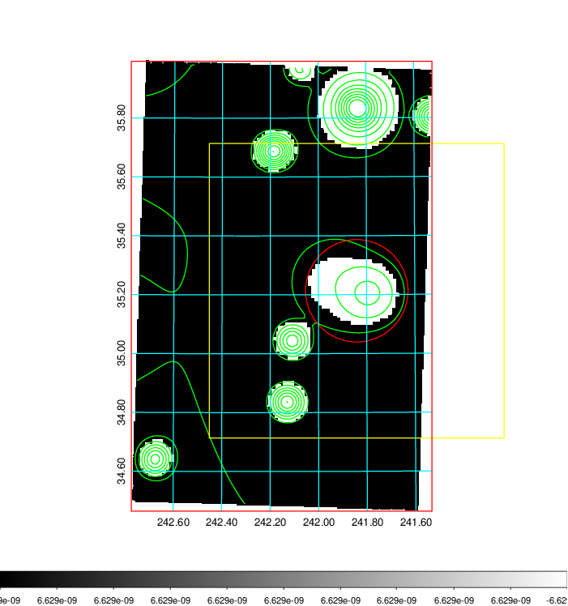  |

|[Exposure image](../image/634/634_mex.pdf)| [nH image](../image/634/634_nh.pdf)| [Planck image](../image/634/634_p.pdf)|
|-------------------|--------------------|-------------------|
|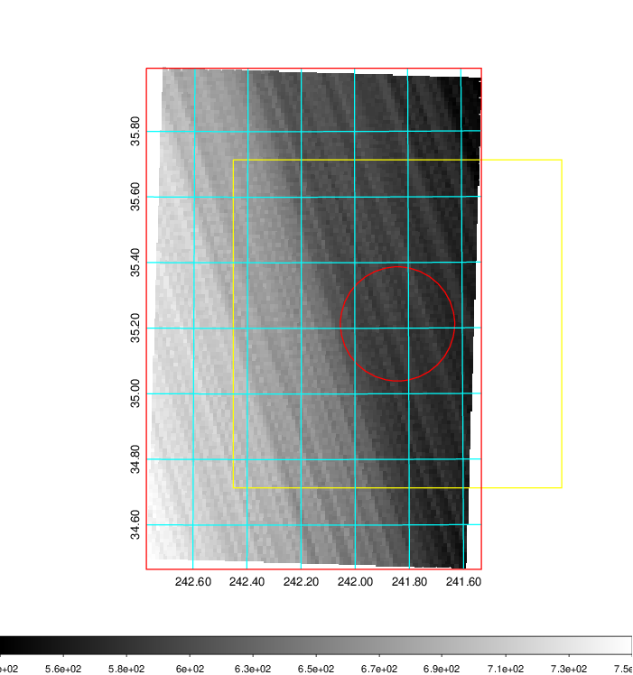   | 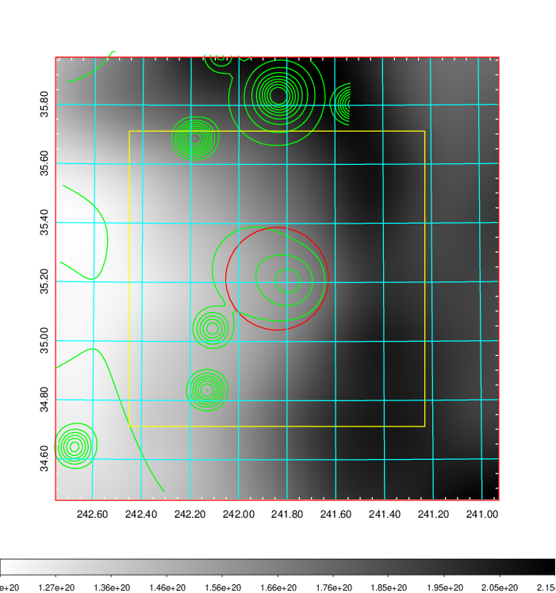    | 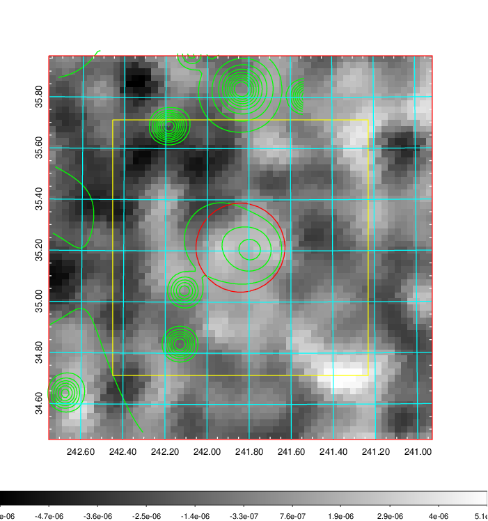 |

|[Redshift Histogram](../image/634/634_zg.pdf) | [DSS image(z1)](../image/634/634_dss_z1.pdf)      |  [DSS image(z2)](../image/634/634_dss_z2.pdf)    |
|-------------------|--------------------|-------------------|
|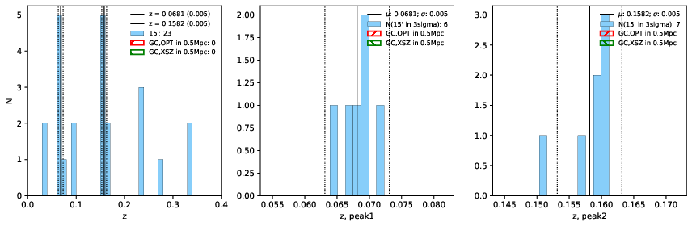 |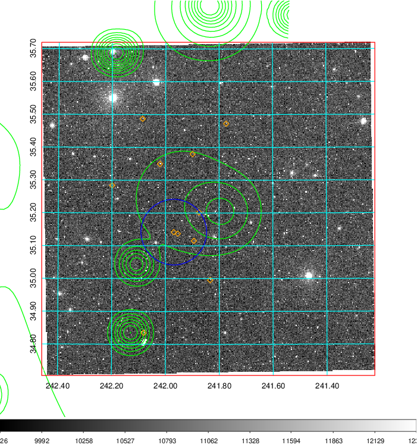  Blue circle for optical clusters;  Magenta circle for XSZ clusters;  all with r=1Mpc;  Only GC with Delta_z<0.01 are shown. | 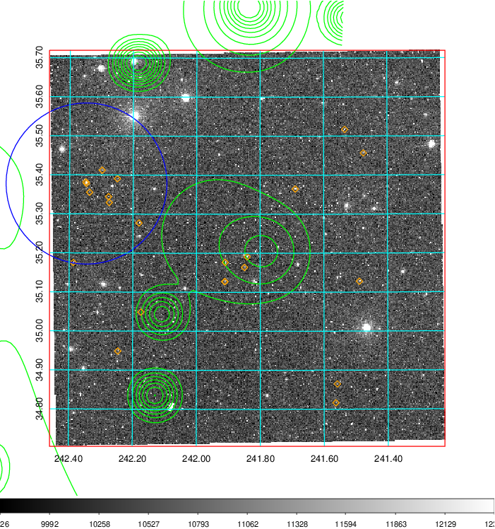 Blue circle for optical clusters;  Magenta circle for XSZ clusters;  all with r=1Mpc;  Only GC with Delta_z<0.01 are shown.  |

|[Previous-identified clusters](../image/634/634_gc.pdf) | [2MASS image](../image/634/634_2mass.pdf)      |[SDSS image](../image/634/634_sdss.pdf)   |
|-------------------|-------------------|-------------------|
|  Green, magenta, and blue circles  for optical, X-ray and SZ clusters  respectively, with redshift of clusters  labelled. The radius of circles  are 1Mpc.|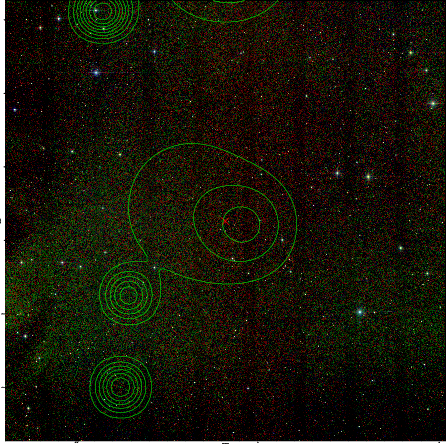  | 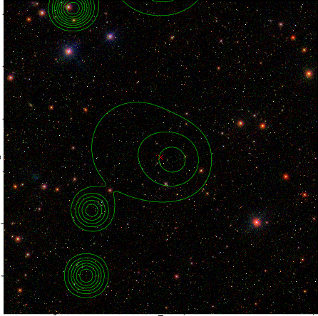  |

