

### 635

|Name|RAJ2000[deg]|DEJ2000[deg] |Ext[arcmin]| Ext,ml | z | z_src| C|GC(XSZ,Delta_z<0.01)| GC(OPT,Delta_z<0.01)|GC| R_sig[arcmin] | R500[arcmin] | R500[Mpc]| CRsig[c/s] | CR500[c/s] |L500[1E44 erg/s]|F500[1E-12 erg/s/cm^2]| M500[1E14 Msun]|Tx[keV]|Cnt_sig|Beta|Rc[arcmin]|Comment|Alias|
|---|---|---|---|---|---|------|---|--------|---------|----------|---|---|---|---|---|---|---|---|---|---|---|---|---|---|
|635| 242.762| 36.919| 7.16| 103.62| 0.0673(0.005)| z1, z_xsz| B| F20, SPI| N, W| C, F20, N, SPI, W| 9.288| 9.269| 0.717| 0.150(0.032)| 0.150(0.032)| 0.317(0.046)| 2.885(0.419)| 1.12(0.08)| 2.34(0.11)| 110.6| 0.913(-0.108+0.062)| 7.481(-0.981+0.752)| -| t357|

|[RASS image](../image/635/635_img.pdf)|[filtered image](../image/635/635_fil.pdf)|[Segment image](../image/635/635_seg.pdf)|
|-------------------|--------------------|-------------------|
| 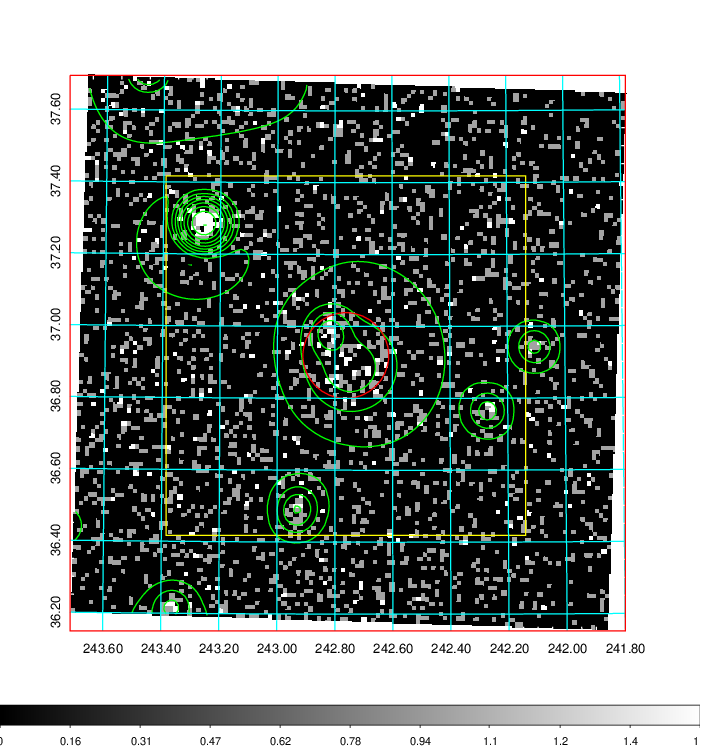  | 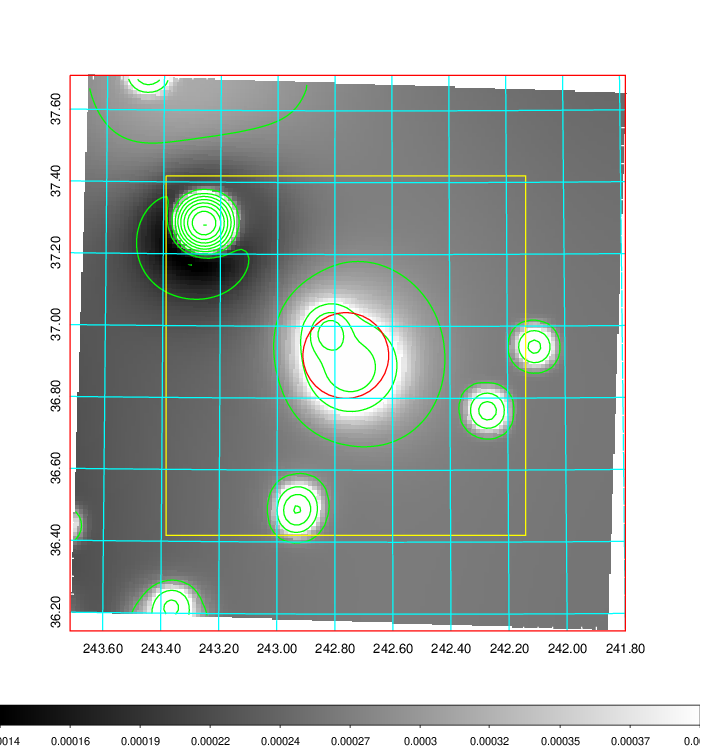   | 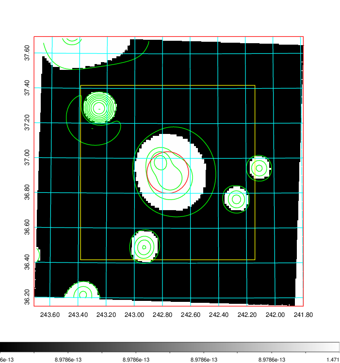  |

|[Exposure image](../image/635/635_mex.pdf)| [nH image](../image/635/635_nh.pdf)| [Planck image](../image/635/635_p.pdf)|
|-------------------|--------------------|-------------------|
|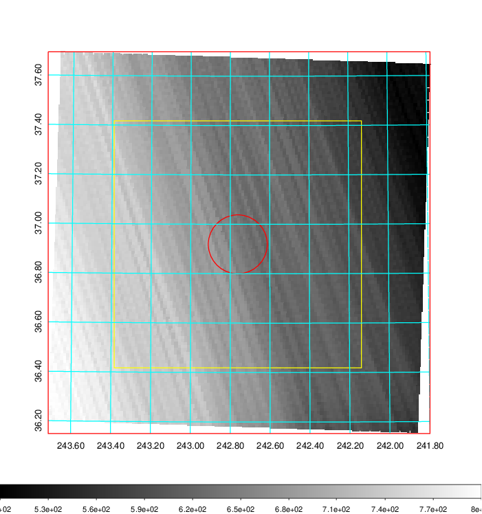   | 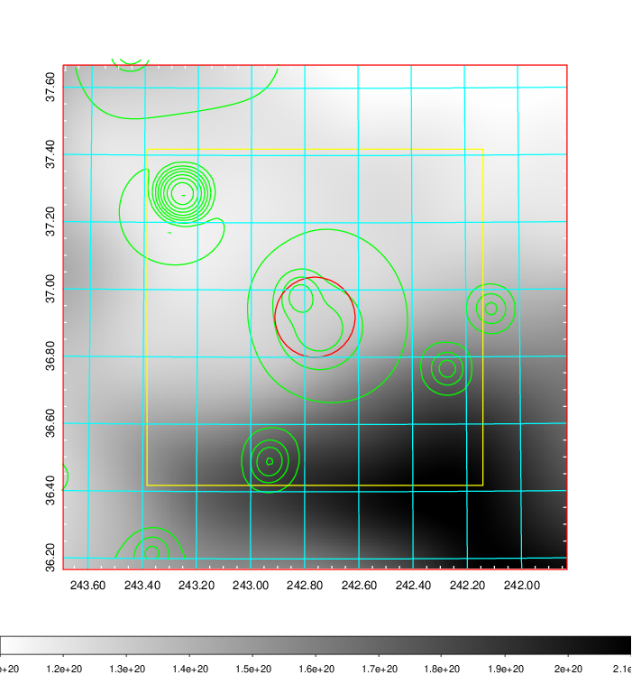    | 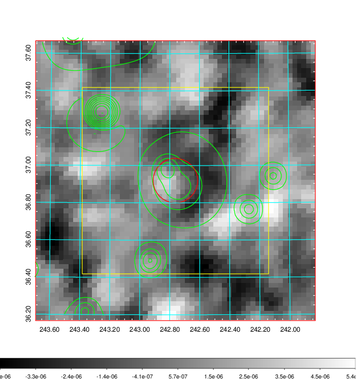 |

|[Redshift Histogram](../image/635/635_zg.pdf) | [DSS image(z1)](../image/635/635_dss_z1.pdf)      |  [DSS image(z2)](../image/635/635_dss_z2.pdf)    |
|-------------------|--------------------|-------------------|
|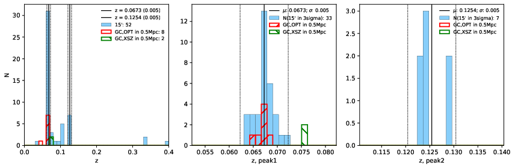 |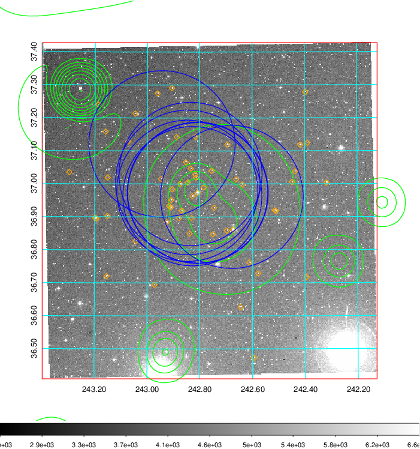  Blue circle for optical clusters;  Magenta circle for XSZ clusters;  all with r=1Mpc;  Only GC with Delta_z<0.01 are shown. | 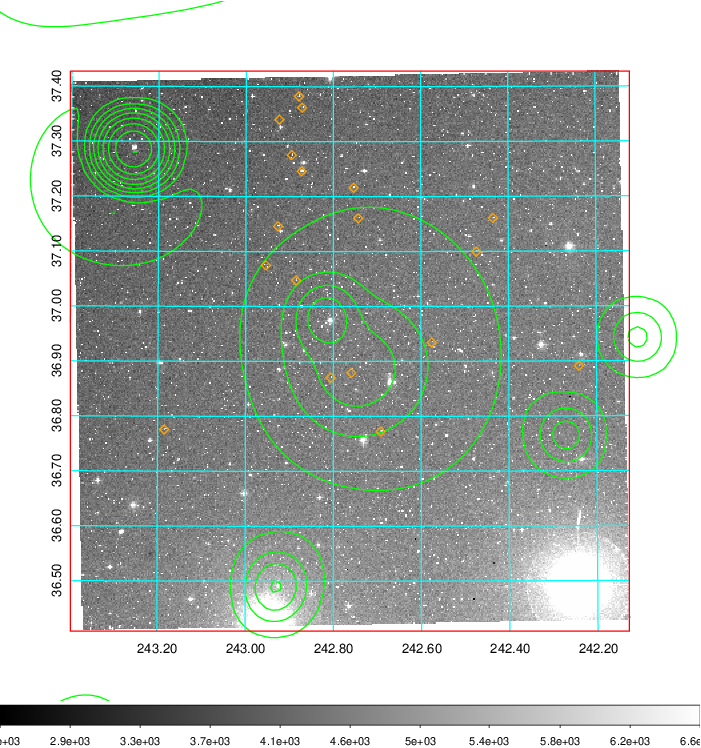 Blue circle for optical clusters;  Magenta circle for XSZ clusters;  all with r=1Mpc;  Only GC with Delta_z<0.01 are shown.  |

|[Previous-identified clusters](../image/635/635_gc.pdf) | [2MASS image](../image/635/635_2mass.pdf)      |[SDSS image](../image/635/635_sdss.pdf)   |
|-------------------|-------------------|-------------------|
|  Green, magenta, and blue circles  for optical, X-ray and SZ clusters  respectively, with redshift of clusters  labelled. The radius of circles  are 1Mpc.|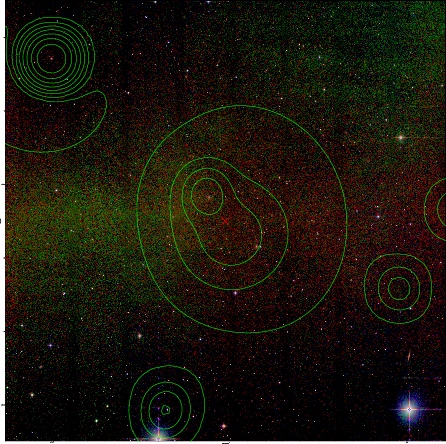  | 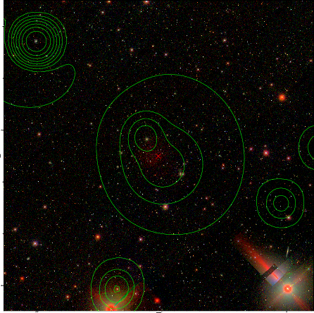  |

