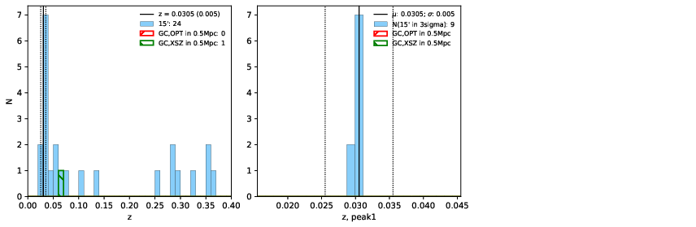

### 636

|Name|RAJ2000[deg]|DEJ2000[deg] |Ext[arcmin]| Ext,ml | z | z_src| C|GC(XSZ,Delta_z<0.01)| GC(OPT,Delta_z<0.01)|GC| R_sig[arcmin] | R500[arcmin] | R500[Mpc]| CRsig[c/s] | CR500[c/s] |L500[1E44 erg/s]|F500[1E-12 erg/s/cm^2]| M500[1E14 Msun]|Tx[keV]|Cnt_sig|Beta|Rc[arcmin]|Comment|Alias|
|---|---|---|---|---|---|------|---|--------|---------|----------|---|---|---|---|---|---|---|---|---|---|---|---|---|---|
|636| 242.797| 61.263| 3.43| 52.61| 0.0305(0.005)| z1,| G| -| -| C, F20, N, W| 13.675| 12.533| 0.459| 0.091(0.017)| 0.089(0.017)| 0.027(0.004)| 1.257(0.194)| 0.28(0.02)| 0.99(0.05)| 165.2| 0.548(-0.035+0.080)| 2.654(-0.499+0.888)| -| t162|

|[RASS image](../image/636/636_img.pdf)|[filtered image](../image/636/636_fil.pdf)|[Segment image](../image/636/636_seg.pdf)|
|-------------------|--------------------|-------------------|
|   |    |   |

|[Exposure image](../image/636/636_mex.pdf)| [nH image](../image/636/636_nh.pdf)| [Planck image](../image/636/636_p.pdf)|
|-------------------|--------------------|-------------------|
|   |     |  |

|[Redshift Histogram](../image/636/636_zg.pdf) | [DSS image(z1)](../image/636/636_dss_z1.pdf)      |  [DSS image(z2)](../image/636/636_dss_z2.pdf)    |
|-------------------|--------------------|-------------------|
| |  Blue circle for optical clusters;  Magenta circle for XSZ clusters;  all with r=1Mpc;  Only GC with Delta_z<0.01 are shown. |  Blue circle for optical clusters;  Magenta circle for XSZ clusters;  all with r=1Mpc;  Only GC with Delta_z<0.01 are shown.  |

|[known Abell/XSZ clusters](../image/636/636_gc.pdf) | [2MASS image](../image/636/636_2mass.pdf)      |[SDSS image](../image/636/636_sdss.pdf)   |
|-------------------|-------------------|-------------------|
|  Magenta, blue and green circles  for optical, X-ray and SZ clusters  respectively, with redshift of clusters  labelled. The radius of circles  are 1Mpc.|  |   |

