

### 638

|Name|RAJ2000[deg]|DEJ2000[deg] |Ext[arcmin]| Ext,ml | z | z_src| C|GC(XSZ,Delta_z<0.01)| GC(OPT,Delta_z<0.01)|GC| R_sig[arcmin] | R500[arcmin] | R500[Mpc]| CRsig[c/s] | CR500[c/s] |L500[1E44 erg/s]|F500[1E-12 erg/s/cm^2]| M500[1E14 Msun]|Tx[keV]|Cnt_sig|Beta|Rc[arcmin]|Comment|Alias|
|---|---|---|---|---|---|------|---|--------|---------|----------|---|---|---|---|---|---|---|---|---|---|---|---|---|---|
|638| 242.922| 16.946| 5.47| 28.77| 0.0889(0.005)| z1, z_xsz| B| F20| A, N, RM, W| A, F20, N, W| 11.725| 7.498| 0.747| 0.108(0.036)| 0.102(0.034)| 0.356(0.081)| 1.805(0.408)| 1.29(0.15)| 2.58(0.19)| 56.9| 0.845(-0.164+0.109)| 8.387(-1.790+1.375)| -| t280|

|[RASS image](../image/638/638_img.pdf)|[filtered image](../image/638/638_fil.pdf)|[Segment image](../image/638/638_seg.pdf)|
|-------------------|--------------------|-------------------|
| 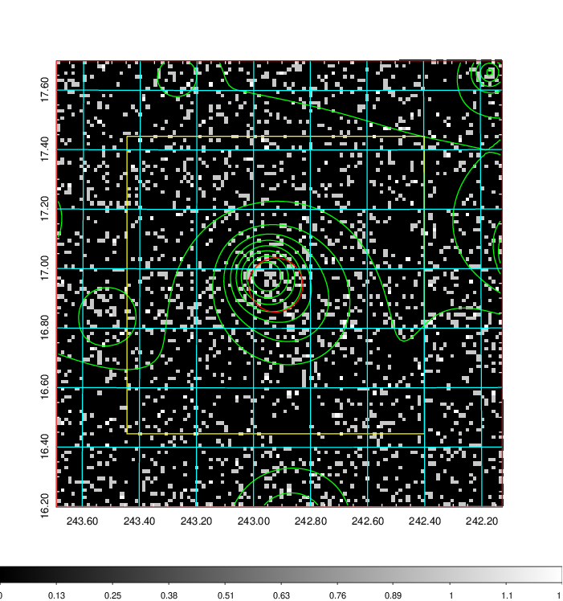  | 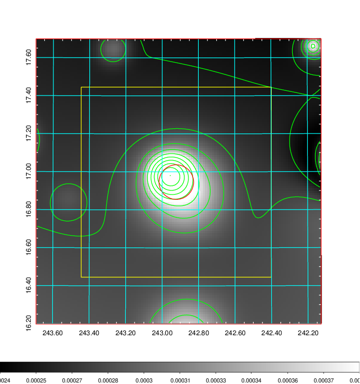   | 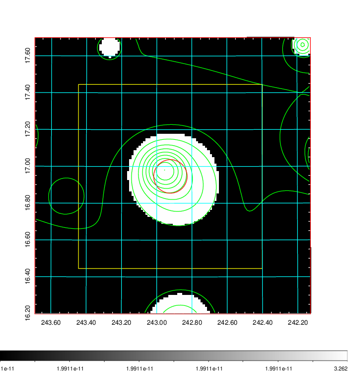  |

|[Exposure image](../image/638/638_mex.pdf)| [nH image](../image/638/638_nh.pdf)| [Planck image](../image/638/638_p.pdf)|
|-------------------|--------------------|-------------------|
|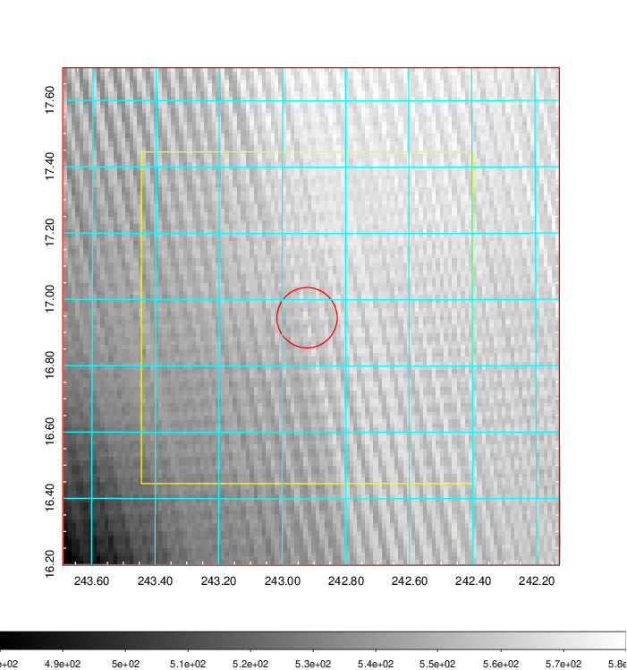   | 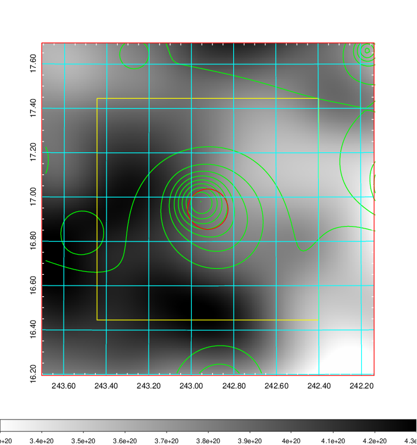    | 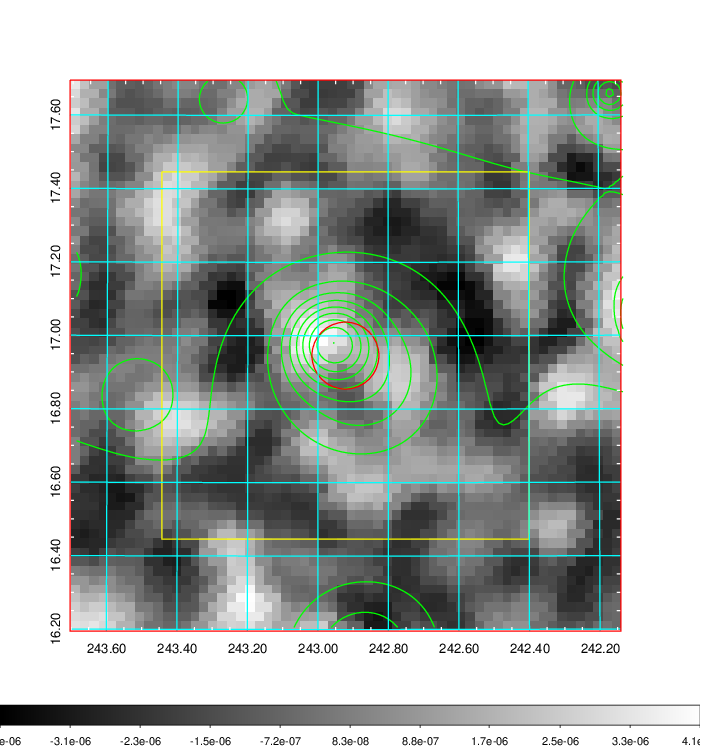 |

|[Redshift Histogram](../image/638/638_zg.pdf) | [DSS image(z1)](../image/638/638_dss_z1.pdf)      |  [DSS image(z2)](../image/638/638_dss_z2.pdf)    |
|-------------------|--------------------|-------------------|
|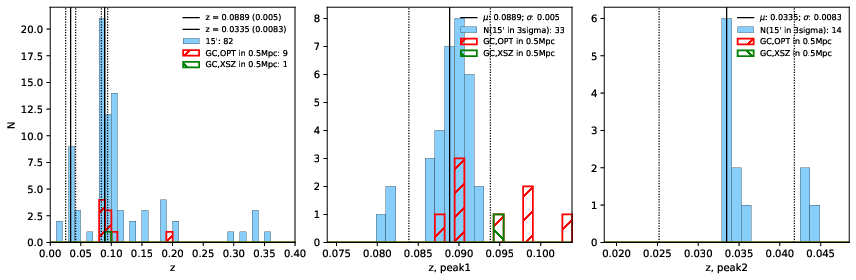 |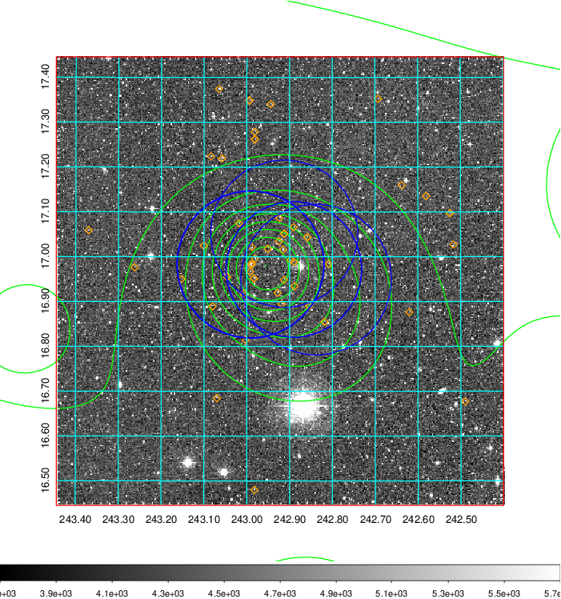  Blue circle for optical clusters;  Magenta circle for XSZ clusters;  all with r=1Mpc;  Only GC with Delta_z<0.01 are shown. | 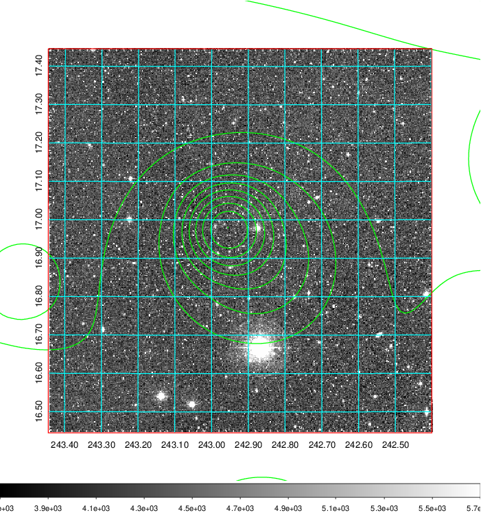 Blue circle for optical clusters;  Magenta circle for XSZ clusters;  all with r=1Mpc;  Only GC with Delta_z<0.01 are shown.  |

|[Previous-identified clusters](../image/638/638_gc.pdf) | [2MASS image](../image/638/638_2mass.pdf)      |[SDSS image](../image/638/638_sdss.pdf)   |
|-------------------|-------------------|-------------------|
|  Green, magenta, and blue circles  for optical, X-ray and SZ clusters  respectively, with redshift of clusters  labelled. The radius of circles  are 1Mpc.|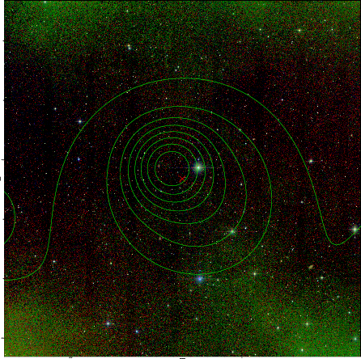  | 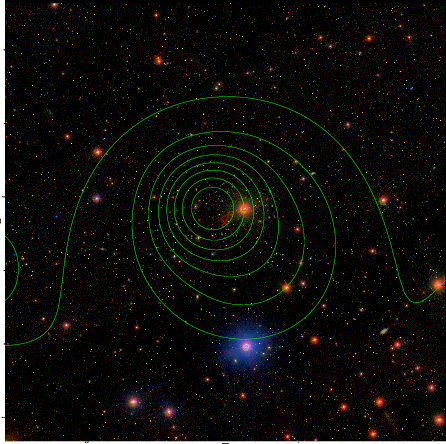  |

