

### 639

|Name|RAJ2000[deg]|DEJ2000[deg] |Ext[arcmin]| Ext,ml | z | z_src| C|GC(XSZ,Delta_z<0.01)| GC(OPT,Delta_z<0.01)|GC| R_sig[arcmin] | R500[arcmin] | R500[Mpc]| CRsig[c/s] | CR500[c/s] |L500[1E44 erg/s]|F500[1E-12 erg/s/cm^2]| M500[1E14 Msun]|Tx[keV]|Cnt_sig|Beta|Rc[arcmin]|Comment|Alias|
|---|---|---|---|---|---|------|---|--------|---------|----------|---|---|---|---|---|---|---|---|---|---|---|---|---|---|
|639| 243.328| 30.840| 4.94| 43.96| 0.0516(0.005)| z1, z_opt| S| -| A, N, W| A, F20, N, SPI, W| 25.688| 11.468| 0.684| 0.220(0.040)| 0.202(0.037)| 0.218(0.040)| 3.556(0.659)| 0.96(0.09)| 2.11(0.13)| 133.0| 0.691(-0.081+0.116)| 8.382(-1.547+1.977)| -| t256|

|[RASS image](../image/639/639_img.pdf)|[filtered image](../image/639/639_fil.pdf)|[Segment image](../image/639/639_seg.pdf)|
|-------------------|--------------------|-------------------|
| 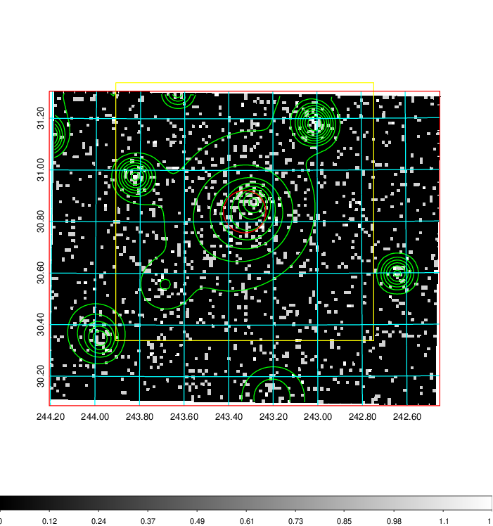  | 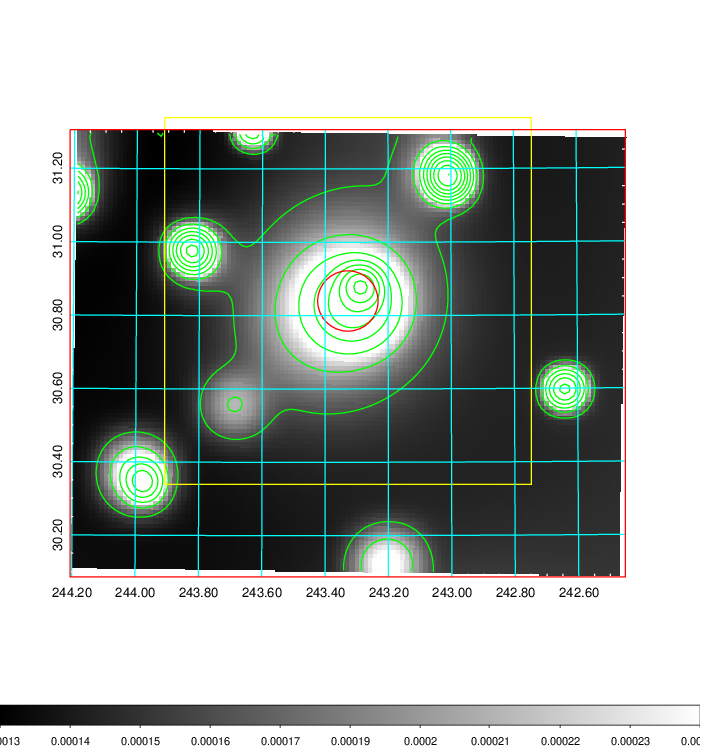   | 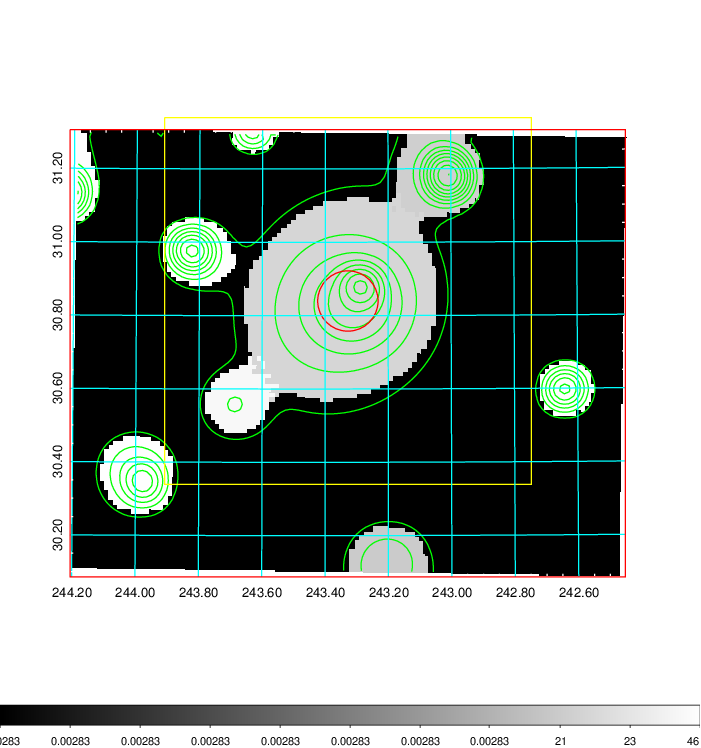  |

|[Exposure image](../image/639/639_mex.pdf)| [nH image](../image/639/639_nh.pdf)| [Planck image](../image/639/639_p.pdf)|
|-------------------|--------------------|-------------------|
|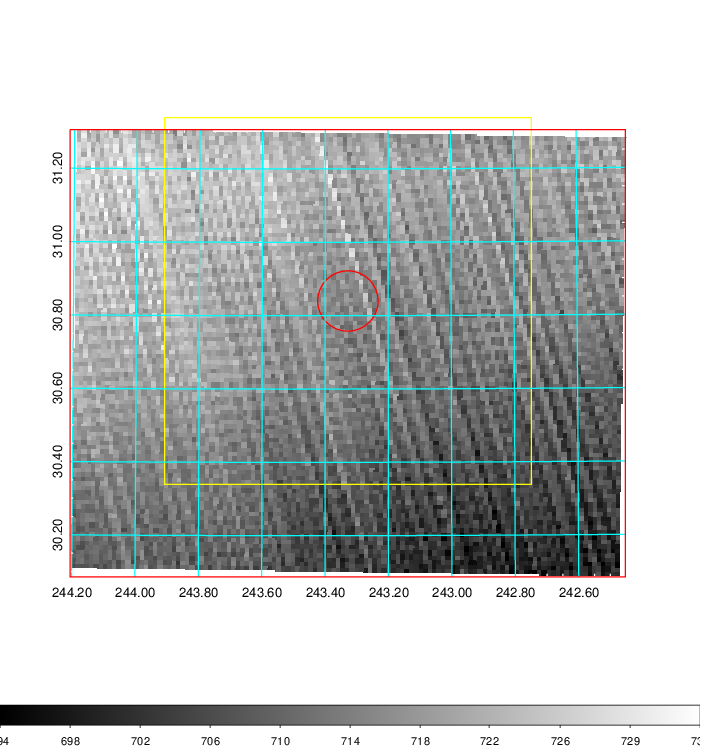   | 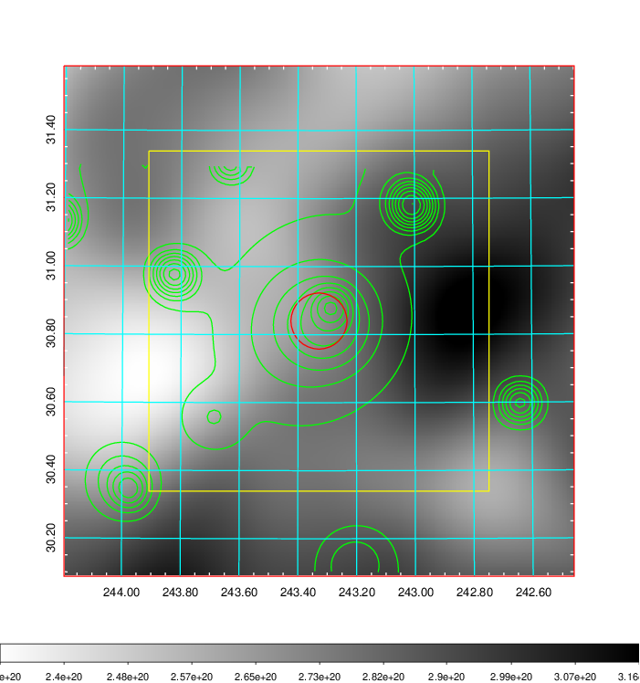    | 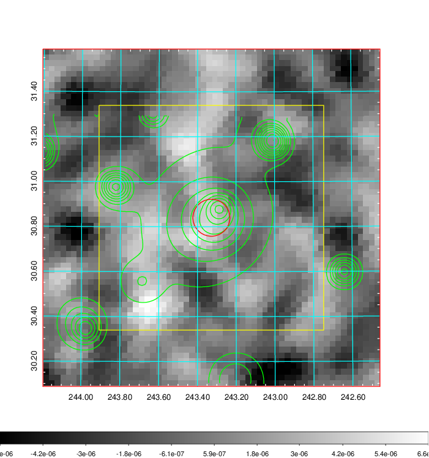 |

|[Redshift Histogram](../image/639/639_zg.pdf) | [DSS image(z1)](../image/639/639_dss_z1.pdf)      |  [DSS image(z2)](../image/639/639_dss_z2.pdf)    |
|-------------------|--------------------|-------------------|
|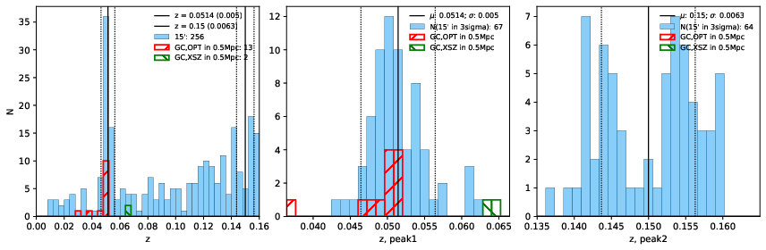 |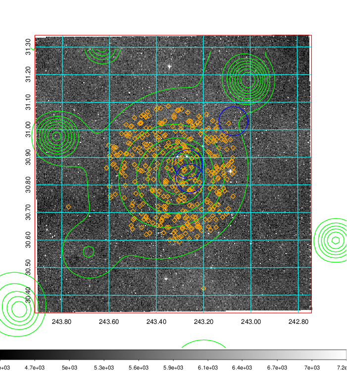  Blue circle for optical clusters;  Magenta circle for XSZ clusters;  all with r=1Mpc;  Only GC with Delta_z<0.01 are shown. | 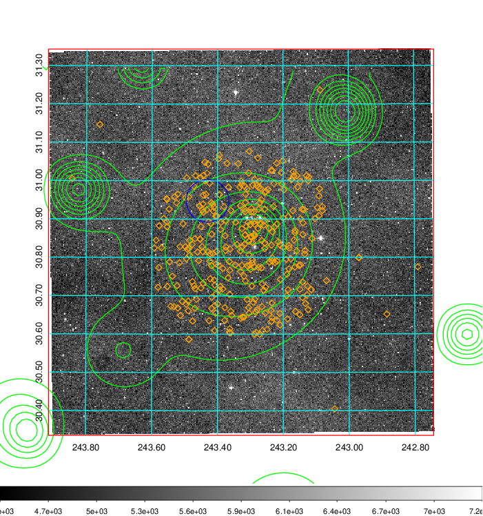 Blue circle for optical clusters;  Magenta circle for XSZ clusters;  all with r=1Mpc;  Only GC with Delta_z<0.01 are shown.  |

|[Previous-identified clusters](../image/639/639_gc.pdf) | [2MASS image](../image/639/639_2mass.pdf)      |[SDSS image](../image/639/639_sdss.pdf)   |
|-------------------|-------------------|-------------------|
|  Green, magenta, and blue circles  for optical, X-ray and SZ clusters  respectively, with redshift of clusters  labelled. The radius of circles  are 1Mpc.|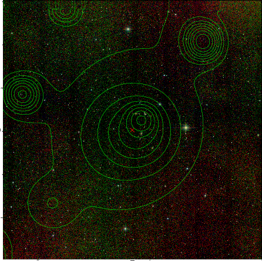  | 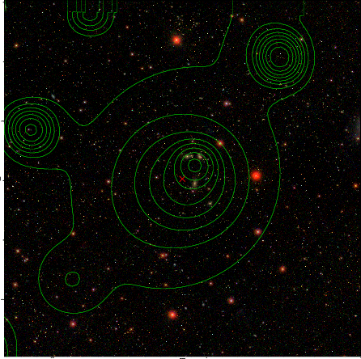  |

