

### 64

|Name|RAJ2000[deg]|DEJ2000[deg] |Ext[arcmin]| Ext,ml | z | z_src| C|GC(XSZ,Delta_z<0.01)| GC(OPT,Delta_z<0.01)|GC| R_sig[arcmin] | R500[arcmin] | R500[Mpc]| CRsig[c/s] | CR500[c/s] |L500[1E44 erg/s]|F500[1E-12 erg/s/cm^2]| M500[1E14 Msun]|Tx[keV]|Cnt_sig|Beta|Rc[arcmin]|Comment|Alias|
|---|---|---|---|---|---|------|---|--------|---------|----------|---|---|---|---|---|---|---|---|---|---|---|---|---|---|
|64| 18.881| 40.987| 3.33| 47.69| 0.0910(0.008)| z1, z_xsz| B| Tar| N| A, N, Tar, W| 13.188| 8.960| 0.912| 0.252(0.041)| 0.240(0.039)| 0.890(0.080)| 4.290(0.387)| 2.35(0.11)| 3.73(0.11)| 110.8| 0.920(-0.102+0.058)| 10.112(-1.093+0.875)| -| t151|

|[RASS image](../image/64/64_img.pdf)|[filtered image](../image/64/64_fil.pdf)|[Segment image](../image/64/64_seg.pdf)|
|-------------------|--------------------|-------------------|
| 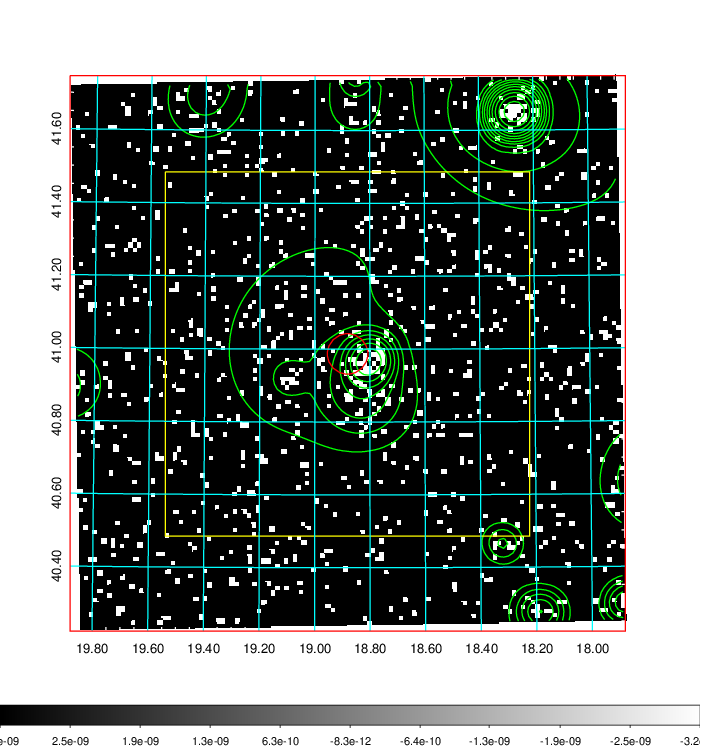  | 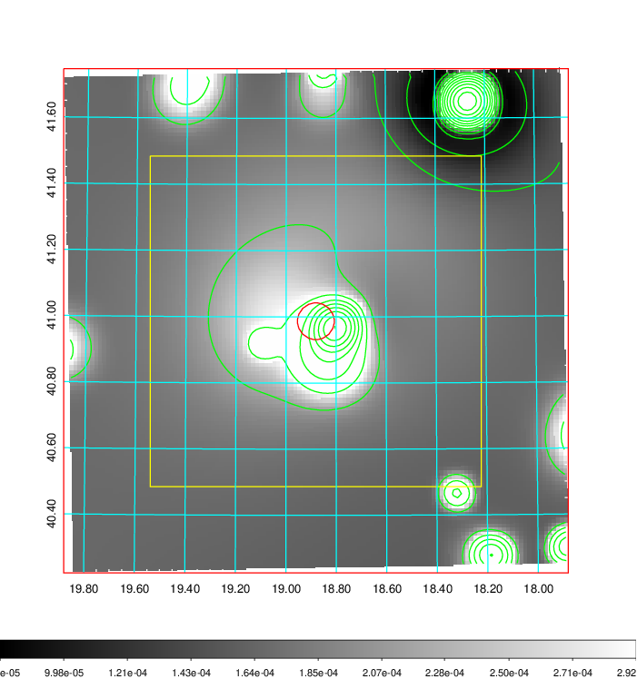   | 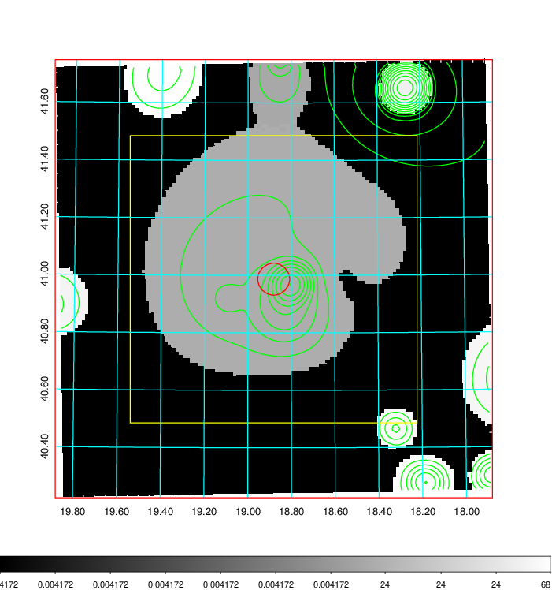  |

|[Exposure image](../image/64/64_mex.pdf)| [nH image](../image/64/64_nh.pdf)| [Planck image](../image/64/64_p.pdf)|
|-------------------|--------------------|-------------------|
|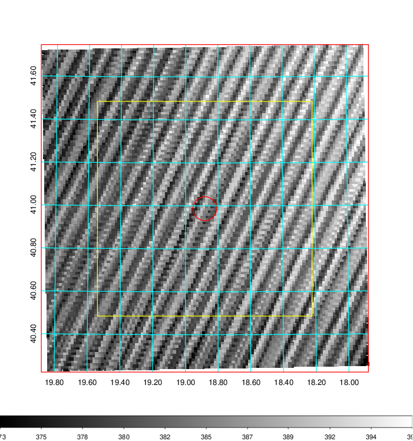   | 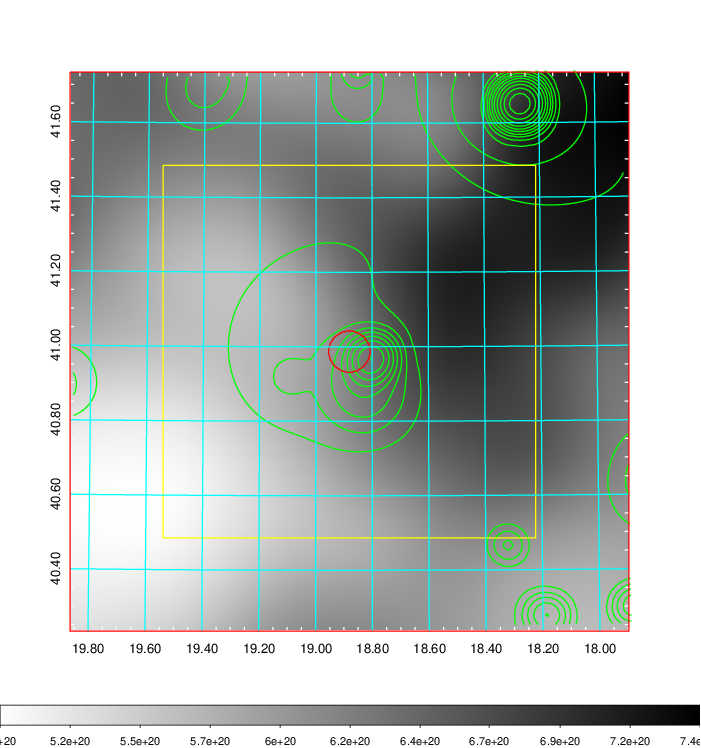    | 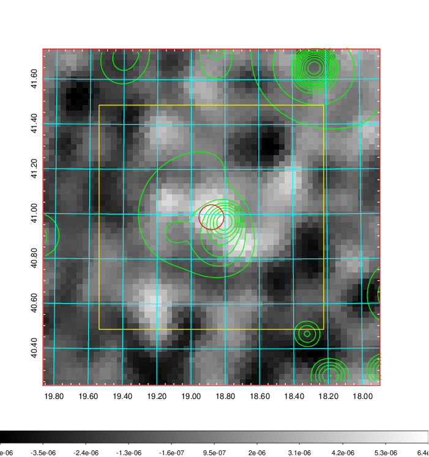 |

|[Redshift Histogram](../image/64/64_zg.pdf) | [DSS image(z1)](../image/64/64_dss_z1.pdf)      |  [DSS image(z2)](../image/64/64_dss_z2.pdf)    |
|-------------------|--------------------|-------------------|
|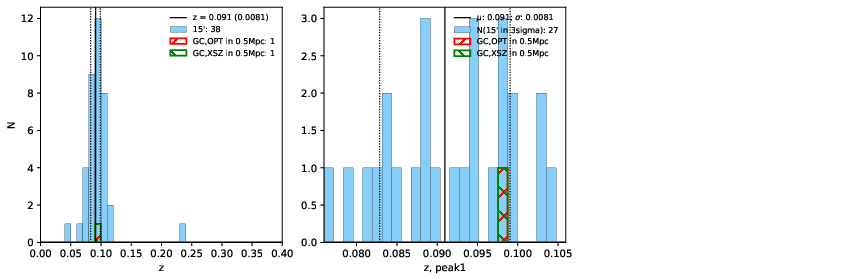 |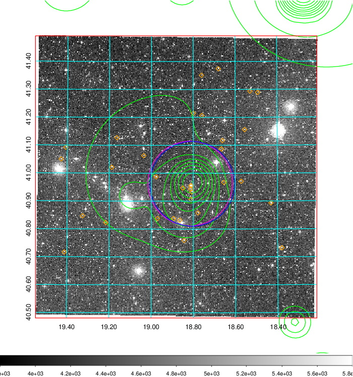  Blue circle for optical clusters;  Magenta circle for XSZ clusters;  all with r=1Mpc;  Only GC with Delta_z<0.01 are shown. | 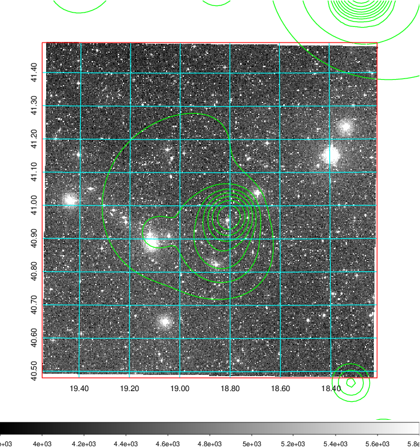 Blue circle for optical clusters;  Magenta circle for XSZ clusters;  all with r=1Mpc;  Only GC with Delta_z<0.01 are shown.  |

|[Previous-identified clusters](../image/64/64_gc.pdf) | [2MASS image](../image/64/64_2mass.pdf)      |
|-------------------|-------------------|
|  Green, magenta, and blue circles  for optical, X-ray and SZ clusters  respectively, with redshift of clusters  labelled. The radius of circles  are 1Mpc.|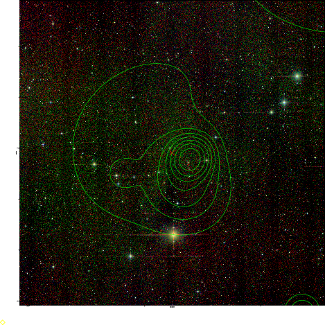  |

|[PS1 image](../image/64/64_ps1.pdf)            |
|-------------------|
| 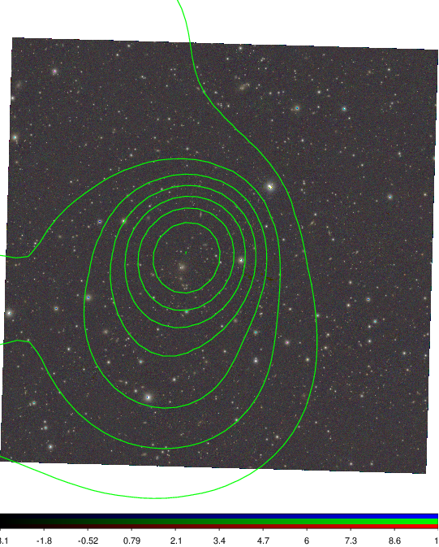  |
