

### 640

|Name|RAJ2000[deg]|DEJ2000[deg] |Ext[arcmin]| Ext,ml | z | z_src| C|GC(XSZ,Delta_z<0.01)| GC(OPT,Delta_z<0.01)|GC| R_sig[arcmin] | R500[arcmin] | R500[Mpc]| CRsig[c/s] | CR500[c/s] |L500[1E44 erg/s]|F500[1E-12 erg/s/cm^2]| M500[1E14 Msun]|Tx[keV]|Cnt_sig|Beta|Rc[arcmin]|Comment|Alias|
|---|---|---|---|---|---|------|---|--------|---------|----------|---|---|---|---|---|---|---|---|---|---|---|---|---|---|
|640| 243.582| 38.435| 6.80| 53.93| 0.1843(0.005)| z1, z_xsz| B| F20, SPI| C, N, RM, W| A, C, F20, N, SPI, W| 7.825| 5.001| 0.928| 0.085(0.028)| 0.081(0.027)| 1.592(0.448)| 1.662(0.468)| 2.73(0.38)| 4.22(0.37)| 68.0| 0.843(-0.156+0.111)| 5.142(-1.259+0.978)| -| t338|

|[RASS image](../image/640/640_img.pdf)|[filtered image](../image/640/640_fil.pdf)|[Segment image](../image/640/640_seg.pdf)|
|-------------------|--------------------|-------------------|
| 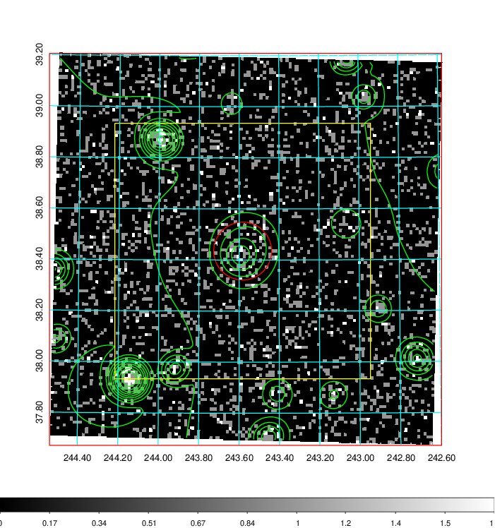  | 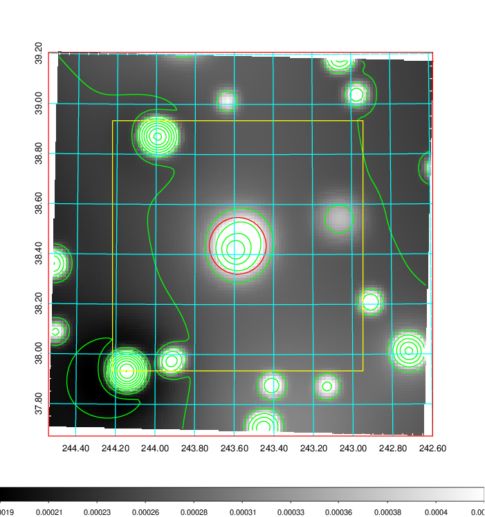   | 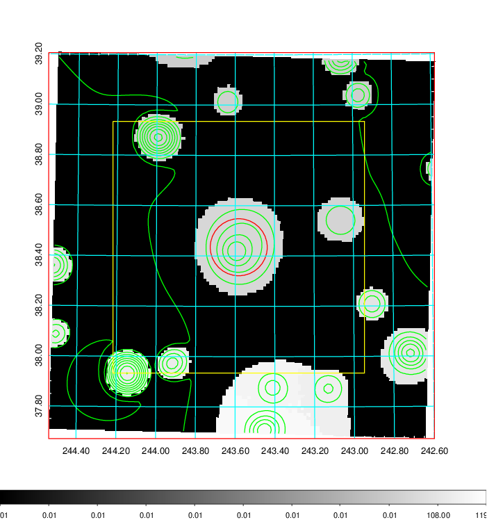  |

|[Exposure image](../image/640/640_mex.pdf)| [nH image](../image/640/640_nh.pdf)| [Planck image](../image/640/640_p.pdf)|
|-------------------|--------------------|-------------------|
|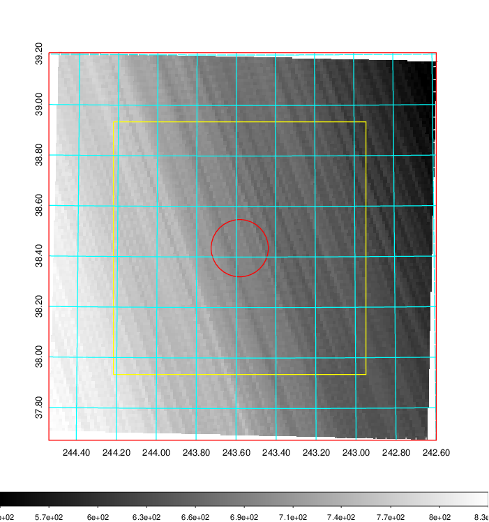   | 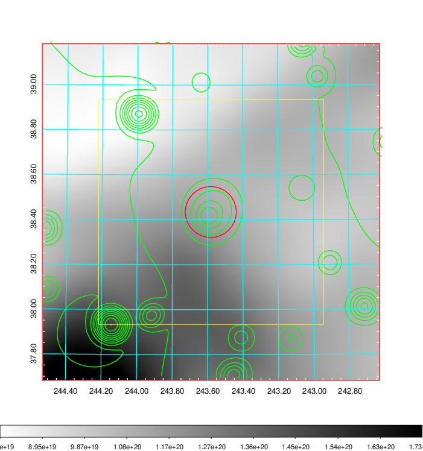    | 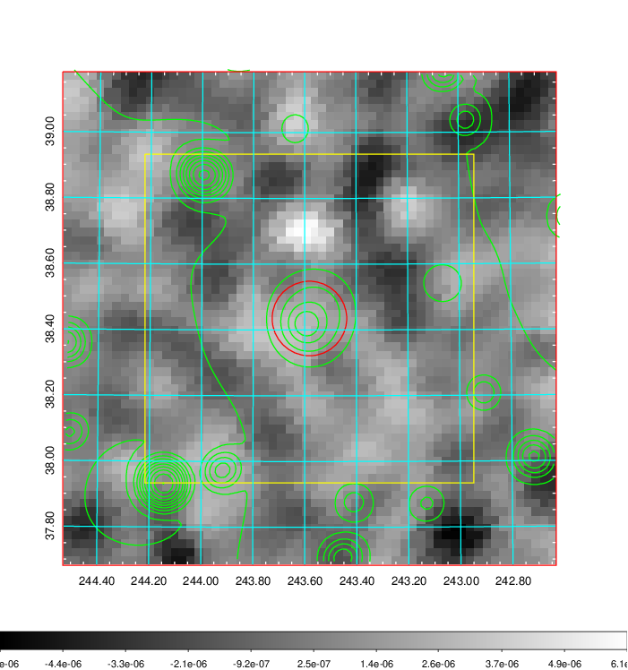 |

|[Redshift Histogram](../image/640/640_zg.pdf) | [DSS image(z1)](../image/640/640_dss_z1.pdf)      |  [DSS image(z2)](../image/640/640_dss_z2.pdf)    |
|-------------------|--------------------|-------------------|
|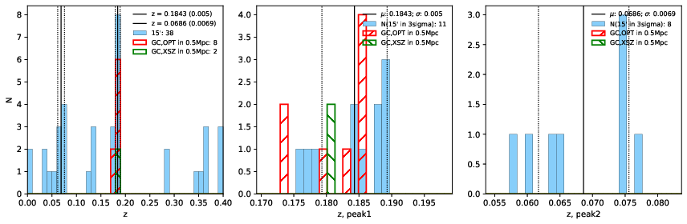 |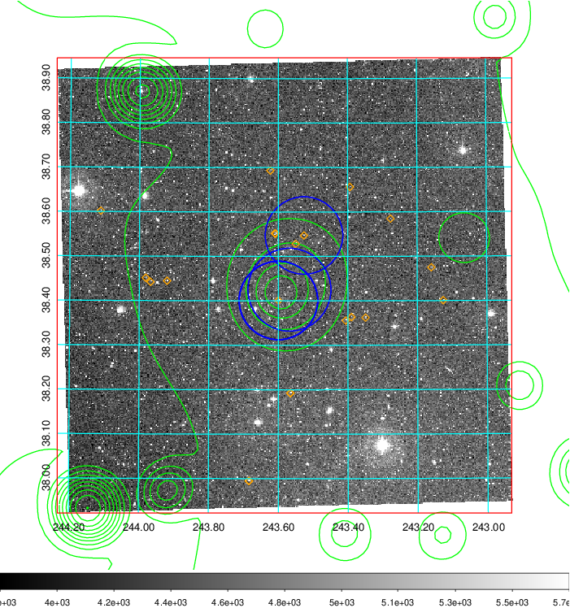  Blue circle for optical clusters;  Magenta circle for XSZ clusters;  all with r=1Mpc;  Only GC with Delta_z<0.01 are shown. | 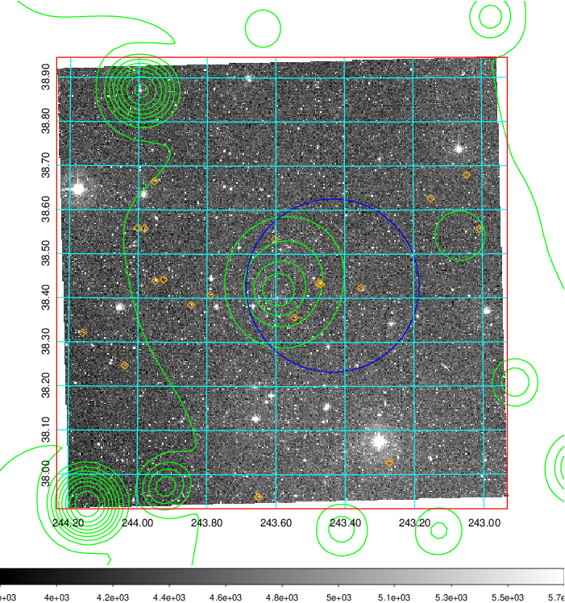 Blue circle for optical clusters;  Magenta circle for XSZ clusters;  all with r=1Mpc;  Only GC with Delta_z<0.01 are shown.  |

|[Previous-identified clusters](../image/640/640_gc.pdf) | [2MASS image](../image/640/640_2mass.pdf)      |[SDSS image](../image/640/640_sdss.pdf)   |
|-------------------|-------------------|-------------------|
|  Green, magenta, and blue circles  for optical, X-ray and SZ clusters  respectively, with redshift of clusters  labelled. The radius of circles  are 1Mpc.|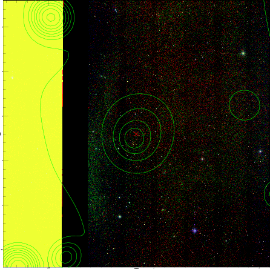  | 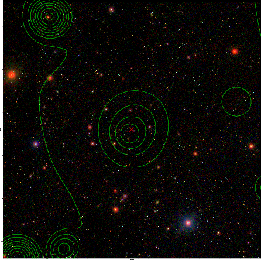  |

