

### 641

|Name|RAJ2000[deg]|DEJ2000[deg] |Ext[arcmin]| Ext,ml | z | z_src| C|GC(XSZ,Delta_z<0.01)| GC(OPT,Delta_z<0.01)|GC| R_sig[arcmin] | R500[arcmin] | R500[Mpc]| CRsig[c/s] | CR500[c/s] |L500[1E44 erg/s]|F500[1E-12 erg/s/cm^2]| M500[1E14 Msun]|Tx[keV]|Cnt_sig|Beta|Rc[arcmin]|Comment|Alias|
|---|---|---|---|---|---|------|---|--------|---------|----------|---|---|---|---|---|---|---|---|---|---|---|---|---|---|
|641| 243.893| 19.505| 5.58| 86.19| 0.0310(0.005)| z1, z_xsz| B| MCXC| N| C, MCXC, N, W| 13.188| 14.875| 0.553| 0.198(0.032)| 0.202(0.033)| 0.066(0.008)| 2.997(0.358)| 0.50(0.03)| 1.40(0.05)| 140.6| 0.912(-0.108+0.064)| 7.736(-0.970+0.751)| -| k532|

|[RASS image](../image/641/641_img.pdf)|[filtered image](../image/641/641_fil.pdf)|[Segment image](../image/641/641_seg.pdf)|
|-------------------|--------------------|-------------------|
| 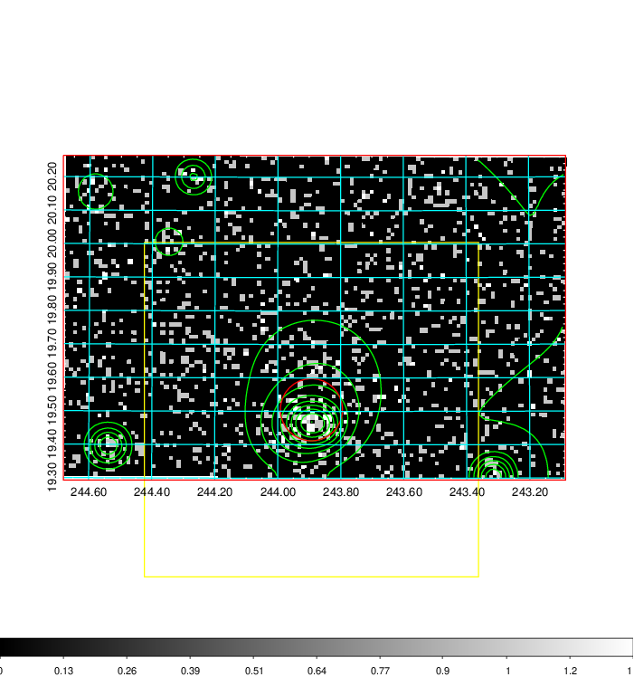  | 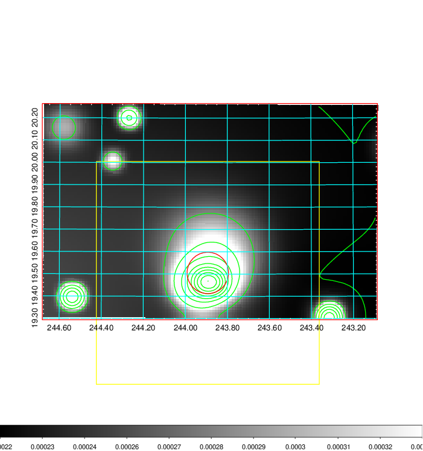   | 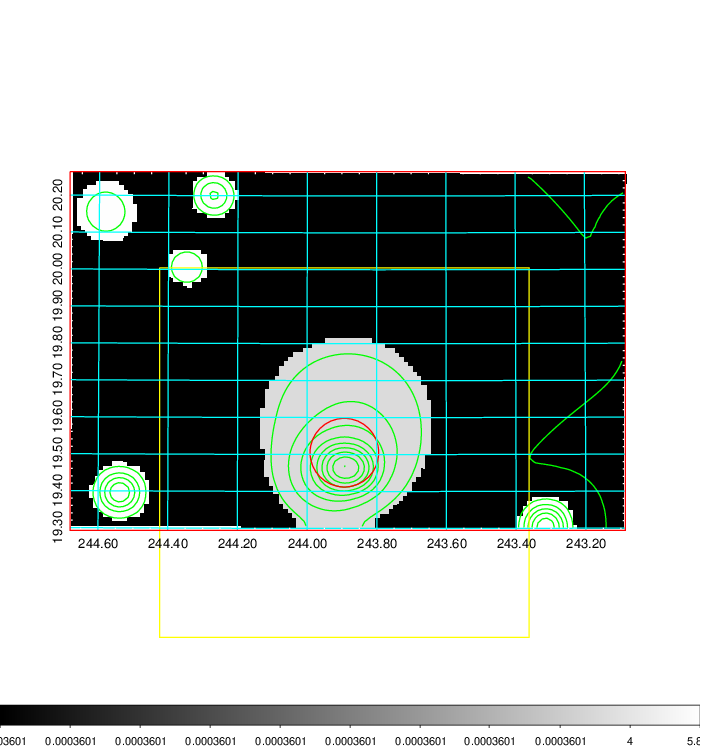  |

|[Exposure image](../image/641/641_mex.pdf)| [nH image](../image/641/641_nh.pdf)| [Planck image](../image/641/641_p.pdf)|
|-------------------|--------------------|-------------------|
|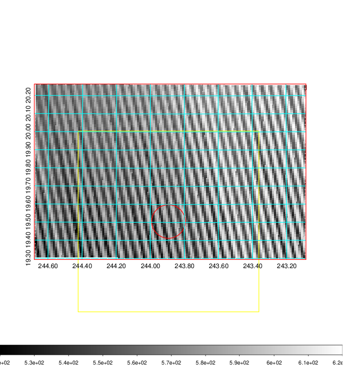   | 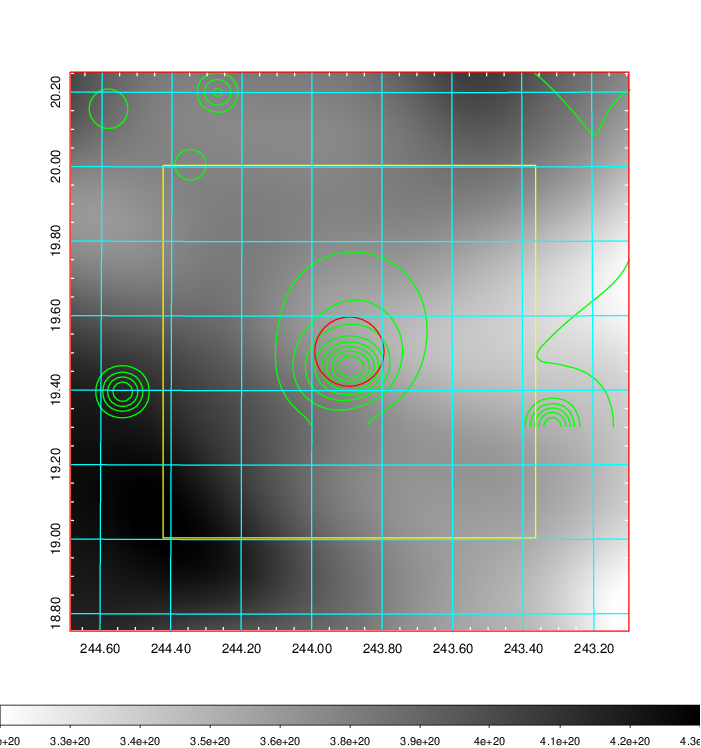    | 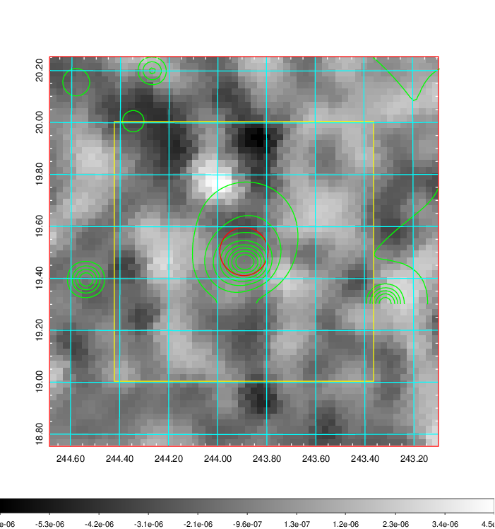 |

|[Redshift Histogram](../image/641/641_zg.pdf) | [DSS image(z1)](../image/641/641_dss_z1.pdf)      |  [DSS image(z2)](../image/641/641_dss_z2.pdf)    |
|-------------------|--------------------|-------------------|
|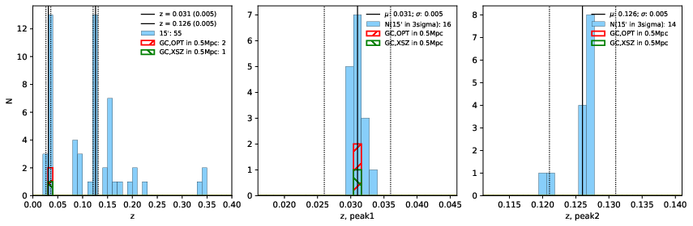 |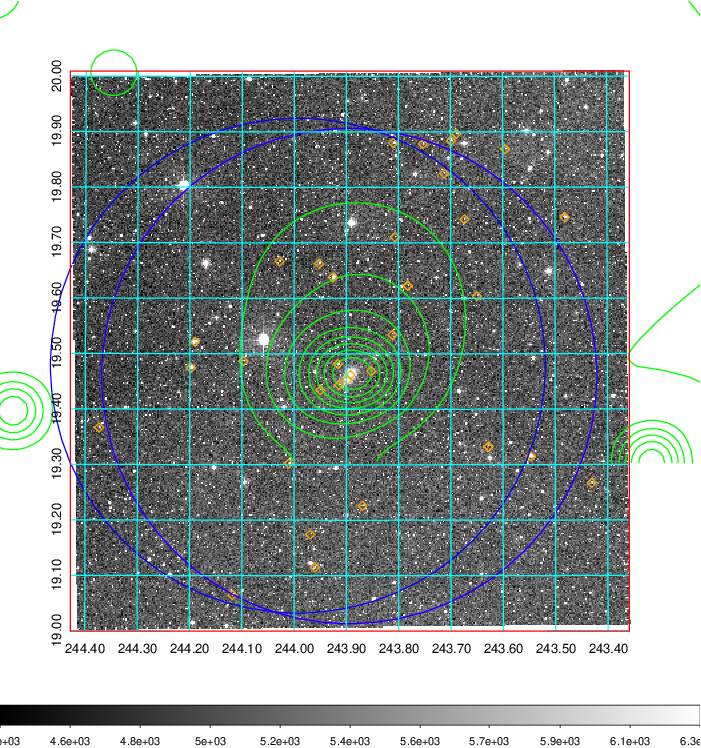  Blue circle for optical clusters;  Magenta circle for XSZ clusters;  all with r=1Mpc;  Only GC with Delta_z<0.01 are shown. | 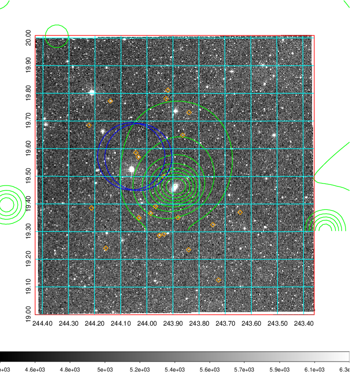 Blue circle for optical clusters;  Magenta circle for XSZ clusters;  all with r=1Mpc;  Only GC with Delta_z<0.01 are shown.  |

|[Previous-identified clusters](../image/641/641_gc.pdf) | [2MASS image](../image/641/641_2mass.pdf)      |[SDSS image](../image/641/641_sdss.pdf)   |
|-------------------|-------------------|-------------------|
|  Green, magenta, and blue circles  for optical, X-ray and SZ clusters  respectively, with redshift of clusters  labelled. The radius of circles  are 1Mpc.|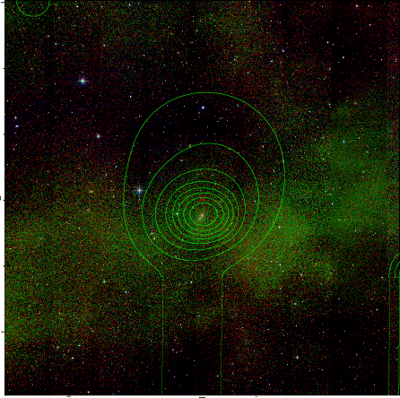  | 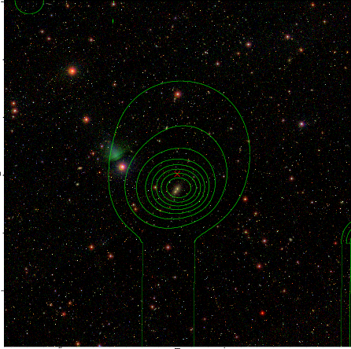  |

