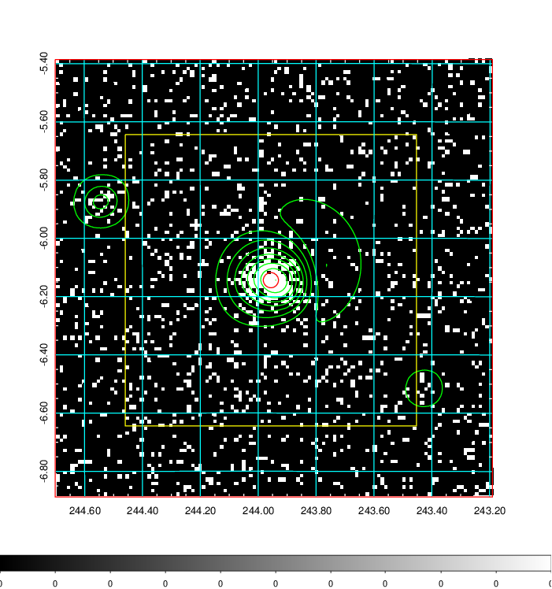
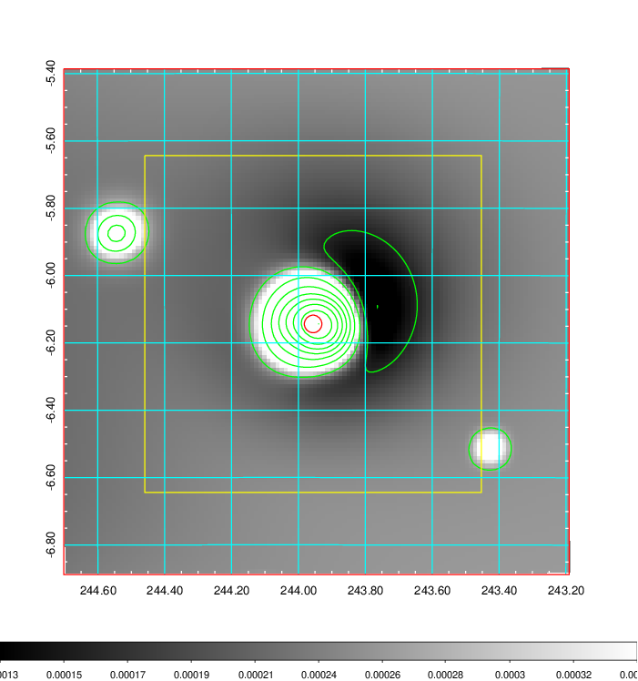
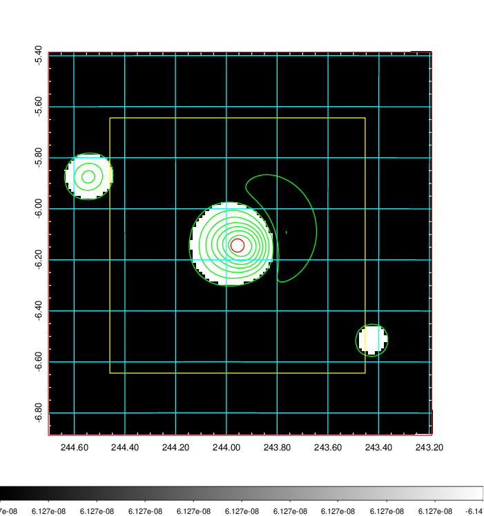
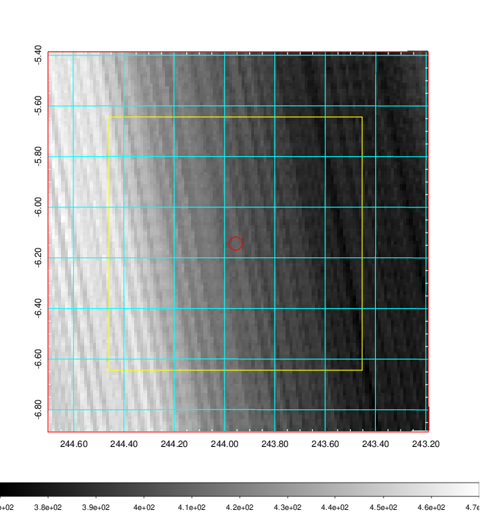
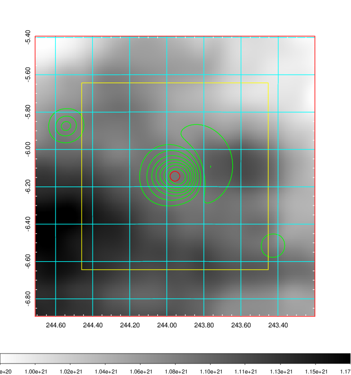
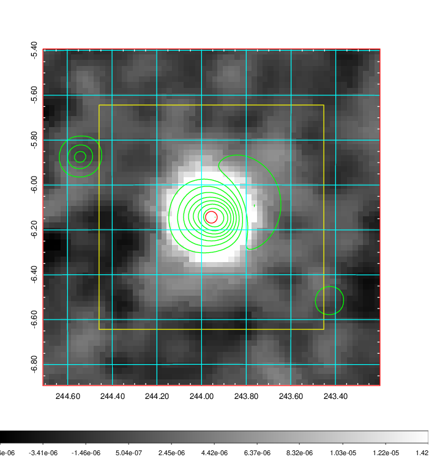
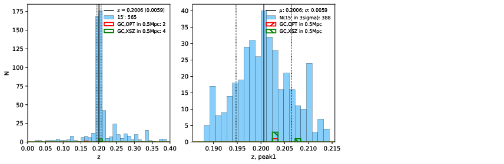
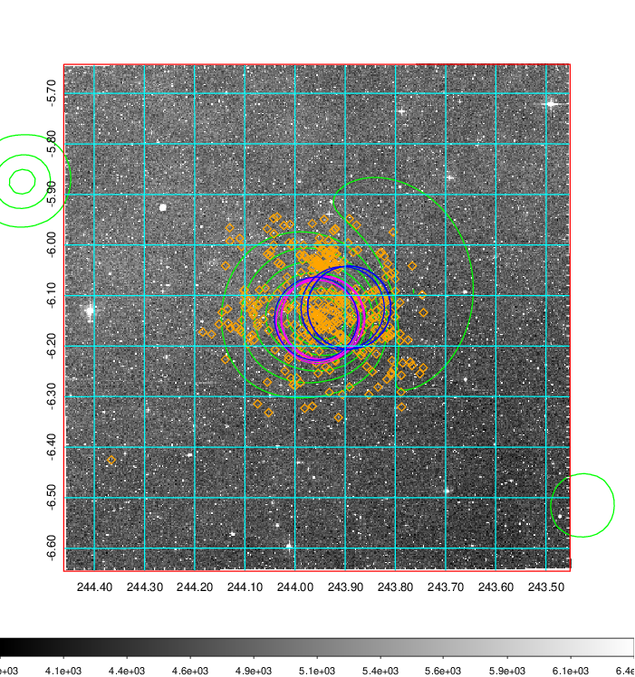
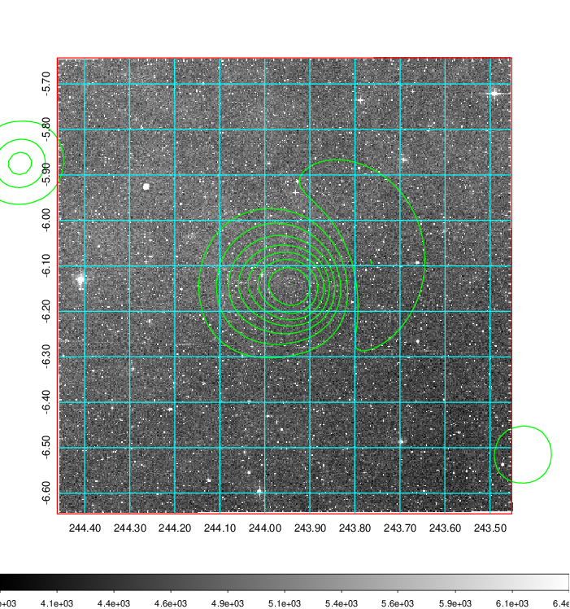
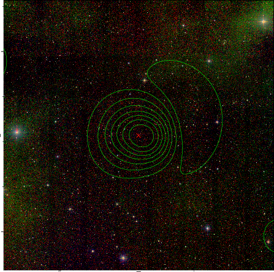

### 642

|Name|RAJ2000[deg]|DEJ2000[deg] |Ext[arcmin]| Ext,ml | z | z_src| C|GC(XSZ,Delta_z<0.01)| GC(OPT,Delta_z<0.01)|GC| R_sig[arcmin] | R500[arcmin] | R500[Mpc]| CRsig[c/s] | CR500[c/s] |L500[1E44 erg/s]|F500[1E-12 erg/s/cm^2]| M500[1E14 Msun]|Tx[keV]|Cnt_sig|Beta|Rc[arcmin]|Comment|Alias|
|---|---|---|---|---|---|------|---|--------|---------|----------|---|---|---|---|---|---|---|---|---|---|---|---|---|---|
|642| 243.956| -6.144| 1.57| 185.17| 0.2006(0.006)| z1, z_xsz| B| MCXC, PSZ2, Tar, XB| A| A, MCXC, N, PSZ2, Tar, XB| 8.312| 8.081| 1.604| 0.784(0.056)| 0.781(0.055)| 16.367(0.295)| 14.146(0.255)| 14.32(0.12)| 11.80(0.06)| 300.9| 0.960(-0.052+0.030)| 4.008(-0.272+0.203)| -| k128|

|[RASS image](../image/642/642_img.pdf)|[filtered image](../image/642/642_fil.pdf)|[Segment image](../image/642/642_seg.pdf)|
|-------------------|--------------------|-------------------|
|   |    |   |

|[Exposure image](../image/642/642_mex.pdf)| [nH image](../image/642/642_nh.pdf)| [Planck image](../image/642/642_p.pdf)|
|-------------------|--------------------|-------------------|
|   |     |  |

|[Redshift Histogram](../image/642/642_zg.pdf) | [DSS image(z1)](../image/642/642_dss_z1.pdf)      |  [DSS image(z2)](../image/642/642_dss_z2.pdf)    |
|-------------------|--------------------|-------------------|
| |  Blue circle for optical clusters;  Magenta circle for XSZ clusters;  all with r=1Mpc;  Only GC with Delta_z<0.01 are shown. |  Blue circle for optical clusters;  Magenta circle for XSZ clusters;  all with r=1Mpc;  Only GC with Delta_z<0.01 are shown.  |

|[known Abell/XSZ clusters](../image/642/642_gc.pdf) | [2MASS image](../image/642/642_2mass.pdf)      |
|-------------------|-------------------|
|  Magenta, blue and green circles  for optical, X-ray and SZ clusters  respectively, with redshift of clusters  labelled. The radius of circles  are 1Mpc.|  |

|[PS1 image](../image/642/642_ps1.pdf)            |
|-------------------|
|   |
