

### 643

|Name|RAJ2000[deg]|DEJ2000[deg] |Ext[arcmin]| Ext,ml | z | z_src| C|GC(XSZ,Delta_z<0.01)| GC(OPT,Delta_z<0.01)|GC| R_sig[arcmin] | R500[arcmin] | R500[Mpc]| CRsig[c/s] | CR500[c/s] |L500[1E44 erg/s]|F500[1E-12 erg/s/cm^2]| M500[1E14 Msun]|Tx[keV]|Cnt_sig|Beta|Rc[arcmin]|Comment|Alias|
|---|---|---|---|---|---|------|---|--------|---------|----------|---|---|---|---|---|---|---|---|---|---|---|---|---|---|
|643| 244.376| 34.962| 7.67| 303.19| 0.0311(0.005)| z1, z_xsz| B| MCXC| N, Zw| C, F20, MCXC, N, SPI, W| 21.738| 17.309| 0.646| 0.432(0.048)| 0.418(0.047)| 0.167(0.014)| 7.526(0.621)| 0.79(0.03)| 1.87(0.05)| 384.5| 0.912(-0.084+0.061)| 11.852(-1.297+0.892)| -| k561|

|[RASS image](../image/643/643_img.pdf)|[filtered image](../image/643/643_fil.pdf)|[Segment image](../image/643/643_seg.pdf)|
|-------------------|--------------------|-------------------|
| 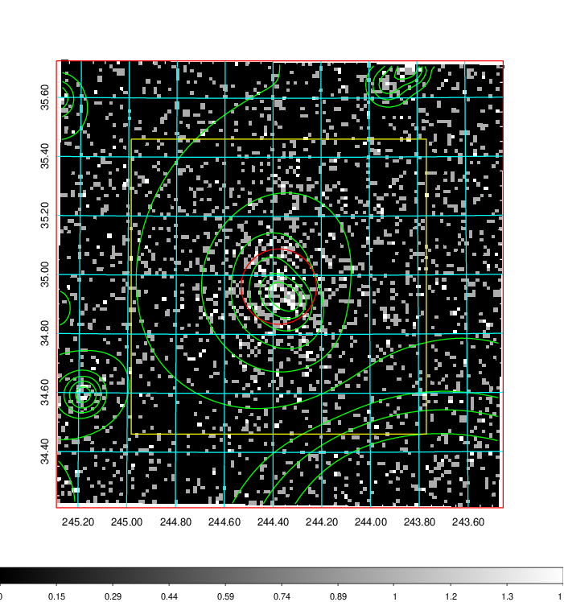  | 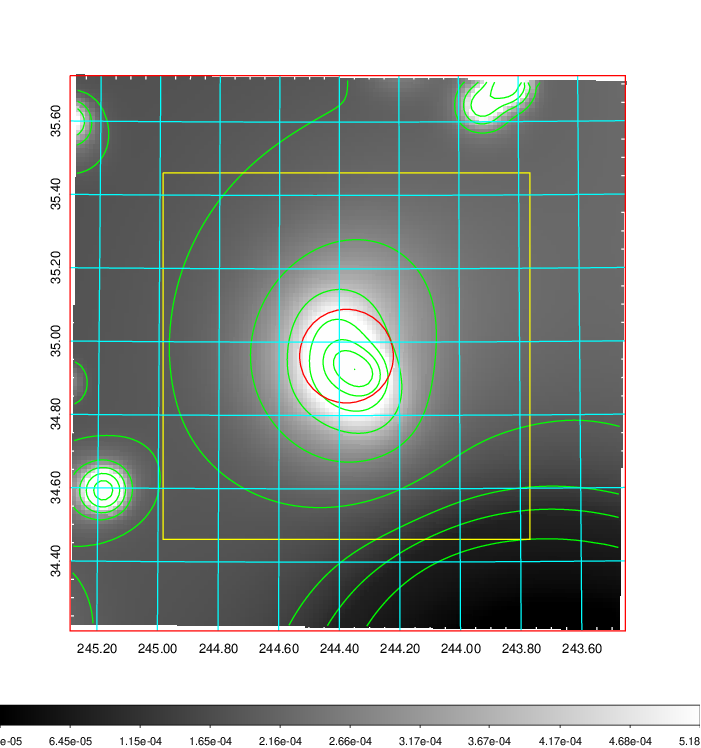   | 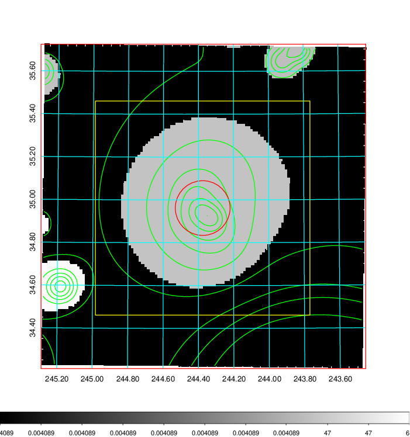  |

|[Exposure image](../image/643/643_mex.pdf)| [nH image](../image/643/643_nh.pdf)| [Planck image](../image/643/643_p.pdf)|
|-------------------|--------------------|-------------------|
|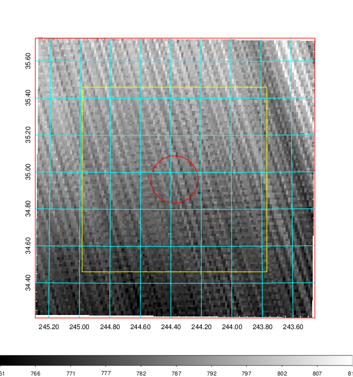   | 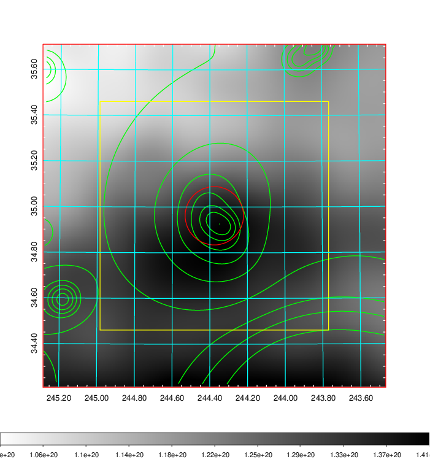    | 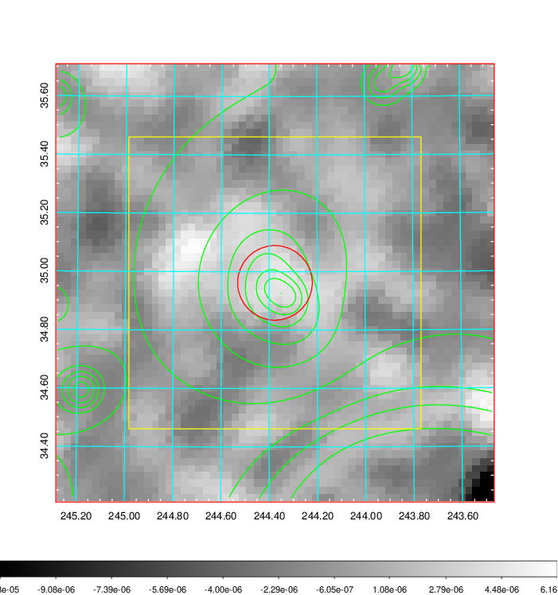 |

|[Redshift Histogram](../image/643/643_zg.pdf) | [DSS image(z1)](../image/643/643_dss_z1.pdf)      |  [DSS image(z2)](../image/643/643_dss_z2.pdf)    |
|-------------------|--------------------|-------------------|
|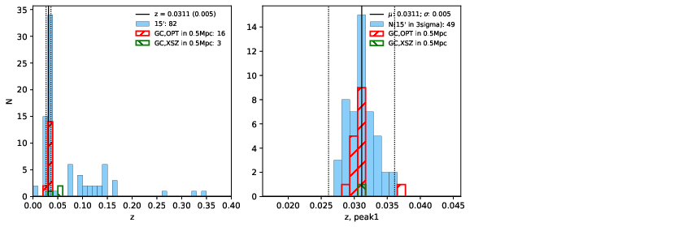 |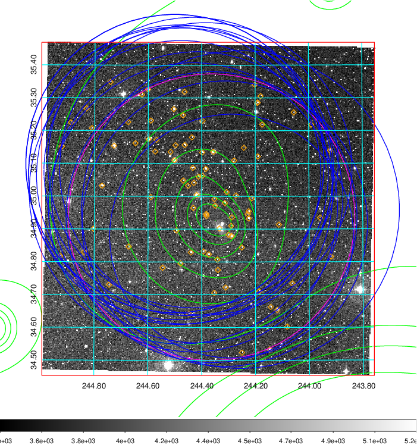  Blue circle for optical clusters;  Magenta circle for XSZ clusters;  all with r=1Mpc;  Only GC with Delta_z<0.01 are shown. | 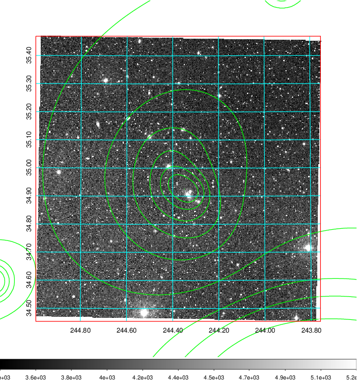 Blue circle for optical clusters;  Magenta circle for XSZ clusters;  all with r=1Mpc;  Only GC with Delta_z<0.01 are shown.  |

|[Previous-identified clusters](../image/643/643_gc.pdf) | [2MASS image](../image/643/643_2mass.pdf)      |[SDSS image](../image/643/643_sdss.pdf)   |
|-------------------|-------------------|-------------------|
|  Green, magenta, and blue circles  for optical, X-ray and SZ clusters  respectively, with redshift of clusters  labelled. The radius of circles  are 1Mpc.|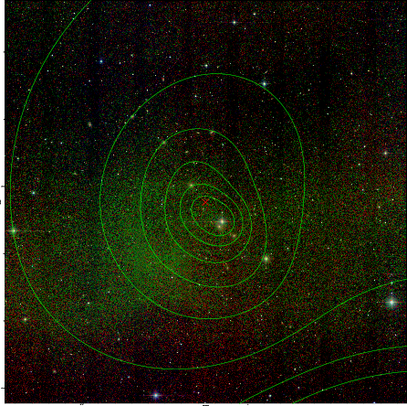  | 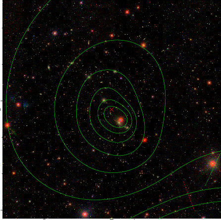  |

