

### 644

|Name|RAJ2000[deg]|DEJ2000[deg] |Ext[arcmin]| Ext,ml | z | z_src| C|GC(XSZ,Delta_z<0.01)| GC(OPT,Delta_z<0.01)|GC| R_sig[arcmin] | R500[arcmin] | R500[Mpc]| CRsig[c/s] | CR500[c/s] |L500[1E44 erg/s]|F500[1E-12 erg/s/cm^2]| M500[1E14 Msun]|Tx[keV]|Cnt_sig|Beta|Rc[arcmin]|Comment|Alias|
|---|---|---|---|---|---|------|---|--------|---------|----------|---|---|---|---|---|---|---|---|---|---|---|---|---|---|
|644| 244.477| 56.812| 0.88| 29.93| 0.0625(0.006)| z1,| G| -| -| C, F20, N, SPI, W| 14.162| 6.595| 0.476| 0.029(0.017)| 0.027(0.016)| 0.036(0.011)| 0.383(0.114)| 0.33(0.05)| 1.09(0.11)| 32.0| 0.934(-0.091+0.049)| 5.065(-0.680+0.646)| -| t007|

|[RASS image](../image/644/644_img.pdf)|[filtered image](../image/644/644_fil.pdf)|[Segment image](../image/644/644_seg.pdf)|
|-------------------|--------------------|-------------------|
| 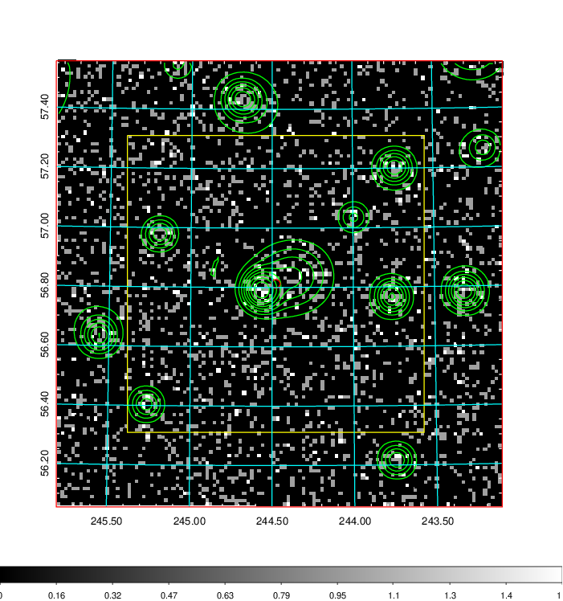  | 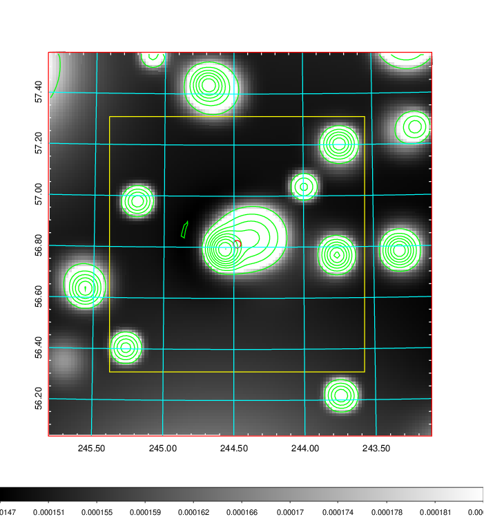   | 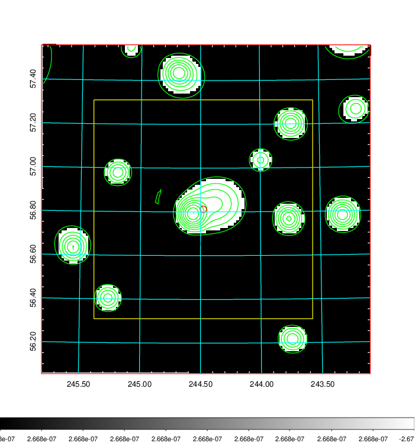  |

|[Exposure image](../image/644/644_mex.pdf)| [nH image](../image/644/644_nh.pdf)| [Planck image](../image/644/644_p.pdf)|
|-------------------|--------------------|-------------------|
|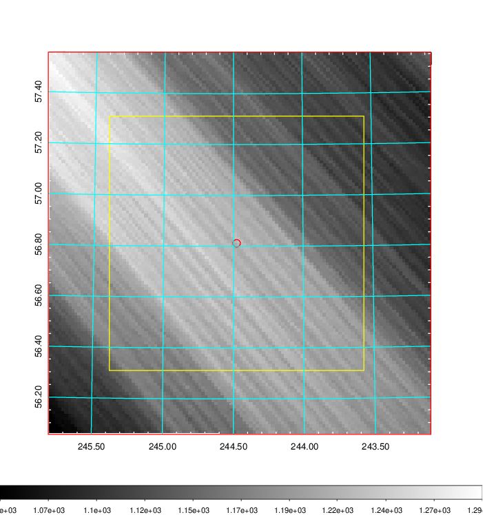   | 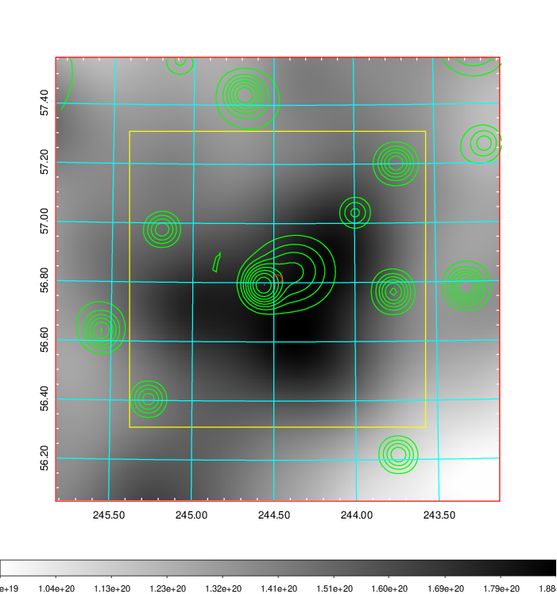    | 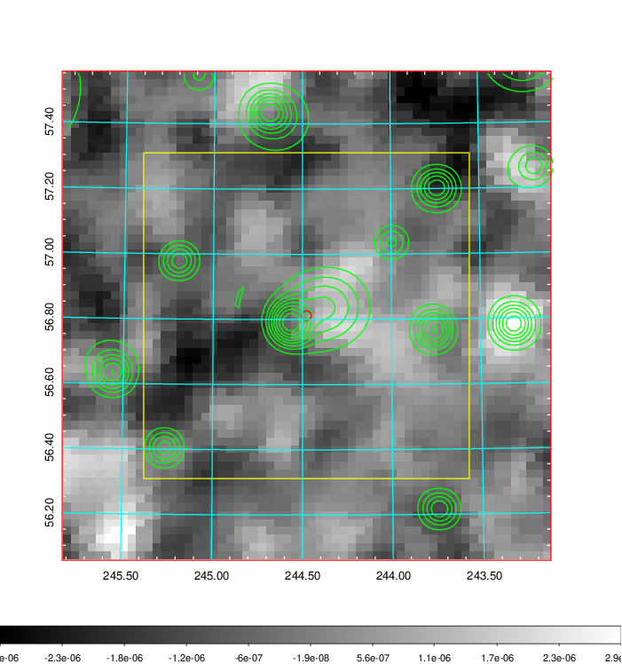 |

|[Redshift Histogram](../image/644/644_zg.pdf) | [DSS image(z1)](../image/644/644_dss_z1.pdf)      |  [DSS image(z2)](../image/644/644_dss_z2.pdf)    |
|-------------------|--------------------|-------------------|
|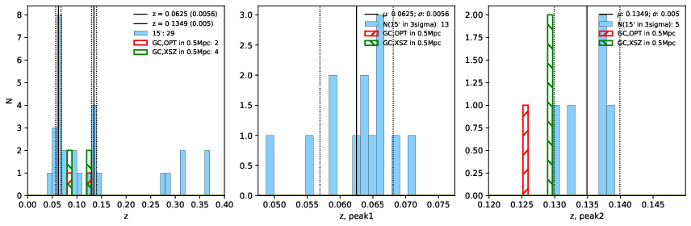 |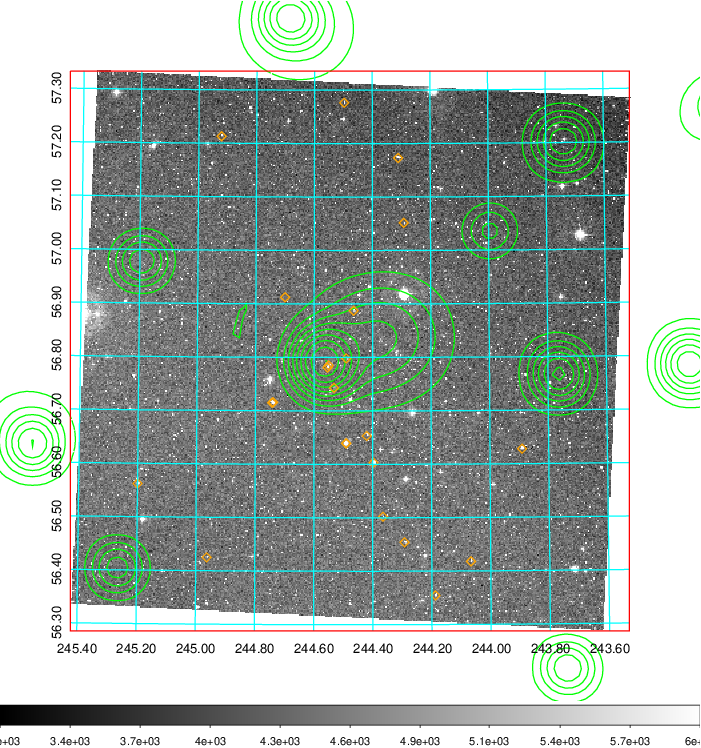  Blue circle for optical clusters;  Magenta circle for XSZ clusters;  all with r=1Mpc;  Only GC with Delta_z<0.01 are shown. | 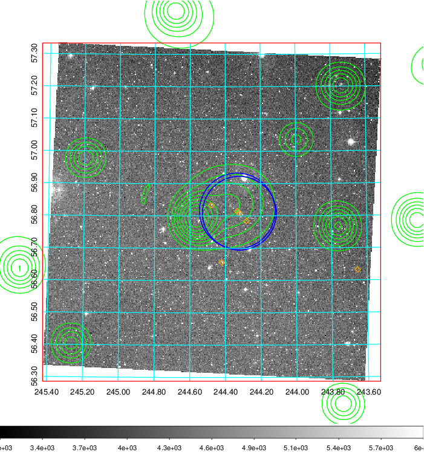 Blue circle for optical clusters;  Magenta circle for XSZ clusters;  all with r=1Mpc;  Only GC with Delta_z<0.01 are shown.  |

|[known Abell/XSZ clusters](../image/644/644_gc.pdf) | [2MASS image](../image/644/644_2mass.pdf)      |[SDSS image](../image/644/644_sdss.pdf)   |
|-------------------|-------------------|-------------------|
|  Magenta, blue and green circles  for optical, X-ray and SZ clusters  respectively, with redshift of clusters  labelled. The radius of circles  are 1Mpc.|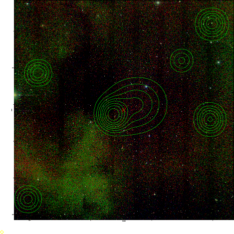  | 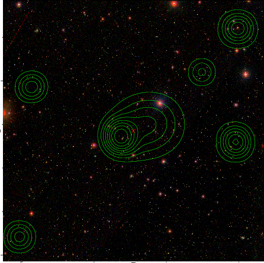  |

