

### 645

|Name|RAJ2000[deg]|DEJ2000[deg] |Ext[arcmin]| Ext,ml | z | z_src| C|GC(XSZ,Delta_z<0.01)| GC(OPT,Delta_z<0.01)|GC| R_sig[arcmin] | R500[arcmin] | R500[Mpc]| CRsig[c/s] | CR500[c/s] |L500[1E44 erg/s]|F500[1E-12 erg/s/cm^2]| M500[1E14 Msun]|Tx[keV]|Cnt_sig|Beta|Rc[arcmin]|Comment|Alias|
|---|---|---|---|---|---|------|---|--------|---------|----------|---|---|---|---|---|---|---|---|---|---|---|---|---|---|
|645| 245.002| 42.484| 26.45| 79.70| 0.1350(0.005)| z1, z_xsz| B| F20, SPI| C, N, W| A, C, F20, N, SPI, W| 46.045| 9.098| 1.306| 0.816(0.083)| 0.720(0.073)| 7.202(2.696)| 14.891(5.575)| 7.22(1.28)| 7.57(0.86)| 969.2| 0.500(-0.001+0.001)| 12.601(-0.166+1.033)| -| t625|

|[RASS image](../image/645/645_img.pdf)|[filtered image](../image/645/645_fil.pdf)|[Segment image](../image/645/645_seg.pdf)|
|-------------------|--------------------|-------------------|
| 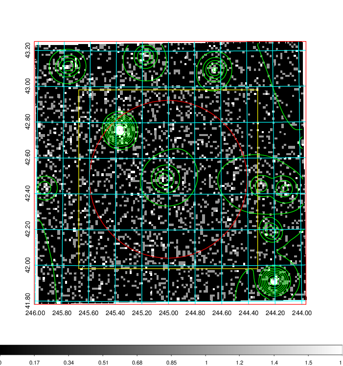  | 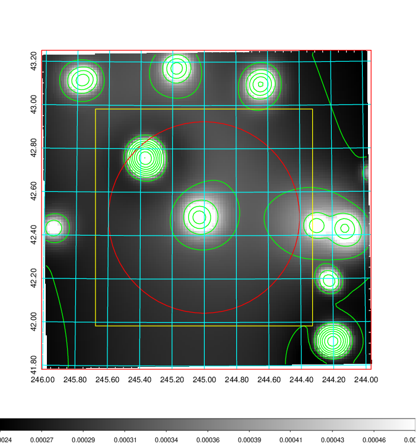   | 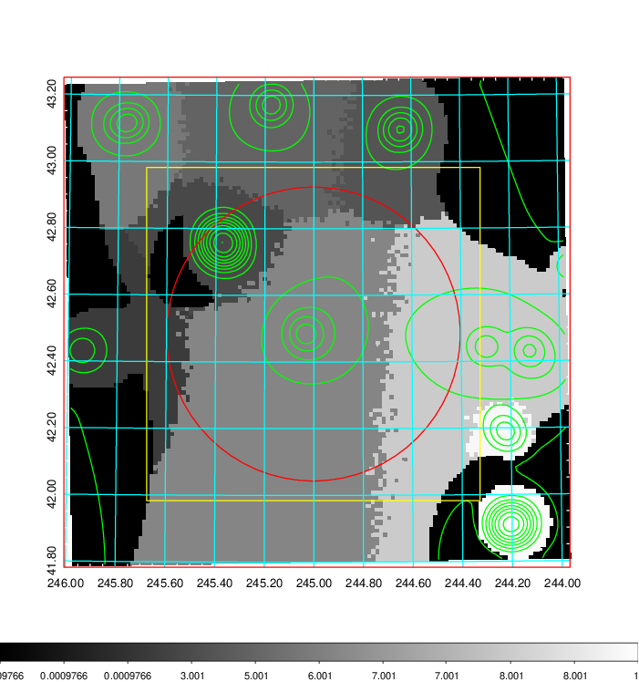  |

|[Exposure image](../image/645/645_mex.pdf)| [nH image](../image/645/645_nh.pdf)| [Planck image](../image/645/645_p.pdf)|
|-------------------|--------------------|-------------------|
|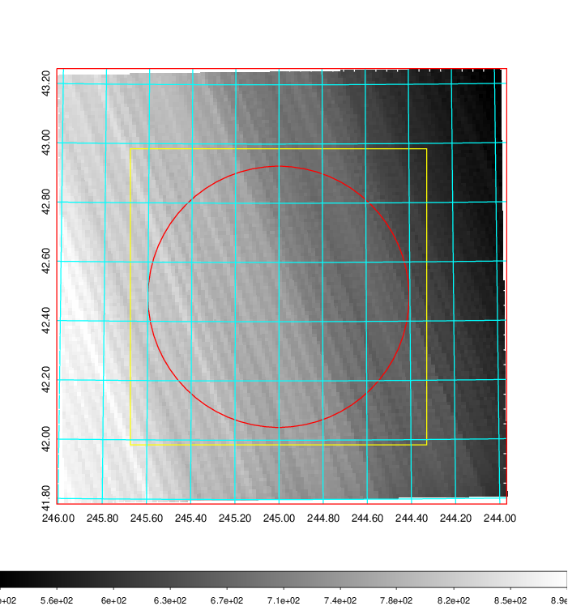   | 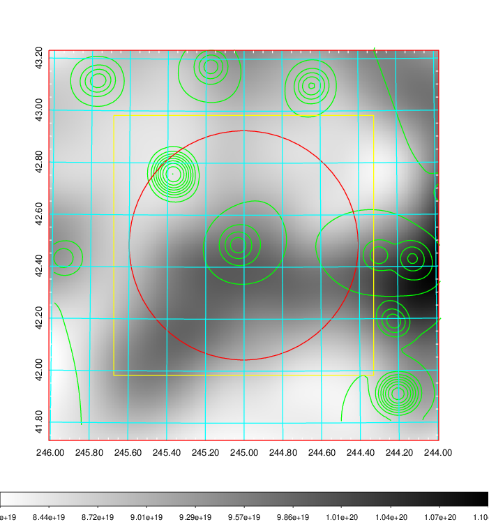    | 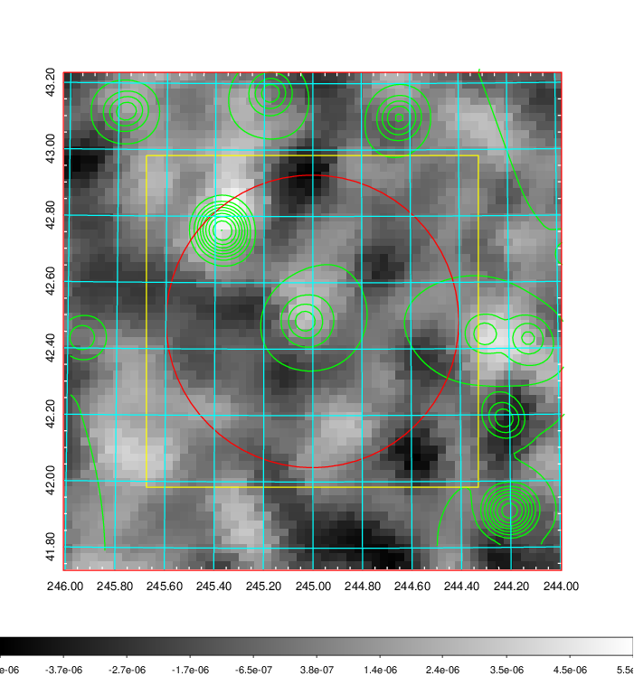 |

|[Redshift Histogram](../image/645/645_zg.pdf) | [DSS image(z1)](../image/645/645_dss_z1.pdf)      |  [DSS image(z2)](../image/645/645_dss_z2.pdf)    |
|-------------------|--------------------|-------------------|
|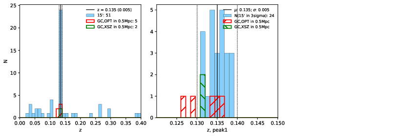 |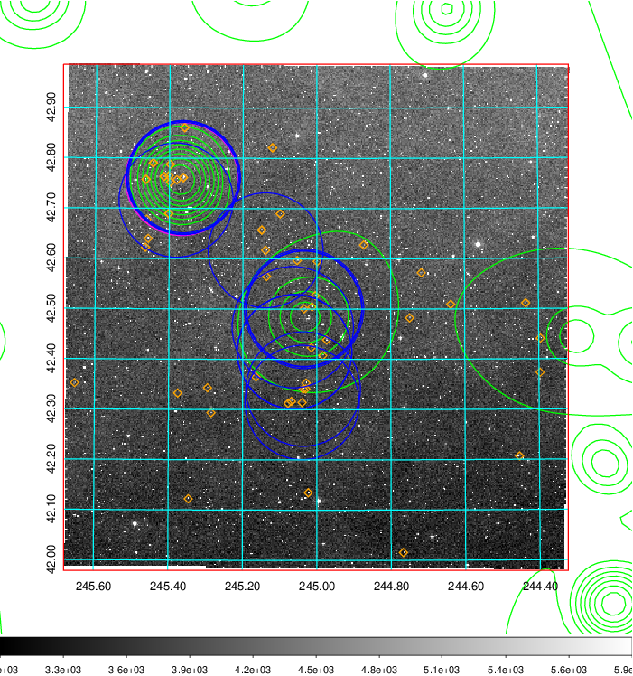  Blue circle for optical clusters;  Magenta circle for XSZ clusters;  all with r=1Mpc;  Only GC with Delta_z<0.01 are shown. | 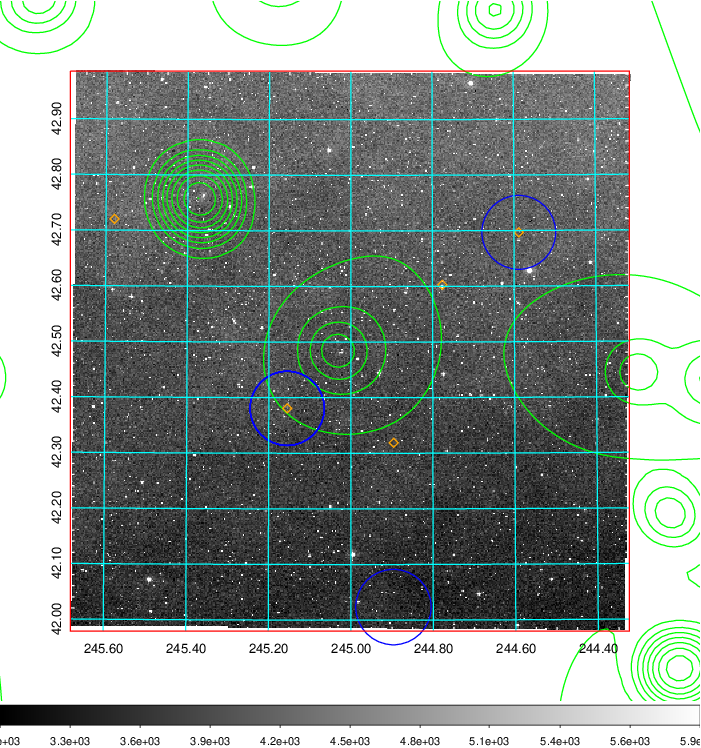 Blue circle for optical clusters;  Magenta circle for XSZ clusters;  all with r=1Mpc;  Only GC with Delta_z<0.01 are shown.  |

|[Previous-identified clusters](../image/645/645_gc.pdf) | [2MASS image](../image/645/645_2mass.pdf)      |[SDSS image](../image/645/645_sdss.pdf)   |
|-------------------|-------------------|-------------------|
|  Green, magenta, and blue circles  for optical, X-ray and SZ clusters  respectively, with redshift of clusters  labelled. The radius of circles  are 1Mpc.|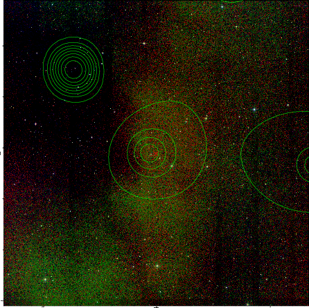  | 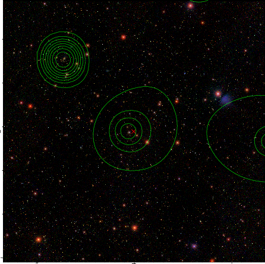  |

